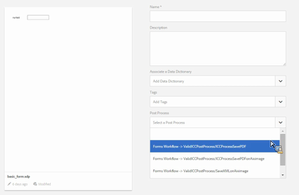

# Post-elaborazione di lettere e comunicazioni interattive{#post-processing-of-letters-and-interactive-communications}

## Post-elaborazione {#post-processing}

Gli agenti possono associare ed eseguire flussi di lavoro post-elaborazione su lettere e comunicazioni interattive. Il processo di post da eseguire può essere selezionato nella vista Proprietà del modello Lettera. È possibile impostare processi di post per inviare via e-mail, stampare, inviare via fax o archiviare le lettere finali.

Per associare i processi post a lettere o comunicazioni interattive, è innanzitutto necessario impostare i processi post. È possibile eseguire due tipi di flussi di lavoro sulle lettere inviate:

1. **Flusso di lavoro moduli:** Questi sono i AEM Forms dei flussi di lavoro JEE per la gestione dei processi. Istruzioni per la configurazione del flusso di lavoro Forms.

1. **Flusso di lavoro AEM:** I flussi di lavoro AEM possono essere utilizzati anche come processi di pubblicazione per le lettere inviate. Istruzioni per la configurazione di [AEM Workflow](../../forms/using/aem-forms-workflow.md).

## Flusso di lavoro per moduli {#formsworkflow}

1. In AEM, apri  Configurazione console Web Adobe Experience Manager per il server utilizzando il seguente URL: `https://<server>:<port>/<contextpath>/system/console/configMgr`

   

1. In questa pagina, individua la configurazione AEM Forms Client SDK e espandila facendo clic su di essa.
1. In URL server, immettete il nome dei AEM Forms sul server JEE, i dettagli di accesso e fate clic su **Salva**.

   

1. Specificate il nome utente e la password.
1. Assicurarsi che sun.util.calendar sia aggiunto alla configurazione del firewall di deserializzazione.

   Passate alla configurazione del firewall di deserializzazione e, in Classi consentite di prefissi di pacchetti, aggiungete sun.util.Calendar.

1. Ora i server sono mappati e i processi di pubblicazione in AEM Forms su JEE sono disponibili nell’interfaccia utente di AEM durante la creazione di lettere.

   

1. Per autenticare un processo/servizio, copiate il nome di un processo e tornate alla pagina Configurazioni console Web  Adobe Experience Manager > Configurazione SDK client AEM Forms e aggiungete il processo come nuovo servizio.

   Ad esempio, se il menu a discesa nella pagina Proprietà della lettera mostra il nome del processo come Flusso di lavoro moduli > ValidoCCPostProcess/SaveXML, aggiungere un Nome servizio come `ValidCCPostProcess/SaveXML`.

1. Per utilizzare AEM Forms sui flussi di lavoro JEE per la post-elaborazione, impostare i parametri e gli output necessari. I valori predefiniti dei parametri sono indicati di seguito.

   Andate alla pagina Configurazioni console Web del Adobe Experience Manager  > Configurazioni **[!UICONTROL di gestione della corrispondenza]** e configurate i seguenti parametri:

   1. **inPDFDoc (parametro del documento PDF):** Un documento PDF come input. Questo input contiene la lettera rappresentata come input. I nomi dei parametri indicati sono configurabili. Possono essere configurati dalle configurazioni di Correspondence Management dalla configurazione.
   1. **inXMLDoc (parametro dati XML):** Un documento XML come input. Questo input contiene i dati immessi dall&#39;utente nel formato XML.
   1. **inXDPDoc (parametro del documento XDP):** Un documento XML come input. Questo input contiene il layout sottostante (XDP).
   1. **inAttachmentDocs (parametro Attachment Documents):** Un parametro di immissione elenco. Questo input contiene tutti gli allegati come input.
   1. **redirectURL (Redirect URL Output):** Un tipo di output che indica l&#39;URL a cui reindirizzare.

   Il flusso di lavoro dei moduli deve avere parametri di documento PDF o dati XML come input con lo stesso nome specificato in **[!UICONTROL Correspondence Management Configurations]**. Questo è necessario per elencare il processo nel menu a discesa Post Process (Processo post).

## Impostazioni nell’istanza Pubblica {#settings-on-the-publish-instance}

1. accedere a `https://localhost:publishport/aem/forms`.
1. Passate a **[!UICONTROL Lettere]** per visualizzare la lettera pubblicata disponibile nell’istanza di pubblicazione.
1. Configurare le impostazioni di AEM DS. Consultate [Configurazione delle impostazioni](../../forms/using/configuring-the-processing-server-url-.md)di AEM DS.

>[!NOTE]
>
>Durante l&#39;utilizzo di flussi di lavoro Forms o AEM, prima di effettuare qualsiasi invio dal server di pubblicazione, è necessario configurare il servizio delle impostazioni DS. In caso contrario, la presentazione del modulo non può essere effettuata.

## Recupero Istanze Lettera {#letter-instances-retrieval}

Le istanze di lettere salvate possono essere ulteriormente modificate, ad esempio il recupero di istanze di lettere e l&#39;eliminazione di istanze di lettere, utilizzando le API seguenti definite in LetterInstanceService.

<table>
 <tbody>
  <tr>
   <td><strong>API lato server</strong></td>
   <td><strong>Nome operazione</strong></td>
   <td><strong>Descrizione</strong></td>
  </tr>
  <tr>
   <td>
Public LetterInstanceVO
 
getLetterInstance(String letterInstanceId)
 
Throws ICCException; 
 </td>
   <td>getLetterInstance</td>
   <td>Recupera l'istanza di lettera specificata </td>
  </tr>
  <tr>
   <td>Public void deleteLetterInstance(String letterInstanceId) genera ICCException; </td>
   <td>deleteLetterInstance </td>
   <td>Eliminata l'istanza di lettera specificata </td>
  </tr>
  <tr>
   <td>List getAllLetterInstances(Query) restituisce ICCException; </td>
   <td>getAllLetterInstances </td>
   <td>Questa API recupera le istanze di lettere in base al parametro della query di input. Per recuperare tutte le istanze di lettere, il parametro query può essere passato come null.  </td>
  </tr>
  <tr>
   <td>letterInstanceExists booleano pubblico(String letterInstanceName) genera ICCException; </td>
   <td>letterInstanceExists </td>
   <td>Verificare se esiste un'istanza LetterInstance con il nome specificato </td>
  </tr>
 </tbody>
</table>

## Associazione di un processo di post a una lettera {#associating-a-post-process-with-a-letter}

Nell&#39;interfaccia utente CCR, completa i seguenti passaggi per associare un processo di post a una lettera:

1. Passa il cursore sopra una lettera e tocca **Visualizza proprietà**.
1. Seleziona **Modifica**.
1. Nell&#39;elenco a discesa Proprietà di base, selezionare il processo di pubblicazione da associare alla lettera. I processi di pubblicazione relativi a AEM e Forms sono elencati nel menu a discesa.
1. Toccate **Salva**.
1. Dopo aver configurato la lettera con il processo di pubblicazione, pubblicate la lettera ed eventualmente sull’istanza di pubblicazione, specificate l’URL di elaborazione nel servizio Impostazioni di AEM DS. In questo modo il processo post viene eseguito sull&#39;istanza di elaborazione.

## Ricaricare un&#39;istanza di lettera bozza  {#reloaddraft}

Un&#39;istanza di lettera bozza può essere ricaricata nell&#39;interfaccia utente utilizzando il seguente URL:

`https://<server>:<port>/aem/forms/`

`createcorrespondence.html?/random=$&cmLetterInstanceId=$<LetterInstanceId>`

LetterInstanceID: L&#39;ID univoco dell&#39;istanza della lettera inviata.

Per ulteriori informazioni sul salvataggio di una bozza di lettera, vedere [Salvataggio di bozze e invio di istanze](../../forms/using/create-correspondence.md#savingdrafts)di lettere.
