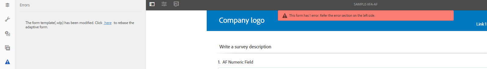

# Sincronizzazione di Forms adattivo con i modelli di modulo XFA{#synchronizing-adaptive-forms-with-xfa-form-templates}

 Adobe consiglia di utilizzare l&#39;acquisizione dati moderna ed estensibile [Componenti core](https://experienceleague.adobe.com/docs/experience-manager-core-components/using/adaptive-forms/introduction.html?lang=it) per [la creazione di un nuovo Forms adattivo](/help/forms/using/create-an-adaptive-form-core-components.md) o [l&#39;aggiunta di Forms adattivo alle pagine AEM Sites](/help/forms/using/create-or-add-an-adaptive-form-to-aem-sites-page.md). Questi componenti rappresentano un progresso significativo nella creazione di Forms adattivi, garantendo esperienze utente straordinarie. Questo articolo descrive un approccio precedente all’authoring di Forms adattivi utilizzando i componenti di base. 

## Introduzione {#introduction}

È possibile creare un modulo adattivo basato su un modello di modulo XFA (file `*.XDP`). Questo riutilizzo consente di mantenere l’investimento nei moduli XFA esistenti. Per informazioni su come utilizzare un modello di modulo XFA per creare un modulo adattivo, [Creare un modulo adattivo basato su un modello](../../forms/using/creating-adaptive-form.md#p-create-an-adaptive-form-based-on-an-xfa-form-template-p).

Puoi riutilizzare i campi del file XDP nel modulo adattivo. Questi campi sono denominati campi associati. Le proprietà dei campi associati (ad esempio script, etichette e formato di visualizzazione) vengono copiate dal file XDP. Puoi anche scegliere di ignorare il valore di alcune di queste proprietà.

AEM Forms consente di mantenere sincronizzati i campi dei moduli adattivi con eventuali modifiche apportate successivamente ai campi corrispondenti nel file XDP. Questo articolo spiega come abilitare questa sincronizzazione.

Nell’ambiente di authoring di AEM Forms, puoi trascinare i campi da un modulo XFA (a sinistra) a un modulo adattivo (a destra)

## Prerequisiti {#prerequisites}

Per utilizzare le informazioni contenute in questo articolo, si consiglia di acquisire familiarità con le seguenti aree:

* [Creazione di un modulo adattivo](../../forms/using/creating-adaptive-form.md)

* XFA (XML Forms Architecture)

Per utilizzare le risorse fornite per l&#39;esempio nell&#39;articolo, scaricare il pacchetto di esempio come descritto nella sezione successiva, [Pacchetto di esempio](../../forms/using/synchronizing-adaptive-forms-xfa.md#p-sample-package-p).

## Pacchetto di esempio {#sample-package}

L’articolo utilizza un esempio per dimostrare come sincronizzare il modulo adattivo con un modello di modulo XFA aggiornato. Le risorse utilizzate nell&#39;esempio sono disponibili in un pacchetto che può essere scaricato dalla sezione [Download](../../forms/using/synchronizing-adaptive-forms-xfa.md#p-downloads-p) di questo articolo.

Dopo aver caricato il pacchetto, puoi visualizzare queste risorse nell’interfaccia utente di AEM Forms.

Installare il pacchetto utilizzando Gestione pacchetti: `https://<server>:<port>/crx/packmgr/index.jsp`

Il pacchetto contiene le seguenti risorse:

1. `sample-form.xdp`: modello di modulo XFA utilizzato come esempio

1. `sample-xfa-af`: modulo adattivo basato sul file sample-form.xdp. Questo modulo adattivo, tuttavia, non include alcun campo. Nel passaggio successivo aggiungi contenuto a questo modulo adattivo.

### Aggiungere contenuto al modulo adattivo {#add-content-to-adaptive-form-br}

1. Passa a https://&lt;server>:&lt;porta>/aem/forms.html. Se richiesto, immettere le credenziali.
1. Apri sample-af-xfa per la modifica in modalità di authoring.
1. Dal browser Contenuto nella barra laterale, scegli la scheda Oggetti modello dati. Trascina NumericField1 e TextField1 nel modulo adattivo.
1. Cambia il titolo del campo numerico1 da **campo numerico** a **campo numerico AF.**

>[!NOTE]
>
>Nei passaggi precedenti, hai sovrascritto una proprietà di un campo nel file XDP. Questa proprietà non viene quindi sincronizzata se la proprietà corrispondente nel file XDP viene modificata in un secondo momento.

## Rilevamento delle modifiche nel file XDP {#detecting-changes-in-xdp-file}

Ogni volta che si apportano modifiche a un file XDP o a un frammento, l’interfaccia utente di AEM Forms contrassegna tutti i moduli adattivi basati sul file XDP o sul frammento.

Dopo aver aggiornato un file XDP, devi caricarlo nuovamente nell’interfaccia utente di AEM Forms affinché le modifiche vengano segnalate.

Ad esempio, aggiorniamo il file `sample-form.xdp` seguendo la procedura seguente:

1. Passa a `https://<server>:<port>/projects.html.` Se richiesto, immetti le tue credenziali.
1. Fai clic sulla scheda Forms a sinistra.
1. Scarica il file `sample-form.xdp` nel computer locale. Il file XDP viene scaricato come file `.zip`, che può essere estratto utilizzando qualsiasi utilità di decompressione dei file.

1. Aprire il file `sample-form.xdp` e modificare il titolo del campo TextField1 da **Text Field** a **My Text Field**.

1. Carica di nuovo il file `sample-form.xdp` nell&#39;interfaccia utente di AEM Forms.

Se un file XDP viene aggiornato, viene visualizzata un’icona nell’editor quando si modificano i moduli adattivi basati sul file XDP. Questa icona indica che il modulo adattivo non è sincronizzato con il file XDP. Nell’immagine seguente, vedi l’icona accanto nella barra laterale.

## Sincronizzazione dei moduli adattivi con il file XDP più recente {#synchronizing-adaptive-forms-with-the-latest-xdp-file}

Alla successiva apertura di un modulo adattivo non sincronizzato con il file XDP per la creazione, viene visualizzato il seguente messaggio: **Schema/Modello di modulo per il modulo adattivo aggiornato. `Click Here` per ricrearlo con la nuova versione.**

Facendo clic sul messaggio, i campi del modulo adattivo vengono sincronizzati con i campi corrispondenti nel file XDP.

Per l&#39;esempio utilizzato in questo articolo, aprire `sample-xfa-af` in modalità creazione. Il messaggio viene visualizzato verso la parte inferiore del modulo adattivo.

### Aggiornamento delle proprietà {#updating-the-properties}

Tutte le proprietà copiate dal file XDP nel modulo adattivo vengono aggiornate, ad eccezione di quelle esplicitamente ignorate dall’autore nel modulo adattivo (dalla finestra di dialogo dei componenti). L’elenco delle proprietà aggiornate è disponibile nei registri del server.

Per aggiornare le proprietà nel modulo adattivo di esempio, fai clic sul collegamento (con etichetta `"Click Here"`) nel messaggio. Il titolo di TextField1 cambia da **Campo di testo** a **Campo di testo personale**.

>[!NOTE]
>
>Il campo numerico AF dell&#39;etichetta non è stato modificato perché la proprietà è stata sostituita dalla finestra di dialogo delle proprietà del componente, come descritto in [Aggiungere contenuto ai moduli adattivi](../../forms/using/synchronizing-adaptive-forms-xfa.md#p-add-content-to-adaptive-form-br-p).

### Aggiunta di nuovi campi dal file XDP al modulo adattivo   {#adding-new-fields-from-xdp-file-to-adaptive-form-nbsp}

Tutti i campi aggiunti successivamente al file XDP originale vengono visualizzati nella scheda Gerarchia modulo e puoi trascinare i nuovi campi nel modulo adattivo.

Non è necessario fare clic sul collegamento nel messaggio di errore per aggiornare i campi nella scheda Gerarchia modulo.

### Campi eliminati nel file XDP {#deleted-fields-in-xdp-file}

Se un campo copiato in precedenza in un modulo adattivo viene eliminato da un file XDP, nella modalità di authoring viene visualizzato un messaggio di errore che informa che il campo non esiste nel file XDP. In questi casi, elimina manualmente il campo dal modulo adattivo o cancella la proprietà `bindRef` nella finestra di dialogo del componente.

I passaggi seguenti illustrano questo flusso di utilizzo per le risorse nell’esempio utilizzato in questo articolo:

1. Aggiornare il file `sample-form.xdp` ed eliminare NumericField1.
1. Carica il file `sample-form.xdp` nell&#39;interfaccia utente di AEM Forms
1. Apri il modulo adattivo `sample-xfa-af` per la creazione. Viene visualizzato il seguente messaggio di errore: Lo schema o il modello di modulo per il modulo adattivo è stato aggiornato. `Click Here` per ricrearlo con la nuova versione.

1. Fare clic sul collegamento (con etichetta &quot; `Click Here`&quot;) nel messaggio. Viene visualizzato un messaggio di errore per segnalare che il campo non esiste più nel file XDP.

Anche il campo che è stato eliminato è contrassegnato da un&#39;icona per indicare un errore nel campo.

>[!NOTE]
>
>Anche i campi nel modulo adattivo con un’associazione non corretta (un valore `bindRef` non valido nella finestra di dialogo per modifica) vengono considerati campi eliminati. Se l’autore non corregge questi errori e pubblica il modulo adattivo, il campo viene considerato come un normale campo modulo adattivo non associato e viene incluso nella sezione non associata del file XML di output.

## Download {#downloads}

Pacchetto di contenuti per l’esempio in questo articolo

[Ottieni file](assets/sample-xfa-af-sync-1.0.zip)
