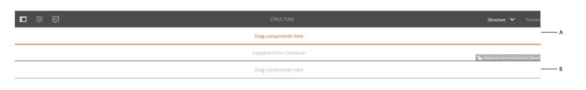
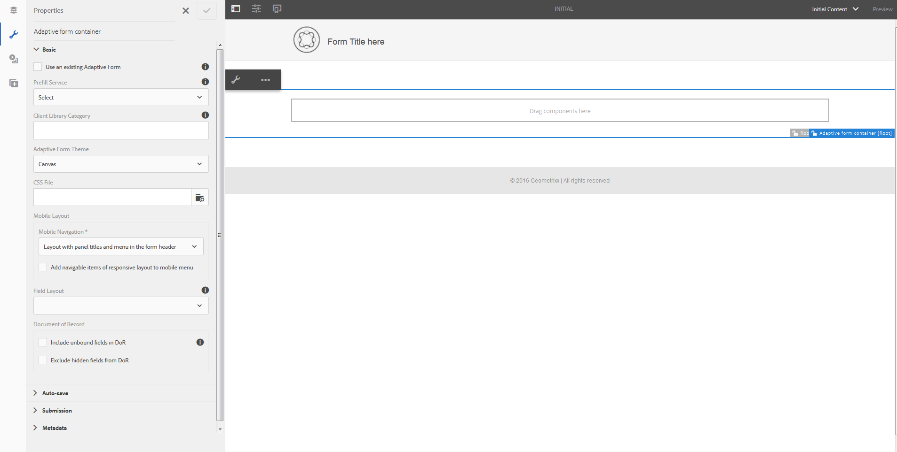

# Modelli di modulo adattivo{#adaptive-form-templates}

 L’Adobe consiglia di utilizzare l’acquisizione dati moderna ed estensibile [Componenti core](https://experienceleague.adobe.com/docs/experience-manager-core-components/using/adaptive-forms/introduction.html?lang=it) per [creazione di un nuovo Forms adattivo](/help/forms/using/create-an-adaptive-form-core-components.md) o [aggiunta di Forms adattivo alle pagine AEM Sites](/help/forms/using/create-or-add-an-adaptive-form-to-aem-sites-page.md). Questi componenti rappresentano un progresso significativo nella creazione di Forms adattivi, garantendo esperienze utente straordinarie. Questo articolo descrive un approccio precedente all’authoring di Forms adattivi utilizzando i componenti di base. 

| Versione | Collegamento articolo |
| -------- | ---------------------------- |
| AEM as a Cloud Service | [Fai clic qui](https://experienceleague.adobe.com/docs/experience-manager-cloud-service/content/forms/adaptive-forms-authoring/authoring-adaptive-forms-foundation-components/create-an-adaptive-form-on-forms-cs/template-editor.html) |
| AEM 6.5 | Questo articolo |

Quando si crea un modulo, si aggiungono campi e componenti per definire la struttura del modulo, il contenuto e le azioni nell’editor. È possibile aggiungere campi e componenti in `guideRootPanel` del contenitore di moduli. Con Editor modelli è possibile creare un modello contenente la struttura di base e il contenuto iniziale che gli autori possono utilizzare per creare i moduli.

Ad esempio, si desidera che tutti gli autori di moduli dispongano di determinate caselle di testo, pulsanti di spostamento e un pulsante di invio in un modulo di iscrizione. È possibile creare un modello con i componenti che gli autori possono utilizzare per creare un modulo coerente con altri moduli di iscrizione. Quando gli autori utilizzano il modello per creare un modulo adattivo, il nuovo modulo eredita la struttura e i componenti specificati nel modello. Editor modelli consente di:

* Aggiungete i componenti intestazione e piè di pagina di un modulo nel livello struttura.
* Fornire il contenuto iniziale del modulo.
* Specifica un tema e invia azioni.

## Utilizzo dei modelli {#working-with-templates}

Per accedere all’editor modelli dal menu Strumenti, vai a **Adobe Experience Manager > Strumenti > Modelli**. In questo caso, i modelli sono organizzati in cartelle abilitate per i modelli modificabili. L’AEM fornisce una cartella globale per organizzare i modelli. Tuttavia, non è attivato per impostazione predefinita. Puoi richiedere all’amministratore di abilitare la cartella globale o di creare una cartella per i modelli. Per ulteriori informazioni su come creare cartelle, consulta [Cartelle modelli](/help/sites-developing/page-templates-editable.md).

Dopo aver selezionato di aprire una cartella, viene visualizzato un pulsante Crea che consente di creare un modello per i moduli adattivi.

### Creazione di un modello {#create-template}

Dopo aver creato una cartella, aprila ed esegui i seguenti passaggi per creare un modello:

1. Nella console Modello, seleziona **Crea** all’interno della cartella creata.
1. Nella sezione Scegli un tipo di modello, selezionare **Modello modulo adattivo** e seleziona **Successivo**.

1. Nella sezione Dettagli modello, specifica un Titolo modello e seleziona **Crea**.
È possibile fornire una descrizione e una miniatura che sia possibile visualizzare quando si seleziona il modello creato durante la creazione del modulo.

1. Seleziona **Fine** per tornare alla console, oppure seleziona **Apri** per aprire il modello nell’editor.

### Interfaccia utente dell’editor modelli {#template-editor-ui}

Quando apri un modello per la modifica, puoi vedere i seguenti componenti dell’editor AEM:

* **Barra degli strumenti Pagina**
Contiene le seguenti opzioni:

   * **Attiva/Disattiva pannello laterale**: consente di mostrare o nascondere la barra laterale.
   * **Informazioni pagina**: consente di specificare informazioni quali l’ora di pubblicazione/annullamento della pubblicazione, le miniature, le librerie lato client, i criteri di pagina e la libreria lato client della progettazione della pagina.
   * **Emulatore**: consente di simulare e personalizzare l’aspetto per dispositivi diversi.
   * **Selettore livello:** Consente di modificare il livello.
Puoi scegliere **Struttura** livello o **Contenuto iniziale** livello. Il livello Struttura consente di aggiungere e personalizzare l&#39;intestazione e il piè di pagina. Il livello Contenuto iniziale consente di personalizzare il contenuto del modulo.

   * **Anteprima:** Consente di visualizzare in anteprima l’aspetto del modello quando lo si pubblica. Potete utilizzare Selettore livello (Layer Selector) e Anteprima (Preview) per attivare o disattivare le modalità di modifica e anteprima.

* **Barra laterale:** Fornisce i browser Contenuto, Proprietà, Risorse e Componenti.
* **Barra degli strumenti del componente:** Quando selezioni un componente, viene visualizzata una barra degli strumenti che consente di personalizzarlo.
* **Pagina**: l’area in cui aggiungere contenuto per creare il modello.

Consulta [Introduzione all’authoring di moduli adattivi](../../forms/using/introduction-forms-authoring.md) per comprendere l’editor dell’interfaccia utente touch.

### Modifica di un modello {#editing-a-template}

Un modello di modulo adattivo viene creato utilizzando due livelli:

* Struttura
* Contenuto iniziale

Il selettore dei livelli è disponibile accanto all&#39;opzione Anteprima nell&#39;angolo superiore destro dello schermo.

### Struttura {#structure}

Quando selezioni il livello struttura nell’Editor modelli, puoi visualizzare i contenitori di layout sopra e sotto il Contenitore modulo adattivo. Gli autori possono utilizzare questi contenitori di layout per intestazione e piè di pagina. È possibile aggiungere, modificare o personalizzare l&#39;intestazione e il piè di pagina. Per personalizzare l’intestazione del modello, trascina il componente Intestazione modulo adattiva nel contenitore di layout sopra il Contenitore modulo adattivo. Per personalizzare il piè di pagina del modello, trascina il componente Piè di pagina modulo adattivo nel contenitore di layout sotto il contenitore modulo adattivo.

Contenitori di layout nel livello struttura

**R.** Contenitore di layout per il componente Intestazione **B.** Contenitore di layout per il componente Piè di pagina

Trascina il componente Intestazione modulo adattivo nel contenitore di layout sopra il contenitore modulo adattivo. Dopo aver aggiunto il componente, puoi specificarne le proprietà che ti consentono di aggiungere un logo e il relativo titolo.

Allo stesso modo, quando trascini il componente Piè di pagina nel contenitore di layout sotto il Contenitore di moduli adattivi, puoi fornire le informazioni sul copyright e i dettagli dell’azienda.

Intestazione e piè di pagina aggiunti nel livello Struttura

#### Blocco/sblocco di componenti nel livello struttura {#locking-unlocking-components-in-the-structure-layer}

Quando modificate il modello con il livello struttura selezionato, potete sbloccare l&#39;intestazione e il piè di pagina del modello. Se un componente è sbloccato nel modello, gli autori del modulo possono modificarlo nel modulo adattivo che lo utilizza. Il blocco di un componente impedisce agli autori dei moduli di modificarlo nel modulo adattivo. L’opzione Blocca è disponibile nella barra degli strumenti del componente.

Ad esempio, puoi aggiungere il componente intestazione nel modello. Quando selezioni il componente, nella barra degli strumenti del componente è visibile un’opzione di blocco. In genere, l&#39;intestazione include il nome dell&#39;azienda e il logo e non si desidera che gli autori dei moduli modifichino il logo e l&#39;intestazione in un modello. In un modulo adattivo creato utilizzando il modello con il componente intestazione bloccato, gli autori dei moduli non possono modificare il logo e il nome dell’azienda.

>[!NOTE]
>
>Il blocco o lo sblocco di un’immagine o di un logo nel componente intestazione, singolarmente, non è consigliato. Puoi sbloccare il componente intestazione.

### Contenuto iniziale {#initial-content}

Quando l’opzione Contenuto iniziale è selezionata, il Contenitore di moduli adattivi del modello si apre come un modulo adattivo da modificare. Analogamente all’authoring di un modulo adattivo, puoi specificare le impostazioni iniziali, ad esempio selezionare un tema e inviare azioni.

Gli autori di moduli utilizzano tale modulo come base per la creazione di un modulo. La struttura del flusso di contenuto è specificata nel livello Contenuto iniziale del modello. Per passare alla modifica del contenuto iniziale del modello di modulo, prima di Anteprima nella barra degli strumenti della pagina, seleziona  **> Contenuto iniziale**.

Livello Contenuto iniziale nell’Editor modelli che mostra il Contenitore di moduli adattivi selezionato per la specifica delle proprietà.

Nel livello Contenuto iniziale puoi creare il modello di modulo adattivo utilizzato dagli autori come base. La creazione di un modello è simile alla creazione di un modulo e consente di utilizzare le opzioni disponibili nella barra laterale. Sidebar fornisce contenuti, proprietà, risorse e browser di componenti.

Consulta [Barra laterale](../../forms/using/introduction-forms-authoring.md#sidebar).

>[!NOTE]
>
>Quando si seleziona Archivia contenuto o Archivia PDF come azione di invio, si ottiene un&#39;opzione per specificare il percorso di archiviazione. Se si specifica il percorso nel modello, tutti i moduli creati da esso avranno lo stesso percorso. È possibile specificare il percorso di archiviazione corretto o assicurarsi che gli autori dei moduli lo aggiornino per impedire che i dati di ogni modulo vengano archiviati nella stessa posizione.

#### Creazione di un modello di modulo adattivo con schede e pannelli  {#creating-an-adaptive-form-template-with-tabs-and-panels-nbsp}

Ad esempio, puoi creare un modello con le seguenti schede:

* Informazioni generali
* Informazioni professionali

È stato aggiunto un logo, un titolo e un piè di pagina nel livello struttura. Bloccare l&#39;intestazione e il piè di pagina per impedire agli autori di moduli di modificarli quando utilizzano il modello per creare moduli.

Modificare il livello da Struttura a Contenuto iniziale e iniziare ad aggiungere contenuto al modulo. Per creare una struttura a schede, aggiungi un pannello secondario in guideRootPanel del contenitore di moduli adattivi. Per aggiungere un pannello:

* Per aggiungere un pannello, tocca il **+** quando si seleziona il pulsante **Trascina qui i componenti** opzione.

* Puoi trascinare il componente Pannello dal browser Componenti nella barra laterale.
* È possibile aggiungere un pannello figlio di `guideRootPanel` dalla barra degli strumenti del componente.

Per creare le schede Informazioni generali e Informazioni professionali, aggiungi due pannelli nel pannello secondario di `guideRootPanel`. Seleziona i pannelli e seleziona  per aprire le proprietà nella barra laterale. Modifica i nomi degli elementi come `general-info` e `professional-info`e titoli rispettivamente come Informazioni generali e Informazioni professionali. Nella barra laterale, seleziona il contenuto per aprire il browser del contenuto. Nella scheda Oggetti modulo, seleziona `guideRootPanel`. Nell’editor, viene selezionato guideRootPanel. Seleziona  nella barra degli strumenti del componente per aprirne le proprietà. Nel campo Layout pannello, seleziona **Schede in alto** e seleziona **Fine**. Viene applicata la struttura a schede del modello.

#### Aggiunta di contenuto nelle schede {#adding-content-in-tabs}

Dopo aver aggiunto i pannelli e averli strutturati come schede, puoi aggiungere campi all’interno delle schede. Quando selezioni una scheda nell’editor, puoi visualizzare **Trascina qui i componenti** opzione. È possibile trascinare componenti quali caselle di testo, voci di elenco e pulsanti. Puoi trascinare i componenti dal browser Componenti nella barra laterale.

Ogni componente dispone di proprietà che migliorano l’acquisizione e la manipolazione dei dati. Ad esempio, puoi abilitare **Campo obbligatorio** di un componente. Gli autori possono specificare un messaggio visualizzato dai clienti quando non compilano un campo obbligatorio. Specifica il messaggio in **Messaggio campo obbligatorio** proprietà.

Nel modello di esempio, i campi Nome, Numero di telefono e Data di nascita vengono aggiunti nella scheda Informazioni generali. Nella scheda Informazioni professionali, Tipo di impiego attualmente impiegato, vengono aggiunti i campi Istruzione e qualifica.

Dopo aver aggiunto i campi, puoi aggiungere pulsanti quali Invia e Reimposta.

### Abilitazione del modello {#enabling-the-template}

Quando create un modello, questo viene aggiunto come bozza. Abilita il modello per utilizzarlo per la creazione di moduli adattivi. Per abilitare un modello:

1. Accedi a **Adobe Experience Manager > Strumenti > Modelli** e aprire la cartella in cui è stato creato il modello.

1. Il modello creato è contrassegnato come Bozza.
1. Seleziona il modello e seleziona **Abilita** nella barra degli strumenti.
Quando crei un modulo adattivo, puoi visualizzare il modello elencato quando ti viene richiesto di scegliere un modello.

## Importazione o esportazione di un modello {#importing-or-exporting-a-template}

Un modulo funziona con il relativo modello. Quando si scarica un modulo adattivo creato utilizzando un modello personalizzato, il modello non viene scaricato. Quando si importa il modulo in un’istanza AEM Forms diversa, il modulo viene importato senza il relativo modello. Se un modulo viene importato ma il relativo modello non è disponibile, il modulo non viene sottoposto a rendering. Puoi creare un pacchetto del modello personalizzato da `/conf` nodo in `https://<server>:<port>/crx/packmgr`e inseriscilo nell’istanza di AEM Forms in cui desideri caricare il modulo.

## Creazione di un modulo adattivo utilizzando il modello {#creating-an-adaptive-form-using-the-template}

Dopo aver creato e abilitato un modello, questo sarà disponibile nel gestore dei moduli al momento della creazione di un modulo adattivo. Per utilizzare un modello e creare un modulo adattivo, consulta [Creazione di un modulo adattivo](../../forms/using/creating-adaptive-form.md).

## Modifica l’opzione di visualizzazione dei modelli predefiniti  {#change-display-option-of-out-of-the-box-templates}

Puoi creare modelli personalizzati per i moduli adattivi per definire la struttura di base e il contenuto iniziale. AEM Forms fornisce anche una serie di modelli predefiniti per i moduli adattivi. È possibile scegliere di mostrare o nascondere i modelli.

Per mostrare e nascondere i modelli, effettua le seguenti operazioni:

1. Accedi all’istanza di authoring di AEM Forms e passa a **Strumenti** > **Operazioni** > **Console web**.

   >[!NOTE]
   >
   >L’URL della console web AEM è https://&#39;[server]:[porta]&#39;/system/console/configMgr

1. Individuare e aprire **Configurazione FormsManager** impostazioni:

   * Per mostrare o nascondere il modello di moduli adattivi preconfigurato, seleziona o deseleziona la casella **Includi modelli AF e AD pronti all’uso** opzione.
   * Per mostrare o nascondere dalla casella i modelli di moduli adattivi aggiunti nelle versioni di Forms AEM 6.0 o AEM 6.1 Forms ma ora obsoleti, seleziona o deseleziona la **Includi modelli AF AEM 6.0** opzione. Se questa opzione è selezionata, per diventare effettiva è necessario **Includi modelli AF e AD pronti all’uso** da attivare.

1. Fai clic su **Salva**. Le opzioni di visualizzazione per i modelli predefiniti vengono modificate.

## Consigli {#recommendations}

* Quando si modificano le proprietà del modulo nell&#39;editor modelli, non utilizzare la proprietà BindReference.
* Se desideri aggiungere un punto di interruzione, crealo quando crei un modello di modulo adattivo.
Per ulteriori informazioni sui punti di interruzione, consulta [Layout reattivo](/help/sites-authoring/responsive-layout.md).
