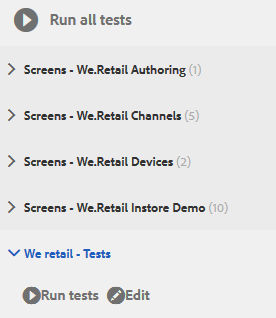

# Esercitazione: Verifica del modulo adattivo {#tutorial-testing-your-adaptive-form}


Questa esercitazione è un passaggio della serie [Crea il tuo primo modulo adattivo](https://helpx.adobe.com/it/experience-manager/6-3/forms/using/create-your-first-adaptive-form.html) . Si consiglia di seguire la serie in sequenza cronologica per comprendere, eseguire e illustrare il caso d’uso completo dell’esercitazione.

Una volta che il modulo adattivo è pronto, è importante testare l’adattivo prima di distribuirlo agli utenti finali. È possibile testare manualmente (test funzionale) ogni campo o automatizzare il test del modulo adattivo. Quando si dispone di più moduli adattivi, verificare manualmente ogni campo di tutti i moduli adattivi diventa un’attività scoraggiante.

AEM [!DNL Forms] fornire un framework di test, Calvin, per automatizzare il test dei moduli adattivi. Utilizzando il framework, puoi scrivere ed eseguire test di interfaccia utente direttamente in un browser web. Il framework fornisce API JavaScript per la creazione di test. Il test automatico consente di verificare l’esperienza di precompilazione di un modulo adattivo, inviare l’esperienza di un modulo adattivo, regole di espressione, da convalide, caricamento lento e interazioni con l’interfaccia utente. Questa esercitazione descrive i passaggi necessari per creare ed eseguire test automatizzati su un modulo adattivo. Al termine di questa esercitazione, potrai:

* [Creare una suite di test per il modulo adattivo](../../forms/using/testing-your-adaptive-form.md#step-create-a-test-suite)
* [Creazione di test per il modulo adattivo](../../forms/using/testing-your-adaptive-form.md#step-create-a-test-case-to-prefill-values-in-an-adaptive-form)
* [Esegui suite di test e test creati per il modulo adattivo](#step-run-all-the-tests-in-a-suite-or-individual-tests-cases)

## Passaggio 1: Creare una suite di test {#step-create-a-test-suite}

Le suite di test dispongono di una raccolta di casi di test. Puoi avere più suite di test. È consigliabile disporre di una suite di test separata per ciascun modulo. Per creare una suite di test:

1. Accedi AEM [!DNL Forms] istanza di authoring in come amministratore. Apri [!UICONTROL CRXDE Lite]. Tocca AEM Logo > **[!UICONTROL Strumenti]** > **[!UICONTROL Generale]** > **[!UICONTROL CRXDE Lite]** oppure apri l&#39;URL [https://localhost:4502/crx/de/index.jsp](https://localhost:4502/crx/de/index.jsp) in un browser per aprire CRXDE Lite.

1. Passa a /etc/clientlibs in [!UICONTROL CRXDE Lite]. Fai clic con il pulsante destro del mouse sulla sottocartella /etc/clientlibs e fai clic su **[!UICONTROL Crea]** > **[!UICONTROL Crea nodo]**. Nel campo **[!UICONTROL Name]** digitare **WeRetailFormTestCases**. Seleziona il tipo **cq:ClientLibraryFolder** e fai clic su **[!UICONTROL OK]**. Crea un nodo. Puoi utilizzare qualsiasi nome al posto di `WeRetailFormTestCases`.
1. Aggiungi le seguenti proprietà al nodo `WeRetailFormTestCases` e tocca **[!UICONTROL Salva ALL]**.

   <table>
    <tbody>
     <tr>
      <td><strong>Proprietà</strong></td>
      <td><strong>Tipo</strong></td>
      <td><strong>Più</strong></td>
      <td><strong>Valore</strong></td>
     </tr>
     <tr>
      <td>categorie</td>
      <td>Stringa</td>
      <td>Abilitato</td>
      <td>
       <ul>
        <li>granite.testing.hobbes.tests<br /> </li>
        <li>granite.testing.calvin.tests</li>
       </ul> </td>
     </tr>
     <tr>
      <td>dipendenze</td>
      <td>Stringa</td>
      <td>Abilitato</td>
      <td>
       <ul>
        <li>granite.testing.hobbes.testrunner <br /> </li>
        <li>granite.testing.calvin <br /> </li>
        <li>apps.testframework.all</li>
       </ul> </td>
     </tr>
    </tbody>
   </table>

   Assicurati che ogni proprietà venga aggiunta a una casella separata come mostrato di seguito:

   

1. Fai clic con il pulsante destro del mouse sul nodo **[!UICONTROL WeRetailFormTestCases]** e fai clic su **[!UICONTROL Crea]** > **[!UICONTROL Crea file]**. Nel campo **[!UICONTROL Nome]**, digita `js.txt` e fai clic su **[!UICONTROL OK]**.
1. Apri il file js.txt per la modifica, aggiungi il codice seguente e salva il file:

   ```text
   #base=.
    init.js
   ```

1. Crea un file, init.js, nel nodo `WeRetailFormTestCases`. Aggiungi il codice seguente al file e tocca **[!UICONTROL Salva tutto]**.

   ```javascript
   (function(window, hobs) {
       'use strict';
       window.testsuites = window.testsuites || {};
     // Registering the test form suite to the sytem
     // If there are other forms, all registration should be done here
       window.testsuites.testForm3 = new hobs.TestSuite("We retail - Tests", {
           path: '/etc/clientlibs/WeRetailFormTestCases/init.js',
           register: true
       });
    // window.testsuites.testForm2 = new hobs.TestSuite("testForm2");
   }(window, window.hobs));
   ```

   Il codice riportato sopra crea una suite di test denominata **We retail - Tests**.

1. Apri AEM interfaccia utente di test (AEM > **[!UICONTROL Strumenti]** > **[!UICONTROL Operazioni]** > **[!UICONTROL Test]**). La suite di test - **We retail - Tests** - è elencata nell&#39;interfaccia utente.

   

## Passaggio 2: Crea un caso di test per precompilare i valori in un modulo adattivo {#step-create-a-test-case-to-prefill-values-in-an-adaptive-form}

Un test case è un insieme di azioni per testare una funzionalità specifica. Ad esempio, la precompilazione di tutti i campi di un modulo e la convalida di alcuni campi per garantire l’immissione dei valori corretti.

Un’azione è un’attività specifica in un modulo adattivo, ad esempio fare clic su un pulsante. Per creare un caso di test e azioni per convalidare l’input dell’utente per ciascun campo modulo adattivo:

1. In [!UICONTROL CRXDE lite], passa alla cartella `/content/forms/af/create-first-adaptive-form` . Fai clic con il pulsante destro del mouse sul nodo della cartella **[!UICONTROL create-first-adaptive-form]** e fai clic su **[!UICONTROL Crea]** **[!UICONTROL Crea file]**. Nel campo **[!UICONTROL Nome]**, digita `prefill.xml` e fai clic su **[!UICONTROL OK]**. Aggiungi al file il codice seguente:

   ```xml
   <?xml version="1.0" encoding="UTF-8"?><afData>
     <afUnboundData>
       <data>
         <customer_ID>371767</customer_ID>
         <customer_Name>John Jacobs</customer_Name>
         <customer_Shipping_Address>1657 1657 Riverside Drive Redding</customer_Shipping_Address>
         <customer_State>California</customer_State>
         <customer_ZIPCode>096001</customer_ZIPCode>
        </data>
     </afUnboundData>
     <afBoundData>
       <data xmlns:xfa="https://www.xfa.org/schema/xfa-data/1.0/"/>
     </afBoundData>
   </afData>
   ```

1. Accedi a `/etc/clientlibs`. Fai clic con il pulsante destro del mouse sulla sottocartella `/etc/clientlibs` e fai clic su **[!UICONTROL Crea]**> **[!UICONTROL Crea nodo]**.

   Nel campo **[!UICONTROL Nome]** digitare `WeRetailFormTests`. Selezionare il tipo come `cq:ClientLibraryFolder` e fare clic su **[!UICONTROL OK]**.

1. Aggiungi le seguenti proprietà al nodo **[!UICONTROL WeRetailFormTests]** .

   <table>
    <tbody>
     <tr>
      <td><strong>Proprietà</strong></td>
      <td><strong>Tipo</strong></td>
      <td><strong>Più</strong></td>
      <td><strong>Valore</strong></td>
     </tr>
     <tr>
      <td>categorie</td>
      <td>Stringa</td>
      <td>Abilitato</td>
      <td>
       <ul>
        <li>granite.testing.hobbes.tests<br /> </li>
        <li>granite.testing.hobbes.tests.testForm</li>
       </ul> </td>
     </tr>
     <tr>
      <td>dipendenze</td>
      <td>Stringa</td>
      <td>Abilitato</td>
      <td>
       <ul>
        <li>granite.testing.calvin.tests</li>
       </ul> </td>
     </tr>
     </tbody>
   </table>

1. Crea un file, js.txt, nel nodo **[!UICONTROL WeRetailFormTests]** . Aggiungi quanto segue al file :

   ```shell
   #base=.
   prefillTest.js
   ```

   Fare clic su **[!UICONTROL Salva tutto]**.

1. Crea un file `prefillTest.js` nel nodo **[!UICONTROL WeRetailFormTests]** . Aggiungi il codice seguente al file . Il codice crea un test case. Il test case precompila tutti i campi di un modulo e convalida alcuni campi per assicurarsi che vengano immessi valori corretti.

   ```javascript
   (function (window, hobs) {
       'use strict';
   
       var ts = new hobs.TestSuite("Prefill Test", {
           path: '/etc/clientlibs/WeRetailFormTests/prefillTest.js',
           register: false
       })
   
       .addTestCase(new hobs.TestCase("Prefill Test")
           // navigate to the testForm which is to be test
           .navigateTo("/content/forms/af/create-first-adaptive-form/shipping-address-add-update-form.html?wcmmode=disabled&dataRef=crx:///content/forms/af/create-first-adaptive-form/prefill.xml")
           // check if adaptive form is loaded
           .asserts.isTrue(function () {
               return calvin.isFormLoaded()
           })
           .asserts.isTrue(function () {
               return calvin.model("customer_ID").value == 371767;
           })
           .asserts.isTrue(function () {
               return calvin.model("customer_ZIPCode").value == 96001;
           })
       );
   
       // register the test suite with testForm
       window.testsuites.testForm3.add(ts);
   
   }(window, window.hobs));
   ```

   Il test case viene creato e pronto per essere eseguito. È possibile creare casi di test per convalidare vari aspetti di un modulo adattivo, ad esempio per controllare l’esecuzione dello script di calcolo, la convalida dei pattern e la convalida dell’esperienza di invio di un modulo adattivo. Per informazioni sui vari aspetti del test dei moduli adattivi, vedere test automatico dei moduli adattivi.

## Passaggio 3: Esegui tutti i test in una suite o singoli casi di test {#step-run-all-the-tests-in-a-suite-or-individual-tests-cases}

Una suite di test può avere più casi di test. Puoi eseguire tutti i casi di test in una suite di test contemporaneamente o singolarmente. Quando esegui un test, le icone indicano i risultati:

* Un’icona a forma di segno di spunta indica un test superato: 
* Un&#39;icona &quot;X&quot; indica un test non riuscito: 

1. Passa all&#39;icona AEM > **[!UICONTROL Strumenti]**> **[!UICONTROL Operazioni]**> **[!UICONTROL Test]**
1. Per eseguire tutti i test della suite di test:

   1. Nel pannello [!UICONTROL Test], tocca **[!UICONTROL We retail - Test (1)]**. Si espande per visualizzare l’elenco dei test.
   1. Toccare il pulsante **[!UICONTROL Esegui test]**. L’area vuota sul lato destro dello schermo viene sostituita con un modulo adattivo durante l’esecuzione del test.

      

1. Per eseguire un singolo test dalla suite di test:

   1. Nel pannello Test, tocca **[!UICONTROL We retail - Test (1)]**. Si espande per visualizzare l’elenco dei test.
   1. Toccare il **[!UICONTROL Test di precompilazione]** e toccare il pulsante **[!UICONTROL Esegui test]**. L’area vuota sul lato destro dello schermo viene sostituita con un modulo adattivo durante l’esecuzione del test.

1. Toccare il nome del test, Prova di precompilazione, per esaminare i risultati del test case. Apre il pannello [!UICONTROL Risultato]. Toccare il nome del Test Case nel pannello [!UICONTROL Risultato] per visualizzare tutti i dettagli del test.

   

Ora il modulo adattivo è pronto per la pubblicazione.
