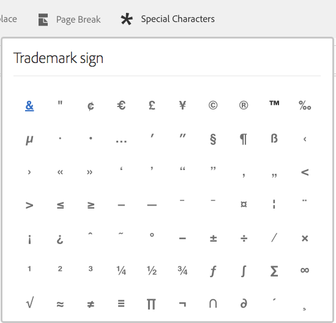

# Testi nelle comunicazioni interattive{#texts-in-interactive-communications}

## Panoramica {#overview}

Un frammento di documento di testo è costituito da uno o più paragrafi di testo. Un paragrafo può essere statico o dinamico. Un paragrafo dinamico può contenere proprietà e variabili del modello dati del modulo. È inoltre possibile applicare regole e ripeterle all’interno di un frammento di documento di testo. Ad esempio, il nome del cliente in una formula introduttiva potrebbe essere una proprietà Form Data Model (FDM) con il relativo valore reso disponibile in fase di esecuzione. Modificando questi valori, la stessa comunicazione interattiva può essere utilizzata per preparare comunicazioni interattive per clienti diversi utilizzando l’interfaccia utente dell’agente.

Il frammento di documento di testo nella comunicazione interattiva supporta il seguente tipo di dati dinamici:

* **Oggetti** del modello dati: Le proprietà dei dati utilizzano un’origine dati back-end.
* **Contenuto** basato su regole: Parti di contenuto in un testo che vengono visualizzate o nascoste in base a una regola. Una regola potrebbe anche essere basata sulle proprietà e variabili del modello dati del modulo.
* **Variabili**: Nel frammento di documento di testo, le variabili non sono associate a un’origine dati di backend. L’agente compila/seleziona i valori nelle variabili o le associa alle origini dati durante la preparazione della comunicazione interattiva per l’invio a un processo post.
* **Ripeti**: È possibile che nella comunicazione interattiva siano presenti informazioni dinamiche, ad esempio transazioni in un estratto conto della carta di credito, il cui numero di occorrenze può continuare a cambiare con ogni comunicazione interattiva generata. Utilizzando la funzione di ripetizione, è possibile formattare e strutturare tali informazioni dinamiche. Per ulteriori informazioni, vedere [Condizione in linea e ripetere](https://helpx.adobe.com/experience-manager/6-3/forms/using/cm-inline-condition.html).

## Crea testo {#createtext}

1. Selezionare **[!UICONTROL Forms]** > **[!UICONTROL Frammenti documento]**.
1. Seleziona **[!UICONTROL Crea]** > **[!UICONTROL Testo]**.
1. Specifica le seguenti informazioni:

   * **[!UICONTROL Titolo]**: (Facoltativo) Immettere il titolo del frammento di documento di testo. I titoli non devono essere univoci e possono contenere caratteri speciali e caratteri non inglesi. I testi sono indicati dai loro titoli (se disponibili), ad esempio nelle miniature e nelle proprietà.
   * **[!UICONTROL Nome]**: Nome univoco del testo all’interno di una cartella. In una cartella non possono esistere due frammenti di documento (testo, condizione o elenco) con lo stesso nome. Nel campo Nome è possibile immettere solo caratteri, numeri e trattini della lingua inglese. Il campo Nome viene compilato automaticamente in base al campo Titolo . I caratteri speciali, gli spazi, i numeri e i caratteri non inglesi immessi nel campo Titolo vengono sostituiti dai trattini nel campo Nome . Anche se il valore nel campo Titolo viene copiato automaticamente nel campo Nome, è possibile modificarlo.

   * **[!UICONTROL Descrizione]**: Digitare una descrizione del testo.
   * **[!UICONTROL Modello]** dati modulo: Facoltativamente, selezionare il pulsante di opzione Modello dati modulo per creare il testo basato su un modello dati modulo. Quando si seleziona il pulsante di opzione Modello dati modulo , viene visualizzato il campo **[!UICONTROL Modello dati modulo]** . Sfogliare e selezionare un modello dati del modulo. Durante la creazione di testo e condizioni per una comunicazione interattiva, assicurati di utilizzare lo stesso modello dati che intendi utilizzare nella comunicazione interattiva. Per ulteriori informazioni su Form Data Model, vedere [Integrazione dei dati](/help/forms/using/data-integration.md).

   * **[!UICONTROL Tag]**: Facoltativamente, per creare un tag personalizzato inserisci il valore nel campo di testo e premi Invio. Quando salvi questo testo, vengono creati i nuovi tag aggiunti.

1. Tocca **[!UICONTROL Avanti]**.

   Viene visualizzata la pagina Crea testo . Se si è scelto di creare un testo basato su un modello di dati modulo, le proprietà del modello di dati modulo vengono visualizzate nel riquadro a sinistra.

1. Digitare il testo e utilizzare le opzioni seguenti per formattare, condizionalizzare e inserire nel testo le proprietà e le variabili del modello dati del modulo:

   * [Modello dati modulo](#formdatamodel)
   * [Variabili](#variables)
   * [Editor di regole](#rules)
   * [Opzioni di formattazione](#formatting)

      * [Copia e incolla testo formattato da altre applicazioni](#paste)

      * [Evidenziare parti di testo](#highlight)
   * [Ripeti](/help/forms/using/cm-inline-condition.md)
   * [Caratteri speciali](#special)
   * [Ricerca e sostituzione del testo](#searching)
   * [Scelte rapide da tastiera](/help/forms/using/keyboard-shortcuts.md)

   >[!NOTE]
   >
   >È possibile aggiungere elementi del modello dati modulo, elementi del dizionario dati e variabili utilizzando il simbolo @ nell’editor di testo. Quando immetti una stringa preceduta da @ nell’editor di testo, vengono cercati tutti gli elementi del modello dati, gli elementi e le variabili del dizionario dati e vengono visualizzati gli elementi o le variabili contenenti la stringa ricercata. Puoi navigare tra i risultati della ricerca e selezionare un elemento o una variabile. Se non è presente alcun risultato corrispondente, viene visualizzato il messaggio *Nessun risultato corrispondente trovato* .

1. Tocca **[!UICONTROL Salva]**.

   Il testo viene creato. È ora possibile utilizzare il testo come blocco predefinito durante la creazione di una comunicazione interattiva.

## Modifica testo {#edittext}

È possibile modificare un frammento di documento di testo esistente utilizzando i passaggi seguenti. È inoltre possibile scegliere di modificare un frammento di documento di testo da un editor di comunicazioni interattive.

1. Selezionare **[!UICONTROL Forms]** > **[!UICONTROL Frammenti documento]**.
1. Selezionare un frammento di documento di testo.
1. Tocca **[!UICONTROL Modifica]**.
1. Apporta le modifiche necessarie. Per ulteriori informazioni sulle opzioni nel testo, vedere [Crea testo](#createtext).
1. Tocca **[!UICONTROL Salva]**, quindi tocca **[!UICONTROL Chiudi]**.

## Personalizzazione di un frammento di documento di testo utilizzando le proprietà del modello dati del modulo {#formdatamodel}

È possibile personalizzare i frammenti del documento di testo inserendo le proprietà del modello dati del modulo. Inserendo le proprietà del modello dati del modulo nel testo, è possibile recuperare e compilare dati specifici del destinatario dall’origine dati associata durante l’anteprima di una comunicazione interattiva. Per ulteriori informazioni sul modello di dati del modulo, vedere [Integrazione dei dati di AEM Forms](/help/forms/using/data-integration.md).

Se durante la creazione di un testo è stato specificato un modello dati modulo, le proprietà nel modello dati modulo vengono visualizzate nel riquadro a sinistra dell’editor di testo. Il modello dati modulo specificato deve essere lo stesso per il frammento di documento di testo e per la comunicazione interattiva che lo include.

* Per inserire una proprietà del modello dati modulo nel testo, posizionare il cursore nel punto in cui si desidera inserire la proprietà, quindi selezionare la proprietà **[A]** nel riquadro a sinistra toccandola e toccare **[!UICONTROL [B] Aggiungi selezionati]**. Puoi anche semplicemente toccare due volte la proprietà per inserirla nella posizione del cursore **[C]**. Le proprietà del modello dati del modulo sono evidenziate con un colore di sfondo brunastro.

In alternativa, è possibile cercare e aggiungere la proprietà del modello dati del modulo utilizzando il simbolo @ nell’editor di testo. Posizionare il cursore nel punto in cui si desidera inserire la proprietà. Digitare @ seguito dalla stringa di ricerca. L’operazione di ricerca viene eseguita su tutte le proprietà e le variabili del modello dati del modulo disponibili nel frammento di documento. Le proprietà o variabili contenenti la stringa di ricerca vengono recuperate e visualizzate come elenco a discesa. Passa tra i risultati della ricerca e fai clic sulla proprietà che desideri inserire nella posizione del cursore. Premere Esc per nascondere i risultati della ricerca.

* Per consentire agli agenti di modificare il valore di una proprietà del modello dati del modulo nell&#39;interfaccia utente dell&#39;agente durante la [Preparazione e invio della comunicazione interattiva](/help/forms/using/prepare-send-interactive-communication.md) tramite l&#39;interfaccia utente dell&#39;agente, tocca l&#39;icona di blocco **[D]** per tale proprietà e assicurati che si trovi in uno stato sbloccato. Lo stato predefinito della proprietà è bloccato e un agente non può modificare la proprietà nell&#39;interfaccia utente dell&#39;agente.

È inoltre possibile utilizzare le proprietà del modello dati del modulo per creare regole per visualizzare o nascondere parti di contenuto. Per ulteriori informazioni, consulta [Creare regole nel testo](#rules).

## Creazione e utilizzo di variabili in un frammento di documento di testo {#variables}

Le variabili sono segnaposto che possono essere associati durante la creazione di una comunicazione interattiva. Le variabili possono essere associate a una proprietà del modello dati del modulo o a un frammento di testo. È inoltre possibile lasciare che l’agente si riempia.

È possibile utilizzare le variabili invece delle proprietà del modello dati modulo quando:

* Un frammento di documento di testo deve essere utilizzato in più comunicazioni interattive in cui il binding deve essere diverso per comunicazioni interattive diverse.
* Al momento della creazione, il frammento di documento di testo non dispone di un modello dati del modulo. È possibile inserire le variabili e successivamente associarle alle proprietà del modello dati del modulo al momento della creazione della comunicazione interattiva.
* È necessario eseguire il binding e il recupero del testo da un frammento di documento di testo. Solo i frammenti di documento di testo che possono essere associati a variabili non devono avere variabili all’interno.

Durante la creazione o la modifica di un frammento di documento di testo, è possibile creare e inserire variabili. Le variabili create vengono visualizzate nella scheda Dati dell’interfaccia utente dell’agente. L&#39;agente specifica i valori delle variabili mentre [Prepara e invia comunicazioni interattive utilizzando l&#39;interfaccia utente dell&#39;agente](/help/forms/using/prepare-send-interactive-communication.md).

### Crea variabili {#createvariables}

1. Nel riquadro a sinistra, tocca **[!UICONTROL Variabili]**.

   Viene visualizzato il riquadro Variabili.

   

1. Tocca **[!UICONTROL Crea]**.

   Viene visualizzato il riquadro Crea variabili .

1. Immetti le seguenti informazioni e tocca **[!UICONTROL Crea]**:

   * **[!UICONTROL Nome]** : Nome della variabile.
   * **[!UICONTROL Descrizione]** : Facoltativamente, inserisci una descrizione della variabile.
   * **[!UICONTROL Tipo]** : Seleziona un tipo di variabile: Stringa, Numero, Booleano o Data.
   * **[!UICONTROL Consenti solo]**  valori specifici: Per le variabili String e Number, è possibile assicurarsi che l&#39;agente scelga da un set specifico di valori per un segnaposto nell&#39;interfaccia utente dell&#39;agente. Per specificare il set di valori, selezionare questa opzione, quindi specificare i valori separati da virgola consentiti nel campo **[!UICONTROL Valori]**.

1. Tocca **[!UICONTROL Crea]**.

   La variabile viene creata ed elencata nel riquadro Variabili .

1. Per inserire una variabile nel testo, posiziona il cursore nella posizione appropriata, seleziona la variabile e tocca **[!UICONTROL Aggiungi selezionati]**.

   

   Le variabili vengono evidenziate con un colore di sfondo blu chiaro, mentre le proprietà del modello dati del modulo sono evidenziate con un colore brunastro.

   In alternativa, è possibile cercare e aggiungere variabili utilizzando il simbolo @ nell’editor di testo. Posizionare il cursore nel punto in cui si desidera inserire la variabile. Digitare @ seguito dalla stringa di ricerca. L’operazione di ricerca viene eseguita su tutte le proprietà e le variabili del modello dati del modulo disponibili nel frammento di documento. Le proprietà e le variabili contenenti la stringa di ricerca vengono recuperate e visualizzate come elenco a discesa. Passa tra i risultati della ricerca e fai clic sulla variabile da inserire nella posizione del cursore. Premere Esc per nascondere i risultati della ricerca.

1. Tocca **[!UICONTROL Salva]**.

## Crea regole nel testo {#rules}

Utilizzando l&#39;editor di regole in un testo, puoi creare regole per visualizzare o nascondere stringhe di testo o parti di contenuto in base a **condizioni preimpostate**. Queste condizioni possono essere costruite in base a:

* Stringhe
* Numeri
* Espressione matematica
* Date
* Proprietà del modello dati del modulo associato
* Eventuali variabili create nel testo

### Crea regole nel testo {#create-rules-in-text}

1. Durante la creazione o la modifica di un testo, selezionare la stringa di testo, il paragrafo o il contenuto da condizionalizzare utilizzando la regola.

   

1. Tocca **[!UICONTROL Crea regola]**.

   Viene visualizzata la finestra di dialogo Crea regola. Oltre a stringa, numero, espressione matematica e data, nell’Editor regole sono disponibili anche le seguenti istruzioni per la creazione di istruzioni delle regole:

   * Proprietà del modello dati del modulo associato
   * Qualsiasi variabile creata

   Selezionare l’opzione appropriata da valutare.

    

   >[!NOTE]
   >
   >La proprietà Collection non è supportata per la creazione di regole per la condizionale e la visualizzazione di testo.

1. Seleziona l’operatore appropriato per valutare la regola, ad esempio È uguale a, Contiene e Inizia con.

   

1. Inserire l&#39;espressione di valutazione, il valore, la proprietà del modello dati o la variabile.

   

   Regola per visualizzare il testo selezionato se la posizione del destinatario è US in base ai dati di origine di FDM

   * Durante la creazione o la modifica di una regola, puoi anche toccare  (Ridimensiona) per espandere la finestra di dialogo Crea regola/Modifica regola. La finestra di dialogo estesa a tutta la finestra consente di trascinare le proprietà e le variabili del modello dati del modulo per creare regole. Tocca nuovamente Ridimensiona per tornare alla finestra di dialogo Crea regola.
   * Puoi anche creare più condizioni in una regola.
   * Puoi anche creare regole di sovrapposizione, in cui una regola viene applicata a una parte di contenuto a cui è già stata applicata una regola.

1. Toccate **[!UICONTROL Chiudi]**.

   La regola viene applicata. Il testo o il contenuto a cui viene applicata la regola viene evidenziato in verde. Quando passi il cursore del mouse sulla maniglia sinistra dell&#39;evidenziazione, viene visualizzata la regola applicata.

   

   Facendo clic sulla maniglia sinistra della regola applicata, si ottengono le opzioni per modificare o rimuovere la regola.

## Formattazione del testo {#formatting}

Durante la creazione o la modifica del testo, la barra degli strumenti varia a seconda del tipo di modifica che si sceglie di apportare: Paragrafo, Allineamento o Elenco:

Seleziona il tipo di barra degli strumenti: Paragrafo, Allineamento o Elenco

Barra degli strumenti di modifica dei font

Barra degli strumenti Allineamento

Barra degli strumenti Elenco

### Evidenziare/evidenziare parti di testo {#highlight}

Per evidenziare\enfatizzare parti di testo in un frammento di documento modificabile, selezionare il testo e toccare Evidenzia colore.

È possibile toccare direttamente un colore di base `**[A]**` presente nella palette Colori di base oppure toccare **Seleziona** dopo aver utilizzato il cursore `**[B]**` per scegliere l&#39;ombreggiatura appropriata del colore.

Facoltativamente, puoi anche passare alla scheda Avanzate per selezionare la tonalità, la luminosità e la saturazione `**[C]**` appropriata per creare il colore preciso, quindi toccare Seleziona `**[D]**` per applicare il colore in modo da evidenziare il testo.

### Incolla il testo formattato {#paste}

Per riutilizzare uno o più paragrafi di testo esistenti in un&#39;altra applicazione, ad esempio da pagine Microsoft® Word o HTML, copiare e incollare il testo nell&#39;editor di testo. La formattazione del testo copiato viene mantenuta nell&#39;editor di testo.

È possibile copiare e incollare uno o più paragrafi di testo in un frammento di documento di testo modificabile. Ad esempio, è possibile che si disponga di un documento Microsoft® Word con un elenco puntato di bozze di residenza accettabili, come riportato di seguito:

È possibile copiare e incollare direttamente il testo dal documento Microsoft® Word in un frammento di documento di testo modificabile. La formattazione, ad esempio l’elenco puntato, il font e il colore del testo, viene mantenuta nel frammento di documento di testo.

>[!NOTE]
>
>La formattazione del testo incollato, tuttavia, presenta alcune [limitazioni](https://helpx.adobe.com/aem-forms/kb/cm-copy-paste-text-limitations.html).

## Inserisci caratteri speciali nel testo {#special}

Se necessario, inserire caratteri speciali nel frammento di documento. Ad esempio, è possibile utilizzare la palette Caratteri speciali per inserire:

* Simboli di valuta come €,¥ e £
* Simboli matematici come ∑, Ö, , e ^
* Simboli di punteggiatura come ‟ e&quot;

L’editor di testo ha integrato il supporto di 210 caratteri speciali. L&#39;amministratore può [aggiungere supporto per caratteri speciali più/personalizzati tramite personalizzazione](/help/forms/using/custom-special-characters.md).

## Ricerca e sostituzione del testo {#searching}

Quando si utilizzano frammenti di documento di testo contenenti una grande quantità di testo, è necessario cercare una stringa di testo specifica. Potrebbe inoltre essere necessario sostituire una stringa di testo specifica con una stringa alternativa.

La funzione Trova e sostituisci consente di cercare (e sostituire) qualsiasi stringa di testo in un frammento di documento di testo. La funzione include anche una potente ricerca di espressioni regolari.

1. Apri un frammento di documento di testo per [modificare](#edittext).
1. Tocca **[!UICONTROL Trova e sostituisci]**.

1. Inserisci il testo da cercare nella casella di testo **[!UICONTROL Trova]** e il nuovo testo (testo di sostituzione) nella casella di testo **[!UICONTROL Sostituisci]** e tocca **[!UICONTROL Sostituisci]**.

1. Se il testo cercato viene trovato, il testo viene sostituito dal testo sostitutivo.

   * Se viene trovata un’altra istanza del testo di ricerca, tale istanza viene evidenziata nel frammento di documento di testo. Se tocchi nuovamente **[!UICONTROL Sostituisci]**, l&#39;istanza evidenziata viene sostituita e il cursore si sposta in avanti, se viene trovata una terza istanza.
   * Se non viene trovata un&#39;altra istanza, nella finestra di dialogo Trova e sostituisci viene visualizzato un messaggio: Fine del modulo raggiunta.

   Puoi anche toccare Sostituisci tutto per sostituire tutte le corrispondenze con una sola mossa.

   Trova e sostituisci include anche una potente ricerca di espressioni regolari. Per utilizzare l&#39;espressione regex nella ricerca, selezionare **[!UICONTROL Reg ex]**, quindi toccare **[!UICONTROL Trova]** o **[!UICONTROL Sostituisci]**.

