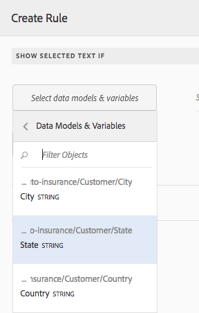

# Testi nelle comunicazioni interattive{#texts-in-interactive-communications}

## Panoramica {#overview}

Un frammento di documento di testo è costituito da uno o più paragrafi di testo. Un paragrafo può essere statico o dinamico. Un paragrafo dinamico può contenere proprietà e variabili del modello dati del modulo. È inoltre possibile applicare regole e ripeterle all&#39;interno di un frammento di documento di testo. Ad esempio, il nome del cliente in una formula introduttiva potrebbe essere una proprietà FDM (Form Data Model) con il relativo valore reso disponibile in fase di esecuzione. Modificando questi valori, la stessa comunicazione interattiva può essere utilizzata per preparare la comunicazione interattiva per clienti diversi utilizzando l&#39;interfaccia utente dell&#39;agente.

Il frammento di documento di testo in Comunicazione interattiva supporta il seguente tipo di dati dinamici:

* **Oggetti** del modello dati: Le proprietà dei dati utilizzano un&#39;origine dati back-end.
* **Contenuto** basato su regole: Parti di contenuto in un testo che vengono visualizzate o nascoste in base a una regola. Una regola può anche essere basata sulle proprietà e sulle variabili del modello dati del modulo.
* **Variabili**: Nel frammento di documento di testo, le variabili non sono associate a un&#39;origine dati back-end. L&#39;agente compila/seleziona i valori nelle variabili o vincola le variabili alle origini dati durante la preparazione della comunicazione interattiva per l&#39;invio a un processo di pubblicazione.
* **Ripeti**: È possibile che nella comunicazione interattiva siano presenti informazioni dinamiche, come le transazioni in un rendiconto della carta di credito, il cui numero di occorrenze può continuare a cambiare con ogni comunicazione interattiva generata. Utilizzando la ripetizione, potete formattare e strutturare tali informazioni dinamiche. Per ulteriori informazioni, vedere [Condizione in linea e ripetere](https://helpx.adobe.com/experience-manager/6-3/forms/using/cm-inline-condition.html).

## Crea testo {#createtext}

1. Selezionare **[!UICONTROL Forms]** > **[!UICONTROL Frammenti documento]**.
1. Selezionare **[!UICONTROL Crea]** > **[!UICONTROL Testo]**.
1. Specificate le seguenti informazioni:

   * **[!UICONTROL Titolo]**: (Facoltativo) Immettere il titolo per il frammento di documento di testo. I titoli non devono essere univoci e possono contenere caratteri speciali e caratteri non inglesi. I testi sono indicati dai titoli (se disponibili), ad esempio nelle miniature e nelle proprietà.
   * **[!UICONTROL Nome]**: Nome univoco del testo, all’interno di una cartella. In una cartella non possono essere presenti due frammenti di documento (testo, condizione o elenco) con lo stesso nome. Nel campo Nome, è possibile immettere solo caratteri, numeri e trattini della lingua inglese. Il campo Nome viene compilato automaticamente in base al campo Titolo. I caratteri speciali, gli spazi, i numeri e i caratteri non inglesi immessi nel campo Titolo vengono sostituiti con i trattini nel campo Nome. Anche se il valore nel campo Titolo viene automaticamente copiato nel campo Nome, è possibile modificarlo.

   * **[!UICONTROL Descrizione]**: Digitate una descrizione del testo.
   * **[!UICONTROL Modello]** dati modulo: Facoltativamente, selezionare il pulsante di opzione Modello dati modulo per creare il testo basato su un modello dati del modulo. Quando si seleziona il pulsante di scelta Modello dati modulo, viene visualizzato il campo **[!UICONTROL Modello dati modulo]**. Individuare e selezionare un modello dati del modulo. Durante la creazione di testo e condizioni per una comunicazione interattiva, accertatevi di utilizzare lo stesso modello dati che intendete utilizzare nella comunicazione interattiva. Per ulteriori informazioni sul modello dati modulo, vedere [Integrazione dati](/help/forms/using/data-integration.md).

   * **[!UICONTROL Tag]**: Se necessario, per creare un tag personalizzato immettete un valore nel campo di testo e premete Invio. Quando salvate questo testo, vengono creati i nuovi tag aggiunti.

1. Toccare **[!UICONTROL Next]**.

   Viene visualizzata la pagina Crea testo. Se si è scelto di creare un testo basato su un modello dati del modulo, le proprietà del modello dati del modulo vengono visualizzate nel riquadro a sinistra.

1. Digitare il testo e utilizzare le seguenti opzioni per formattare, condizionalizzare e inserire nel testo le proprietà e le variabili del modello dati del modulo:

   * [Modello dati modulo](#formdatamodel)
   * [Variabili](#variables)
   * [Editor regole](#rules)
   * [Opzioni di formattazione](#formatting)

      * [Copia e incolla testo formattato da altre applicazioni](#paste)

      * [Evidenziare parti di testo](#highlight)
   * [Ripeti](/help/forms/using/cm-inline-condition.md)
   * [Caratteri speciali](#special)
   * [Ricerca e sostituzione del testo](#searching)
   * [Scelte rapide da tastiera](/help/forms/using/keyboard-shortcuts.md)

   >[!NOTE]
   >
   >È possibile aggiungere elementi del modello dati modulo, elementi del dizionario dati e variabili utilizzando il simbolo @ nell&#39;editor di testo. Quando si immette una stringa preceduta da @ nell&#39;editor di testo, vengono cercati tutti gli elementi del modello dati, gli elementi del dizionario dati e le variabili e vengono visualizzati elementi o variabili contenenti la stringa ricercata. Potete scorrere i risultati della ricerca e selezionare un elemento o una variabile. In assenza di risultati corrispondenti, viene visualizzato il messaggio *Nessun risultato corrispondente trovato*.

1. Toccate **[!UICONTROL Salva]**.

   Il testo viene creato. Ora potete utilizzare il testo come blocco predefinito durante la creazione di una comunicazione interattiva.

## Modifica testo {#edittext}

È possibile modificare un frammento di documento di testo esistente utilizzando la procedura seguente. È inoltre possibile scegliere di modificare un frammento di documento di testo direttamente da un editor di comunicazione interattiva.

1. Selezionare **[!UICONTROL Forms]** > **[!UICONTROL Frammenti documento]**.
1. Individuare e selezionare un frammento di documento di testo.
1. Toccate **[!UICONTROL Modifica]**.
1. Apportate le modifiche necessarie. Per ulteriori informazioni sulle opzioni nel testo, vedere [Crea testo](#createtext).
1. Toccate **[!UICONTROL Save]**, quindi toccate **[!UICONTROL Close]**.

## Personalizzazione di un frammento di documento di testo utilizzando le proprietà del modello dati del modulo {#formdatamodel}

È possibile personalizzare i frammenti di documento di testo inserendo le proprietà del modello dati del modulo. Inserendo le proprietà del modello dati del modulo nel testo, è possibile recuperare e compilare dati specifici del destinatario dall&#39;origine dati associata durante la visualizzazione dell&#39;anteprima di una comunicazione interattiva. Per ulteriori informazioni sul modello di dati del modulo, vedere [ Integrazione dei dati AEM Forms](/help/forms/using/data-integration.md).

Se durante la creazione di un testo è stato specificato un modello dati modulo, le proprietà del modello dati modulo vengono visualizzate nel riquadro sinistro dell&#39;editor di testo. Il modello dati del modulo specificato deve essere lo stesso per il frammento di documento di testo e per la comunicazione interattiva che lo include.

* Per inserire nel testo una proprietà del modello dati del modulo, posizionare il cursore nel punto in cui si desidera inserire la proprietà, quindi selezionare la proprietà **[A]** nel riquadro a sinistra toccando la proprietà, quindi toccare **[!UICONTROL [B] Aggiungi selezionato]**. È inoltre possibile toccare due volte la proprietà per inserirla nella posizione del cursore **[C]**. Le proprietà del modello dati del modulo sono evidenziate in un colore di sfondo brunastro.

In alternativa, è possibile cercare e aggiungere la proprietà del modello dati del modulo utilizzando il simbolo @ nell&#39;editor di testo. Posizionare il cursore nel punto in cui si desidera inserire la proprietà. Digitare @ seguito dalla stringa di ricerca. L&#39;operazione di ricerca viene eseguita su tutte le proprietà del modello dati del modulo e le variabili disponibili nel frammento di documento. Le proprietà o le variabili contenenti la stringa di ricerca vengono recuperate e visualizzate come elenco a discesa. Scorrete i risultati della ricerca e fate clic sulla proprietà che desiderate inserire nella posizione del cursore. Premete Esc per nascondere i risultati della ricerca.

* Per consentire agli agenti di modificare il valore di una proprietà del modello dati del modulo nell&#39;interfaccia utente dell&#39;agente durante la [Preparazione e invio della comunicazione interattiva](/help/forms/using/prepare-send-interactive-communication.md) tramite l&#39;interfaccia utente dell&#39;agente, toccare l&#39;icona del blocco **[D]** relativa a tale proprietà e assicurarsi che sia nello stato sbloccato. Lo stato predefinito della proprietà è bloccato e un agente non può modificare la proprietà nell&#39;interfaccia utente dell&#39;agente.

È inoltre possibile utilizzare le proprietà del modello dati del modulo per creare regole per visualizzare o nascondere parti di contenuto. Per ulteriori informazioni, vedere [Creare regole in text](#rules).

## Creazione e utilizzo di variabili in un frammento di documento di testo {#variables}

Le variabili sono segnaposto che possono essere associati durante la creazione di una comunicazione interattiva. Le variabili possono essere associate a una proprietà del modello dati del modulo o a un frammento di testo. È inoltre possibile lasciare che l&#39;agente riempia le variabili.

È possibile utilizzare le variabili invece delle proprietà del modello dati modulo quando:

* Un frammento di documento di testo deve essere utilizzato in più comunicazioni interattive in cui il binding deve essere diverso per le diverse comunicazioni interattive.
* Al momento della creazione del frammento di documento di testo non è presente un modello dati del modulo. È possibile inserire variabili e successivamente associarle alle proprietà del modello dati del modulo al momento della creazione della comunicazione interattiva.
* È necessario eseguire un binding e recuperare il testo da un frammento di documento di testo. Solo i frammenti di documento di testo che possono essere associati a variabili non devono contenere variabili al loro interno.

Durante la creazione o la modifica di un frammento di documento di testo, è possibile creare e inserire variabili. Le variabili create vengono visualizzate nella scheda Dati dell’interfaccia utente agente. L&#39;agente specifica i valori per le variabili mentre [Prepara e invia comunicazioni interattive utilizzando l&#39;interfaccia utente dell&#39;agente](/help/forms/using/prepare-send-interactive-communication.md).

### Creare variabili {#createvariables}

1. Nel riquadro a sinistra, toccare **[!UICONTROL Variabili]**.

   Viene visualizzato il riquadro Variabili.

   

1. Toccate **[!UICONTROL Crea]**.

   Viene visualizzato il riquadro Crea variabili.

1. Immettere le informazioni seguenti e toccare **[!UICONTROL Crea]**:

   * **[!UICONTROL Nome]** : Nome della variabile.
   * **[!UICONTROL Descrizione]** : Facoltativamente, immettete una descrizione della variabile.
   * **[!UICONTROL Tipo]** : Selezionare un tipo di variabile: Stringa, Numero, Booleano o Data.
   * **[!UICONTROL Consenti solo]**  valori specifici: Per le variabili String e Number, potete fare in modo che l&#39;agente scelga da un set specifico di valori per un segnaposto nell&#39;interfaccia utente dell&#39;agente. Per specificare il set di valori, selezionare questa opzione e specificare i valori separati da virgola consentiti nel campo **[!UICONTROL Values]**.

1. Toccate **[!UICONTROL Crea]**.

   La variabile viene creata ed elencata nel riquadro Variabili.

1. Per inserire una variabile nel testo, posizionate il cursore nella posizione appropriata, selezionate la variabile e toccate **[!UICONTROL Aggiungi selezionato]**.

   

   Le variabili sono evidenziate con un colore di sfondo blu chiaro, mentre le proprietà del modello dati del modulo sono evidenziate con un colore brunastro.

   In alternativa, è possibile cercare e aggiungere variabili utilizzando il simbolo @ nell&#39;editor di testo. Posizionare il cursore nel punto in cui si desidera inserire la variabile. Digitare @ seguito dalla stringa di ricerca. L&#39;operazione di ricerca viene eseguita su tutte le proprietà del modello dati del modulo e le variabili disponibili nel frammento di documento. Le proprietà e le variabili contenenti la stringa di ricerca vengono recuperate e visualizzate come elenco a discesa. Scorri i risultati della ricerca e fai clic sulla variabile da inserire nella posizione del cursore. Premete Esc per nascondere i risultati della ricerca.

1. Toccate **[!UICONTROL Salva]**.

## Creare regole nel testo {#rules}

Utilizzando l&#39;editor di regole in un testo, potete creare regole per visualizzare o nascondere stringhe di testo o parti di contenuto basate su **condizioni preimpostate**. Queste condizioni possono essere costruite sulla base di:

* Stringhe
* Numeri
* Espressione matematica
* Date
* Proprietà del modello dati del modulo associato
* Qualsiasi variabile eventualmente creata nel testo

### Creare regole nel testo {#create-rules-in-text}

1. Durante la creazione o la modifica di un testo, selezionate la stringa di testo, il paragrafo o il contenuto da condizionare utilizzando la regola.

   

1. Toccate **[!UICONTROL Crea regola]**.

   Viene visualizzata la finestra di dialogo Crea regola. Oltre a stringa, numero, espressione matematica e data, nell&#39;Editor regola sono disponibili anche le seguenti informazioni per la creazione di istruzioni delle regole:

   * Proprietà del modello dati del modulo associato
   * Qualsiasi variabile creata

   Selezionare l&#39;opzione appropriata da valutare.

    

   >[!NOTE]
   >
   >La proprietà Collection non è supportata per la creazione di regole per la condizionale e la visualizzazione del testo.

1. Selezionare l&#39;operatore appropriato per valutare la regola, ad esempio È uguale a, Contiene e Inizia con.

   

1. Inserire l&#39;espressione di valutazione, il valore, la proprietà del modello dati o la variabile.

   

   Regola per visualizzare il testo selezionato se la posizione del destinatario è US in base ai dati di origine di FDM

   * Durante la creazione o la modifica di una regola, potete anche toccare  (Ridimensiona) per espandere la finestra di dialogo Crea regola/Modifica regola. La finestra di dialogo estesa a tutta finestra consente di trascinare le proprietà e le variabili del modello dati del modulo per creare le regole. Toccate nuovamente Ridimensiona per tornare alla finestra di dialogo Crea regola.
   * È inoltre possibile creare più condizioni in una regola.
   * Potete anche creare regole di sovrapposizione, in cui una regola viene applicata a una parte di contenuto a cui è già applicata una regola.

1. Toccate **[!UICONTROL Chiudi]**.

   La regola viene applicata. Il testo o il contenuto a cui è applicata la regola è evidenziato in verde. Quando si passa il mouse sulla maniglia sinistra dell&#39;evidenziazione, viene visualizzata la regola applicata.

   

   Facendo clic sulla maniglia sinistra della regola applicata, si ottengono le opzioni per modificare o rimuovere la regola.

## Formattazione del testo {#formatting}

Durante la creazione o la modifica del testo, la barra degli strumenti cambia a seconda del tipo di modifiche che si desidera apportare: Paragrafo, Allineamento o Elenco:

Selezionare il tipo di barra degli strumenti: Paragrafo, Allineamento o Elenco

Barra degli strumenti di modifica dei font

Allineamento, barra degli strumenti

Elenco, barra degli strumenti

### Evidenziare/mettere in evidenza parti di testo {#highlight}

Per evidenziare\enfatizzare parti di testo in un frammento di documento modificabile, selezionare il testo e toccare Evidenzia colore.

È possibile toccare direttamente un colore di base `**[A]**` presente nella palette Colori base oppure toccare **Seleziona** dopo aver utilizzato il cursore `**[B]**` per scegliere la tonalità appropriata del colore.

Facoltativamente, è anche possibile passare alla scheda Avanzate per selezionare la tonalità, la luminosità e la saturazione `**[C]**` appropriata per creare il colore preciso, quindi toccare Seleziona `**[D]**` per applicare il colore per evidenziare il testo.

### Incolla il testo formattato {#paste}

Per riutilizzare uno o più paragrafi di testo esistenti in un&#39;altra applicazione, ad esempio da pagine di Microsoft® Word o HTML, copiate e incollate il testo nell&#39;editor di testo. La formattazione del testo copiato viene mantenuta nell’editor di testo.

È possibile copiare e incollare uno o più paragrafi di testo in un frammento di documento di testo modificabile. Ad esempio, è possibile che si disponga di un documento di Microsoft® Word con un elenco puntato di prove di residenza accettabili, ad esempio:

È possibile copiare e incollare direttamente il testo dal documento Microsoft® Word a un frammento di documento di testo modificabile. La formattazione, ad esempio l&#39;elenco puntato, il font e il colore del testo, viene mantenuta nel frammento di documento di testo.

>[!NOTE]
>
>La formattazione del testo incollato, tuttavia, presenta alcune [limitazioni](https://helpx.adobe.com/aem-forms/kb/cm-copy-paste-text-limitations.html).

## Inserisci caratteri speciali nel testo {#special}

Se necessario, inserire caratteri speciali nel frammento di documento. Ad esempio, è possibile utilizzare la palette Caratteri speciali per inserire:

* Simboli di valuta come €,⇒ e £
* Simboli matematici come i simboli all&#39;unisono, seguente:
* Simboli di punteggiatura come ‟ e&quot;

L&#39;editor di testo ha integrato il supporto per 210 caratteri speciali. L&#39;amministratore può [aggiungere supporto per più/personalizzare caratteri speciali mediante la personalizzazione](/help/forms/using/custom-special-characters.md).

## Ricerca e sostituzione del testo {#searching}

Quando si utilizzano frammenti di documento di testo contenenti una grande quantità di testo, è necessario cercare una stringa di testo specifica. Potrebbe inoltre essere necessario sostituire una stringa di testo specifica con una stringa alternativa.

La funzione Trova e sostituisci consente di cercare (e sostituire) qualsiasi stringa di testo in un frammento di documento di testo. La funzione include anche una potente ricerca di espressioni regolari.

1. Aprire un frammento di documento di testo per [modificare](#edittext).
1. Toccate **[!UICONTROL Trova e sostituisci]**.

1. Immettete il testo da cercare nella casella di testo **[!UICONTROL Trova]** e il nuovo testo (testo sostitutivo) nella casella di testo **[!UICONTROL Sostituisci]** e toccate **[!UICONTROL Sostituisci]**.

1. Se il testo ricercato viene trovato, il testo viene sostituito dal testo sostitutivo.

   * Se viene trovata un&#39;altra istanza del testo di ricerca, tale istanza viene evidenziata nel frammento del documento di testo. Se toccate nuovamente **[!UICONTROL Replace]**, l&#39;istanza evidenziata viene sostituita e il cursore si sposta in avanti, se viene trovata una terza istanza.
   * Se non viene trovata un&#39;altra istanza, nella finestra di dialogo Trova e sostituisci viene visualizzato un messaggio: Fine del modulo raggiunta.

   Potete anche toccare Replace all (Sostituisci tutto) per sostituire tutte le corrispondenze in un&#39;unica operazione.

   Trova e sostituisci include anche una potente ricerca di espressioni regolari. Per utilizzare regex nella ricerca, selezionare **[!UICONTROL Reg ex]**, quindi toccare **[!UICONTROL Find]** o **[!UICONTROL Replace]**.

