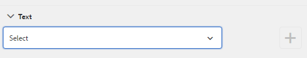
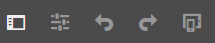
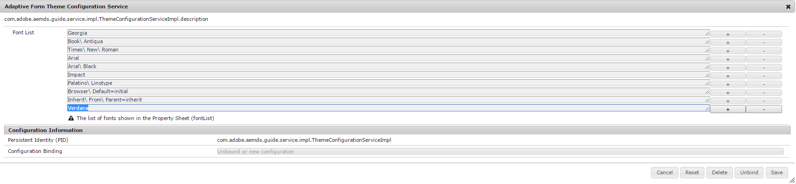
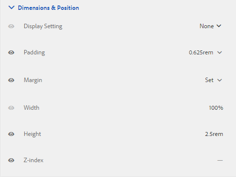

# Creazione e utilizzo dei temi {#creating-and-using-themes}

## Introduzione {#introduction}

È possibile creare e applicare temi per stilizzare un modulo adattivo o una comunicazione interattiva. Un tema contiene dettagli di stile per i componenti e i pannelli. Gli stili includono proprietà quali colori di sfondo, colori dello stato, trasparenza, allineamento e dimensioni. Quando applichi un tema, lo stile specificato si riflette sui componenti corrispondenti. I temi vengono gestiti in modo indipendente senza alcun riferimento a una forma adattiva o a una comunicazione interattiva.

Operazioni disponibili:

* Creare un tema
* Modificare e copiare un tema esistente
* Scaricare e caricare un tema esistente sul server AEM Forms
* Gestire le dipendenze per un tema

## Creazione, download o caricamento di un tema {#creating-downloading-or-uploading-a-theme}

Con AEM Forms puoi creare, scaricare o caricare temi. Un tema viene creato come altre risorse quali moduli, documenti e lettere. Il tema viene salvato come entità separata, completo di meta-proprietà come i moduli. I temi, essendo un’entità separata, possono essere riutilizzati in più moduli adattivi e comunicazioni interattive. Puoi anche spostare un tema in un’altra istanza di AEM Forms e riutilizzarlo.

### Creazione di un tema {#creating-a-theme}

Esegui i seguenti passaggi per creare un tema:

1. Fai clic su **Adobe Experience Manager**, fai clic su **Forms**, quindi fai clic su **Temi**.

1. Nella pagina Temi fare clic su **Crea > Tema**.
Viene avviata una procedura guidata per creare un tema.

1. Nella scheda Base della procedura guidata Crea tema , specifica **Titolo** e **Nome** del tema. Si tratta di campi obbligatori.

1. Nella scheda Avanzate sono disponibili due campi:

   * **Posizione** clientlib: Posizione nell’archivio che memorizza le clientlibs per il tema.

   * **Categoria** Clientlib: Fornisce un campo di testo per immettere il nome della categoria clientlib per il tema.

1. Fai clic su **Crea**, quindi fai clic su **Modifica** per aprire il tema in Editor tema, oppure fai clic su **Fine** per tornare alla pagina dei temi.

### Download di un tema {#downloading-a-theme}

Puoi esportare i temi come file zip e utilizzarli in altri progetti o istanze AEM. Per scaricare un tema:

1. Fai clic su **Adobe Experience Manager**, fai clic su **Forms**, quindi fai clic su **Temi**.

1. Nella pagina Temi **Seleziona** un tema e fai clic su **Scarica**. Viene visualizzata una finestra di dialogo con i dettagli del tema.

1. Fai clic su **Scarica**. Il tema viene scaricato come file zip.

>[!NOTE]
>
>Se scarichi un tema a cui è associato un modulo adattivo e il modulo adattivo associato si basa su un modello personalizzato, scarica anche il modello personalizzato. Quando carichi il tema scaricato e il modulo adattivo in un server AEM Forms, carica anche il relativo modello personalizzato.

### Caricamento di un tema {#uploading-a-theme}

Puoi utilizzare i temi creati con i predefiniti di stile del progetto. Puoi importare pacchetti di temi creati da altri caricandoli sul tuo progetto.

Per caricare un tema:

1. Fai clic su **Adobe Experience Manager**, fai clic su **Forms**, quindi fai clic su **Temi**.

1. Nella pagina Temi fare clic su **Crea > Caricamento file**.
1. Nel prompt Caricamento file, sfoglia e seleziona un pacchetto tema sul computer e fai clic su **Carica**.
Il tema caricato è disponibile nella pagina dei temi .

## Metadati di un tema {#metadata-of-a-theme}

Elenco di meta-proprietà di un tema (trovato nella pagina delle proprietà di un tema).

<table>
 <tbody>
  <tr>
   <th>
<strong>ID</strong>
 
 
 </th>
   <th><strong>Nome</strong></th>
   <th><strong>Può essere modificato</strong></th>
   <th><strong>Descrizione proprietà</strong></th>
  </tr>
  <tr>
   <td>1.</td>
   <td>Titolo</td>
   <td>Sì</td>
   <td>Nome visualizzato del tema.</td>
  </tr>
  <tr>
   <td>2.</td>
   <td>Descrizione</td>
   <td>Sì</td>
   <td>Descrizione del tema.</td>
  </tr>
  <tr>
   <td>3.</td>
   <td>Tipo</td>
   <td>No</td>
   <td>
    <ul>
     <li>Tipo di risorsa.</li>
     <li>Il valore è sempre Tema.</li>
    </ul> </td>
  </tr>
  <tr>
   <td>4.</td>
   <td>Creato</td>
   <td>No</td>
   <td>Data della creazione del tema</td>
  </tr>
  <tr>
   <td>5.</td>
   <td>Nome autore</td>
   <td>Sì</td>
   <td>Autore del tema. Calcolato al momento della creazione del tema.</td>
  </tr>
  <tr>
   <td>6.</td>
   <td>Data ultima modifica</td>
   <td>No</td>
   <td>Data dell'ultima modifica del tema.</td>
  </tr>
  <tr>
   <td>7.</td>
   <td>Stato</td>
   <td>No</td>
   <td>Stato del tema (Modificato/Pubblicato).</td>
  </tr>
  <tr>
   <td>8.</td>
   <td>Pubblica in tempo</td>
   <td>Sì</td>
   <td>Ora di pubblicare automaticamente il tema.</td>
  </tr>
  <tr>
   <td>9.</td>
   <td>Ora di disattivazione pubblicazione</td>
   <td>Sì</td>
   <td>Ora di annullare automaticamente la pubblicazione del tema.</td>
  </tr>
  <tr>
   <td>10.</td>
   <td>Tag</td>
   <td>Sì</td>
   <td>Etichetta collegata al tema di identificazione utilizzata per migliorare la ricerca.</td>
  </tr>
  <tr>
   <td>11.</td>
   <td>Riferimenti</td>
   <td>Collegamenti</td>
   <td>
    <ul>
     <li>Contiene la sezione 'Referred by'. Elenca i moduli che utilizzano il tema.</li>
     <li>Poiché il tema non fa riferimento ad alcuna altra risorsa, non è disponibile alcuna sezione "Riferimenti".</li>
    </ul> </td>
  </tr>
  <tr>
   <td>12.</td>
   <td>Posizione Clientlib</td>
   <td>Sì</td>
   <td>
    <ul>
     <li>Il percorso dell'archivio definito dall'utente all'interno di '/etc' in cui sono memorizzate le clientlibs corrispondenti a questo tema.</li>
     <li>Valore predefinito - '/etc/clientlibs/fd/theme' + percorso relativo della risorsa del tema.</li>
     <li>Se il percorso non esiste, la gerarchia delle cartelle viene generata automaticamente.</li>
     <li>Quando questo valore viene modificato, la struttura del nodo clientlib viene spostata nella nuova posizione inserita.  <em><strong>Nota:</strong> se modifichi la posizione clientlib predefinita, nell’archivio CRXDE assegna  <code>crx:replicate, rep:write, rep:glob:*, rep:itemNames:: js.txt, jcr:read </code>a  <code>forms-users</code> e  <code>crx:replicate</code>,  <code>jcr:read </code>a  <code>fd-service</code> nella nuova posizione. Allega anche un altro ACL aggiungendo <code>deny jcr:addChildNodes</code> per <code>forms-user</code></em></li>
    </ul> </td>
  </tr>
  <tr>
   <td>13.</td>
   <td>Nome categoria Clientlib</td>
   <td>Sì</td>
   <td>
    <ul>
     <li>Nome della categoria clientlib definita dall'utente per questo tema.</li>
     <li>Viene visualizzato un errore se il nome è già utilizzato da un altro tema esistente.</li>
     <li>Valore predefinito - calcolato utilizzando la posizione del tema.</li>
     <li>Quando questo valore viene modificato, il nome della categoria viene aggiornato sul nodo clientlib corrispondente. L’aggiornamento del nome della categoria Clientlib nei file jsp non è necessario perché il nome della categoria clientlib viene utilizzato come riferimento.</li>
    </ul> </td>
  </tr>
 </tbody>
</table>

## Informazioni sull’editor di temi {#about-the-theme-editor}

AEM Forms viene fornito con Theme Editor. Si tratta di un’interfaccia intuitiva per utenti aziendali e web-designer/sviluppatori che fornisce le funzionalità necessarie per specificare facilmente lo stile dei vari elementi di comunicazione interattivi e dei moduli adattivi. Quando crei un tema, questo viene memorizzato come entità separata, ad esempio moduli, comunicazioni interattive, lettere, frammenti di documento e dizionari di dati.

L’Editor tema ti consente di personalizzare gli stili dei componenti formattati in un tema. È possibile personalizzare l’aspetto di un modulo o di una comunicazione interattiva su un dispositivo.

L’Editor tema è diviso in due pannelli:

* **Area di lavoro** : viene visualizzata sul lato destro. Mostra un esempio di modulo adattivo o comunicazione interattiva in cui tutte le modifiche allo stile vengono immediatamente applicate. È inoltre possibile selezionare gli oggetti direttamente dall’area di lavoro per cercare gli stili ad essi associati e modificare tali stili. Un righello di risoluzione del dispositivo in alto governa il quadro. Quando si seleziona un punto di interruzione della risoluzione dal righello, viene visualizzata l’anteprima del modulo di esempio o la comunicazione interattiva per la relativa risoluzione. L&#39;area di lavoro viene discussa in dettaglio [sotto](../../forms/using/themes.md#using-canvas).

* **Barra laterale** - Viene visualizzata sul lato sinistro. Sono disponibili i seguenti elementi:

   * **Selettore:** mostra il componente selezionato per la formattazione e le relative proprietà che è possibile assegnare. Il selettore rappresenta tutti i componenti di un tipo. Se si seleziona un componente casella di testo in un tema per la formattazione, tutte le caselle di testo nel modulo o nella comunicazione interattiva erediteranno lo stile. I selettori consentono di selezionare un componente generico o un componente specifico per lo stile. Ad esempio, un componente campo è un componente generico e una casella di testo è un componente specifico.

      **Stile del componente generico:**
un campo può essere un campo casella numerica, ad esempio età o un campo casella di testo, ad esempio indirizzo.
Quando si formatta un campo, vengono formattati tutti i campi, ad esempio età, nome e indirizzo.

      **Componente** specifico per lo stile: Un componente specifico influisce sugli oggetti della categoria specifica. Quando si applica uno stile al componente casella numerica nel tema, solo l’oggetto casella numerica nel testo eredita lo stile.

      Ad esempio, un campo casella di testo, ad esempio indirizzo, ha una lunghezza maggiore e un campo casella numerica, ad esempio l’età, ha una lunghezza inferiore. È possibile selezionare un campo casella numerica, ridurne la lunghezza e applicarlo al modulo. Nel modulo viene ridotta la larghezza di tutti i campi casella numerica.

      Quando si personalizzano tutti i componenti campo con un colore di sfondo specifico, tutti i campi, ad esempio età, nome e indirizzo, ereditano il colore di sfondo. Quando si seleziona una casella numerica, ad esempio l’età, e ne si riduce la larghezza, la larghezza di tutte le caselle numeriche, ad esempio l’età, viene ridotto il numero di persone in una famiglia. La larghezza delle caselle di testo non viene modificata.

   * **Stato:** ti consente di personalizzare gli stili di un oggetto in uno stato specifico. Ad esempio, è possibile specificare l’aspetto di un oggetto in uno stato di default, attivo, disattivato, al passaggio del mouse o di errore.
   * **Categorie di proprietà:** le proprietà di stile sono suddivise in varie categorie. Ad esempio Dimension e posizione, testo, sfondo, bordo ed effetti. Sotto ogni categoria vengono fornite informazioni sullo stile. Ad esempio, in Sfondo, puoi fornire Colore sfondo e Immagine e sfumatura.

   * **Avanzate:** consente di aggiungere CSS personalizzati a un oggetto, che sostituisce le proprietà definite dai controlli visivi per determinare se è presente una sovrapposizione.

   * **Visualizza CSS**: Consente di visualizzare i CSS del componente selezionato
   Inoltre, nella barra laterale, in basso è presente una freccia. Quando fai clic sulla freccia, ottieni altre due opzioni: **Simula il successo** e **Simula l&#39;errore.** Queste opzioni, insieme alle opzioni descritte sopra, sono discusse in dettaglio  [di seguito](../../forms/using/themes.md#using-rail).

 **A.** Sidebar  **B.** Canvas

### Componenti di stile {#styling-components}

È possibile utilizzare un tema in più moduli adattivi e comunicazioni interattive, che importa la formattazione dei componenti specificata nel tema. È possibile assegnare uno stile a vari componenti quali titoli, descrizioni, pannelli, campi, icone e caselle di testo. Utilizza i widget per configurare le proprietà dei componenti in un tema. La conoscenza preventiva di CSS o LESS non è necessaria ma desiderata, anche se la sezione CSS Overrides ti consente di scrivere codice CSS o fornire selettori personalizzati. La sezione Sostituzioni CSS viene visualizzata quando selezioni un componente nella barra laterale.

Opzioni nella barra laterale che consentono di selezionare e assegnare uno stile a componenti diversi.

Facendo clic sul pulsante di modifica rispetto a un componente nella barra laterale si seleziona il componente in Area di lavoro e il componente viene formattato utilizzando le opzioni nella barra laterale.

Alcuni componenti come casella di testo, casella numerica, pulsante di scelta e casella di controllo sono organizzati in categorie in componenti generici come Campo. Ad esempio, è consigliabile personalizzare lo stile dei pulsanti di scelta. Per selezionare i pulsanti di scelta per lo stile, selezionare **Campo > Widget > Pulsante di scelta**.

Fai clic su **ESPANDI TUTTO** nella barra laterale per visualizzare, selezionare e assegnare uno stile ai componenti categorizzati che non sono visibili in primo piano.

### Layout dei pannelli di stile {#styling-panel-layouts-br}

I temi in AEM Forms supportano lo stile degli elementi nel layout dei pannelli nei moduli e le comunicazioni interattive. È supportato lo stile degli elementi nei layout predefiniti e nei layout personalizzati.

I pannelli preconfigurati includono:

* Schede a sinistra
* Schede in alto
* Pannello a soffietto
* Reattivo
* Wizard
* Layout mobile

   * Titoli del pannello nell’intestazione
   * Senza titoli del pannello nell&#39;intestazione

I selettori variano a seconda del layout.
Lo stile di layout personalizzati dall’Editor tema comporta:

* Definizione dei componenti per un layout che può essere formattato e selettori CSS per l’identificazione univoca di tali componenti
* Definizione delle proprietà CSS applicabili a questi componenti
* Definire lo stile di questi componenti in modo interattivo dall’interfaccia utente

### Stili diversi per diverse dimensioni dello schermo {#different-styles-for-different-screen-sizes-br}

I layout desktop e mobili possono avere stili leggermente o completamente diversi. Per i dispositivi mobili, i tablet e il telefono condividono layout simili, ad eccezione delle dimensioni dei componenti.

Utilizza i punti di interruzione dell’Editor tema per definire lo stile alternativo per le diverse dimensioni dello schermo. È possibile selezionare un dispositivo o una risoluzione di base su cui iniziare a creare il tema e le varianti di stile per altre risoluzioni vengono generate automaticamente. È possibile modificare esplicitamente lo stile per tutte le risoluzioni.

>[!NOTE]
>
>Il tema viene prima creato utilizzando un modulo o una comunicazione interattiva e quindi applicato a diversi moduli o comunicazioni interattive. I punti di interruzione utilizzati nella creazione di un tema possono essere diversi dal modulo o dalla comunicazione interattiva su cui viene applicato il tema. Le query multimediali CSS si basano sul modulo o sulla comunicazione interattiva utilizzata nella creazione di un tema e non sul modulo o sulla comunicazione interattiva su cui viene applicato il tema.

### Modifica del contesto delle proprietà di stile nella barra laterale durante la selezione degli oggetti {#styling-properties-context-changes-in-sidebar-on-selecting-objects}

Quando selezionate un componente nell’area di lavoro, le relative proprietà di stile sono elencate nella barra laterale. Selezionare il tipo di oggetto e il relativo stato, quindi specificare lo stile.

### Stili utilizzati di recente nell’Editor tema {#recently-used-styles-in-theme-editor}

L’editor di temi memorizza in cache fino a 10 stili applicati a un componente. Puoi utilizzare gli stili memorizzati nella cache con altri componenti di un tema. Gli stili utilizzati di recente sono disponibili sotto il componente selezionato nella barra laterale come casella di riepilogo. Inizialmente, l’elenco degli stili utilizzati di recente è vuoto.

Mentre si formatta un componente, gli stili vengono memorizzati nella cache ed elencati nella casella di riepilogo. In questo esempio, l&#39;etichetta della casella di testo viene formattata per modificare la dimensione e il colore del font. Puoi seguire passaggi simili per scegliere un’immagine o cambiare i colori in base allo stile di un componente. Osserva come lo stile viene memorizzato nella cache ed elencato nella casella di riepilogo quando viene modificato lo stile dell’etichetta del campo.

In questo esempio, lo stile dell’etichetta del campo viene modificato e, quando è selezionata la descrizione del pannello reattivo per lo stile, una voce di elenco viene aggiunta nella libreria delle risorse. La voce nella libreria delle risorse può essere utilizzata per modificare lo stile della descrizione del pannello reattivo.

Quando si aggiunge uno stile nella libreria delle risorse, questo è disponibile per altri temi e nella [modalità stile](../../forms/using/inline-style-adaptive-forms.md) dell’editor di moduli o dell’interfaccia utente dell’editor di comunicazioni interattive. Allo stesso modo, quando si utilizza la modalità stile dell’editor di moduli o l’interfaccia utente dell’editor di comunicazioni interattive per assegnare uno stile a un componente, lo stile viene memorizzato nella cache ed è disponibile nei temi.

Il pulsante più della libreria di risorse consente di salvare in modo permanente lo stile con il nome specificato. Il pulsante più salva lo stile anche se non fai clic sul pulsante Salva nella barra laterale per applicare lo stile a un componente. Il pulsante più per salvare uno stile per un uso successivo non è disponibile in modalità stile.

Quando si fornisce un nome personalizzato per uno stile, lo stile è legato a un tema e non è più disponibile per altri temi. Per eliminare uno stile salvato:

1. Sulla barra degli strumenti CANVAS fare clic su **Opzioni tema**  > **Gestisci stili**.
1. Nella finestra di dialogo Gestione stili, seleziona uno stile salvato e fai clic su **Elimina**.

   

### Anteprima live, salvataggio ed eliminazione delle modifiche {#live-preview-save-and-discard-changes}

Le modifiche apportate allo stile si riflettono immediatamente nel modulo o nella comunicazione interattiva caricata nell’area di lavoro. L’anteprima live consente di definire e visualizzare in modo interattivo l’impatto dello stile. Quando modificate lo stile di un componente, il pulsante **Fine** viene attivato nella barra laterale. Per mantenere le modifiche, utilizza il pulsante **Fine** .

>[!NOTE]
>
>Quando un carattere non valido viene immesso in un campo, il colore del bordo del campo diventa rosso e nell’angolo in alto a sinistra dello schermo viene visualizzato un messaggio di errore. Ad esempio, se si immettono alfabeti in una casella di testo che accetta caratteri numerici come input, il colore del bordo della casella di input diventa rosso. Non è possibile salvare un tema di questo tipo senza risolvere l&#39;errore visualizzato in alto.

### Tema con un altro modulo adattivo o comunicazione interattiva {#theme-with-another-adaptive-form-or-interactive-communication}

Quando si crea un tema, questo viene creato con un modulo fornito con l’Editor tema. È disponibile lo stile per i componenti di questo modulo. Invece del modulo fornito con l’Editor tema, è possibile selezionare un modulo o una comunicazione interattiva a scelta per fornire stile e visualizzare in anteprima i risultati.

Per sostituire il modulo corrente o la comunicazione interattiva nell&#39;area di lavoro dell&#39;Editor tema:

1. Nel pannello EDITOR TEMA, fai clic su **Opzioni tema**  > **Configura**.

1. Nella scheda Generale, individuare e selezionare un modulo o una comunicazione interattiva per il campo **Modulo/documento adattivo**.

### Ripristina/Annulla {#redo-undo}

Puoi annullare o ripristinare le modifiche indesiderate che si verificano accidentalmente. Utilizzare i pulsanti Ripristina/Annulla nell’area di lavoro.

Pulsanti Annulla/Ripristina nell’area di lavoro

I pulsanti Ripristina/Annulla vengono visualizzati quando si applica uno stile a un componente nell’Editor tema.

## Utilizzo dell&#39;editor di temi {#using-the-theme-editor}

L’Editor tema consente di modificare un tema creato o caricato. Passa a **Forms &amp; Documents > Themes**, seleziona un tema e aprilo. Il tema viene aperto nell’Editor tema.

Come illustrato in precedenza, l’Editor tema presenta due pannelli: Barra laterale e tela.

Personalizzazione dello stile dello stato di successo del componente Widget casella di testo nell&#39;Editor tema. Il componente viene selezionato in Area di lavoro e il relativo stato viene selezionato nella barra laterale. Le opzioni di stile disponibili nella barra laterale consentono di personalizzare l’aspetto di un componente.

### Utilizzo dell&#39;area di lavoro {#using-canvas}

Il tema viene creato utilizzando il modulo preconfigurato o utilizzando un modulo o una comunicazione interattiva a scelta dell’utente. L’area di lavoro mostra l’anteprima del modulo o della comunicazione interattiva utilizzata per creare il tema con le personalizzazioni specificate nel tema. Il righello sopra il modulo viene utilizzato per determinare il layout in base alle dimensioni di visualizzazione del dispositivo.

Nella barra degli strumenti Area di lavoro sono disponibili le seguenti opzioni:

* **Attiva/Disattiva pannello laterale** : Consente di mostrare o nascondere la barra laterale.
* **Opzioni tema** : Fornisce tre opzioni

   * Configura: Fornisce opzioni per selezionare il modulo di anteprima o la comunicazione interattiva, la configurazione clientlib di base e Adobe Fonts.
   * Visualizza CSS tema: Genera CSS per il tema selezionato.
   * Gestione stili: Fornisce opzioni per gestire gli stili di testo e immagini
   * Aiuto: Esegue una visita guidata immagine dell&#39;Editor tema.

* **** : Emula l&#39;aspetto del tema per diverse dimensioni di visualizzazione. Le dimensioni di un display vengono trattate come punto di interruzione nell’emulatore. È possibile selezionare un punto di interruzione e specificarne uno stile. Ad esempio, Desktop e Tablet sono due punti di interruzione. Puoi specificare stili diversi per ogni punto di interruzione.

Quando selezioni un componente nell’area di lavoro, viene visualizzata la barra degli strumenti del componente sopra di esso. La barra degli strumenti del componente consente di selezionare i componenti o passare a componenti generici. Ad esempio, è possibile selezionare una casella di testo numerica in un pannello. Nella barra degli strumenti del componente sono disponibili le seguenti opzioni:

* **Widget** Casella Numerica: Consente di selezionare il componente per personalizzarne l’aspetto nella barra laterale.
* **Widget** campo: Consente di selezionare il componente generico da applicare allo stile. In questo esempio, tutti i componenti di input di testo (casella di testo/casella numerica/passaggio numerico/input data) sono selezionati per lo stile.

*  di campo: Consente di passare al componente generico per la formattazione. Se si seleziona una casella numerica e si tocca questa icona, viene selezionato il componente Campo. Se selezioni il componente Campo e tocca questa icona, viene selezionato il pannello . Se continui a toccare questa icona per la selezione, finisci per selezionare il layout per la formattazione.

>[!NOTE]
>
>Le opzioni disponibili nella barra degli strumenti del componente variano a seconda del componente selezionato.

Barra degli strumenti del componente nella casella numerica dell’area di lavoro

### Utilizzo della barra laterale {#using-rail}

La barra laterale nell’editor di temi fornisce opzioni per personalizzare gli stili per i componenti di un tema e utilizzare i selettori. I selettori consentono di selezionare un gruppo di componenti o singoli componenti e di cercare i selettori nella barra laterale. Puoi scrivere selettori per componenti personalizzati.

Quando selezionate un componente dall’area di lavoro o dai selettori nella barra laterale, la barra laterale mostra tutte le opzioni che consentono di personalizzare gli stili.
Di seguito sono riportate le opzioni visualizzate nella barra laterale quando si seleziona un componente:

* Stadio
* Foglio delle proprietà
* Simula errore/successo

#### Stadio {#state}

Uno stato è un indicatore dell’interazione dell’utente con un componente. Ad esempio, quando un utente immette dati errati in una casella di testo, lo stato della casella di testo diventa uno stato di errore. L’editor dei temi consente di specificare lo stile per uno stato specifico.

Le opzioni per personalizzare gli stili di stato variano per i diversi componenti.

#### Foglio delle proprietà {#property-sheet}

<table>
 <tbody>
  <tr>
   <td><strong>Proprietà</strong></td>
   <td><strong>Utilizzo</strong></td>
  </tr>
  <tr>
   <td>
Dimensioni e posizione
 </td>
   <td>
Consente di definire lo stile, le dimensioni, il posizionamento e il posizionamento dei componenti nel tema. 
 
Le opzioni disponibili sono: impostazione della visualizzazione, spaziatura, margine, larghezza, altezza e indice Z.
 
È inoltre possibile utilizzare la modalità Layout per definire la larghezza dei componenti mediante una semplice interfaccia a trascinamento della selezione. Per ulteriori informazioni, consulta <a href="../../forms/using/resize-using-layout-mode.md">Utilizzare la modalità Layout per ridimensionare i componenti</a>.
 </td>
  </tr>
  <tr>
   <td>
Testo
 </td>
   <td>
Consente di personalizzare gli stili di testo nel componente del tema.
 
Ad esempio, si desidera modificare l’aspetto del testo immesso nella casella di testo.
 
Le opzioni disponibili sono famiglia di font, peso, colore, dimensione, altezza riga, allineamento testo, spaziatura lettere, rientro testo, sottolineatura, corsivo, trasformazione testo, allineamento verticale, linea di base e direzione. 
 </td>
  </tr>
  <tr>
   <td>
Sfondo 
 </td>
   <td>
Consente di riempire lo sfondo del componente con un’immagine o un colore. 
 </td>
  </tr>
  <tr>
   <td>
Bordo
 </td>
   <td>
Consente di scegliere l’aspetto del bordo del componente. Ad esempio, si desidera che la casella di testo abbia un bordo rosso profondo e spesso con una linea tratteggiata. 
 
Le opzioni disponibili sono larghezza, stile, raggio e colore del bordo.
 </td>
  </tr>
  <tr>
   <td>
Effetti
 </td>
   <td>
Consente di aggiungere effetti speciali ai componenti quali opacità, modalità di fusione e ombre. 
 </td>
  </tr>
  <tr>
   <td>
Avanzate 
 </td>
   <td>
Consente di aggiungere:

    <ul>
     <li>Proprietà per gli elementi pseudo <code>::before</code> e <code>::after</code> per aggiungere contenuto dopo o prima del contenuto predefinito nel selettore e formattarlo.  Consulta  <a href="https://www.w3schools.com/css/css_pseudo_elements.asp" target="_blank">Pseudo-elements</a> CSS.</li>
     <li>Codice CSS personalizzato in linea con un componente e scrivi selettori personalizzati. </li>
    </ul> 
Quando aggiungi un codice CSS personalizzato, sostituisce la personalizzazione aggiunta utilizzando le opzioni nella barra laterale. 
 </td>
  </tr>
 </tbody>
</table>

#### Simula errore/successo {#simulate-error-success}

Le opzioni Errore di simulazione e Successo sono disponibili nella parte inferiore della barra laterale. È possibile visualizzarli utilizzando una freccia mostra/nascondi visibile nella parte inferiore della barra laterale. Utilizzando l’editor di temi, puoi assegnare uno stile a vari stati di un componente.

Ad esempio, è possibile aggiungere un campo numerico nel modulo e specificarne lo stile nell’editor di temi. Quando un utente digita un valore alfanumerico nel campo, si desidera modificare il colore di sfondo della casella di testo. Selezionate il campo numerico nel tema e utilizzate l&#39;opzione stato nella barra laterale. Selezionate lo stato Errore nella barra laterale e cambiate il colore di sfondo in rosso. Per visualizzare un’anteprima del comportamento, puoi utilizzare l’opzione Simula errore disponibile nella barra laterale. Le opzioni Errore di simulazione e Successo sono descritte in dettaglio di seguito:

* **Simulazione riuscita**: Consente di visualizzare l’aspetto di un componente se si specifica lo stile per lo stato di successo. Ad esempio, in un modulo i clienti impostano la password. Gli utenti possono impostare la password in base alle linee guida fornite. Quando un utente digita una password seguendo tutte le linee guida fornite, la casella di testo diventa verde. Quando la casella di testo diventa verde, lo stato è riuscito. Potete specificare lo stile di un componente in stato di successo e simularne l’aspetto utilizzando l’opzione Simula successo .

* **Errore** Simulazione: Consente di visualizzare l’aspetto di un componente se si specifica lo stile per lo stato di errore. Ad esempio, in un modulo i clienti impostano la password. Gli utenti possono impostare la password in base alle linee guida fornite. Quando un utente digita una password che non rispetta tutte le linee guida fornite, la casella di testo diventa rossa. Quando la casella di testo diventa rossa, si verifica uno stato di errore. È possibile specificare lo stile di un componente in stato di errore e simularne l’aspetto utilizzando l’opzione Simula errore.

### Stile di un componente {#styling-a-component}

Ad esempio, nel modulo sono disponibili due tipi di caselle di testo: che accetta solo valori numerici e altri che accettano valori alfanumerici. È possibile personalizzare lo stile della casella di testo che accetta solo valori numerici (casella numerica).

Per personalizzare lo stile di un particolare componente (una casella numerica in questo esempio), effettua le seguenti operazioni:

1. Nell’Editor tema, selezionare la casella numerica nell’area di lavoro.
1. Quando si seleziona la casella numerica, è possibile visualizzare la barra degli strumenti del componente con tre opzioni:

   * **Widget casella numerica**
   * **Livello campo** 

1. Selezionare **Widget Casella numerica**.
1. Il titolo della barra laterale diventa Widget per casella numerica e mostra le opzioni per personalizzarne l’aspetto.
Utilizza l’opzione **Dimension e posizione** nella barra laterale per personalizzare le dimensioni del componente. Assicurati che lo stato sia **Predefinito**.

Invece di selezionare **Widget casella numerica**, selezionare **Widget campo** nella barra degli strumenti del componente ed eseguire i passaggi precedenti. Quando si selezionano le dimensioni per l&#39;opzione **Widget campo**, tutte le caselle di testo tranne la casella numerica hanno le stesse dimensioni.

### Campi di stile per un dato stato {#styling-fields-given-state}

Con la barra degli strumenti dei componenti è inoltre possibile specificare lo stile dei componenti per i diversi stati. Ad esempio, se un componente è disabilitato, lo stato è disabilitato. Gli stati comunemente utilizzati di un componente che è possibile definire nell’editor di temi sono: Predefinito, Attiva, Disabilitata, Errore, Successo e passaggio del mouse. Potete selezionare un componente nell’area di lavoro e utilizzare l’opzione Stato nella barra laterale per personalizzarne l’aspetto.

Per personalizzare lo stile di un componente in uno stato specifico, effettua le seguenti operazioni:

1. Seleziona un componente nell’area di lavoro e seleziona l’opzione appropriata dalla barra degli strumenti del componente.
La barra laterale mostra le opzioni per personalizzare lo stile del componente.
1. Seleziona uno stato nella barra laterale. Ad esempio, Stato errore.
1. Utilizza le opzioni quali **Bordo, Sfondo** nella barra laterale per personalizzare l’aspetto del componente.
1. Utilizza l’opzione **Simula errore** nella parte inferiore della barra laterale per visualizzare l’aspetto dello stile durante la modifica.

Quando si personalizza lo stile di un componente dopo averne specificato lo stato, viene visualizzata la personalizzazione solo per lo stato specificato. Ad esempio, se personalizzi lo stile del componente quando lo stato del passaggio del mouse è selezionato. La personalizzazione viene visualizzata per il componente quando si sposta il puntatore sul componente nel modulo di cui è stato effettuato il rendering o nella comunicazione interattiva a cui si applica il tema.

Per simulare il comportamento di stati diversi da errore e successo, utilizza la modalità Anteprima . Per utilizzare la modalità Anteprima, fare clic su **Anteprima** nella barra degli strumenti della pagina.

### Layout di stile per visualizzazioni più piccole {#styling-layouts-for-smaller-displays}

Utilizza il righello nell’area di lavoro per selezionare i punti di interruzione per i dispositivi con display più piccoli. Fai clic su emulatore  in Area di lavoro per visualizzare il righello e i punti di interruzione. I punti di interruzione consentono di visualizzare in anteprima un modulo o una comunicazione interattiva per le dimensioni di visualizzazione relative a diversi dispositivi, ad esempio telefoni e tablet. Nell’Editor tema sono supportate più dimensioni di visualizzazione.

Per assegnare uno stile ai componenti per diversi punti di interruzione:

1. Nell’area di lavoro, seleziona un punto di interruzione sopra il righello.
Un punto di interruzione rappresenta un dispositivo mobile e le relative dimensioni di visualizzazione.
1. Utilizzare la barra laterale per personalizzare lo stile dei componenti modulo o di comunicazione interattiva nel tema in base alle dimensioni di visualizzazione selezionate.
1. Assicurati che la personalizzazione sia salvata.

È possibile assegnare uno stile ai componenti modulo o di comunicazione interattiva per più dispositivi. I componenti per moduli e comunicazioni interattive per desktop e dispositivi mobili possono avere stili completamente diversi.

### Utilizzo dei font web in un tema {#using-web-fonts-in-a-theme}

È ora possibile utilizzare i font disponibili in un servizio Web in un modulo adattivo o in una comunicazione interattiva. Predefinito, [Adobe Fonts](https://fonts.adobe.com/), servizio font Web Adobe, è disponibile come configurazione. Per utilizzare Adobe Fonts, crea un kit, aggiungi font al suo interno e ottieni l’ID kit da [Adobe Fonts](https://fonts.adobe.com/).

Esegui i seguenti passaggi per configurare Adobe Fonts in AEM:

1. Nell&#39;istanza dell&#39;autore, fai clic su Adobe Experience Manager > Strumenti  > Distribuzione > Cloud Services.
1. Nella pagina **Cloud Services** , individua e apri l&#39;opzione **Adobe Fonts** . Apri la cartella di configurazione e fai clic su **Crea**.
1. Nella finestra di dialogo **Crea configurazione**, specifica un titolo per la configurazione e fai clic su **Crea**.

   Verrai reindirizzato alla pagina di configurazione.

1. Nella finestra di dialogo Modifica componente visualizzata, specifica l’ID kit e fai clic su **OK**.

Esegui i seguenti passaggi per configurare un tema per utilizzare la configurazione di Adobe Fonts:

1. Nell’istanza di authoring, apri un tema nell’editor di temi.
1. Nell&#39;editor dei temi, passa a **Opzioni tema**  > **Configura**.
1. Nel campo **Configurazione Adobe Fonts**, seleziona un kit e fai clic su **Salva**.

   Ora è possibile vedere i font aggiunti nella proprietà font-family del tema.

### Inserimento e selezione di font nell’editor di temi {#listing-and-selecting-fonts-in-theme-editor}

Puoi usare il servizio di configurazione del tema per aggiungere altri font all’editor di temi. Esegui i seguenti passaggi per aggiungere font:

1. Accedi a AEM console Web con privilegi amministrativi. L’URL della console Web AEM è `https://'[server]:[port]'/system/console/configMgr`.
1. Apri **Servizio di configurazione del tema del modulo adattivo**.

   

1. Fare clic su +, specificare il nome del font e fare clic su **Salva**. Il font viene aggiunto e disponibile nell’editor di temi.

#### Selezione dei font nell’editor di temi {#selecting-fonts-in-theme-editor}

È possibile utilizzare il pulsante + per aggiungere un font. Quando aggiungi un font, questo viene elencato nella barra laterale.

Oltre all’opzione di configurazione del tema, puoi anche aggiungere il font dall’editor di temi stesso. Digitare il font che si desidera utilizzare nel campo della famiglia di font sotto la barra laterale e premere il tasto di ritorno sulla tastiera.

Quando si seleziona un font, questo viene aggiunto nell’elenco della famiglia di font. È possibile utilizzare l&#39;opzione Maschera nell&#39;editor di temi per disabilitare o abilitare i font elencati.

È possibile visualizzare la modifica del font del componente.

Il campo Famiglia font supporta più font. Quando digitate un font, il browser lo cerca e lo applica al componente selezionato. Se il browser non è in grado di trovare un font, cerca un font accanto ad esso nella famiglia. Puoi iniziare digitando il font specifico che stai cercando. Se non si trova il font che si desidera utilizzare, è possibile digitare un font generico nella famiglia e utilizzarlo.

#### Stili di maschera applicati nell&#39;editor di temi {#mask-styles-applied-in-theme-editor}

È possibile mascherare gli stili applicati in un tema. Nella barra laterale dell’editor di temi, puoi utilizzare l’icona per disabilitare uno stile applicato. Ad esempio, se modifichi le dimensioni di un componente in una maschera o in una comunicazione interattiva, puoi utilizzare il pulsante maschera a sinistra di una proprietà per disattivarlo. Quando salvi un tema, vengono mantenute le opzioni di mascheramento selezionate.

L’esempio seguente mostra gli stili mascherati e non mascherati in un tema.

## Applicazione di un tema a un modulo o a una comunicazione interattiva {#applying-a-theme-to-a-form-or-interactive-communication-br}

Per applicare un tema a un modulo adattivo:

1. Apri il modulo in modalità di modifica. Per aprire un modulo in modalità di modifica, selezionarlo e fare clic su **Apri**.
1. In modalità di modifica, seleziona un componente, quindi fai clic su  > **Contenitore modulo adattivo**, quindi fai clic su .

   È possibile modificare le proprietà del modulo nella barra laterale.

1. Nella barra laterale fate clic su **Stile**.
1. Seleziona il tema dal menu a discesa **Tema modulo adattivo** e fai clic su **Fine** .

Per applicare un tema a una comunicazione interattiva:

1. Apri la comunicazione interattiva in modalità di modifica. Per aprire una comunicazione interattiva in modalità di modifica, selezionare un modulo e fare clic su **Apri**.
1. In modalità di modifica, seleziona un componente, quindi fai clic su  >**Contenitore documento**, quindi fai clic su .

   È possibile modificare le proprietà del modulo nella barra laterale.

1. Nella barra laterale, in **Base**, seleziona il tema dal menu a discesa **Tema** e fai clic su **Fine** 

### Modificare il tema di un modulo in fase di esecuzione {#change-theme-of-a-form-at-runtime}

Un tema utilizza diversi componenti di un modulo. È possibile utilizzare la proprietà `themeOverride` per modificare dinamicamente il tema di un modulo. Un URL tipico di un modulo è:

`https://<server>:<port>/content/forms/af/test.html`

Puoi utilizzare il parametro themeOverride per applicare un tema in fase di esecuzione.

`https://<server>:<port>/content/forms/af/test.html?themeOverride=/content/dam/formsanddocuments-themes/simpleEnrollmentTheme`

L’opzione `themeOverride` ti consente di fornire un percorso a un tema. Cambia il tema del modulo e lo aggiorna con gli stili aggiornati.

## Ottenere un aspetto specifico utilizzando i temi {#specific-af-appearance}

Con AEM Forms, insieme al tema dell’area di lavoro predefinito, sono disponibili molti altri temi. Se si desidera progettare il modulo o la comunicazione interattiva utilizzando altri temi, oltre a ulteriori modifiche, copiare il tema dalla cartella Libreria temi. Incolla i temi copiati all&#39;esterno della cartella Libreria temi e modifica il tema copiato in base alle modifiche desiderate.

Per copiare un tema, esegui le seguenti operazioni:

1. Nell&#39;istanza di authoring, passa a **Adobe Experience Manager > Forms > Themes**.
1. Apri la cartella Libreria temi .
1. Nella cartella Libreria temi, posiziona il puntatore del mouse sul tema predefinito corrispondente e tocca **Copia**.
1. Incolla il tema copiato all&#39;esterno della cartella Libreria temi.
1. Personalizza il tema copiato.

Dopo aver personalizzato il tema, applicarlo al modulo o alla comunicazione interattiva.

>[!NOTE]
>
>Non modificare i temi disponibili nella cartella Libreria temi. Questa cartella contiene i temi di sistema. Qualsiasi modifica apportata a questi temi viene sovrascritta al momento dell’installazione di una versione più recente o di un hotfix di AEM Forms.

## Impatto su altri casi di utilizzo di moduli adattivi {#impact-on-other-adaptive-form-use-cases}

* **Pubblicare/annullare la pubblicazione di un modulo:** quando si pubblica un modulo, viene pubblicato anche il tema a cui è stato applicato (se non è già pubblicato)
* **Importazione/Esportazione di un modulo:** quando si importa o esporta un modulo, viene importato o esportato automaticamente anche il tema associato.
* **Riferimenti di un modulo:** la sezione Riferimenti nei riferimenti al modulo contiene una voce aggiuntiva per il tema.
* **Data e ora dell’ultima modifica di un modulo:** Aggiornato quando il tema associato viene modificato.
* **Test A/B:** è possibile applicare un tema diverso a due versioni del modulo nel test A/B. Le informazioni dei due temi sono memorizzate individualmente sui due contenitori guida.

## Sequenza di generazione CSS {#css-generation-sequence}

Quando selezioni Visualizza CSS, l’Editor tema raccoglie tutte le informazioni sullo stile e crea un CSS. Raccoglie le informazioni nel seguente ordine:

1. Stile definito nella libreria client di base del tema.
1. Stile definito dall’utente, specificato utilizzando le proprietà nella barra laterale.
1. Stile CSS fornito utilizzando l’opzione Override CSS.

Ad esempio, il colore di sfondo di una casella di testo è blu nella libreria client di base. Lo si cambia in rosa utilizzando le proprietà nella barra laterale. Quando si genera CSS, il colore di sfondo della casella di testo viene visualizzato come rosa. Dopo aver modificato il colore di sfondo utilizzando le proprietà, un altro autore utilizza l’opzione di sostituzione CSS per modificare la casella di testo del colore di sfondo in bianco. Quando generi CSS, il colore di sfondo viene visualizzato come bianco nel CSS generato.

## Debug degli stili {#debugging-styles}

Quando specifichi gli stili per i componenti nell’Editor tema, viene generato un CSS. Quando si formatta un componente generico, vengono formattati anche più componenti inclusi in esso. Ad esempio, quando si formatta un campo, anche la casella di testo e l’etichetta in esso contenute vengono formattate. Quando si formatta la casella di testo all’interno del campo, ottiene il proprio CSS. Se desideri eseguire il debug del CSS generato per il campo e il componente, l’Editor tema fornisce opzioni che consentono di visualizzare CSS.

Puoi visualizzare i CSS generati utilizzando le seguenti opzioni:

* **Visualizza opzione** CSS nella barra laterale: Quando selezioni un componente nel tema, puoi visualizzare l’opzione VIEW CSS nella barra laterale. Mostra il CSS generato, compresi i CSS per gli elementi pseudo `::before` e `::after`.
* **Visualizza** opzione CSS tema nella barra degli strumenti dell’area di lavoro: Nella barra degli strumenti Area di lavoro, fai clic su    >  **Visualizza CSS tema**. Puoi visualizzare l’intero CSS del tema generato dalle proprietà definite nell’Editor tema.

## Risoluzione dei problemi, raccomandazioni e best practice {#troubleshooting-recommendations-and-best-practices}

* **Evitare risorse da un altro tema**

   Quando modifichi un tema, puoi sfogliare e aggiungere risorse (come le immagini) da altri temi. Ad esempio, si sta modificando lo sfondo di una pagina. Ad esempio, quando selezioni **Pagina** > **Sfondo** > **Aggiungi** > **Immagine**, viene visualizzata una finestra di dialogo che consente di sfogliare e aggiungere immagini in altri temi.

* Puoi riscontrare problemi con il tema corrente se una risorsa viene aggiunta da un altro tema e l’altro tema viene spostato o eliminato. È consigliabile evitare di sfogliare e aggiungere risorse da altri temi.
* **Utilizzo di clientlib di base, editor di temi e stile in linea**

   * **clientlib** di base:

      La libreria client di base contiene informazioni sullo stile. Per utilizzare le informazioni sullo stile nelle librerie lato client nei temi.

      1. Passa a **Experience Manager > Forms > Temi**.
      1. Nella pagina Temi , seleziona un tema e fai clic su **Visualizza proprietà**.
      1. Nella pagina Proprietà visualizzata, fai clic su **Avanzate**.
      1. Nella scheda Avanzate , nel campo Posizione Clientlib , sfoglia e seleziona la libreria-client che desideri utilizzare.
      1. Fai clic su **Salva**.

      Lo stile specificato nella libreria client viene importato nel tema che lo utilizza. Ad esempio, è possibile specificare lo stile per le caselle di testo, le caselle numeriche e passare alla libreria client. Quando importi la libreria client nel tema, viene importato lo stile per la casella di testo, la casella numerica e lo switch. Puoi quindi assegnare uno stile ad altri componenti utilizzando l’editor di temi.
Puoi anche creare un tema, crearne copie e quindi modificare lo stile fornito nei temi copiati per casi d’uso simili.
Vedere [Ottenere un aspetto specifico utilizzando i temi](#specific-af-appearance)

   * **Editor temi:**

      L’Editor tema consente di creare temi per personalizzare lo stile del modulo o la comunicazione interattiva. È possibile specificare lo stile dei componenti in un tema, che consenta la coerenza dell’aspetto tra più moduli o comunicazioni interattive sviluppate. È consigliabile specificare le informazioni sullo stile in un tema e quindi applicare il tema a un modulo.

   * **Stile in linea:**

      Quando si lavora con un modulo, è possibile assegnare uno stile ai componenti utilizzando la modalità Stile nell’editor multicanale per moduli o comunicazioni interattive. L’utilizzo della modalità stile per modificare lo stile del componente modulo ha la precedenza sullo stile specificato nel tema. Per modificare lo stile di alcuni componenti di un modulo specifico, consultare [Stile in linea dei componenti](../../forms/using/inline-style-adaptive-forms.md).

* **Utilizzo di librerie lato client**

   Per creare librerie client per importare informazioni sugli stili, consulta [Utilizzo delle librerie lato client](/help/sites-developing/clientlibs.md). Dopo aver creato una libreria client, puoi importarla nel tuo tema utilizzando i passaggi indicati sopra.

* **Modifica della larghezza del layout del pannello contenitore**

   Si sconsiglia di modificare la larghezza del layout del pannello contenitore. Quando si specifica la larghezza di un pannello contenitore, questo diventa statico e non si adatta a diversi schermi.

* **Quando utilizzare l’editor di moduli o di temi per lavorare con intestazione e piè di pagina**

   Utilizza l’editor di temi se desideri assegnare uno stile a intestazione e piè di pagina utilizzando opzioni di stile quali stile del font, sfondo e trasparenza.
Per fornire informazioni quali un’immagine logo, il nome dell’azienda nell’intestazione e le informazioni sul copyright nel piè di pagina, utilizzare le opzioni dell’editor moduli.
