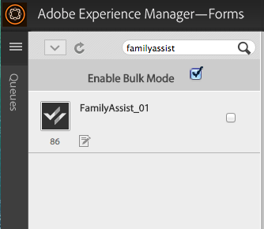

# Utilizzo degli elenchi delle operazioni da eseguire{#working-with-to-do-lists}

Quando visualizzate gli elenchi delle operazioni, è possibile che vengano visualizzate attività da un processo aziendale assegnato all&#39;utente o a qualsiasi gruppo a cui appartenete o che sia l&#39;attività condivisa di altri utenti. È possibile aprire, lavorare e completare le attività come necessario, ad esempio approvare o rifiutare una richiesta o aggiungere ulteriori informazioni. Dopo aver completato un&#39;attività, questa viene inviata alla persona successiva nel processo aziendale,

## Informazioni sugli elenchi da fare {#about-todo-lists}

&#39;area di lavoro di AEM Forms include i tre tipi seguenti di elenchi Da fare:

* Singoli elenchi, che contengono attività assegnate direttamente all&#39;utente.
* Elenchi di gruppi, che contengono attività assegnate a un gruppo. Qualsiasi membro del gruppo può aprire e completare le attività. Per aprire un&#39;attività, un membro di un gruppo deve prima reclamare l&#39;attività.
* Elenchi condivisi, che contengono attività assegnate a un utente che ha condiviso il proprio elenco A-do con l&#39;utente e, eventualmente, con altri utenti. Qualsiasi utente che condivide un elenco può richiedere, aprire e completare attività condivise.

Per eseguire alcune azioni senza aprire l’attività, fare clic sulle icone visualizzate quando si passa il puntatore su un’attività.

>[!NOTE]
>
>Un&#39;icona esclamativa indica che l&#39;attività è ad alta priorità.

## Attività tipiche {#typical-tasks}

Quando si apre e si lavora su un&#39;attività, gli strumenti disponibili dipendono dall&#39;attività. Diverse attività richiedono l’esecuzione di azioni diverse e, per questo motivo, alcuni strumenti potrebbero non essere disponibili. Di seguito sono descritte le attività tipiche che potete ricevere.

**Fornire informazioni**: Riceverete un&#39;attività che richiede di completare e inviare un modulo.

**Rivedi informazioni**: Riceverete un’attività che richiede di rivedere le informazioni e disconnettersi dal contenuto.

**Recensione** multiutente: L’utente riceve un’attività contemporaneamente da altri utenti. Voi e gli altri utenti dovete fornire informazioni o rivedere il contenuto, oppure entrambi. Con questo tipo di attività possono essere disponibili i seguenti strumenti:

* Visualizzazione delle istruzioni per l&#39;attività
* Visualizzazione dello stato di completamento di tutti gli utenti a cui è stata assegnata l&#39;attività
* Visualizzazione dei commenti di tutti gli utenti a cui è stata assegnata l’attività
* Aggiunta di commenti all&#39;attività

Gli strumenti aggiuntivi che possono essere disponibili con una delle attività di cui sopra includono:

* Inoltra
* Condividi
* Consulta
* Return
* Note
* Allegati

## Apertura delle attività {#opening-tasks}

È possibile aprire e bloccare le attività dall&#39;elenco A o dalla richiesta e aprire le attività da un gruppo o da un elenco A-do condiviso. Quando si apre un&#39;attività, questa viene visualizzata nel riquadro principale. Le altre attività sono visualizzate nell&#39;elenco delle attività accanto all&#39;elenco A.

Se esiste un URL di riepilogo attività, per impostazione predefinita viene visualizzata la visualizzazione Riepilogo attività, anziché il modulo associato a un&#39;attività. Anche quando un utente abilita l&#39;opzione &quot;Apri il modulo in modalità ingrandita&quot; in Assegna attività, il modulo non si apre in modalità ingrandita.

>[!NOTE]
>
>Quando si apre un&#39;attività, in base alle impostazioni predefinite dell&#39;attività, è possibile che il modulo associato venga visualizzato nella visualizzazione completa.

### Aprire e bloccare un&#39;attività dall&#39;elenco {#open-and-lock-a-task-from-your-list}

Quando si apre un&#39;attività dall&#39;elenco A, se l&#39;elenco è condiviso, è possibile bloccare l&#39;attività per impedire a un altro utente che ha accesso all&#39;elenco di lavorare sull&#39;attività.

1. Nella pagina Da fare, nel riquadro a sinistra, selezionare il singolo elenco Da fare. Tutte le attività vengono visualizzate nel riquadro centrale.

   >[!NOTE]
   >
   >È possibile filtrare le attività selezionando il tipo di processo all&#39;interno dell&#39;elenco A. È possibile selezionare l&#39;elenco A per visualizzare di nuovo tutte le attività nell&#39;elenco A.

1. Se necessario, bloccate l&#39;attività. Per bloccare un&#39;attività, fare clic sull&#39;icona Tutte le opzioni nell&#39;attività e selezionare Blocca. Passate il puntatore sull’attività per rendere disponibile l’opzione.

   >[!NOTE]
   >
   >È inoltre possibile bloccare o sbloccare un&#39;attività su qualsiasi scheda quando l&#39;attività è aperta.

   

   Menu Tutte le opzioni di un&#39;attività

1. Aprite l’attività facendo clic su di essa.

### Aprire e richiedere un&#39;attività da un elenco condiviso o di gruppi {#open-and-claim-a-task-from-a-shared-or-group-list}

Quando aprite e richiedete un&#39;attività da un gruppo o un elenco condiviso, l&#39;attività viene spostata dal gruppo o dall&#39;elenco condiviso al singolo elenco A. Agli altri utenti con accesso all&#39;elenco non è consentito lavorare sull&#39;attività.

1. Nella pagina Da fare, nel riquadro a sinistra, selezionare un gruppo o un elenco Condiviso da fare. Tutte le attività vengono visualizzate nel riquadro centrale.
1. Effettuare una delle seguenti operazioni:

   * Per richiedere un&#39;attività, senza aprirla, da un elenco di attività di gruppo o condivisa fare clic su **Claim** posizionando il puntatore sull&#39;attività. In alternativa, quando l&#39;attività è aperta, il pulsante Richiedi rimborso è disponibile nella barra delle azioni sotto il riquadro attività. Al momento della richiesta, un&#39;attività passa dall&#39;elenco dei gruppi o dei To-do condivisi all&#39;elenco.
   * Per richiedere e aprire un&#39;attività da un gruppo o un elenco di attività condivise, fare clic su **Richiedi e aprire**.

## Operazioni con le attività {#working-with-tasks}

Dopo aver aperto un’attività, le schede visualizzate nel riquadro principale e gli strumenti disponibili dipendono dall’attività. Le schede visualizzate sono descritte di seguito:

**Riepilogo** attività: Quando si apre un&#39;attività, il riquadro Riepilogo attività consente di visualizzare informazioni sull&#39;attività, se esistente, utilizzando un URL specificato nel processo al passaggio Assegna attività. Utilizzando il riquadro di riepilogo delle attività è possibile visualizzare informazioni aggiuntive e rilevanti per un&#39;attività, per aggiungere ulteriori valori all&#39;utente finale dell&#39;area di lavoro di  AEM Forms. Questa scheda non è disponibile, se l&#39;URL di riepilogo attività non esiste.

**Dettagli**: Fornisce alcune informazioni sull&#39;attività corrente e sul processo a cui appartiene.

**Modulo**: Visualizza il modulo associato all&#39;attività. Il modulo può essere di molti tipi di file, inclusi PDF, HTML, Guide e file SWF. Il modulo può essere stampato come un modulo normale o basato su Web oppure guidarvi attraverso una serie di pannelli in stile procedura guidata per raccogliere informazioni.

**Cronologia**: Elenca le attività che fanno parte dell&#39;istanza di processo e il modulo associato, le assegnazioni delle attività e gli allegati per ciascuna attività.

**Allegati**: Visualizza gli allegati esistenti associati all&#39;attività e, se necessario, aggiunge degli allegati.

**Note**: Visualizza le note esistenti associate all&#39;attività e, se necessario, aggiunge note.

Quando lavorate su un’attività, gli strumenti che potete visualizzare e le azioni che potete eseguire sono descritti di seguito.

### Inoltra, condividi o consulta un&#39;attività {#forward-share-or-consult-on-a-task}

È possibile inoltrare un&#39;attività con note o allegati a un altro utente o condividere l&#39;attività o consultare l&#39;attività con un altro utente. Se si modificano i dati del modulo associati a un&#39;attività, salvare il modulo come bozza prima di inoltrare, condividere o consultare l&#39;attività. In caso contrario, l&#39;attività viene inviata senza il modulo aggiornato. Dopo aver inoltrato e condiviso un&#39;attività, l&#39;utente che riceve l&#39;attività può richiederla e completarla o restituirla. Se si consulta un&#39;attività, l&#39;utente può solo restituirla.

1. Se si modifica un modulo associato a un&#39;attività che si desidera mantenere, fare clic su **Salva**. L&#39;opzione Salva è disponibile nella barra delle azioni, nella parte inferiore di ciascuna scheda. In caso contrario, l&#39;attività viene inviata senza il modulo aggiornato.

   >[!NOTE]
   >
   >Il pulsante Salva non è disponibile per alcuni moduli, a seconda dell&#39;attività su cui si sta lavorando.

1. In una scheda, fare clic su uno dei seguenti pulsanti:

   * **Inoltra**
   * **Condividi**
   * **Consulta**

   >[!NOTE]
   >
   >A seconda dell&#39;attività, è anche possibile eseguire queste azioni dall&#39;elenco A senza aprire l&#39;attività.

1. Nella finestra di dialogo a comparsa, eseguite una ricerca e selezionate il nome dell’utente con cui inoltrare, condividere o consultare l’attività.

### Restituire un&#39;attività {#return-a-task}

1. In qualsiasi scheda, fare clic su **Return**. L&#39;attività viene restituita all&#39;elenco A dell&#39;utente che in precedenza ha inoltrato l&#39;attività all&#39;utente oppure l&#39;ha condivisa o consultata con l&#39;utente.

### Eseguire un&#39;attività offline {#take-a-task-offline}

È possibile lavorare su un&#39;attività offline e successivamente inviare il modulo da  Adobe® Reader® o  Adobe®  Acrobat® Professional o  Adobe®  Acrobat® Standard. Quando il modulo viene inviato, il client di posta elettronica viene avviato con l&#39;indirizzo e-mail del server appropriato. È quindi possibile inviare il modulo compilato al server tramite e-mail.

1. In qualsiasi scheda, fare clic su **Offline**.
1. Specificare un nome di file in cui salvare il modulo e fare clic su **Salva**. Il modulo associato all&#39;attività viene salvato localmente e l&#39;attività rimane nell&#39;elenco A fino all&#39;invio del modulo.

### Operazioni con gli allegati {#work-with-attachments}

È possibile aggiungere, aggiornare, eliminare o salvare localmente eventuali allegati.

**Aggiungere un allegato**

1. Nella scheda **Allegati**, fare clic su **Sfoglia** per selezionare il file da allegare.
1. Selezionare il livello **Autorizzazioni** per l&#39;allegato per gli altri utenti che partecipano al processo. Se si seleziona **Leggi**, altri utenti possono salvare il file localmente. Se si seleziona una delle autorizzazioni di modifica, altri utenti possono caricare un nuovo file per sostituire l&#39;allegato.

   >[!NOTE]
   >
   >È inoltre possibile aggiungere commenti insieme agli allegati.

1. Fare clic su **Carica**. Il file è allegato al modulo.

**Visualizzare un allegato**

1. Nella scheda **Allegati** fare clic sul nome del file dell&#39;allegato da visualizzare.

**Salvare un allegato localmente**

1. Fare clic su un allegato per aprirlo. Salvare localmente l&#39;allegato aperto.

**Aggiornamento di un allegato**

1. Fare clic su **Modifica** per l&#39;allegato. Selezionare il file con cui sostituire l&#39;allegato esistente, facendo clic su **Sfoglia**.

**Eliminare un allegato**

1. Fare clic su **Elimina** per un allegato.

### Salvare il lavoro senza completare l&#39;attività {#save-your-work-without-completing-the-task}

1. Su qualsiasi scheda, toccare **Save**.

   Viene visualizzata la finestra di dialogo Salva come bozza. Il nome predefinito della bozza è il nome dell&#39;attività dal modello di attività.

   

   >[!NOTE]
   >
   >Potete configurare l’area di lavoro in modo da salvare periodicamente automaticamente le informazioni immesse da un utente come bozza. Se il salvataggio automatico è abilitato e un utente sta lavorando a una bozza, la bozza viene salvata periodicamente. In caso di salvataggio automatico, il nome predefinito dell&#39;attività viene assunto automaticamente.
   >
   >
   >Per ulteriori informazioni, vedere Salva bozza periodicamente in [Gestione delle preferenze](/help/forms/using/getting-started-livecycle-html-workspace.md).

1. Nella finestra di dialogo Salva come bozza, specificate un nome univoco per l&#39;attività e toccate **OK**.

   

   La bozza viene salvata con il nome specificato. L&#39;attività rimane nell&#39;elenco A e tutte le modifiche apportate al modulo vengono salvate nella cartella Bozze. Inoltre, nell&#39;elenco A-fare, potete cercare la bozza utilizzando il nome della bozza per riprendere a lavorarci.

   

## Completamento delle attività {#completing-tasks}

Il modo in cui si completa un&#39;attività dipende dall&#39;attività stessa e dal ruolo svolto nel processo. È possibile che venga chiesto di approvare o rifiutare una richiesta, fornire contenuto, rivedere e verificare le informazioni o indicare che hai agito.

Potete completare un’attività in vari modi:

* Utilizzo delle azioni disponibili in una qualsiasi delle schede
* Uso delle azioni integrate nel modulo stesso
* Dall&#39;elenco A, senza aprire l&#39;attività

>[!NOTE]
>
>Questa opzione è disponibile se il campo `isMustOpenToComplete` non è selezionato nel passaggio `Assign Task` di Workbench durante la progettazione di un processo.

* Per e-mail, se ricevete notifiche e-mail

Quando si completa un&#39;attività, a seconda dell&#39;attività potrebbe comparire una finestra di dialogo di conferma che riafferma l&#39;azione. Ad esempio, potrebbe essere visualizzata una finestra di dialogo che richiede di attestare la validità delle informazioni fornite.

>[!NOTE]
>
>Se avete modificato un’attività ma non siete pronti a completarla, potete salvare il lavoro come bozza facendo clic su Salva e tornarvi in seguito.

### Completa un&#39;attività {#complete-a-task}

1. Effettuare una delle seguenti operazioni:

   * Selezionate l’attività e fate clic sul pulsante appropriato per il passaggio successivo richiesto nel processo in fondo all’elenco.
   * Se il modulo non dispone di pulsanti e &#39;area di lavoro AEM Forms è disponibile il pulsante Completa, fare clic su **Completa**.
   * Se il modulo contiene dei pulsanti e il pulsante Completa nell&#39;area di lavoro  AEM Forms non è disponibile, fare clic sul pulsante appropriato del modulo per il passaggio successivo richiesto nel processo.

   Se il modulo non dispone di pulsanti e il pulsante Completa nell&#39;area di lavoro di  AEM Forms non è disponibile, viene visualizzato un messaggio che indica che non è possibile inviare il modulo.

1. Se viene visualizzata una finestra di dialogo di conferma, effettuate una delle seguenti operazioni:

   * Fare clic su **OK** se si è completata l&#39;attività e si è pronti per disconnettersi.
   * Fare clic su **Annulla** per tornare all&#39;attività e non essere pronti per disconnettersi.

>[!NOTE]
>
>È possibile visualizzare un pulsante di invio all&#39;interno dei moduli HTML quando le proprietà di processo sono utilizzate in un modulo. Questo pulsante non è visibile quando viene eseguito il rendering dello stesso modulo come PDF. Per completare un&#39;attività, fare clic sul pulsante Invia disponibile nella parte inferiore dell&#39;area di lavoro di AEM Forms , all&#39;esterno del modulo e non sul pulsante Invia all&#39;interno del modulo.

### Attività di approvazione in blocco {#bulk-approve-tasks}

È possibile inviare più attività dall&#39;elenco Attività. Solo le attività dello stesso processo, con gli stessi nomi di task e le stesse opzioni di route possono essere inviate insieme.

>[!NOTE]
>
>Questa opzione è disponibile se il campo isMustOpenToComplete non è selezionato nel passaggio Assegna attività di Workbench durante la progettazione di un processo.

1. Nella pagina Da fare, nel riquadro a sinistra, selezionare il singolo elenco Da fare. Tutte le attività vengono visualizzate nel riquadro centrale.
1. Selezionare **Attiva modalità di massa**. Le caselle di controllo sono visualizzate davanti alle attività elencate.

   >[!NOTE]
   >
   >Questa opzione non è disponibile per le attività per le quali il campo isMustOpenToComplete è selezionato nel passaggio Assegna attività di Workbench durante la progettazione di un processo. Le caselle di controllo di tali attività nell&#39;elenco TO-DO rimangono sempre disattivate.

1. Selezionare le attività per l&#39;approvazione in blocco. È possibile selezionare più attività dello stesso processo, con gli stessi nomi di task e le stesse opzioni di route. Dopo aver selezionato un&#39;attività per l&#39;approvazione, rimangono abilitate solo le attività con lo stesso processo, con gli stessi nomi di attività e le stesse opzioni di route. Gli altri sono disabilitati.

   

1. Fate clic sull&#39;opzione Invia disponibile. Le attività selezionate vengono inviate.

   

## Partecipazione alle attività tramite e-mail {#participating-in-tasks-through-email}

Puoi ricevere e completare le attività tramite e-mail. La partecipazione alle attività tramite e-mail elimina la necessità di controllare regolarmente l&#39;elenco delle attività da eseguire per individuare nuove attività o di controllare lo stato di un&#39;attività nella pagina Tracciamento.

Innanzitutto, impostate le preferenze dell&#39;area di lavoro  AEM Forms in modo da ricevere le notifiche e-mail. &#39;area di lavoro di AEM Forms può inviare notifiche e-mail per attività nell&#39;elenco A o in qualsiasi elenco A gruppi a cui appartenete. L’amministratore determina quando i messaggi e-mail di notifica vengono inviati e chi li riceve.

I messaggi e-mail possono contenere un collegamento che apre l’attività ’area di lavoro di AEM Forms, un allegato del modulo utilizzato per l’attività o azioni per completare l’attività tramite e-mail. Se un modulo è incluso nel messaggio e-mail, è possibile aprire il modulo e completare l&#39;attività se nel modulo sono incorporati i pulsanti per completare l&#39;attività. Se nel messaggio e-mail sono incluse delle azioni per completare l’attività, potete completare l’attività facendo clic sulle azioni contenute nel messaggio e-mail o rispondendo all’e-mail con l’azione digitata come prima riga nel corpo del messaggio e-mail.

>[!NOTE]
>
>Per configurare l&#39;area di lavoro in modo che utilizzi i modelli e-mail appropriati, consultare la [ AEM Forms JEE Administrator Guide](https://help.adobe.com/en_US/AEMForms/6.1/AdminHelp/).

Quando si completa un&#39;attività tramite e-mail, l&#39;attività viene rimossa dall&#39;elenco A nell&#39;area di lavoro  AEM Forms.

>[!NOTE]
>
>Se l&#39;utente non ha eseguito l&#39;accesso &#39;area di lavoro AEM Forms nel browser e apre un collegamento a un&#39;attività A-do, il collegamento A-do diretto non si apre e visualizza un&#39;eccezione. Effettuate il login nell&#39;area di lavoro di  AEM Forms prima di fare clic sui collegamenti nelle e-mail.

>[!NOTE]
>
>Non potete inoltrare una notifica e-mail per assegnare un’attività a un altro utente. È possibile inoltrare le attività solo ad altri utenti dall’area di lavoro  AEM Forms.

### Ricevi messaggi di notifica e-mail {#receive-email-notification-messages}

1. Fare clic su **Preferenze**.
1. Nell&#39;elenco **Notifica eventi attività tramite e-mail**, selezionare **Yes**.
1. Per includere il modulo e i dati con il messaggio e-mail, nell&#39;elenco **Allega Forms in E-mail** selezionare **Sì**.

## Partecipazione alle attività tramite dispositivi mobili {#participating-in-tasks-through-mobile-devices}

Potete utilizzare &#39;app dell&#39;area di lavoro AEM Forms per partecipare alle attività dal dispositivo mobile. Prima di installare l&#39;applicazione, verificate con l&#39;amministratore di sistema che l&#39;azienda supporti l&#39;uso &#39;app dell&#39;area di lavoro AEM Forms.

## Informazioni su scadenze e promemoria {#about-deadlines-and-reminders}

Una *scadenza* determina la data e l&#39;ora in cui è necessario completare un&#39;attività. Quando una scadenza viene superata, il server indirizza l&#39;attività al passaggio successivo del processo (che può essere l&#39;elenco A-do di un altro utente), quindi sull&#39;attività viene visualizzata l&#39;icona della scadenza. L&#39;icona di scadenza viene visualizzata indipendentemente dalle regole associate al processo.

Un *promemoria* notifica un&#39;attività che richiede l&#39;attenzione dell&#39;utente. I promemoria si verificano a un&#39;ora prestabilita e quindi a intervalli regolari fino al completamento dell&#39;attività associata. Quando ricevete un promemoria, sull&#39;attività viene visualizzata l&#39;icona del promemoria.

Il processo aziendale determina il comportamento e la tempistica di scadenze e promemoria. Non tutti i processi hanno scadenze e promemoria. L’amministratore specifica se le notifiche e-mail vengono inviate per scadenze e promemoria. Potete impostare le preferenze in modo da specificare se ricevere le notifiche e-mail.

## Operazioni con le attività da code di gruppo e condivise {#working-with-tasks-from-group-and-shared-queues}

Tutte le attività assegnate all&#39;utente vengono visualizzate nell&#39;elenco A (coda).

Qualsiasi elenco di gruppi e di operazioni condivise a cui avete accesso viene visualizzato anche nel riquadro a sinistra nella pagina Da fare. È possibile completare le attività da qualsiasi elenco A a cui si ha accesso.

Un elenco di attività di gruppo può avere più di un membro. Un amministratore configura elenchi di attività di gruppo in base ai requisiti specifici dell&#39;organizzazione. Gli elenchi di attività raggruppate consentono di distribuire il lavoro a più persone che condividono responsabilità simili.

Ad esempio, ogni membro del team elabora i moduli per le domande di prestito. Tutte queste attività vengono inviate a un elenco di attività del gruppo a cui ogni membro del gruppo ha accesso. Ciascun membro del gruppo può accedere alle attività contenute in tale elenco.

Quando un altro utente condivide con voi l&#39;elenco A, o condivide esplicitamente con voi un&#39;attività, viene visualizzato un elenco di cose da fare condiviso. Potete quindi visualizzare le attività nell&#39;elenco A e completarle per conto dell&#39;utente. Ad esempio, se state trascorrendo una vacanza, potete scegliere di condividere l&#39;elenco delle attività con un collega che completa le attività mentre siete via.

>[!NOTE]
>
>Potete inoltre specificare le impostazioni predefinite per inoltrare le attività ad altri utenti mentre siete lontani.

Per lavorare su un&#39;attività da un gruppo o da un elenco di attività condivisa, eseguire prima l&#39;attività desiderata. Diventate quindi il proprietario dell&#39;attività finché non lo completate o lo inoltrate a un altro utente.

### Condivisione delle code {#sharing-queues}

Potete condividere l&#39;elenco A con un altro utente, che potrà quindi visualizzare le nuove attività nell&#39;elenco A e agirvi. Se nell&#39;elenco A sono presenti attività prima di condividere l&#39;elenco A, l&#39;altro utente non può visualizzarle. L&#39;utente può visualizzare e reclamare solo le attività che arrivano nell&#39;elenco Da fare dopo aver concesso l&#39;accesso all&#39;elenco Da fare.

Tenere presente che per consentire a un utente di visualizzare un&#39;attività in una coda condivisa, il progettista di processi deve abilitare l&#39;opzione Aggiungi ACL per coda condivisa nella scheda Elenco controllo accesso attività (ACL) del servizio utente.

>[!NOTE]
>
>Se prevedete di essere lontani dall&#39;ufficio, potete anche specificare le impostazioni fuori sede per inoltrare le attività ad altri utenti mentre siete lontani, invece di condividere l&#39;intero elenco A.

**Condivisione della coda**

1. Nella scheda **Code** della scheda **Preferenze** fare clic sull&#39;icona &quot;+&quot; per &quot;Utenti che condividono la coda&quot;.
1. Cercate e selezionate il nome dell’utente.
1. Fate clic sul pulsante **Condividi** per condividere la coda con l&#39;utente selezionato.
1. Selezionate il nome dell&#39;utente e fate clic su **Condividi**.

   >[!NOTE]
   >
   >Per rimuovere un utente dalla condivisione dell&#39;elenco delle azioni, fare clic sull&#39;icona **X** alla fine della riga in cui l&#39;utente è elencato.

### Accesso ad altre code {#accessing-other-queues}

Potete richiedere l&#39;accesso all&#39;elenco A-do di un altro utente per visualizzare e reclamare eventuali nuove attività nell&#39;elenco A-do dell&#39;utente.

Quando richiedete l&#39;accesso all&#39;elenco A di un altro utente, l&#39;utente riceve un&#39;attività dall&#39;elenco A per approvare o rifiutare la richiesta. Una volta completata l&#39;attività, l&#39;utente riceve una notifica nell&#39;elenco A-do.

Se si dispone dell&#39;accesso all&#39;elenco A di un altro utente, non è possibile visualizzare alcuna attività presente nell&#39;elenco A prima che sia stato concesso l&#39;accesso. È possibile visualizzare solo le attività che arrivano nell&#39;elenco A-do dell&#39;utente dopo che gli è stato concesso l&#39;accesso all&#39;elenco A-do.

**Accedere a un&#39;altra coda**

1. Nella scheda **Preferenze**, aprire la scheda **Code**.
1. Fare clic su &#39;+&#39; per le &#39;code utente a cui ho accesso&#39;. Cercate il nome dell’utente nella finestra di dialogo a comparsa.
1. Selezionate il nome dell&#39;utente e fate clic su **Request**.

   >[!NOTE]
   >
   >Per rimuovere l&#39;accesso a un altro elenco A, selezionare il nome utente dall&#39;elenco Code utenti a cui ho accesso e fare clic su **X** alla fine della riga in cui è indicato il nome utente. Non è possibile rimuovere l&#39;accesso a un altro elenco A-do quando la richiesta di accesso all&#39;elenco A-do è ancora in sospeso.

## Impostazione delle preferenze fuori sede {#setting-out-of-office-preferences}

Se si prevede di uscire dall&#39;ufficio, è possibile specificare cosa accade alle attività assegnate per quel periodo.

È possibile specificare una data e un&#39;ora di inizio e una data e un&#39;ora di fine affinché le impostazioni fuori sede siano attive. Se vi trovate in un fuso orario diverso dal server, il fuso orario utilizzato è quello del server.

È possibile impostare una persona predefinita alla quale vengono inviate tutte le attività. È inoltre possibile specificare eccezioni per le attività derivanti da processi specifici da inviare a un altro utente o da rimanere nell&#39;elenco A fino alla restituzione. Se anche la persona designata è fuori ufficio, l&#39;attività va all&#39;utente che ha designato. Se l&#39;attività non può essere assegnata a un utente che non è fuori ufficio, l&#39;attività rimane nell&#39;elenco A.

>[!NOTE]
>
>Quando non sei in ufficio, tutte le attività precedentemente incluse nell&#39;elenco A-do rimangono tali e non vengono inoltrate ad altri utenti.

### Impostare le preferenze fuori sede {#set-out-of-office-preferences}

1. Fare clic su **Preferenze** e fare clic su **Fuori sede**.
1. Per specificare quando non si è in ufficio, effettuare una delle seguenti operazioni:

   * Per specificare di essere fuori ufficio ora per un periodo di tempo indeterminato, nell&#39;elenco **Sono attualmente**, selezionare **Fuori sede** ma non aggiungere un intervallo di date.
   * Per specificare una data e un&#39;ora di inizio in cui si è fuori ufficio e fare clic su &#39;+&#39; per **Programma fuori sede**. Utilizzare l&#39;elenco calendario e ora per specificare la data e l&#39;ora di inizio. Se non si specifica una data e un&#39;ora di fine, si viene considerati fuori ufficio a tempo indeterminato dalla data e dall&#39;ora di inizio fino a quando non si modificano le preferenze.

1. Per specificare come devono essere gestite le attività per impostazione predefinita, selezionare una delle seguenti opzioni dal menu **Quando fuori dall&#39;ufficio: Utente predefinito per le attività fuori sede** elenco:

   * Selezionare **Non assegnare** per mantenere le attività nell&#39;elenco A fino al ritorno.
   * Selezionare **Trova utente** per cercare un utente a cui assegnare le attività. Quando selezionate un utente, potete anche visualizzarne la pianificazione fuori ufficio.

1. Per impostare le eccezioni al valore predefinito, fare clic su + per **Eccezioni processo**, selezionare il processo per cui creare un&#39;eccezione, quindi selezionare un altro utente o selezionare **Non assegnare** dall&#39;elenco **è assegnato a**.

   >[!NOTE]
   >
   >Il progettista di processi può specificare che le attività di alcuni processi vengono sempre mantenute private e non inoltrate ad altri utenti. Questa impostazione sostituisce tutte le impostazioni che avete creato.

1. Al termine dell&#39;impostazione delle preferenze, fare clic su **Salva**. Se le impostazioni indicano che al momento siete fuori ufficio, le modifiche avranno effetto immediatamente. In caso contrario, hanno effetto alla data e all&#39;ora di inizio specificate. Se accedete mentre siete fuori dall&#39;ufficio, non sarete considerati in ufficio finché non cambiate le impostazioni.
