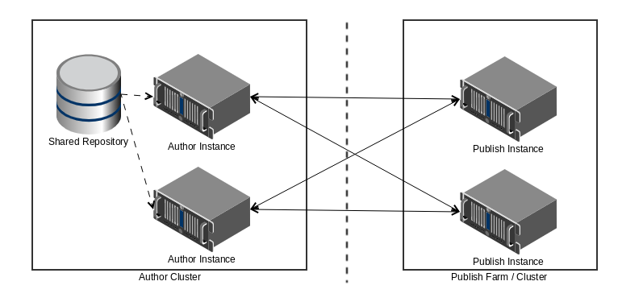

# Panoramica dei report sulle transazioni{#transaction-reports-overview}

## Introduzione {#introduction}

I rapporti sulle transazioni in  AEM Forms consentono di tenere un conteggio di tutte le transazioni effettuate da una data specificata nella distribuzione  AEM Forms. L&#39;obiettivo è quello di fornire informazioni sull&#39;utilizzo dei prodotti e aiutare i soggetti interessati a comprendere i volumi di elaborazione digitale. Esempi di una transazione:

* Invio di un modulo adattivo, un modulo HTML5 o un set di moduli
* Rendering di una versione cartacea o Web di una comunicazione interattiva
* Conversione di un documento da un formato di file a un altro

Per ulteriori informazioni su ciò che viene considerato una transazione, vedere [Billable APIs](../../forms/using/transaction-reports-billable-apis.md).

La registrazione della transazione è disabilitata per impostazione predefinita. È possibile [abilitare la registrazione delle transazioni](../../forms/using/viewing-and-understanding-transaction-reports.md#setting-up-transaction-reports) dalla AEM console Web. Potete visualizzare i rapporti sulle transazioni sulle istanze di creazione, elaborazione o pubblicazione. Visualizza rapporti sulle transazioni sulle istanze di creazione o elaborazione per una somma aggregata di tutte le transazioni. Visualizzare i rapporti sulle transazioni nelle istanze pubblicate per un conteggio di tutte le transazioni che si verificano solo sull&#39;istanza di pubblicazione da cui viene eseguito il rapporto.

Non creare contenuti (moduli adattivi, comunicazioni interattive, temi e altre attività di authoring) e documenti di processo (flussi di lavoro, servizi documenti e altre attività di elaborazione) nella stessa istanza di AEM. Tenere disattivata la registrazione della transazione per  server AEM Forms utilizzati per creare contenuto. Tenere attivata la registrazione delle transazioni per  server AEM Forms utilizzati per elaborare i documenti.

Una transazione rimane nel buffer per un periodo specificato (tempo buffer di scaricamento + tempo di replica inversa). Per impostazione predefinita, il conteggio delle transazioni impiega circa 90 secondi per riflettere nel rapporto delle transazioni.

Azioni come l&#39;invio di un modulo PDF, l&#39;utilizzo dell&#39;interfaccia utente dell&#39;agente per visualizzare l&#39;anteprima di una comunicazione interattiva o l&#39;utilizzo di metodi di invio di moduli non standard non vengono considerate come transazioni.  AEM Forms fornisce un&#39;API per registrare tali transazioni. Chiama l&#39;API dalle tue implementazioni personalizzate per registrare una transazione.

## Topologia supportata {#supported-topology}

I rapporti sulle transazioni sono disponibili solo su  AEM Forms nell&#39;ambiente OSGi. Supporta solo le topologie di creazione e pubblicazione, di elaborazione e di elaborazione. Ad esempio, le topologie, vedere [Architettura e topologie di distribuzione per  AEM Forms](../../forms/using/transaction-reports-overview.md).

Il conteggio delle transazioni viene replicato in modo inverso dalle istanze di pubblicazione alle istanze di creazione o elaborazione. Di seguito è riportata una topologia indicativa per la pubblicazione dell’autore:

>[!NOTE]
>
> rapporti sulle transazioni AEM Forms non supporta topologie che contengono solo istanze di pubblicazione.

### Linee guida per l&#39;utilizzo dei rapporti sulle transazioni {#guidelines-for-using-transaction-reports}

* Disabilitare i rapporti sulle transazioni per tutte le istanze di creazione come rapporti sulle istanze di creazione include le transazioni registrate durante le attività di creazione.
* Abilitate l&#39;opzione **Mostra transazioni solo da pubblicazione** nell&#39;istanza di creazione per visualizzare le transazioni cumulative da tutte le istanze di pubblicazione. Potete inoltre visualizzare i rapporti sulle transazioni in ogni istanza di pubblicazione per le transazioni effettive solo per quella particolare istanza di pubblicazione.
* Non utilizzate le istanze di creazione per eseguire flussi di lavoro ed elaborare documenti.
* Prima di utilizzare il reporting delle transazioni, se disponete di una piattaforma con i server di pubblicazione, assicuratevi che la replica inversa sia abilitata per tutte le istanze di pubblicazione.
* I dati della transazione vengono replicati in modo inverso da un&#39;istanza di pubblicazione solo all&#39;autore o all&#39;istanza di elaborazione corrispondente. L&#39;istanza di creazione o elaborazione non può replicare ulteriormente i dati in un&#39;altra istanza. Ad esempio, se disponete di topologia di pubblicazione per l’elaborazione dell’autore, i dati delle transazioni aggregate vengono replicati solo nell’istanza di elaborazione.

## Articoli correlati {#related-articles}

* [Visualizzazione e comprensione di rapporti sulle transazioni](../../forms/using/viewing-and-understanding-transaction-reports.md)
* [API fatturabili report transazioni](../../forms/using/transaction-reports-billable-apis.md)
* [Registrazione di una transazione per le implementazioni personalizzate](/help/forms/using/record-transaction-custom-implementation.md)

