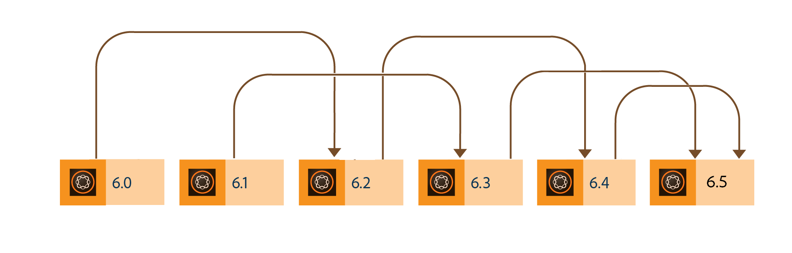

# Aggiornamento ad AEM 6.5 Forms {#upgrade-to-aem-forms}

| Versione | Collegamento articolo |
| -------- | ---------------------------- |
| AEM as a Cloud Service | [Fai clic qui](https://experienceleague.adobe.com/docs/experience-manager-cloud-service/content/forms/setup-configure-migrate/migrate-to-forms-as-a-cloud-service.html) |
| AEM 6.5 | Questo articolo |

AEM 6.5 Forms include diverse nuove funzioni e miglioramenti che semplificano la creazione, la gestione e le esperienze utente con moduli e corrispondenze. Per informazioni su tutte le nuove funzionalità e i miglioramenti apportati al Forms di AEM 6.5, consulta [Documento di riepilogo sulle nuove funzionalità](../../forms/using/whats-new.md).

È possibile aggiornare l’installazione esistente del LiveCycle o di AEM Forms per ottenere nuove funzionalità e miglioramenti offerti da AEM 6.5 Forms, mantenendo intatti i dati, i processi e le risorse esistenti. Durante l’aggiornamento, vengono mantenuti anche i metadati e lo stato dei processi. Per iniziare a utilizzare l’aggiornamento, puoi scegliere un percorso di aggiornamento.

Il diagramma seguente mostra i percorsi di aggiornamento disponibili per AEM Forms su OSGi:

Puoi eseguire un aggiornamento diretto da:

* Forms AEM 6.3 su OSGi
* Forms AEM 6.4 su OSGi

È inoltre possibile eseguire un aggiornamento multi-hop da

* Forms AEM 6.0 su OSGi
* Forms AEM 6.1 su OSGi
* Forms AEM 6.2 su OSGi

Il diagramma seguente mostra i percorsi di aggiornamento disponibili per AEM Forms su JEE:

Puoi eseguire un aggiornamento diretto da:

* AEM 6.3 Forms su JEE
* AEM 6.4 Forms su JEE
* Forms AEM 6.5.x.x su JEE

È inoltre possibile eseguire un aggiornamento multi-hop da

* LiveCycle ES4 SP1
* Forms AEM 6.0 su JEE
* Forms AEM 6.1 su JEE
* AEM 6.2 Forms su JEE

Forms su JEE per AEM 6.5.18.0 fornisce due tipi di programmi di installazione: [Programma di installazione completo](https://experienceleague.adobe.com/docs/experience-manager-release-information/aem-release-updates/forms-updates/aem-forms-releases.html) e [Programma di installazione patch](https://experienceleague.adobe.com/docs/experience-manager-release-information/aem-release-updates/forms-updates/aem-forms-releases.html).

**Programma di installazione completo**: è possibile utilizzare il programma di installazione completo per configurare nuove istanze di AEM Forms o eseguire aggiornamenti da AEM 6.5.x.x Forms su JEE a AEM 6.5.18.0 Forms su JEE.

**Programma di installazione patch**: il programma di installazione delle patch è destinato ai clienti che utilizzano già le versioni 6.5.x.x di AEM. È possibile utilizzare il programma di installazione delle patch per eseguire l’aggiornamento alla versione più recente di AEM Forms.

Nell&#39;immagine seguente sono illustrati gli scenari di utilizzo del programma di installazione completo e patch.

Per installare il Service Pack più recente per l&#39;ambiente JEE, consultare l&#39;articolo [Istruzioni di installazione di Forms Service Pack per AEM 6.5](https://experienceleague.adobe.com/docs/experience-manager-65/release-notes/aem-forms-current-service-pack-installation-instructions.html).

<!--
[Work in Progress]

Migration involves moving only assets (PDF, XDP, images, adaptive forms, correspondence management assets) from one server to another - processes (LCA), settings, configurations, and a few other pieces of metadata are not migrated. Perform the following steps to migrate to AEM 6.3 Forms:

1. Set up a fresh environment of [AEM 6.3 Forms](https://adobe.com/go/learn_aemforms_documentation_63).
1. Move XDP or other compatible assets to the freshly set instance. For detailed instructions, see [Importing and exporting assets to AEM Forms](../../forms/using/import-export-forms-templates.md). 
1. Build the required services, if any.

   For example, if you are using AEM Forms on JEE Document Services, changes are required in the code to use document services available in AEM Forms on OSGi.

1. Perform post-installation activities:

    * **Run Migration Utility**

      The migration utility makes the adaptive forms and correspondence management assets of earlier versions compatible with AEM 6.3 forms. You can download the utility from AEM Software Distribution. For step-by-step information to configure and use the migration utility, see [migration utility](../../forms/using/migration-utility.md) documentation.

    * **Reconfigure Adobe Sign**

      If you had Adobe Sign configured in the previous version of AEM Forms, then reconfigure Adobe Sign from AEM Cloud services. For more details, see [Integrate Adobe Sign with AEM Forms](../../forms/using/adobe-sign-integration-adaptive-forms.md).

      Moreover, AEM 6.3 Forms release has introduced many new Adobe Sign features. For step-by-step information to use Adobe Sign, see [Using Adobe Sign in an adaptive form](../../forms/using/working-with-adobe-sign.md).

    * **Reconfigure analytics and reports**

      In AEM 6.3 Forms, traffic variable for source and success event for impression are not available. So, when you upgrade to AEM 6.3 Forms, AEM Forms stops sending data to Adobe Analytics server and analytics reports for adaptive forms are not available. Moreover, AEM 6.3 Forms introduces traffic variable for the version of form analytics and success event for the amount of time spent on a field. So, reconfigure analytics and reports for your AEM Forms environment. For detailed steps, see [Configuring analytics and reports](../../forms/using/configure-analytics-forms-documents.md).

      Methods to calculate average fill time for forms and average read time for have changed. So, when you upgrade to AEM 6.3 forms, older data (data from previous AEM Forms release) for these metrics is available only in Adobe Analytics. It is not visible in AEM Forms analytics reports. For these metrics, AEM Forms analytics reports display data which is captured after performing the upgrade.
      
      -->

