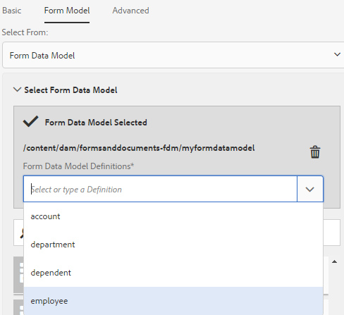

# Usa modello dati modulo{#use-form-data-model}

L’integrazione dei dati in AEM Forms consente di utilizzare diverse origini dati di back-end per creare un modello di dati modulo da utilizzare come schema in vari moduli adattivi e flussi di lavoro di comunicazione interattiva. Richiede la configurazione delle origini dati e la creazione di un modello dati modulo basato su oggetti e servizi modello dati disponibili nelle origini dati. Per ulteriori informazioni, vedi:

* [Integrazione dei dati di AEM Forms](../../forms/using/data-integration.md)
* [Configurare origini dati](../../forms/using/configure-data-sources.md)
* [Crea modello dati modulo](../../forms/using/create-form-data-models.md)
* [Utilizzare il modello dati del modulo](../../forms/using/work-with-form-data-model.md)

Un modello dati modulo è un’estensione dello schema JSON che puoi utilizzare per:

* [Creare frammenti e moduli adattivi](#create-af)
* [Creare comunicazioni interattive e blocchi predefiniti come frammenti di testo, elenchi e condizioni](#create-ic)
* [Anteprima di comunicazioni interattive con dati di esempio](#preview-ic)
* [Precompilare moduli adattivi e comunicazioni interattive](#prefill)
* [Riscrivere i dati del modulo adattivo inviati nelle origini dati](#write-af)
* [Richiama servizi tramite regole per moduli adattivi](#invoke-services)

## Creare frammenti e moduli adattivi {#create-af}

Puoi creare [moduli adattivi](../../forms/using/creating-adaptive-form.md) e [frammenti di moduli adattivi](../../forms/using/adaptive-form-fragments.md) basato su un modello dati modulo. Per utilizzare un modello di dati modulo durante la creazione di un modulo adattivo o di un frammento di modulo adattivo, effettua le seguenti operazioni:

1. Nella scheda Modello modulo della schermata Aggiungi proprietà, seleziona **[!UICONTROL Modello dati modulo]** nel **[!UICONTROL Seleziona da]** elenco a discesa.

   

1. Tocca per espandere **[!UICONTROL Seleziona modello dati modulo]**. Sono elencati tutti i modelli di dati dei moduli disponibili.

   Seleziona un dal modello dati.

   

1. (**Solo frammenti di moduli adattivi** a) È possibile creare un frammento di modulo adattivo basato su un solo oggetto modello dati in un modello dati modulo. Espandi **[!UICONTROL Definizioni modello dati modulo]** a discesa. Elenca tutti gli oggetti modello dati nel modello dati del modulo specificato. Seleziona un oggetto modello dati dall’elenco.

   

Una volta creato il modulo adattivo o il frammento di modulo adattivo basato su un modello di dati del modulo, gli oggetti del modello di dati del modulo vengono visualizzati in **[!UICONTROL Oggetti modello dati]** del browser Contenuti nell’editor di moduli adattivi.

>[!NOTE]
>
>Per un frammento di modulo adattivo, nella scheda Oggetti modello dati vengono visualizzati solo l’oggetto modello dati selezionato al momento dell’authoring e i relativi oggetti modello dati associati.

Per aggiungere campi modulo, puoi trascinare gli oggetti modello dati nel modulo adattivo o nel frammento. I campi modulo aggiunti mantengono le proprietà dei metadati e l’associazione con le proprietà dell’oggetto modello dati. L’associazione assicura che i valori dei campi vengano aggiornati nelle origini dati corrispondenti all’invio del modulo e precompilati al momento del rendering del modulo.

## Creare comunicazioni interattive {#create-ic}

Puoi creare una comunicazione interattiva basata su un modello di dati del modulo che puoi utilizzare per precompilare la comunicazione interattiva con i dati provenienti da origini dati configurate. Inoltre, i blocchi predefiniti di una comunicazione interattiva, come i frammenti di testo, elenco e documento condizione, possono essere basati su un modello di dati del modulo.

Puoi scegliere un modello di dati modulo durante la creazione di una comunicazione interattiva o di un frammento di documento. L’immagine seguente mostra la scheda Generale della finestra di dialogo Crea comunicazione interattiva.

Scheda Generale della finestra di dialogo Crea comunicazione interattiva

Per ulteriori informazioni, consulta:

[Creare una comunicazione interattiva](../../forms/using/create-interactive-communication.md)

[Testo nelle comunicazioni interattive](/help/forms/using/texts-interactive-communications.md)

[Condizioni nelle comunicazioni interattive](/help/forms/using/conditions-interactive-communications.md)

[Frammenti di elenco](/help/forms/using/lists.md)

## Anteprima con dati di esempio {#preview-ic}

L’editor del modello dati modulo consente di generare e modificare dati di esempio per gli oggetti del modello dati nel modello dati modulo. Puoi utilizzare questi dati per visualizzare in anteprima e testare le comunicazioni interattive e i moduli adattivi. Prima di visualizzare l&#39;anteprima dovete generare i dati di esempio come descritto in [Utilizzare il modello dati del modulo](../../forms/using/work-with-form-data-model.md#sample).

Per visualizzare in anteprima una comunicazione interattiva con dati modello dati modulo di esempio:

1. Nell’istanza di authoring dell’AEM, passa a **[!UICONTROL Forms > Forms e documenti]**.
1. Seleziona una comunicazione interattiva e tocca **[!UICONTROL Anteprima]** nella barra degli strumenti per selezionare **[!UICONTROL Canale web]**, **[!UICONTROL Stampa canale]**, o **[!UICONTROL Entrambi i canali]** per visualizzare in anteprima la comunicazione interattiva.
1. Nell’anteprima [*channel*] , assicurati che **[!UICONTROL Dati di prova del modello dati modulo]** è selezionato e tocca **[!UICONTROL Anteprima]**.

La comunicazione interattiva si apre con dati di esempio precompilati.

Allo stesso modo, per visualizzare in anteprima un modulo adattivo con dati di esempio, apri il modulo adattivo in modalità di creazione e tocca **[!UICONTROL Anteprima]**.

## Precompilare utilizzando il servizio del modello di dati del modulo {#prefill}

AEM Forms fornisce il servizio di precompilazione del modello dati dei moduli preconfigurato che puoi abilitare per i moduli adattivi e le comunicazioni interattive basate sul modello dati del modulo. Il servizio di precompilazione interroga le origini dati per gli oggetti modello dati nel modulo adattivo e nella comunicazione interattiva e, di conseguenza, esegue la precompilazione dei dati durante il rendering del modulo o della comunicazione.

Per abilitare il servizio di precompilazione del modello dati modulo per un modulo adattivo, apri le proprietà Contenitore modulo adattivo e seleziona **[!UICONTROL Servizio di precompilazione modello dati modulo]** dal **[!UICONTROL Servizio preriempimento]** nel pannello a soffietto Base. Quindi, salva le proprietà.

Per configurare il servizio di precompilazione del modello dati modulo in una comunicazione interattiva, puoi selezionare Servizio di precompilazione del modello dati modulo nel menu a discesa Servizio di precompilazione durante la creazione o in un secondo momento modificando le proprietà.

Finestra di dialogo Modifica proprietà per una comunicazione interattiva

## Scrivere i dati del modulo adattivo inviati nelle origini dati {#write-af}

Quando un utente invia un modulo basato su un modello dati del modulo, è possibile configurare il modulo in modo che scriva i dati inviati per un oggetto modello dati nelle relative origini dati. Per ottenere questo caso d’uso, AEM Forms fornisce [Azione di invio modello dati modulo](../../forms/using/configuring-submit-actions.md), disponibile solo per i moduli adattivi basati su un modello di dati per moduli. Scrive i dati inviati per un oggetto modello dati nella relativa origine dati.

Per configurare l’azione di invio Modello dati modulo, apri le proprietà Contenitore modulo adattivo e seleziona **[!UICONTROL Invia utilizzando il modello dati modulo]** dal menu a discesa Azione di invio nel pannello a soffietto Invio. Quindi, sfoglia e seleziona un oggetto modello dati dal menu **[!UICONTROL Nome dell’oggetto modello dati da inviare]** a discesa. Salva le proprietà.

All’invio del modulo, i dati per l’oggetto modello dati configurato vengono scritti nella rispettiva origine dati.

È inoltre possibile inviare gli allegati del modulo a un&#39;origine dati utilizzando la proprietà dell&#39;oggetto modello dati binario. Per inviare allegati a un&#39;origine dati JDBC, effettuare le seguenti operazioni:

1. Aggiungi al modello dati del modulo un oggetto modello dati che include una proprietà binaria.
1. Nel modulo adattivo, trascina **[!UICONTROL File allegato]** dal browser Componenti al modulo adattivo.
1. Tocca per selezionare il componente aggiunto e tocca  per aprire il browser Proprietà del componente.
1. Nel campo Associa riferimento, tocca  e passa alla selezione della proprietà binaria aggiunta nel modello dati del modulo. Configura altre proprietà, a seconda delle necessità.

   Tocca  per salvare le proprietà. Il campo allegato è ora associato alla proprietà binaria del modello dati del modulo.

1. Nella sezione Invio delle proprietà Contenitore modulo adattivo, abilita **[!UICONTROL Invia allegati modulo]**. Invia l’allegato nel campo della proprietà binaria all’origine dati al momento dell’invio del modulo.

## Richiama servizi in moduli adattivi tramite regole {#invoke-services}

In un modulo adattivo basato su un modello di dati del modulo, puoi: [creare regole](../../forms/using/rule-editor.md) per richiamare i servizi configurati nel modello dati del modulo. Il **[!UICONTROL Richiama servizi]** l’operazione in una regola elenca tutti i servizi disponibili nel modello dati del modulo e consente di selezionare i campi di input e output per il servizio. È inoltre possibile utilizzare **Imposta valore** tipo di regola per richiamare un servizio modello dati modulo e impostare il valore di un campo sull&#39;output restituito dal servizio.

Ad esempio, la regola seguente richiama un servizio get che utilizza come input l&#39;ID dipendente e i valori restituiti vengono inseriti nei campi ID dipendente, Cognome, Nome e Genere corrispondenti nel modulo.

Inoltre, è possibile utilizzare `guidelib.dataIntegrationUtils.executeOperation` API per scrivere un JavaScript nell’editor di codice per l’editor di regole. Per informazioni dettagliate sull’API, consulta [API per richiamare il servizio modello dati modulo](/help/forms/using/invoke-form-data-model-services.md).
