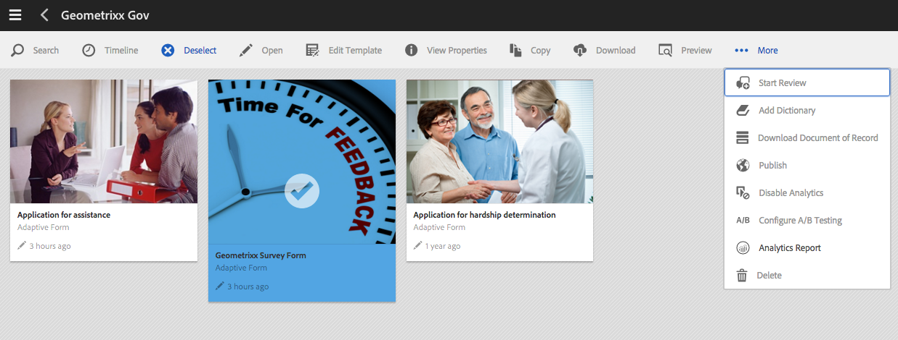

# Visualizzare e comprendere i rapporti di AEM Forms Analytics {#view-and-understand-aem-forms-analytics-reports}

Adobe Experience Manager Forms si integra con Adobe Analytics per acquisire e monitorare le metriche delle prestazioni dei moduli e dei documenti pubblicati. L’analisi di queste metriche ha lo scopo di prendere decisioni informate basate sui dati necessari per rendere i moduli o i documenti più utilizzabili.

## Impostazione di analytics {#setting-up-analytics}

La funzione di analisi in AEM Forms è disponibile come parte del pacchetto aggiuntivo di AEM Forms. Per informazioni sull&#39;installazione del pacchetto aggiuntivo, vedi [Installazione e configurazione di AEM Forms](../../forms/using/installing-configuring-aem-forms-osgi.md).

Oltre al pacchetto aggiuntivo, è necessario un account Adobe Analytics. Per informazioni sulla soluzione, vedi [Adobe Analytics](https://www.adobe.com/solutions/digital-analytics.html).

Una volta che disponi del pacchetto aggiuntivo AEM Forms e di un account Adobe Analytics, integra l’account Adobe Analytics con AEM Forms e abilita il tracciamento sui moduli o sui documenti come descritto in [Configurare analisi e rapporti](../../forms/using/configure-analytics-forms-documents.md).

### Registrazione delle informazioni sull’interazione con l’utente {#how-user-interaction-information-is-recorded}

Quando un utente interagisce con il modulo, le interazioni vengono registrate e inviate al server Analytics. L’elenco seguente indica le chiamate server per varie attività utente:

* 2 chiamate per campo per visita
* 1 per la visita a panel
* 1 per il salvataggio
* 2 per la presentazione
* 2 per il salvataggio
* 1 per assistenza
* 1 per ogni errore di convalida
* 1 per il rendering del modulo + 1 per il pannello predefinito visita + 1 per il primo campo predefinito visita
* 2 per abbandono modulo

>[!NOTE]
>
>Questo elenco non è esaustivo.

### Visualizzazione dei rapporti di analisi {#summary-report}

Esegui i seguenti passaggi per visualizzare i rapporti di analisi:

1. Accedi al portale AEM all&#39;indirizzo `https://[hostname]:'port'`
1. Fai clic su **Forms > Forms e documenti**.
1. Selezionare il modulo per il quale si desidera visualizzare i rapporti di analisi.
1. Seleziona **Altro > Report di Analytics**.

**A.** Rapporto di Analytics, comando

AEM Forms visualizza i rapporti di analisi per il modulo e per ciascun pannello del modulo, come illustrato di seguito.

**A.** Conversioni **B.** Riepilogo a livello di modulo **C.** Riepilogo a livello di pannello **D.** Browser dei visitatori - filtro **E.** Sistema operativo dei visitatori - filtro **F.** Lingua dei visitatori - filtro

Per impostazione predefinita, viene visualizzato il rapporto di analisi per gli ultimi sette giorni. Puoi visualizzare i rapporti relativi agli ultimi 15 giorni, all’ultimo mese e così via oppure specificare un intervallo di date.

>[!NOTE]
>
>Le opzioni, ad esempio Ultimi 7 giorni e Ultimi 15 giorni, non includono i dati per il giorno in cui stai generando il rapporto di analisi. Per includere i dati del giorno corrente, devi specificare l’intervallo di date, compreso il giorno corrente, quindi eseguire il rapporto.

### Grafico a conversioni per i moduli adattivi e HTML5 {#conversions-graph-for-adaptive-and-html-forms}

Il grafico delle conversioni a livello di modulo offre informazioni approfondite sulle prestazioni del modulo in relazione ai seguenti indicatori prestazioni chiave (KPI, Key Performance Indicators):

* **Rendering**: Numero di volte in cui un modulo viene aperto
* **Visitatori**: Il numero di visitatori del modulo
* **Invii**: Numero di volte in cui il modulo viene inviato

### Rapporto di Analytics per moduli adattivi e HTML5 {#analytics-report-for-adaptive-and-html-forms}

La sezione di riepilogo a livello di modulo fornisce informazioni approfondite sulle prestazioni del modulo in relazione ai seguenti indicatori prestazioni chiave (KPI, Key Performance Indicators):

* **Tempo medio di riempimento**: Tempo medio impiegato per compilare il modulo. Quando gli utenti passano del tempo sul modulo ma non inviano, questo tempo non viene incluso in questo calcolo.
* **Rendering**: Numero di volte in cui è stato eseguito il rendering o l’apertura del modulo
* **Bozze**: Numero di volte in cui il modulo è stato salvato come bozza
* **Invii**: Numero di volte in cui il modulo è stato inviato
* **Interrompere**: Numero di volte in cui gli utenti hanno iniziato a compilare il modulo e poi se ne sono andati senza compilare il modulo
* **Visitatori unici**: Numero di volte in cui il modulo viene rappresentato da visitatori univoci. Per ulteriori informazioni sui visitatori unici, vedi [Visitatori, visite e comportamenti dei clienti univoci](https://helpx.adobe.com/analytics/kb/unique-visitors-visitor-behavior.html).

### Rapporto pannello {#bottom-summary-report}

La sezione di riepilogo a livello di pannello fornisce le seguenti informazioni su ciascun pannello del modulo:

* **Tempo medio di riempimento**: Tempo medio trascorso sul pannello, indipendentemente dal fatto che il modulo sia stato inviato o meno
* **Errori riscontrati**: Numero medio di errori rilevati dagli utenti nei campi di un pannello. Gli errori riscontrati si ottengono dividendo gli errori totali in un campo per il numero di rappresentazioni del modulo.
* **Aiuto accessibile**: Numero medio di volte in cui gli utenti hanno effettuato l’accesso alla guida contestuale per i campi nel pannello . La Guida in linea accessibile viene fornita suddividendo il numero totale di volte in cui l&#39;Aiuto è accessibile per un campo in base al numero di rappresentazioni del modulo.

#### Relazione dettagliata del panel {#detailed-panel-report}

Per visualizzare i dettagli di ciascun pannello, fai clic sul nome di un pannello in Rapporto pannello .

Il rapporto dettagliato mostra i valori di tutti i campi nel pannello .

Il rapporto del pannello presenta tre schede:

* **Rapporto temporale**(Predefinito): Visualizza il tempo, in secondi, impiegato per la compilazione di ciascuno dei campi del pannello
* **Report di errore**: Visualizza il numero di errori riscontrati dagli utenti durante la compilazione dei campi
* **Report dell&#39;Aiuto**: Numero di volte in cui è stato effettuato l’accesso all’Aiuto per un particolare campo

Se sono disponibili più pannelli, è possibile spostarsi tra i pannelli.

### Filtri: Browser, OS e lingua {#filters-browser-os-and-language}

Le tabelle Distribuzione browser, Distribuzione sistema operativo e Distribuzione lingua visualizzano rappresentazioni, visitatori e invii in base a browser, sistema operativo e lingua degli utenti del modulo. Per impostazione predefinita, in queste tabelle sono visualizzate fino a cinque voci. È possibile fare clic su Mostra altro per visualizzare più voci e fare clic su Mostra meno per tornare alle cinque voci normali o meno.

Per filtrare ulteriormente i dati analitici, puoi fare clic su una voce in una qualsiasi delle tabelle. Ad esempio, se fai clic su Google Chrome nella tabella Distribuzione browser, il rapporto viene riprodotto con i dati relativi al browser Google Chrome come segue:

Se visualizzi il rapporto del pannello dopo aver applicato un filtro, i dati del rapporto del pannello vengono visualizzati anche in base al filtro applicato.

Una volta applicato il filtro:

* Le tabelle di distribuzione diventano di sola lettura, in quanto è possibile applicare un solo filtro alla volta.
* La tabella del filtro applicato scompare.
* Fai clic sul pulsante Chiudi (evidenziato di seguito) per rimuovere il filtro applicato.

### Test A/B {#a-b-testing}

Se per il modulo sono abilitati i test A/B e sono configurati, nella pagina del rapporto è disponibile un elenco a discesa che è possibile utilizzare per visualizzare il rapporto di test A/B. Il rapporto di test A/B visualizza le prestazioni comparative di due versioni del modulo configurate.

Per ulteriori informazioni sui test A/B, vedi [Creazione e gestione di test A/B per i moduli adattivi](../../forms/using/ab-testing-adaptive-forms.md).
