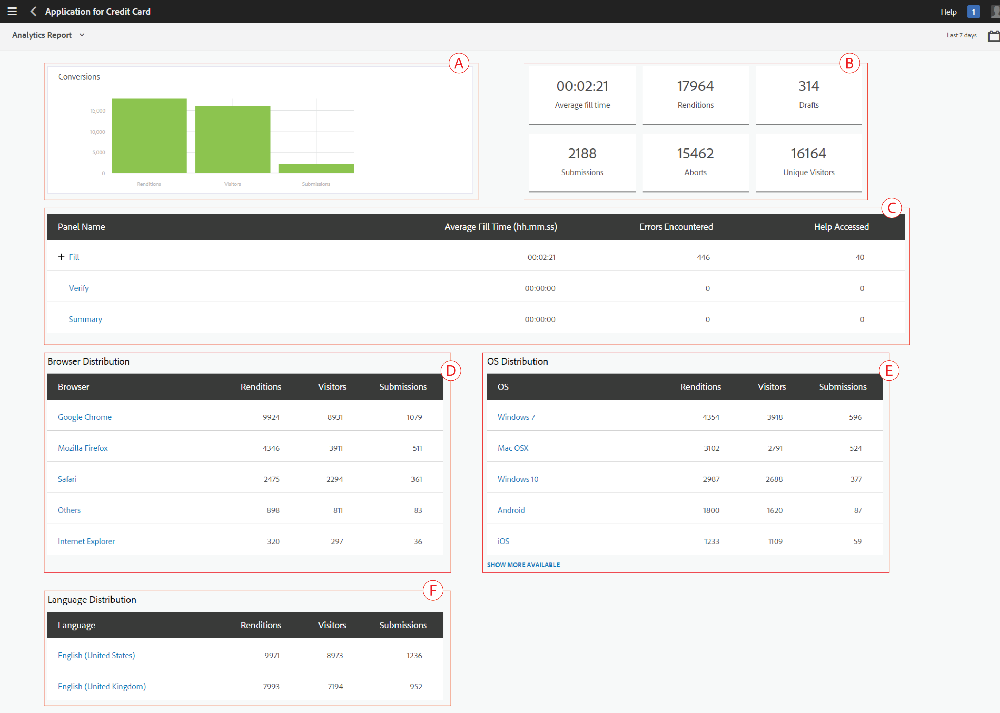

# Visualizzare e comprendere i rapporti di AEM Forms Analytics {#view-and-understand-aem-forms-analytics-reports}

Adobe Experience Manager Forms si integra con Adobe Analytics che consente di acquisire e tenere traccia delle metriche delle prestazioni per i moduli e i documenti pubblicati. L’obiettivo dell’analisi di queste metriche è quello di prendere decisioni informate basate sui dati in merito alle modifiche necessarie a rendere i moduli o i documenti più utilizzabili.

## Configurazione di Analytics {#setting-up-analytics}

La funzione di analisi di AEM Forms è disponibile come parte del pacchetto del componente aggiuntivo AEM Forms. Per informazioni sull&#39;installazione del pacchetto del componente aggiuntivo, vedere [Installazione e configurazione di AEM Forms](../../forms/using/installing-configuring-aem-forms-osgi.md).

Oltre al pacchetto del componente aggiuntivo, è necessario un account Adobe Analytics. Per informazioni sulla soluzione, consulta [Adobe Analytics](https://www.adobe.com/solutions/digital-analytics.html).

Dopo aver acquistato il pacchetto del componente aggiuntivo AEM Forms e un account Adobe Analytics, integra l’account Adobe Analytics con AEM Forms e abilita il tracciamento sui moduli o documenti come descritto in [Configurare analisi e rapporti](../../forms/using/configure-analytics-forms-documents.md).

### Registrazione delle informazioni sull’interazione dell’utente {#how-user-interaction-information-is-recorded}

Quando un utente interagisce con il modulo, le interazioni vengono registrate e inviate al server di Analytics. L’elenco seguente indica le chiamate server per varie attività dell’utente:

* 2 chiamate per campo per visita
* 1 per visita al pannello
* 1 per il salvataggio
* 2 per l&#39;invio
* 2 per il salvataggio
* 1 per assistenza
* 1 per ogni errore di convalida
* 1 per rappresentazione modulo + 1 per visita pannello predefinita + 1 per visita primo campo predefinita
* 2 per abbandono modulo

>[!NOTE]
>
>Questo elenco non è esaustivo.

### Visualizzazione dei rapporti di analisi {#summary-report}

Per visualizzare i rapporti di analisi, effettua le seguenti operazioni:

1. Accedi al portale dell’AEM all’indirizzo `https://[hostname]:'port'`
1. Clic **Forms > Forms e documenti**.
1. Selezionare la maschera per la quale si desidera visualizzare i rapporti di analisi.
1. Seleziona **Altro > Rapporti di Analytics**.

**R.** Report di Analytics, comando

AEM Forms visualizza i rapporti di analisi per il modulo e per ciascun pannello nel modulo, come illustrato di seguito.

**R.** Conversioni **B.** Riepilogo a livello di modulo **C.** Riepilogo a livello di pannello **D.** Browser dei visitatori - filtro **E.** Sistema operativo dei visitatori - filtro **F.** Lingua dei visitatori - filtro

Per impostazione predefinita, viene visualizzato il rapporto di analisi relativo agli ultimi sette giorni. Puoi visualizzare i rapporti relativi agli ultimi 15 giorni, all’ultimo mese e così via, oppure specificare un intervallo di date.

>[!NOTE]
>
>Le opzioni Ultimi 7 giorni e Ultimi 15 giorni non includono i dati per il giorno in cui si sta generando il rapporto di analisi. Per includere i dati del giorno corrente, è necessario specificare l&#39;intervallo di date, incluso il giorno corrente, quindi eseguire il rapporto.

### Grafo delle conversioni per moduli adattivi e HTML5 {#conversions-graph-for-adaptive-and-html-forms}

Il grafico delle conversioni a livello di modulo fornisce informazioni approfondite sulle prestazioni del modulo per i seguenti indicatori prestazioni chiave (KPI, Key Performance Indicators):

* **Rappresentazioni**: numero di volte in cui un modulo viene aperto
* **Visitor**: numero di visitatori del modulo
* **Invii**: numero di volte in cui il modulo viene inviato

### Rapporto di Analytics per moduli adattivi e HTML5 {#analytics-report-for-adaptive-and-html-forms}

La sezione Riepilogo a livello di modulo fornisce informazioni approfondite sulle prestazioni del modulo per i seguenti indicatori prestazioni chiave (KPI, Key Performance Indicators):

* **Tempo medio di riempimento**: tempo medio impiegato per la compilazione del modulo. Quando gli utenti trascorrono del tempo sul modulo ma non inviano, tale tempo non viene incluso in questo calcolo.
* **Rappresentazioni**: numero di volte in cui il modulo è stato renderizzato o aperto
* **Bozze**: numero di volte in cui il modulo è stato salvato come bozza
* **Invii**: numero di volte in cui il modulo è stato inviato
* **Interrompi**: numero di volte in cui gli utenti hanno iniziato a compilare il modulo e poi lo hanno lasciato senza completare il modulo
* **Visitatori univoci**: numero di volte in cui il modulo &quot;viene renderizzato da visitatori univoci. Per ulteriori informazioni sui visitatori univoci, consulta [Visitatori univoci, visite e comportamento dei clienti](https://helpx.adobe.com/analytics/kb/unique-visitors-visitor-behavior.html).

### Rapporto del pannello {#bottom-summary-report}

La sezione di riepilogo a livello di pannello fornisce le seguenti informazioni su ciascun pannello nel modulo:

* **Tempo medio di riempimento**: tempo medio trascorso sul pannello, indipendentemente dal fatto che il modulo sia inviato o meno
* **Errori riscontrati**: numero medio di errori riscontrati dagli utenti sui campi di un pannello. Gli errori rilevati vengono calcolati dividendo il totale degli errori in un campo per il numero di rappresentazioni del modulo.
* **Accesso all&#39;Aiuto eseguito**: numero medio di accessi degli utenti alla guida contestuale per i campi nel pannello. L&#39;accesso alla Guida viene ottenuto dividendo il numero totale di volte in cui si accede alla Guida per il numero di copie trasformate di un modulo.

#### Rapporto dettagliato del pannello {#detailed-panel-report}

Per visualizzare i dettagli di ciascun pannello, fai clic sul nome del pannello in Rapporto pannello.

Il rapporto dettagliato mostra i valori per tutti i campi nel pannello.

Il rapporto del pannello dispone di tre schede:

* **Rapporto temporale**(Impostazione predefinita): visualizza il tempo, in numero di secondi, impiegato per riempire ciascuno dei campi del pannello
* **Segnalazione errori**: visualizza il numero di errori riscontrati dagli utenti durante la compilazione dei campi
* **Report della Guida**: numero di volte in cui è stato effettuato l’accesso all’Aiuto per un campo specifico

Se sono disponibili più pannelli, puoi spostarti tra i pannelli.

### Filtri: browser, sistema operativo e lingua {#filters-browser-os-and-language}

Le tabelle Distribuzione browser, Distribuzione sistema operativo e Distribuzione lingua visualizzano le rappresentazioni, i visitatori e gli invii in base ai browser, al sistema operativo e alla lingua degli utenti del modulo. Per impostazione predefinita, in queste tabelle vengono visualizzate al massimo cinque voci. È possibile fare clic su Mostra altro per visualizzare più voci e fare clic su Mostra meno per tornare alle normali cinque voci o meno.

Per filtrare ulteriormente i dati di analisi, puoi fare clic su una voce in una qualsiasi delle tabelle. Ad esempio, se fai clic su Google Chrome nella tabella Distribuzione browser, il rapporto viene nuovamente sottoposto a rendering con i dati relativi al browser Google Chrome come segue:

Se visualizzi il rapporto del pannello dopo l’applicazione di un filtro, vengono visualizzati anche i dati del rapporto del pannello in base al filtro applicato.

Dopo aver applicato un filtro:

* Le tabelle di distribuzione sono di sola lettura, in quanto è possibile applicare un solo filtro alla volta.
* La tabella del filtro applicato scompare.
* Puoi fare clic sul pulsante Chiudi (evidenziato di seguito) per rimuovere il filtro applicato.

### Test A/B {#a-b-testing}

Se per la maschera è abilitato e impostato il test A/B, nella pagina del report è disponibile un elenco a discesa che consente di visualizzare il report Test A/B. Nel rapporto Test A/B vengono visualizzate le prestazioni comparative di due versioni del modulo impostate.

Per ulteriori informazioni sui test A/B, consulta [Creare e gestire test A/B per i moduli adattivi](../../forms/using/ab-testing-adaptive-forms.md).
