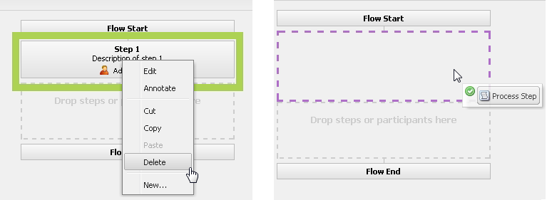

# Cartella controllata in AEM Forms{#watched-folder-in-aem-forms}

Un amministratore può configurare una cartella di rete, nota come cartella controllata, in modo che, quando un utente inserisce un file (ad esempio un file PDF) nella cartella controllata, venga avviato un flusso di lavoro, un servizio o un’operazione di script preconfigurati per elaborare il file aggiunto. Dopo aver eseguito l&#39;operazione specificata, il servizio salva il file dei risultati in una cartella di output specificata. Per ulteriori informazioni su workflow, servizio e script, vedere [Vari metodi per l&#39;elaborazione dei file](#variousmethodsforprocessingfiles).

## Creare una cartella controllata {#create-a-watched-folder}

Per creare una cartella controllata nel file system, è possibile utilizzare uno dei seguenti metodi:

* Durante la configurazione delle proprietà di un nodo di configurazione della cartella controllata, digitare il percorso completo della directory padre nella proprietà folderPath e aggiungere il nome della cartella controllata da creare, come illustrato nell&#39;esempio seguente: `C:/MyPDFs/MyWatchedFolder`
La cartella `MyWatchedFolder` non esiste. AEM Forms tenta di creare la cartella nel percorso specificato.

* Creare una cartella nel file system prima di configurare un endpoint Watched Folder, quindi specificare il percorso completo nella proprietà folderPath. Per informazioni dettagliate sulla proprietà folderPath, vedere [Proprietà cartella controllata](#watchedfolderproperties).

>[!NOTE]
>
>In un ambiente cluster, la cartella utilizzata come cartella controllata deve essere accessibile, scrivibile e condivisa nel file system o in rete. Ogni istanza del server applicazioni del cluster deve avere accesso alla stessa cartella condivisa. In Windows, creare un&#39;unità di rete mappata su tutti i server e specificare il percorso dell&#39;unità di rete mappata nella proprietà folderPath.

## Crea nodo di configurazione della cartella controllata {#create-watched-folder-configuration-node}

Per configurare una cartella controllata, crea un nodo di configurazione della cartella controllata. Per creare il nodo di configurazione, effettua le seguenti operazioni:

1. Accedi a CRX-DE lite come amministratore e passa alla cartella /etc/fd/watchfolder/config.

1. Creare un nodo di tipo `nt:unstructured`. Ad esempio, cartella controllata

   >[!NOTE]
   >
   >Il nome del nodo Cartella controllata non può includere spazi e caratteri speciali.

1. Aggiungi le seguenti proprietà al nodo:

   * `folderPath`
   * `inputProcessorType`
   * `inputProcessorId`
   * `outputFilePattern`

   Per un elenco completo delle proprietà supportate, vedere [Proprietà cartella controllata](#watchedfolderproperties).

1. Fare clic su **Salva tutto**. Dopo la creazione del nodo e il salvataggio delle proprietà. Le cartelle `input`, `result`, `failure`, `preserve` e `stage` vengono create nel percorso specificato nella proprietà `folderPath`.

   Il processo di scansione avvia la scansione della cartella controllata in un intervallo di tempo definito.

## Proprietà cartella controllata {#watchedfolderproperties}

Puoi configurare le seguenti proprietà per una cartella controllata.

* **folderPath (String)**: percorso della cartella da analizzare a intervalli di tempo definiti. Per un ambiente cluster, la cartella deve trovarsi in una posizione condivisa con tutti i server che dispongono di accesso completo al server. È una proprietà obbligatoria.
* **inputProcessorType (String)**: tipo di processo da avviare. Puoi specificare flusso di lavoro, script o servizio. È una proprietà obbligatoria.
* **inputProcessorId (stringa)**: il comportamento della proprietà inputProcessorId si basa sul valore specificato per la proprietà inputProcessorType. È una proprietà obbligatoria. Nell&#39;elenco seguente vengono illustrati tutti i valori possibili della proprietà inputProcessorType e i requisiti corrispondenti per la proprietà inputProcessorType:

   * Per workflow, specifica il modello di workflow da eseguire. Ad esempio, /etc/workflow/models/&lt;nome_flusso di lavoro>/jcr:content/model
   * Per lo script, specifica il percorso JCR dello script da eseguire. Ad esempio, /etc/fd/watchfolder/test/testScript.ecma
   * Per il servizio, specifica il filtro utilizzato per individuare un servizio OSGi. Il servizio è registrato come implementazione dell’interfaccia com.adobe.aemfd.watchfolder.service.api.ContentProcessor.

* **runModes (String)**: elenco separato da virgole delle modalità di esecuzione consentite per l&#39;esecuzione del flusso di lavoro. Alcuni esempi sono:

   * author

   * pubblicazione

   * authoring, pubblicazione

   * pubblicazione, authoring

>[!NOTE]
>
>Se il server che ospita la cartella controllata non dispone della modalità di esecuzione specificata, la cartella controllata si attiva sempre indipendentemente dalle modalità di esecuzione sul server.

* **outputFilePattern (stringa)**: pattern del file di output. È possibile specificare una cartella o un modello di file. Se viene specificato un pattern di cartella, i nomi dei file di output saranno quelli descritti nei flussi di lavoro. Se viene specificato un pattern di file, i nomi dei file di output sono quelli descritti in pattern di file. [Il modello di file e cartella](../../forms/using/watched-folder-in-aem-forms.md#p-file-and-folder-patterns-p) può inoltre specificare una struttura di directory per i file di output. È una proprietà obbligatoria.

* **stageFileExpirationDuration (Long, default -1)**: il numero di secondi di attesa prima di un file/cartella di input già prelevato per l&#39;elaborazione deve essere considerato come timeout e contrassegnato come errore. Questo meccanismo di scadenza si attiva solo quando il valore di questa proprietà è un numero positivo.

>[!NOTE]
>
>Anche quando un input viene contrassegnato come scaduto utilizzando questo meccanismo, è possibile che l’elaborazione avvenga in background, ma richiede più tempo del previsto. Se i contenuti di input sono stati utilizzati prima dell’attivazione del meccanismo di timeout, l’elaborazione potrebbe anche procedere al completamento in un secondo momento e l’output potrebbe essere scaricato nella cartella dei risultati. Se i contenuti non sono stati utilizzati prima del timeout, è molto probabile che l’elaborazione si interrompa in un secondo momento quando si tenta di utilizzare i contenuti. Inoltre, questo errore verrà registrato nella cartella degli errori per lo stesso input. D’altra parte, se l’elaborazione dell’input non viene mai attivata a causa di un’attivazione errata di processi/flussi di lavoro intermittenti (che è lo scenario che il meccanismo di scadenza intende affrontare), non si verificherà nessuna di queste due eventualità. Pertanto, per tutte le voci nella cartella dei file non riusciti contrassegnate come non riusciti a causa di un timeout (cercare i messaggi nel formato &quot;File non elaborato dopo un periodo di tempo significativo, contrassegnandolo come non riuscito!&quot; nel registro degli errori, è consigliabile analizzare la cartella dei risultati (e anche la cartella degli errori stessa per individuare un’altra voce per lo stesso input) per verificare se si è verificata una delle eventualità descritte in precedenza.

* **deleteExpiredStageFileOnlyWhenThrottled (booleano, valore predefinito true):** Indica se il meccanismo di scadenza deve essere attivato solo quando la cartella di controllo è limitata. Il meccanismo è più pertinente per le cartelle di controllo limitate, poiché un numero limitato di file che rimangono in attesa in uno stato non elaborato (a causa di errori di processo/flusso di lavoro intermittenti) può bloccare l’elaborazione per l’intero batch quando la limitazione è abilitata. Se questa proprietà viene mantenuta come true (valore predefinito), il meccanismo di scadenza non viene attivato per le cartelle di controllo che non sono limitate. Se la proprietà viene mantenuta come false, il meccanismo viene sempre attivato purché la proprietà stageFileExpirationDuration sia un numero positivo.

* **pollInterval (Long)**: intervallo in secondi per la ricerca di input nella cartella controllata. Se l&#39;impostazione Limitazione non è abilitata, l&#39;intervallo di polling deve essere più lungo del tempo necessario per elaborare un processo medio. In caso contrario, il sistema potrebbe sovraccaricare. Il valore predefinito è 5. Per ulteriori informazioni, consulta la descrizione di Dimensione batch. Il valore dell&#39;intervallo di polling deve essere maggiore o uguale a uno.
* **excludeFilePattern (String)**: elenco delimitato da punti e virgola (;) dei pattern utilizzati da una cartella controllata per determinare quali file e cartelle analizzare e selezionare. Qualsiasi file o cartella con questo modello non viene analizzato per l&#39;elaborazione. Questa impostazione è utile quando l’input è una cartella con più file. Il contenuto della cartella può essere copiato in una cartella con un nome scelto dalla cartella controllata. Questo impedisce alla cartella controllata di selezionare una cartella da elaborare prima che la cartella venga completamente copiata nella cartella di input. Il valore predefinito è null.
È possibile utilizzare [modelli di file](../../forms/using/watched-folder-in-aem-forms.md#p-file-and-folder-patterns-p) per escludere:

   * File con estensioni di file specifiche; ad esempio, &#42;.dat, &#42;.xml, .pdf, &#42;.&#42;
   * File con nomi specifici; ad esempio, dati&#42; escluderebbe file e cartelle denominati dati1, dati2 e così via.
   * File con espressioni composite nel nome e nell’estensione, come negli esempi seguenti:

      * Dati`[0-9][0-9][0-9]`.`[dD][aA]`&#39;porta&#39;
      * &#42;.`[dD][aA]`&#39;porta&#39;
      * &#42;.`[Xx][Mm][Ll]`

Per ulteriori informazioni sui modelli di file, consulta [Informazioni sui pattern di file](../../forms/using/watched-folder-in-aem-forms.md#p-file-and-folder-patterns-p).

* **includeFilePattern (stringa)**: elenco delimitato da punti e virgola (;) dei pattern utilizzati dalla cartella controllata per determinare quali cartelle e file analizzare e raccogliere. Ad esempio, se IncludeFilePattern è input&#42;, verranno selezionati tutti i file e le cartelle che corrispondono all&#39;input&#42;. Ciò include file e cartelle denominati input1, input2 e così via. Il valore predefinito è &#42; e indica tutti i file e le cartelle. Puoi utilizzare i pattern di file per includere:

   * File con estensioni di file specifiche; ad esempio, &#42;.dat, &#42;.xml, .pdf, &#42;.&#42;
   * File con nomi specifici, ad esempio dati.&#42; includerebbe file e cartelle denominati data1, data2 e così via.

* File con espressioni composite nel nome e nell’estensione, come negli esempi seguenti:

   * Dati`[0-9][0-9][0-9]`.`[dD][aA]`&#39;porta&#39;

      * &#42;.`[dD][aA]`&#39;porta&#39;
      * &#42;.`[Xx][Mm][Ll]`

Per ulteriori informazioni sui modelli di file, vedere [Informazioni sui modelli di file](../../forms/using/watched-folder-in-aem-forms.md#p-file-and-folder-patterns-p)

* **waitTime (Long)**: tempo, in millisecondi, di attesa prima della scansione di una cartella o di un file dopo la creazione. Ad esempio, se il tempo di attesa è di 3.600.000 millisecondi (un’ora) e il file è stato creato un minuto fa, questo file verrà acquisito dopo 59 o più minuti. Il valore predefinito è 0. Questa impostazione è utile per garantire che un file o una cartella sia completamente copiato nella cartella di input. Ad esempio, se hai un file di grandi dimensioni da elaborare e il download del file richiede dieci minuti, imposta il tempo di attesa su 10&#42;60 &#42;1000 millisecondi. Questo impedisce alla cartella controllata di esaminare il file se non ha dieci minuti.
* **purgeDuration (Long)**: i file e le cartelle nella cartella dei risultati vengono eliminati quando sono più vecchi di questo valore. Questo valore è misurato in giorni. Questa impostazione è utile per garantire che la cartella dei risultati non sia piena. Un valore pari a -1 giorni indica di non eliminare mai la cartella dei risultati. Il valore predefinito è -1.
* **resultFolderName (String)**: cartella in cui sono archiviati i risultati salvati. Se i risultati non vengono visualizzati in questa cartella, seleziona la cartella errori. I file di sola lettura non vengono elaborati e vengono salvati nella cartella degli errori. Questo valore può essere un percorso assoluto o relativo con i seguenti pattern di file:

   * %F = prefisso del nome file
   * %E = estensione del nome file
   * %Y = anno (completo)
   * %y = anno (ultime due cifre)
   * %M = mese
   * %D = giorno del mese
   * %d = giorno dell’anno
   * %H = ora (24 ore)
   * %h = ora (12 ore)
   * %m = minuto
   * %s = secondo
   * %l = millisecondo
   * %R = numero casuale (tra 0 e 9)
   * %P = ID processo

  Ad esempio, se sono le 20:00 del 17 luglio 2009 e si specifica C:/Test/WF0/failure/%Y/%M/%D/%H/, la cartella dei risultati sarà C:/Test/WF0/failure/2009/07/17/20

  Se il percorso non è assoluto ma relativo, la cartella viene creata all’interno della cartella controllata. Il valore predefinito è result/%Y/%M/%D/, ovvero la cartella dei risultati all&#39;interno della cartella controllata. Per ulteriori informazioni sui modelli di file, consulta [Informazioni sui pattern di file](../../forms/using/watched-folder-in-aem-forms.md#p-file-and-folder-patterns-p).

>[!NOTE]
>
>Minore è la dimensione delle cartelle dei risultati, migliori sono le prestazioni della cartella controllata. Ad esempio, se il carico stimato per la cartella controllata è di 1000 file all&#39;ora, provare un modello come risultato/%Y%M%D%H in modo che venga creata una nuova sottocartella ogni ora. Se il carico è minore (ad esempio, 1000 file al giorno), è possibile utilizzare un modello come risultato/%Y%M%D.

* **failureFolderName (String)**: cartella in cui vengono salvati i file con errori. Questa posizione è sempre relativa alla cartella controllata. Puoi utilizzare i modelli di file, come descritto per la Cartella dei risultati. I file di sola lettura non vengono elaborati e vengono salvati nella cartella degli errori. Il valore predefinito è errore/%A/%M/%G/.
* **preserveFolderName (String):** Percorso in cui vengono archiviati i file dopo l&#39;elaborazione. Il percorso può essere un percorso di directory assoluto, relativo o nullo. Puoi utilizzare i modelli di file, come descritto per la Cartella dei risultati. Il valore predefinito è mantieni/%A/%M/%G/.
* **batchSize (Long)**: numero di file o cartelle da raccogliere per analisi. Da utilizzare per evitare un sovraccarico del sistema; la scansione di troppi file contemporaneamente può causare un arresto anomalo. Il valore predefinito è 2.

  Le impostazioni Intervallo di polling e Dimensione batch determinano il numero di file selezionati dalla cartella controllata in ogni analisi. La cartella esaminata utilizza un pool di thread Quartz per analizzare la cartella di input. Il pool di thread è condiviso con altri servizi. Se l’intervallo di scansione è ridotto, i thread eseguono spesso la scansione della cartella di input. Se i file vengono rilasciati frequentemente nella cartella controllata, è necessario mantenere l’intervallo di scansione ridotto. Se i file vengono eliminati raramente, utilizza un intervallo di scansione più ampio in modo che gli altri servizi possano utilizzare i thread.

  Se elimini un grande volume di file, ingrandisci la dimensione del batch. Ad esempio, se il servizio avviato dall’endpoint &quot;cartella controllata&quot; è in grado di elaborare 700 file al minuto e gli utenti rilasciano i file nella cartella di input alla stessa velocità, impostare le dimensioni del batch su 350 e l’intervallo di polling su 30 secondi per migliorare le prestazioni della cartella controllata senza incorrere troppo nel costo della scansione della cartella controllata.

  Quando i file vengono rilasciati nella cartella controllata, vengono elencati i file nell’input, il che può ridurre le prestazioni se la scansione viene eseguita ogni secondo. L’aumento dell’intervallo di scansione può migliorare le prestazioni. Se il volume dei file da eliminare è ridotto, regolare di conseguenza le dimensioni del batch e l&#39;intervallo di polling. Ad esempio, se vengono rilasciati 10 file al secondo, prova a impostare pollInterval su 1 secondo e la dimensione batch su 10

* **throttleOn (booleano)**: quando questa opzione è selezionata, limita il numero di processi della cartella controllata che AEM Forms elabora in un dato momento. Il numero massimo di processi è determinato dal valore Dimensione batch. Il valore predefinito è true. (Vedi [Informazioni sulla limitazione](../../forms/using/watched-folder-in-aem-forms.md#p-about-throttling-p).)

* **overwriteDuplicateFilename (Boolean)**: se è impostato su True, i file nella cartella dei risultati e nella cartella di conservazione vengono sovrascritti. Se è impostato su falso, vengono utilizzati file e cartelle con un suffisso di indice numerico per il nome. Il valore predefinito è falso.
* **preserveOnFailure (booleano)**: mantenere i file di input in caso di errore durante l&#39;esecuzione dell&#39;operazione su un servizio. Il valore predefinito è vero.
* **inputFilePattern (stringa)**: specifica il modello dei file di input per una cartella controllata. Crea una inserisce nell&#39;elenco Consentiti di file di tipo.
* **asincrono (booleano)**: identifica il tipo di chiamata come asincrono o sincrono. Il valore predefinito è true (asincrono). L’elaborazione del file è un’attività che consuma risorse; mantieni il valore del flag asincrono su true per evitare che il thread principale del processo di scansione venga bloccato. In un ambiente cluster, è fondamentale mantenere il flag true per abilitare il bilanciamento del carico per i file elaborati tra i server disponibili. Se il flag è false, il processo di scansione tenta di eseguire l’elaborazione per ogni file/cartella di livello principale in sequenza all’interno del proprio thread. Non impostare il flag su false senza un motivo specifico, ad esempio un’elaborazione basata sul flusso di lavoro in una configurazione a server singolo.

>[!NOTE]
>
>Per impostazione predefinita, i flussi di lavoro sono asincroni. Anche se imposti il valore su false, i flussi di lavoro vengono avviati in modalità asincrona.

* **enabled (booleano)**: disattiva e attiva la ricerca di una cartella controllata. Imposta abilitato su true per avviare la scansione della cartella controllata. Il valore predefinito è vero.
* **payloadMapperFilter:** Quando una cartella è configurata come cartella controllata, viene creata una struttura di cartelle all&#39;interno della cartella controllata. La struttura dispone di cartelle per fornire input, ricevere output (risultati), salvare dati per errori, conservare dati per processi a lunga durata e salvare dati per varie fasi. La struttura di cartelle di una cartella controllata può fungere da payload di flussi di lavoro incentrati su Forms. Un mapper di payload consente di definire la struttura di un payload che utilizza una cartella controllata per l’input, l’output e l’elaborazione. Ad esempio, se utilizzi il mapper predefinito, il contenuto della cartella controllata viene mappato con [payload]\input e [payload]\cartella output. Sono disponibili due implementazioni predefinite per la mappatura del payload. Se non disponi di [un&#39;implementazione personalizzata](../../forms/using/watched-folder-in-aem-forms.md#creating-a-custom-payload-mapper-filter), utilizza un&#39;implementazione preconfigurata:

   * **Mapper predefinito:** Utilizza il mapper del payload predefinito per mantenere i contenuti di input e output delle cartelle controllate in cartelle di input e output separate nel payload. Inoltre, nel percorso payload di un flusso di lavoro, utilizza [payload]/input/ e [payload]/percorsi di output per recuperare e salvare il contenuto.

   * **Mappatore payload semplice basato su file:** Utilizzare il mapper payload semplice basato su file per mantenere i contenuti di input e output direttamente nella cartella del payload. Non crea alcuna gerarchia aggiuntiva, come l’mappatore predefinito.

### Parametri di configurazione personalizzati {#custom-configuration-parameters}

Oltre alle proprietà di configurazione della cartella controllata elencate in precedenza, puoi anche specificare parametri di configurazione personalizzati. I parametri personalizzati vengono passati al codice di elaborazione del file. Consente al codice di modificarne il comportamento in base al valore del parametro. Per specificare un parametro:

1. Accedi a CRXDE-Lite e passa al nodo di configurazione della cartella controllata.
1. Aggiungi un parametro proprietà.&lt;nome_proprietà> al nodo di configurazione della cartella controllata. Il tipo della proprietà può essere solo Boolean, Date, Decimal, Double, Long e String. Puoi specificare proprietà con valore singolo e multiplo.

>[!NOTE]
>
>Se il tipo di dati della proprietà è Double, specificare un punto decimale nel valore di tali proprietà. Per tutte le proprietà, dove il tipo di dati è Double e nel valore non è specificato alcun punto decimale, il tipo viene convertito in Long.

Queste proprietà vengono passate come mappa immutabile di tipo Map&lt;String, Object> al codice di elaborazione. Il codice di elaborazione può essere un ECMAScript, un flusso di lavoro o un servizio. I valori forniti per le proprietà sono disponibili come coppie chiave-valore nella mappa. Chiave è il nome della proprietà e valore è il valore della proprietà. Per ulteriori informazioni sui parametri di configurazione personalizzati, vedi l’immagine seguente:


Un esempio di nodo di configurazione di una cartella di controllo con proprietà obbligatorie, alcune proprietà opzionali e alcuni parametri di configurazione.

#### Variabili mutabili per flussi di lavoro {#mutable-variables-for-workflows}

Puoi creare variabili mutabili per metodi di elaborazione dei file basati su flusso di lavoro. Queste variabili fungono da contenitori per il flusso di dati tra i passaggi di un flusso di lavoro. Per creare tali variabili:

1. Accedi a CRXDE-Lite e passa al nodo di configurazione della cartella controllata.

1. Aggiungi una proprietà workflow.var.&lt;nome_variabile> nel nodo di configurazione della cartella controllata.

   Il tipo della proprietà può essere solo Boolean, Date, Decimal, Double, Long e String. Sono supportate anche le proprietà con più valori. Per le proprietà con più valori, il valore disponibile per il passaggio del flusso di lavoro è un array del tipo specificato.

   >[!NOTE]
   >
   >Se il tipo di dati della proprietà è Double, specificare un punto decimale nel valore di tali proprietà. Per tutte le proprietà, dove il tipo di dati è Double e nel valore non è specificato alcun punto decimale, il tipo viene convertito in Long.

>[!NOTE]
>
>La specifica JCR richiede un valore predefinito per le proprietà. I valori predefiniti sono disponibili per i passaggi di un flusso di lavoro per l’elaborazione. Quindi, specificate i valori predefiniti corretti.


## Vari metodi per l’elaborazione dei file {#variousmethodsforprocessingfiles}

È possibile avviare un flusso di lavoro, un servizio o uno script per elaborare i documenti in una cartella di controllo.

### Utilizzo di un servizio per elaborare i file di una cartella controllata   {#using-a-service-to-process-files-of-a-watched-folder-nbsp}

Un servizio è un&#39;implementazione personalizzata dell&#39;interfaccia `com.adobe.aemfd.watchfolder.service.api.ContentProcessor`. È registrato con OSGi insieme ad alcune proprietà personalizzate. Le proprietà personalizzate dell’implementazione lo rendono univoco e facilitano l’identificazione dell’implementazione.

#### Implementazione personalizzata dell’interfaccia ContentProcessor {#custom-implementation-of-the-contentprocessor-interface}

L’implementazione personalizzata accetta un contesto di elaborazione (un oggetto di tipo com.adobe.aemfd.watchfolder.service.api.ProcessorContext), legge i documenti di input e i parametri di configurazione dal contesto, elabora gli input e aggiunge di nuovo l’output al
contesto. ProcessorContext dispone delle seguenti API:

* **getWatchFolderId**: restituisce l&#39;ID della cartella controllata.
* **getInputMap**: restituisce una mappa di tipo Map. Le chiavi della mappa sono il nome del file di input e un oggetto documento contenente il contenuto del file. Utilizza l’API getinputMap per leggere i file di input.
* **getConfigParameters**: restituisce una mappa immutabile di tipo Map. La mappa contiene
i parametri di configurazione di una cartella controllata.

* **setResult**: implementazione di ContentProcessor
utilizza l’API per scrivere il documento di output nella cartella dei risultati. È possibile specificare un nome per il file di output nell&#39;API setResult. L’API può scegliere di utilizzare o ignorare il file fornito a seconda della cartella di output o del pattern di file specificato. Se viene specificato un pattern di cartella, i nomi dei file di output saranno quelli descritti nei flussi di lavoro. Se viene specificato un pattern di file, i nomi dei file di output sono quelli descritti in pattern di file.

Ad esempio, il codice seguente è un’implementazione personalizzata dell’interfaccia ContentProcessor con una proprietà personalizzata foo=bar.

```java
@Component(metatype = true, immediate = true, label = "WF Test Service", description = "WF Test Service")
@Service(value = {OutputWriter.class, ContentProcessor.class})
@Property(name = "foo", value = "bar")
public class OutputWriter implements ContentProcessor {
```

Durante la [configurazione di una cartella controllata](../../forms/using/watched-folder-in-aem-forms.md#p-create-watched-folder-configuration-node-p), se si specifica la proprietà inputProcessorId come (foo=bar) e la proprietà inputProcessorType come Service, per elaborare i file di input della cartella controllata viene utilizzato il servizio (implementazione personalizzata) indicato sopra.

L’esempio seguente è anche un’implementazione personalizzata dell’interfaccia ContentProcessor. Nell&#39;esempio, il Servizio accetta i file di input, li copia in una posizione temporanea e restituisce un oggetto documento con il contenuto del file. Il contenuto dell&#39;oggetto documento viene salvato nella cartella dei risultati. Il percorso fisico della cartella dei risultati è configurato nel nodo di configurazione [Cartella controllata](../../forms/using/watched-folder-in-aem-forms.md#p-create-watched-folder-configuration-node-p).

```java
@Component(immediate = true)
@Service(value = ContentProcessor.class)
@Property(name = "serviceSelector", value = "testProcessor1")
public class TestContentProcessor1 implements ContentProcessor {
    @Override
    public void processInputs(ProcessorContext context) throws Exception {
        Map.Entry<String, Document> e = context.getInputMap().entrySet().iterator().next();
        File f = new File((String) context.getConfigParameters().get("tempDir"),
                context.getConfigParameters().get("outPrefix") + e.getKey());
        e.getValue().copyToFile(f);
        context.setResult(f.getName(), new Document(f, true));
    }
}
```

### Utilizzo di script per elaborare i file di una cartella controllata {#using-scripts-to-process-files-of-a-watched-folder}

Gli script sono il codice personalizzato di reclamo ECMAScript scritto per elaborare i documenti inseriti nella cartella controllata. Uno script è rappresentato come nodo JCR. Oltre alle variabili ECMAScript standard (log, sling e altro), lo script dispone di una variabile processorContext. La variabile è di tipo ProcessorContext. ProcessorContext dispone delle seguenti API:

* **getWatchFolderId**: restituisce l&#39;ID della cartella controllata.
* **getInputMap**: restituisce una mappa di tipo Map. Le chiavi della mappa sono il nome del file di input e un oggetto documento contenente il contenuto del file. Utilizza l’API getinputMap per leggere i file di input.
* **getConfigParameters**: restituisce una mappa immutabile di tipo Map. La mappa contiene i parametri di configurazione di una cartella controllata.
* **setResult**: l&#39;implementazione ContentProcessor utilizza l&#39;API per scrivere il documento di output nella cartella dei risultati. È possibile specificare un nome per il file di output nell&#39;API setResult. L’API può scegliere di utilizzare o ignorare il file fornito a seconda della cartella di output o del pattern di file specificato. Se viene specificato un pattern di cartella, i nomi dei file di output saranno quelli descritti nei flussi di lavoro. Se viene specificato un pattern di file, i nomi dei file di output sono quelli descritti in pattern di file.

Il codice seguente è un esempio di ECMAScript. Accetta i file di input, li copia in una posizione temporanea e restituisce un oggetto documento con il contenuto del file. Il contenuto dell&#39;oggetto documento viene salvato nella cartella dei risultati. Il percorso fisico della cartella dei risultati è configurato nel nodo di configurazione [Cartella controllata](../../forms/using/watched-folder-in-aem-forms.md#p-create-watched-folder-configuration-node-p).

>[!NOTE]
>
>La cartella di output e il prefisso del nome file vengono decisi in base ai parametri di configurazione della cartella controllata.

```java
var inputMap = processorContext.getInputMap();
var params = processorContext.getConfigParameters();
var entry = inputMap.entrySet().iterator().next();
var tempFile = new Packages.java.io.File(params.get("tempDir"), params.get("outPrefix") + entry.getKey());
entry.getValue().copyToFile(tempFile);
processorContext.setResult(tempFile.getName(), new Packages.com.adobe.aemfd.docmanager.Document(tempFile, true));
```

#### Posizione degli script e considerazioni sulla sicurezza {#location-of-scripts-and-security-considerations}

Per impostazione predefinita, viene fornita una cartella contenitore (/etc/fd/watchfolder/scripts) in cui i clienti possono inserire i propri script e l’utente del servizio predefinito utilizzato dal framework watch-folder dispone delle autorizzazioni necessarie per la lettura degli script da questa posizione.

Se si prevede di inserire gli script in una posizione personalizzata, è probabile che l&#39;utente del servizio predefinito non disponga delle autorizzazioni di lettura per la posizione personalizzata. Per questo scenario, esegui i seguenti passaggi per fornire le autorizzazioni necessarie alla posizione personalizzata:

1. Crea un utente di sistema a livello di programmazione o tramite la console https://&#39;[server]:[porta]&#39;/crx/explorer. È inoltre possibile utilizzare un utente di sistema esistente. È importante lavorare con gli utenti del sistema qui invece che con gli utenti normali.
1. Fornire autorizzazioni di lettura all&#39;utente di sistema appena creato o esistente nel percorso personalizzato in cui sono archiviati gli script. Puoi avere più posizioni personalizzate. Fornisci almeno autorizzazioni di lettura per tutte le posizioni personalizzate.
1. Nella console di configurazione Felix (/system/console/configMgr), individua la mappatura utente del servizio per le cartelle di controllo. Questa mappatura è simile a &quot;Mappatura: adobe-aemds-core-watch-folder=...&quot;.
1. Fai clic sulla mappatura. Per la voce &#39;adobe-aemds-core-watch-folder:scripts=fd-service&#39;, modificare fd-service in ID dell&#39;utente di sistema personalizzato. Fai clic su Salva.

Ora puoi utilizzare la posizione personalizzata configurata per salvare gli script.

### Utilizzo di un flusso di lavoro per elaborare i file di una cartella controllata {#using-a-workflow-to-process-files-of-a-watched-folder}

I flussi di lavoro consentono di automatizzare le attività di Experience Manager. I flussi di lavoro sono costituiti da una serie di passaggi eseguiti in un ordine specifico. Ogni passaggio esegue un’attività distinta, ad esempio l’attivazione di una pagina o l’invio di un messaggio e-mail. I flussi di lavoro possono interagire con le risorse nell’archivio, gli account utente e i servizi Experience Manager. Pertanto, i flussi di lavoro possono coordinarsi in modo complesso.

* Prima di creare un flusso di lavoro, considera i punti seguenti:
* L&#39;output di un passo deve essere disponibile per tutti i passi successivi.
I passaggi devono essere in grado di aggiornare (o addirittura eliminare) gli output esistenti generati dai passaggi precedenti.
* Le variabili mutabili vengono utilizzate per far scorrere i dati dinamici personalizzati tra i passaggi.

Per elaborare i file tramite i flussi di lavoro, effettua le seguenti operazioni:

1. Creare un&#39;implementazione dell&#39;interfaccia `com.adobe.aemfd.watchfolder.workflow.api.WorkflowContextProcessor`. È simile all’implementazione creata per un servizio.

   >[!NOTE]
   >
   >Puoi creare l’implementazione completa interamente in ECMAScript.

1. In un passaggio di Workflow, individua il servizio OSGi di tipo com.adobe.aemfd.watchfolder.workflow.api.WorkflowContextService e chiama il metodo execute() del servizio con i seguenti argomenti.

   * Implementazione personalizzata dell’interfaccia WorkflowContextProcessor
   * workItem
   * workflowSession
   * metadati

Se si utilizza il linguaggio di programmazione Java per implementare il flusso di lavoro, il motore del flusso di lavoro di AEM fornisce valore per le variabili workItem, workflowSession e metadata. Queste variabili vengono passate come argomenti al metodo execute() dell’implementazione personalizzata WorkflowProcess.

Se si utilizza ECMAScript per implementare il flusso di lavoro, il motore del flusso di lavoro di AEM fornisce valore per le variabili graniteWorkItem, graniteWorkflowSession e metadati. Queste variabili vengono passate come argomenti al metodo WorkflowContextService.execute().

L&#39;argomento per processWorkflowContext() è un oggetto di tipo com.adobe.aemfd.watchfolder.workflow.api.WorkflowContext. L’interfaccia WorkflowContext dispone delle seguenti API per facilitare le considerazioni specifiche sul flusso di lavoro menzionate sopra:

* getWorkItem: restituisce il valore della variabile WorkItem. Le variabili vengono passate al metodo WorkflowContextService.execute().
* getWorkflowSession: restituisce il valore della variabile WorkflowSession. Le variabili vengono passate al metodo WorkflowContextService.execute().
* getMetadata: restituisce il valore della variabile Metadata. Le variabili vengono passate al metodo WorkflowContextService.execute().
* getCommittedVariables: restituisce una mappa oggetto di sola lettura che rappresenta le variabili impostate dai passaggi precedenti. Se una variabile non viene modificata in nessuno dei passaggi precedenti, viene restituito il valore predefinito specificato durante la configurazione della cartella controllata.
* getCommittedResults: restituisce una mappa documento di sola lettura. La mappa rappresenta i file di output generati dai passaggi precedenti.
* setVariable: l’implementazione di WorkflowContextProcessor utilizza la variabile per manipolare le variabili che rappresentano i dati dinamici personalizzati che scorrono tra i passaggi. Il nome e il tipo delle variabili sono identici al nome delle variabili specificate durante [la configurazione della cartella controllata](../../forms/using/watched-folder-in-aem-forms.md#p-configure-the-watched-folder-p). Per modificare il valore di una variabile, chiama l’API setVariable con un valore non nullo. Per rimuovere una variabile, chiama setVariable() con un valore null.

Sono inoltre disponibili le seguenti API ProcessorContext:

* getWatchFolderId: restituisce l&#39;ID della cartella controllata.
* getInputMap: restituisce una mappa di tipo Map&lt;String, Document>. Le chiavi della mappa sono il nome del file di input e un oggetto documento contenente il contenuto del file. Utilizza l’API getinputMap per leggere i file di input.
* getConfigParameters: restituisce una mappa immutabile di tipo Map&lt;String, Object>. La mappa contiene i parametri di configurazione di una cartella controllata.
* setResult: l’implementazione di ContentProcessor utilizza l’API per scrivere il documento di output nella cartella dei risultati. È possibile specificare un nome per il file di output nell&#39;API setResult. L’API può scegliere di utilizzare o ignorare il file fornito a seconda della cartella di output o del pattern di file specificato. Se viene specificato un pattern di cartella, i nomi dei file di output saranno quelli descritti nei flussi di lavoro. Se viene specificato un pattern di file, i nomi dei file di output sono quelli descritti in pattern di file

Considerazione per l’API setResult, se utilizzata nei flussi di lavoro:

* Per aggiungere un nuovo documento di output che contribuisca all’output complessivo del flusso di lavoro, chiama l’API setResult con un nome file che non è stato utilizzato come nome file di output da alcun passaggio precedente.
* Per aggiornare un output generato da un passaggio precedente, chiama l’API setResult con un nome file già utilizzato da un passaggio precedente.
* Per eliminare un output generato da un passaggio precedente, chiamare setResult con un nome di file già utilizzato da un passaggio precedente e null come contenuto.

>[!NOTE]
>
>Se si chiama l&#39;API setResult con contenuto null in qualsiasi altro scenario, si verifica un errore.

L’esempio seguente viene implementato come passaggio del flusso di lavoro. Nell’esempio, ECMAscript utilizza una variabile stepCount per tenere traccia del numero di volte in cui un passaggio viene chiamato nell’istanza di flusso di lavoro corrente.
Il nome della cartella di output è una combinazione del numero di passaggio corrente, del nome del file originale e del prefisso specificato nel parametro outPrefix.

ECMAScript ottiene un riferimento al servizio di contesto del flusso di lavoro e crea un&#39;implementazione dell&#39;interfaccia WorkflowContextProcessor. L&#39;implementazione di WorkflowContextProcessor accetta file di input, copia il file in una posizione temporanea e restituisce un documento che rappresenta il file copiato. In base al valore della variabile booleana purgePrevious, il passaggio corrente elimina l’ultimo output generato dallo stesso passaggio quando è stato avviato nell’istanza di flusso di lavoro corrente. Alla fine, viene richiamato il metodo wfSvc.execute per eseguire l’implementazione WorkflowContextProcessor. Il contenuto del documento di output viene salvato nella cartella dei risultati nel percorso fisico indicato nel nodo di configurazione della cartella controllata.

```javascript
log.error("Watch-folder workflow script called for step: " + graniteWorkItem.getNode().getTitle());
var wfSvc = sling.getService(Packages.com.adobe.aemfd.watchfolder.workflow.api.WorkflowContextService);
// Custom WorkflowContextProcessor implementation which defines the processWorkflowContext() method purely in JS
var impl = { processWorkflowContext: function (wfContext) {
    var wfId = wfContext.getWatchFolderId();
    var inputMap = wfContext.getInputMap();
    var paramMap = wfContext.getConfigParameters();
    var preResults = wfContext.getCommittedResults();
    var preVars = wfContext.getCommittedVariables();
    log.info("WF ID: " + wfId); // workflowId of type String
    log.info("Inputs: " + inputMap); // Input map of type Map<String, Document>
    log.info("Params: " + paramMap); // Config params of type Map<String, Object>
    log.info("Old results: " + preResults);
    log.info("Old variables: " + preVars);
    var currStepNumber = new Packages.java.lang.Long(new Packages.java.lang.Long(preVars.get("stepCount")).longValue() + 1);
    log.info("Current step number: " + currStepNumber);
    wfContext.setVariable("stepCount", currStepNumber);
    var entry = inputMap.entrySet().iterator().next();
    var tempFile = new Packages.java.io.File(paramMap.get("tempDir"), paramMap.get("outPrefix") + "STEP-" + currStepNumber + "-" + entry.getKey());
    entry.getValue().copyToFile(tempFile);
    var fName = tempFile.getName();
    var outDoc = new Packages.com.adobe.aemfd.docmanager.Document(tempFile, true);
    wfContext.setResult(tempFile.getName(), outDoc);
    var prevStepOutName = paramMap.get("outPrefix") + "STEP-" + (currStepNumber - 1) + "-" + entry.getKey();
    if (preResults.containsKey(prevStepOutName) && paramMap.get("purgePrevious").booleanValue()) {
        log.info("Purging previous step output " + prevStepOutName);
        wfContext.setResult(prevStepOutName, null);
    }
} }
wfSvc.execute(impl, graniteWorkItem, graniteWorkflowSession, metaData);
log.info("Exiting workflow script!")
```

### Creare un filtro di mappatura payload per mappare la struttura di una cartella controllata al payload di un flusso di lavoro {#create-payload-mapper-filter-to-map-structure-of-a-watched-folder-to-the-payload-of-a-workflow}

Quando si crea una cartella controllata, viene creata una struttura di cartelle all&#39;interno della cartella controllata. La struttura di cartelle include cartelle di staging, risultato, conservazione, input e errore. La struttura di cartelle può fungere da payload di input per il flusso di lavoro e accettare l’output da un flusso di lavoro. Può anche elencare eventuali punti di errore.

Se la struttura di un payload è diversa da quella della cartella controllata, puoi scrivere script personalizzati per mappare la struttura della cartella controllata al payload. Tale script è denominato filtro di mappatura payload. Con AEM Forms viene fornito un filtro di mappatura del payload per mappare la struttura della cartella controllata su un payload.

#### Creazione di un filtro di mappatura payload personalizzato {#creating-a-custom-payload-mapper-filter}

1. Scarica [Adobe Client SDK](https://repo1.maven.org/maven2/com/adobe/aemfd/aemfd-client-sdk/).
1. Imposta il SDK client nel percorso di build del progetto basato su Maven. Per iniziare, puoi scaricare e aprire il seguente progetto basato su Maven nell’IDE che preferisci.
1. Modifica il codice del filtro del mapper del payload disponibile nel bundle di esempio per soddisfare le tue esigenze.
1. Utilizza maven per creare un bundle del filtro Payload Mapper personalizzato.
1. Utilizza [console bundle di AEM](https://localhost:4502/system/console/bundles) per installare il bundle.

   Ora, il filtro Payload Mapper personalizzato è elencato nell&#39;interfaccia utente delle cartelle controllate da AEM. Puoi utilizzarlo con il flusso di lavoro.

   Il codice di esempio seguente implementa un semplice mapper basato su file per i file salvati relativi a un payload. Puoi utilizzarlo per iniziare.

   ```java
   package com.adobe.aemfd.watchfolder.workflow;
   import com.adobe.aemfd.docmanager.Document;
   import com.adobe.aemfd.watchfolder.workflow.api.payload.PayloadMapper;
   import com.adobe.aemfd.watchfolder.workflow.api.payload.WorkflowExecutionContext;
   import com.adobe.aemfd.watchfolder.workflow.api.payload.WorkflowInitializationContext;
   import com.adobe.aemfd.watchfolder.workflow.api.payload.WorkflowVariable;
   import com.adobe.granite.workflow.exec.Workflow;
   import org.apache.felix.scr.annotations.Component;
   import org.apache.felix.scr.annotations.Service;
   import org.apache.sling.api.resource.ResourceResolver;
   import javax.jcr.Binary;
   import javax.jcr.Node;
   import java.util.Collection;
   import java.util.HashMap;
   import java.util.Map;
   @Component(immediate = true)
   @Service(value = PayloadMapper.class)
   public class SimpleFileBasedPayloadMapper implements PayloadMapper {
   @Override
   public Node createPayload(WorkflowInitializationContext wfInitCtxt, Node stagingFolder, String uniquePayloadName,
   Map<String, Binary> inputs, Collection<WorkflowVariable> variableDefs) throws Exception {
   Node dirNode = stagingFolder.addNode(uniquePayloadName, "sling:Folder");
   for (Map.Entry<String, Binary> bins: inputs.entrySet()) {
   Node fileNode = dirNode.addNode(bins.getKey(), "nt:file");
   Node resNode = fileNode.addNode ("jcr:content", "nt:resource");
   resNode.setProperty("jcr:data", bins.getValue());
   }
   return dirNode;
   }
   @Override
   public Map<String, Document> getInputs(WorkflowInitializationContext wfInitCtxt, WorkflowExecutionContext wfExecCtxt,
   Node payload, ResourceResolver resourceResolver) throws Exception {
   return null; //To change body of implemented methods use File | Settings | File Templates.
   }
   @Override
   public void setOutput(WorkflowInitializationContext wfInitCtxt, WorkflowExecutionContext wfExecCtxt, Node payload,
   String fileName, Binary contents, int outputMode) throws Exception {
   //To change body of implemented methods use File | Settings | File Templates.
   }
   @Override
   public Map<String, Document> getIntermediateOutputs(WorkflowInitializationContext wfInitCtxt,
   WorkflowExecutionContext wfExecCtxt, Node payload,
   ResourceResolver resourceResolver) throws Exception {
   return null; //To change body of implemented methods use File | Settings | File Templates.
   }
   @Override
   public Map<String, Document> getFinalOutputs(WorkflowInitializationContext wfInitCtxt, Workflow workflow, Node payload,
   ResourceResolver resourceResolver) throws Exception {
   Map<String, Object> params = wfInitCtxt.getConfigParameters();
   Map<String, Document> result = new HashMap<String, Document>();
   for (Map.Entry<String, Object> me: params.entrySet()) {
   String key = me.getKey();
   if (key.startsWith("pm.outfile.")) {
   String fName = (String) me.getValue();
   Document d = new Document(payload.getPath() + "/" + fName, resourceResolver);
   result.put(fName, d);
   }
   }
   return result;
   }
   @Override
   public void setVariable(WorkflowInitializationContext wfInitCtxt, WorkflowExecutionContext wfExecCtxt, Node payload,
   WorkflowVariable variable) throws Exception {
   //To change body of implemented methods use File | Settings | File Templates.
   }
   @Override
   public Map<String, Object> getVariables(WorkflowInitializationContext wfInitCtxt, WorkflowExecutionContext wfExecCtxt,
   Node payload) throws Exception {
   return null; //To change body of implemented methods use File | Settings | File Templates.
   }
   }
   ```

## Interazione degli utenti con una cartella controllata {#how-users-interact-with-a-watched-folder}

Per un endpoint di tipo Cartella controllata, gli utenti possono avviare le operazioni di elaborazione dei file copiando o trascinando i file o le cartelle di input dal proprio desktop in una cartella controllata. I file vengono elaborati in ordine di arrivo.

Per gli endpoint della cartella controllata, se un processo richiede un solo file di input, l’utente può copiare tale file nella directory principale della cartella controllata.

Se il processo contiene più di un file di input, l’utente deve creare una cartella al di fuori della gerarchia delle cartelle controllate che contenga tutti i file richiesti. Questa nuova cartella deve includere i file di input (e facoltativamente un file DDX se richiesto dal processo). Una volta creata la cartella dei processi, l’utente la copia nella cartella di input della cartella controllata.

>[!NOTE]
>
>Verificare che il server applicazioni abbia eliminato l&#39;accesso ai file nella cartella controllata. Se AEM Forms non è in grado di eliminare i file dalla cartella di input dopo la scansione, il processo associato verrà avviato a tempo indeterminato.

## Informazioni aggiuntive sulle cartelle controllate {#additional-information-about-the-watched-folders}

### Limitazione {#about-throttling}

Quando la limitazione è abilitata per un endpoint della cartella di controllo, limita il numero di processi della cartella controllata elaborati in un dato momento. Il numero massimo di processi è determinato dal valore Dimensione batch, anch’esso configurabile nell’endpoint della cartella controllata. Quando viene raggiunto il limite di limitazione, i documenti in arrivo nella directory di input della cartella controllata non vengono sottoposti a polling. Il documento rimane inoltre nella directory di input fino a quando non vengono completati altri processi della cartella controllata e non viene eseguito un altro tentativo di polling. Per l’elaborazione sincrona, tutti i processi elaborati in un singolo poll vengono conteggiati per il limite di limitazione, anche se i processi vengono elaborati consecutivamente in un singolo thread.

>[!NOTE]
>
>La limitazione non viene ridimensionata con un cluster. Quando la limitazione è abilitata, il cluster nel suo insieme non elaborerà un numero di processi superiore a quello specificato in Dimensione batch in un momento dato. Questo limite è relativo all’intero cluster e non specifico per ogni nodo del cluster. Ad esempio, con una dimensione batch pari a 2, è possibile raggiungere il valore massimo di limitazione con un singolo nodo che elabora due processi, e nessun altro nodo può eseguire il polling della directory di input fino al completamento di uno dei processi.

#### Come funziona la limitazione {#how-throttling-works}

Watched Folder analizza la cartella di input in corrispondenza di ogni pollInterval, seleziona il numero di file specificato in Batch Size e richiama il servizio di destinazione per ciascuno di questi file. Ad esempio, se la dimensione batch è quattro, a ogni scansione, Watched Folder seleziona quattro file, crea quattro richieste di chiamata e richiama il servizio di destinazione. Prima del completamento di queste richieste, se viene richiamata la cartella controllata, vengono avviati di nuovo quattro processi, indipendentemente dal fatto che i quattro processi precedenti siano stati completati o meno.

La limitazione impedisce che la cartella controllata richiami nuovi processi quando i processi precedenti non sono ancora completati. La cartella controllata rileva i processi in corso ed elabora i nuovi processi in base alle dimensioni del batch meno quelli in corso. Ad esempio, nella seconda chiamata, se i processi completati sono solo tre e un processo è ancora in corso, la cartella controllata richiama solo altri tre processi.

* La cartella controllata si basa sul numero di file presenti nella cartella di fase per individuare quanti processi sono in corso. Se i file rimangono non elaborati nella cartella di staging, la cartella controllata non richiama altri processi. Ad esempio, se la dimensione del batch è quattro e tre processi sono bloccati, la cartella controllata richiama un solo processo nelle chiamate successive. Esistono più scenari che possono bloccare l’elaborazione dei file nella cartella di fase. Quando i processi vengono arrestati, l&#39;amministratore può terminare il processo nella pagina di amministrazione di Gestione processi in modo che la cartella controllata sposti i file fuori dalla cartella dell&#39;area di visualizzazione.
* Se il server AEM Forms si blocca prima che la cartella controllata richiami i processi, l’amministratore può spostare i file fuori dalla cartella dell’area di visualizzazione. Per informazioni, consulta [Punti di errore e ripristino](../../forms/using/watched-folder-in-aem-forms.md#p-failure-points-and-recoveryfailure-points-and-recovery-p).
* Se il server AEM Forms è in esecuzione ma la cartella controllata non è in esecuzione quando il servizio Gestione processi richiama, ovvero quando i servizi non si avviano nella sequenza ordinata, l&#39;amministratore può spostare i file fuori dalla cartella di stage. Per informazioni, consulta [Punti di errore e ripristino](../../forms/using/watched-folder-in-aem-forms.md#p-failure-points-and-recoveryfailure-points-and-recovery-p).

### Punti di errore e ripristinoPunti di errore e ripristino {#failure-points-and-recoveryfailure-points-and-recovery}

A ogni evento di polling, la cartella controllata blocca la cartella di input, sposta i file che corrispondono al modello di file di inclusione nella cartella di staging e quindi sblocca la cartella di input. Il blocco è necessario in modo che due thread non acquisiscano lo stesso set di file ed elaborino due volte. Le probabilità che ciò accada aumentano con un piccolo pollInterval e una grande dimensione batch. Una volta spostati i file nella cartella di staging, la cartella di input viene sbloccata in modo che altri thread possano eseguire la scansione. Questo passaggio fornisce un throughput elevato perché altri thread possono eseguire la scansione mentre un thread sta elaborando i file.

Una volta spostati i file nella cartella di staging, vengono create richieste di chiamata per ciascun file e viene richiamato il servizio di destinazione. In alcuni casi, la cartella controllata non è in grado di recuperare i file nella cartella di staging:

* Se il server si blocca prima che la cartella controllata possa creare la richiesta di chiamata, i file nella cartella di staging rimangono nella stessa cartella e non vengono recuperati.

* Se la cartella controllata ha creato correttamente la richiesta di chiamata per ciascuno dei file presenti nella cartella di staging e il server si blocca, esistono due comportamenti in base al tipo di chiamata:

   * **Sincrono**: se la cartella controllata è configurata per richiamare il servizio in modo sincrono, tutti i file nella cartella di staging non vengono elaborati nella cartella di staging.
   * **Asincrono**: in questo caso, la cartella controllata si basa sul servizio Gestione processi. Se il servizio Gestione processi richiama la cartella controllata, i file nella cartella di staging vengono spostati nella cartella di conservazione o di errore in base ai risultati della chiamata. Se il servizio Gestione processi non richiama la cartella controllata, i file rimarranno non elaborati nella cartella di fase. Questa situazione si verifica quando la cartella controllata non è in esecuzione al momento in cui Gestione processi richiama.

#### Recuperare i file di origine non elaborati nella cartella dell&#39;area di visualizzazione {#recover-unprocessed-source-files-in-the-stage-folder}

Quando la cartella controllata non è in grado di elaborare i file di origine nella cartella di fase, puoi recuperare i file non elaborati.

1. Riavvia il server applicazioni o il nodo.

1. Impedisci a cartella controllata di elaborare nuovi file di input. Se salti questo passaggio, sarà molto più difficile determinare quali file non sono elaborati nella cartella di fase. Per impedire che la cartella controllata elabori nuovi file di input, esegui una delle operazioni seguenti:

   * Modificare la proprietà includeFilePattern per la cartella controllata in modo che non corrisponda a nessuno dei nuovi file di input (ad esempio, immettere NOMATCH).
   * Sospendi il processo di creazione dei nuovi file di input.

   Attendi che AEM Forms recuperi ed elabori tutti i file. La maggior parte dei file verrà recuperata e i nuovi file di input verranno elaborati correttamente. Il tempo di attesa per il recupero e l’elaborazione dei file da parte della cartella controllata dipende dalla durata dell’operazione di chiamata e dal numero di file da recuperare.

1. Determina quali file non possono essere elaborati. Se hai atteso un periodo di tempo adeguato e hai completato il passaggio precedente e nella cartella dell’area di visualizzazione sono ancora presenti file non elaborati, procedi al passaggio successivo.

   >[!NOTE]
   >
   >Puoi controllare la data e l’ora dei file nella directory di fase. A seconda del numero di file e del tempo di elaborazione normale, puoi determinare quali file sono abbastanza vecchi da poter essere considerati bloccati.

1. Copia i file non elaborati dalla directory di fase alla directory di input.

1. Se nel passaggio 2 hai impedito l’elaborazione di nuovi file di input nella cartella controllata, ripristina il valore precedente del campo Includi modelli file o riattiva il processo che hai disattivato.

### Unisci le cartelle controllate {#chain-watched-folders-together}

Le cartelle controllate possono essere collegate in modo che il documento risultante di una cartella controllata sia il documento di input della cartella controllata successiva. Ogni cartella controllata può richiamare un servizio diverso. Configurando in questo modo le cartelle controllate, è possibile richiamare più servizi. Ad esempio, una cartella controllata può convertire i file PDF in Adobe PostScript® e una seconda cartella controllata può convertire i file PostScript in formato PDF/A. A questo scopo, imposta semplicemente la cartella dei risultati della cartella controllata definita dal primo endpoint in modo che punti alla cartella di input della cartella controllata definita dal secondo endpoint.

L’output della prima conversione passerebbe a \path\result. L’input per la seconda conversione sarebbe \path\result e l’output della seconda conversione passerebbe a \path\result\result (oppure alla directory definita nella casella Cartella dei risultati per la seconda conversione).

### Modelli di file e cartelle {#file-and-folder-patterns}

Gli amministratori possono specificare il tipo di file che può richiamare un servizio. È possibile stabilire più pattern di file per ogni cartella controllata. Un pattern di file può essere rappresentato da una delle seguenti proprietà di file:

* File con estensioni di file specifiche, ad esempio &#42;.dat, &#42;.xml, .pdf, &#42;.&#42;
* File con nomi specifici, ad esempio dati.&#42;
* File con espressioni composite nel nome e nell’estensione, come negli esempi seguenti:

   * Dati`[0-9][0-9][0-9]`.`[dD][aA]`&#39;porta&#39;
   * &#42;.`[dD][aA]`&#39;porta&#39;
   * &#42;.`[Xx][Mm][Ll]`

* L’amministratore può definire il modello di file della cartella di output in cui memorizzare i risultati. Per le cartelle di output (risultati, conservazione ed errori), l’amministratore può specificare uno dei seguenti modelli di file:
* %Y = anno (completo)
* %y = anno (ultime due cifre)
* %M = mese,
* %D = giorno del mese,
* %d = giorno dell’anno,
* %h = ora,
* %m = minuto,
* %s = secondo,
* %R = numero casuale compreso tra 0 e 9
* %J = Nome processo

Ad esempio, il percorso della cartella dei risultati potrebbe essere C:\Adobe\Adobe LiveCycle ES4\BarcodedForms\%y\%m\%d.

Le mappature dei parametri di output possono inoltre specificare pattern aggiuntivi, ad esempio:

* %F = Nome file di origine
* %E = Estensione nome file di origine

Se il modello di mappatura dei parametri di output termina con “File.separator” (il separatore di percorso), viene creata una cartella e il contenuto viene copiato in tale cartella. Se il modello non termina con &quot;File.separator&quot;, il contenuto (file di risultati o cartella) viene creato con tale nome.

## Utilizzo di PDF Generator con una cartella controllata {#using-pdf-generator-with-a-watched-folder}

Puoi configurare una cartella controllata per avviare un flusso di lavoro, un servizio o uno script per elaborare i file di input. Nella sezione seguente verrà configurata una cartella controllata per avviare un ECMAScript. ECMAScript utilizzerà PDF Generator per convertire i documenti di Microsoft Word (.docx) in documenti di PDF.

Per configurare una cartella controllata con PDF Generator, effettua le seguenti operazioni:

1. [Creare un ECMAScript](../../forms/using/watched-folder-in-aem-forms.md#p-create-an-ecmascript-p)
1. [Creare un flusso di lavoro](../../forms/using/watched-folder-in-aem-forms.md#p-create-a-workflow-p)
1. [Configurare la cartella controllata](../../forms/using/watched-folder-in-aem-forms.md#p-configure-the-watched-folder-p)

### Creare un ECMAScript {#create-an-ecmascript}

ECMAScript utilizzerà l&#39;API createPDF di PDF Generator per convertire i documenti Microsoft Word (.docx) in documenti PDF. Per creare lo script, effettua le seguenti operazioni:

1. Apri CRXDE lite in una finestra del browser. URL: https://&#39;[server]:[porta]&#39;/crx/de.

1. Passa a /etc/workflow/scripts e crea una cartella denominata PDFG.

1. Nella cartella PDFG, crea un file denominato pdfg-openOffice-sample.ecma e aggiungi al file il seguente codice:

   ```javascript
   var wfSvc = sling.getService(Packages.com.adobe.aemfd.watchfolder.workflow.api.WorkflowContextService);
   // Custom ContentProcessor implementation which defines the processInputs() method purely in JS
   var impl = { processWorkflowContext: function (wrkfContext) {
   
     //  var logger = Packages.org.slf4j.LoggerFactory.getLogger("cmb-mergeandprint-sample.ecma");
                   var inputMap=wrkfContext.getInputMap();
   
                   var distiller = sling.getService(com.adobe.pdfg.service.api.DistillerService);
                   var generatePDF = sling.getService(com.adobe.pdfg.service.api.GeneratePDFService);
                   var pdfgConfig = sling.getService(com.adobe.pdfg.service.api.PDFGConfigService);
       var result = new Packages.java.util.HashMap();
       var entry = inputMap.entrySet().iterator().next();
       var pdfgOut = generatePDF.createPDF(entry.getValue(), ".docx", "Standard OpenOffice", "Standard", "No Security", null, null);
                   var convertedDoc = pdfgOut.get("ConvertedDoc");
   //   logger.info("SuccessFully saved the document to Ouput Node");
       wrkfContext.setResult(entry.getKey().substring(0, entry.getKey().lastIndexOf('.'))+".pdf",convertedDoc); // Ownership flag set to true for auto temp-file deletion.
   
   } }
   
   wfSvc.execute(impl, graniteWorkItem, graniteWorkflowSession, metaData);
   ```

1. Salva e chiudi il file.

### Creare un flusso di lavoro {#create-a-workflow}

1. Apri l’interfaccia utente di AEM Workflow in una finestra del browser.
   <https://[servername>]:&#39;porta&#39;/flusso di lavoro

1. Nella visualizzazione Modelli, fare clic su **Nuovo**. Nella finestra di dialogo Nuovo flusso di lavoro, specifica **Titolo** e fai clic su **OK**.

   

1. Seleziona il flusso di lavoro appena creato e fai clic su **Modifica**. Il flusso di lavoro si apre in una nuova finestra.

1. Elimina il passaggio predefinito del flusso di lavoro. Trascinare il passaggio del processo dal Sidekick al workflow.

   

1. Fare clic con il pulsante destro del mouse sul passaggio del processo e selezionare **Modifica**. Viene visualizzata la finestra Proprietà passaggio.

1. Nella scheda Processo selezionare ECMAScript. Ad esempio, lo script pdfg-openOffice-sample.ecma creato in [Crea un ECMAScript](#p-create-an-ecmascript-p). Abilita l&#39;opzione **Avanzamento gestore** e fai clic su **OK**.

   

### Configurare la cartella controllata {#configure-the-watched-folder}

1. Apri CRXDE lite in una finestra del browser. https://&#39;[server]:[porta]&#39;/crx/de/

1. Passare alla cartella /etc/fd/watchfolder/config/ e creare un nodo di tipo nt:unstructured.

   

1. Aggiungi le seguenti proprietà al nodo:

   * folderPath (String): percorso della cartella da analizzare a intervalli di tempo definiti. La cartella deve trovarsi in una posizione condivisa con tutti i server che hanno accesso completo al server.
inputProcessorType (String): tipo di processo da avviare. In questa esercitazione, specifica il flusso di lavoro.

   * inputProcessorId (stringa): il comportamento della proprietà inputProcessorId si basa sul valore specificato per la proprietà inputProcessorType. In questo esempio, il valore della proprietà inputProcessorType è workflow. Quindi, per la proprietà inputProcessorId, specifica il seguente percorso del flusso di lavoro PDFG: /etc/workflow/models/pdfg/jcr:content/model

   * outputFilePattern (String): motivo del file di output. È possibile specificare una cartella o un modello di file. Se viene specificato un pattern di cartella, i nomi dei file di output saranno quelli descritti nei flussi di lavoro. Se viene specificato un pattern di file, i nomi dei file di output sono quelli descritti in pattern di file.

   Oltre alle proprietà obbligatorie di cui sopra, le cartelle controllate supportano anche alcune proprietà facoltative. Per l&#39;elenco completo e la descrizione delle proprietà facoltative, vedere [Proprietà cartella controllata](#watchedfolderproperties).

## Problemi noti {#watched-folder-known-issues}

All’avvio di AEM 6.5 Forms su JEE, i file iniziano a essere elaborati prima del completo avvio di JBoss e l’elaborazione dei file non riesce. Per evitarlo, prima di avviare JBoss, cancella tutte le cartelle controllate.
