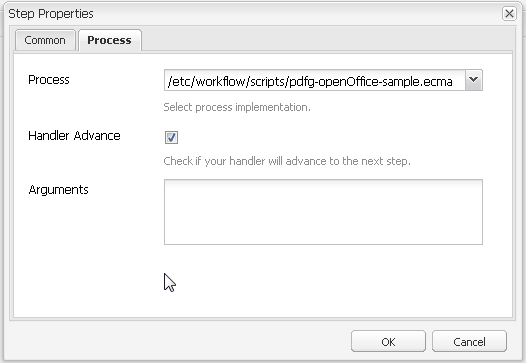

# Cartella esaminata in  AEM Forms{#watched-folder-in-aem-forms}

Un amministratore può configurare una cartella di rete, nota come Cartella esaminata, in modo che quando un utente inserisce un file (ad esempio un file PDF) nella cartella esaminata, venga avviato un flusso di lavoro, un servizio o un&#39;operazione script preconfigurata per l&#39;elaborazione del file aggiunto. Dopo che il servizio ha eseguito l&#39;operazione specificata, salva il file dei risultati in una cartella di output specificata. Per ulteriori informazioni su flusso di lavoro, servizio e script, vedere [Vari metodi per l&#39;elaborazione dei file](#variousmethodsforprocessingfiles).

## Creare una cartella esaminata {#create-a-watched-folder}

Per creare una cartella esaminata nel file system è possibile utilizzare uno dei seguenti metodi:

* Durante la configurazione delle proprietà di un nodo di configurazione Cartella esaminata, digitare il percorso completo della directory principale nella proprietà folderPath e aggiungere il nome della cartella esaminata da creare, come illustrato nell&#39;esempio seguente: `C:/MyPDFs/MyWatchedFolder`
Il 
`MyWatchedFolder`cartella inesistente.  AEM Forms tenta di creare la cartella nel percorso specificato.

* Create una cartella sul file system prima di configurare un endpoint di tipo Cartella esaminata, quindi immettete il percorso completo nella proprietà folderPath. Per informazioni dettagliate sulla proprietà folderPath, vedere [Proprietà cartella esaminata](#watchedfolderproperties).

>[!NOTE]
>
>In un ambiente cluster, la cartella utilizzata come Cartella esaminata deve essere accessibile, scrivibile e condivisa sul file system o sulla rete. Ogni istanza del server applicazione del cluster deve avere accesso alla stessa cartella condivisa. In Windows, creare un&#39;unità di rete mappata su tutti i server e specificare il percorso dell&#39;unità di rete mappata nella proprietà folderPath.

## Crea nodo di configurazione cartella esaminata {#create-watched-folder-configuration-node}

Per configurare una cartella esaminata, create un nodo di configurazione della cartella esaminata. Per creare il nodo di configurazione, effettuate le seguenti operazioni:

1. Accedete a CRX-DE lite come amministratore e andate alla cartella /etc/fd/watchfolder/config.

1. Creare un nodo di tipo `nt:unstructured`. Ad esempio, watchedfolder

   >[!NOTE]
   >
   >Il nome del nodo Cartella esaminata non può includere spazi e caratteri speciali.

1. Aggiungi le seguenti proprietà al nodo:

   * `folderPath`
   * `inputProcessorType`
   * `inputProcessorId`
   * `outputFilePattern`

   Per un elenco completo delle proprietà supportate, vedere [Proprietà cartella esaminata](#watchedfolderproperties).

1. Fare clic su **Salva tutto**. Dopo la creazione del nodo e il salvataggio delle proprietà. Le cartelle `input`, `result`, `failure`, `preserve` e `stage`vengono create nel percorso specificato nella proprietà `folderPath`.

   Il processo di scansione avvia la scansione della cartella esaminata a un intervallo di tempo definito.

## Proprietà cartella esaminata {#watchedfolderproperties}

È possibile configurare le seguenti proprietà per una cartella esaminata.

* **folderPath (String)**: Percorso della cartella da analizzare a intervalli di tempo definiti. Per un ambiente cluster, la cartella deve trovarsi in un percorso condiviso con tutti i server che dispongono dell&#39;accesso completo al server. È una proprietà obbligatoria.
* **inputProcessorType (String)**: Il tipo di processo da avviare. È possibile specificare flusso di lavoro, script o servizio. È una proprietà obbligatoria.
* **inputProcessorId (String)**: Il comportamento della proprietà inputProcessorId si basa sul valore specificato per la proprietà inputProcessorType. È una proprietà obbligatoria. Nell&#39;elenco seguente sono elencati tutti i possibili valori della proprietà inputProcessorType e il requisito corrispondente per la proprietà inputProcessorType:

   * Per il flusso di lavoro, specificate il modello del flusso di lavoro da eseguire. Ad esempio, /etc/workflow/models/&lt;nome_flusso di lavoro>/jcr:content/model
   * Per lo script, specificate il percorso JCR dello script da eseguire. Ad esempio, /etc/fd/watchfolder/test/testScript.ecma
   * Per il servizio, specificate il filtro utilizzato per individuare un servizio OSGi. Il servizio è registrato come implementazione dell’interfaccia com.adobe.aemfd.watchfolder.service.api.ContentProcessor.

* **runModes (String)**: Elenco separato da virgole delle modalità di esecuzione consentite per l&#39;esecuzione del flusso di lavoro. Alcuni esempi:

   * author

   * pubblicazione

   * creazione,pubblicazione

   * publish, author

>[!NOTE]
>
>Se il server che ospita la cartella esaminata non dispone della modalità di esecuzione specificata, la cartella esaminata viene sempre attivata indipendentemente dalle modalità di esecuzione sul server.

* **outputFilePattern (String)**: Pattern del file di output. È possibile specificare una cartella o un pattern di file. Se viene specificato un pattern di cartelle, i file di output hanno nomi come descritto nei flussi di lavoro. Se viene specificato un pattern di file, i file di output hanno nomi come descritto nel pattern di file. [Il ](../../forms/using/watched-folder-in-aem-forms.md#p-file-and-folder-patterns-p) pattern di file e cartelle può anche specificare una struttura di directory per i file di output. È una proprietà obbligatoria.

* **stageFileExpirationDuration (Long, default -1)**: Il numero di secondi di attesa prima che un file o una cartella di input già prelevato per l’elaborazione venga considerato come se fosse scaduto e contrassegnato come un errore. Questo meccanismo di scadenza si attiva solo quando il valore di questa proprietà è un numero positivo.

>[!NOTE]
>
>Anche quando un input è contrassegnato come timeout utilizzando questo meccanismo, potrebbe essere ancora in fase di elaborazione in background ma richiede solo più tempo del previsto. Se il contenuto di input è stato utilizzato prima dell&#39;avvio del meccanismo di timeout, l&#39;elaborazione potrebbe persino procedere al completamento in un secondo momento e l&#39;output potrebbe essere scaricato nella cartella dei risultati. Se il contenuto non è stato consumato prima del timeout, è molto probabile che l&#39;elaborazione si errori più tardi quando si tenta di consumare il contenuto, e questo errore verrà anche registrato nella cartella degli errori per lo stesso input. D&#39;altro canto, se l&#39;elaborazione per l&#39;input non si è mai attivata a causa di un errore di processo/flusso di lavoro intermittente (ovvero lo scenario a cui punta il meccanismo di scadenza), non si verificherà nessuna di queste due eventualità. Di conseguenza, per tutte le voci nella cartella degli errori contrassegnate come errori a causa di un timeout (cercate i messaggi del modulo &quot;File non elaborato dopo un periodo di tempo significativo, contrassegnando come errore!&quot; nel registro degli errori, è consigliabile analizzare la cartella dei risultati (e anche la cartella degli errori stessa per un&#39;altra voce per lo stesso input) per verificare se si sono verificati alcuni degli eventi precedentemente descritti.

* **deleteExpiredStageFileOnlyWhenThrottled (booleano, impostazione predefinita true):** se il meccanismo di scadenza deve essere attivato solo quando la cartella di controllo è limitata. Il meccanismo è più pertinente per le cartelle di orologi limitate in quanto un numero limitato di file che si trovano in uno stato non elaborato (a causa di errori di processo/flusso di lavoro intermittenti) ha il potenziale di soffocare l&#39;elaborazione per l&#39;intero batch quando la limitazione è abilitata. Se questa proprietà viene mantenuta come true (impostazione predefinita), il meccanismo di scadenza non si attiva per le cartelle di controllo che non sono limitate. Se la proprietà viene mantenuta come false, il meccanismo si attiva sempre che la proprietà stageFileExpirationDuration sia un numero positivo.

* **pollInterval (Long)**: L&#39;intervallo in secondi per la scansione della cartella esaminata per l&#39;input. A meno che l’impostazione Limita non sia abilitata, l’intervallo di sondaggio deve essere più lungo del tempo necessario per elaborare un processo medio; in caso contrario, il sistema potrebbe sovraccaricarsi. Il valore predefinito è 5. Per ulteriori informazioni, consultate la descrizione per Dimensione batch. Il valore dell&#39;intervallo polling deve essere maggiore o uguale a uno.
* **excludeFilePattern (String)**: Un elenco delimitato da punti e virgola (;) di pattern utilizzati da una cartella esaminata per determinare quali file e cartelle acquisire e acquisire. Qualsiasi file o cartella con questo pattern non viene sottoposto a scansione per l&#39;elaborazione. Questa impostazione è utile quando l’input è una cartella con più file. Il contenuto della cartella può essere copiato in una cartella con un nome scelto dalla cartella esaminata. Ciò impedisce alla cartella esaminata di acquisire una cartella da elaborare prima che la cartella venga completamente copiata nella cartella di input. Il valore predefinito è null.
È possibile utilizzare [pattern di file](../../forms/using/watched-folder-in-aem-forms.md#p-file-and-folder-patterns-p) per escludere:

   * file con specifiche estensioni di file; ad esempio, *.dat, *.xml, .pdf, *.*
   * File con nomi specifici; ad esempio, data* escluderebbe i file e le cartelle denominati data1, data2 e così via.
   * File con espressioni composite nel nome e nell&#39;estensione, come negli esempi seguenti:

      * Data[0-9][0-9][0-9].[dD][aA]&#39;port
      * *.[dD][Aa]&#39;port
      * *.[Xx][Mm][Ll]

Per ulteriori informazioni sui pattern di file, vedere [Informazioni sui pattern di file](../../forms/using/watched-folder-in-aem-forms.md#p-file-and-folder-patterns-p).

* **includeFilePattern (String)**: Un elenco delimitato da punti e virgola (;) di pattern utilizzati dalla cartella esaminata per determinare le cartelle e i file da acquisire e acquisire. Ad esempio, se viene immesso IncludeFilePattern*, vengono prelevati tutti i file e le cartelle che corrispondono all&#39;input*. Sono inclusi file e cartelle denominati input1, input2 e così via. Il valore predefinito è * e indica tutti i file e le cartelle. È possibile utilizzare i pattern di file per includere:

   * file con specifiche estensioni di file; ad esempio, *.dat, *.xml, .pdf, *.*
   * File con nomi specifici; ad esempio, data.* includerebbe file e cartelle denominati data1, data2 e così via.

* File con espressioni composite nel nome e nell&#39;estensione, come negli esempi seguenti:

   * Data[0-9][0-9][0-9].[dD][aA]&#39;port

      * *.[dD][Aa]&#39;port
      * *.[Xx][Mm][Ll]

Per ulteriori informazioni sui pattern di file, vedere [Informazioni sui pattern di file](../../forms/using/watched-folder-in-aem-forms.md#p-file-and-folder-patterns-p)

* **waitTime (Long)**: Tempo, in millisecondi, di attesa prima di eseguire la scansione di una cartella o di un file dopo la creazione. Ad esempio, se il tempo di attesa è di 3.600.000 millisecondi (un&#39;ora) e il file è stato creato un minuto fa, questo file verrà recuperato dopo che sono passati 59 o più minuti. Il valore predefinito è 0. Questa impostazione è utile per fare in modo che un file o una cartella venga copiato completamente nella cartella di input. Ad esempio, se disponete di un file di grandi dimensioni da elaborare e il file richiede dieci minuti per il download, impostate il tempo di attesa su 10*60 *1000 millisecondi. Ciò impedisce alla cartella esaminata di eseguire la scansione del file se non ha una durata di dieci minuti.
* **purgeDuration (Long)**: I file e le cartelle nella cartella dei risultati vengono eliminati quando sono più vecchi di questo valore. Questo valore viene misurato in giorni. Questa impostazione è utile per evitare che la cartella dei risultati diventi piena. Un valore pari a -1 giorni indica di non eliminare mai la cartella dei risultati. Il valore predefinito è -1.
* **resultFolderName (String)**: La cartella in cui sono memorizzati i risultati salvati. Se i risultati non vengono visualizzati in questa cartella, controllare la cartella degli errori. I file di sola lettura non vengono elaborati e vengono salvati nella cartella degli errori. Questo valore può essere un percorso assoluto o relativo con i seguenti pattern di file:

   * %F = prefisso del nome del file
   * %E = estensione del nome del file
   * %Y = anno (completo)
   * %y = anno (ultime due cifre)
   * %M = mese
   * %D = giorno del mese
   * %d = giorno dell&#39;anno
   * %H = ora (24 ore)
   * %h = ora (orologio da 12 ore)
   * %m = minuto
   * %s = secondo
   * %l = millisecondi
   * %R = numero casuale (tra 0 e 9)
   * %P = ID processo o processo

   Ad esempio, se il numero è alle 20 del 17 luglio 2009 e si specifica C:/Test/WF0/failure/%Y/%M/%D/%H/, la cartella dei risultati è C:/Test/WF0/failure/2009/07/17/20

   Se il percorso non è assoluto ma relativo, la cartella viene creata all’interno della cartella esaminata. Il valore predefinito è result/%Y/%M/%D/, ovvero la cartella dei risultati all&#39;interno della cartella esaminata. Per ulteriori informazioni sui pattern di file, vedere [Informazioni sui pattern di file](../../forms/using/watched-folder-in-aem-forms.md#p-file-and-folder-patterns-p).

>[!NOTE]
>
>Più piccole sono le dimensioni delle cartelle dei risultati, migliore sarà l&#39;esecuzione della cartella esaminata. Ad esempio, se il carico stimato per la cartella esaminata è di 1000 file ogni ora, provate un pattern come risultato/%Y%M%D%H in modo che venga creata una nuova sottocartella ogni ora. Se il carico è minore (ad esempio, 1000 file al giorno), è possibile utilizzare un pattern come risultato/%Y%M%D.

* **failureFolderName (String)**: La cartella in cui vengono salvati i file di errore. Questa posizione è sempre relativa alla cartella esaminata. È possibile utilizzare i pattern di file, come descritto per Cartella risultati. I file di sola lettura non vengono elaborati e vengono salvati nella cartella degli errori. Il valore predefinito è failure/%Y/%M/%D/.
* **preserveFolderName (String):** il percorso in cui i file vengono memorizzati dopo l’elaborazione. Il percorso può essere assoluto, relativo o nullo. È possibile utilizzare i pattern di file, come descritto per Cartella risultati. Il valore predefinito è preserve/%Y/%M/%D/.
* **batchSize (Long)**: Numero di file o cartelle da raccogliere per scansione. utilizzare per evitare un sovraccarico del sistema; la scansione di troppi file alla volta può causare un arresto anomalo. Il valore predefinito è 2.

   Le impostazioni Intervallo sondaggio e Dimensione batch determinano quanti file vengono raccolti da Cartella esaminata in ogni scansione. Cartella esaminata utilizza un pool di thread Quartz per eseguire la scansione della cartella di input. Il pool di thread è condiviso con altri servizi. Se l’intervallo di scansione è ridotto, i thread eseguono spesso la scansione della cartella di input. Se i file vengono rilasciati frequentemente nella cartella esaminata, è necessario mantenere l&#39;intervallo di scansione ridotto. Se i file vengono omessi raramente, usate un intervallo di scansione maggiore in modo che gli altri servizi possano usare i thread.

   Se un grande volume di file viene eliminato, ingrandire la dimensione del batch. Ad esempio, se il servizio avviato dall’endpoint Cartella esaminata può elaborare 700 file al minuto e gli utenti rilasciano i file nella cartella di input allo stesso ritmo, quindi impostando la dimensione batch su 350 e l’intervallo di sondaggio su 30 secondi, le prestazioni della cartella esaminata possono essere aiutate senza dover sostenere troppo spesso i costi di scansione della cartella esaminata.

   Quando i file vengono rilasciati nella cartella esaminata, elenca i file in input, il che può ridurre le prestazioni se la scansione avviene ogni secondo. Aumentare l&#39;intervallo di scansione può migliorare le prestazioni. Se il volume dei file che si desidera eliminare è limitato, regolare di conseguenza le dimensioni del batch e l’intervallo di sondaggio. Ad esempio, se 10 file vengono eliminati ogni secondo, provare a impostare pollInterval su 1 secondo e la dimensione batch su 10

* **throttleOn (Boolean)**: Quando questa opzione è selezionata, limita il numero di processi delle cartelle esaminate che  AEM Forms elabora in un dato momento. Il numero massimo di processi è determinato dal valore Dimensione batch. Il valore predefinito è true. (Vedere [Informazioni sulla limitazione](../../forms/using/watched-folder-in-aem-forms.md#p-about-throttling-p).)

* **overwriteDuplicateFilename (Boolean)**: Se è impostata su True, i file nella cartella dei risultati e nella cartella preserve vengono sovrascritti. Se è impostata su False, per il nome vengono utilizzati file e cartelle con un suffisso indice numerico. Il valore predefinito è False.
* **preserveOnFailed (Boolean)**: Mantieni i file di input in caso di mancata esecuzione dell&#39;operazione su un servizio. Il valore predefinito è true.
* **inputFilePattern (String)**: Specifica il pattern dei file di input per una cartella esaminata. Crea un inserire nell&#39;elenco Consentiti  dei file.
* **asincrono (booleano)**: Identifica il tipo di chiamata come asincrono o sincrono. Il valore predefinito è true (asincrono). L&#39;elaborazione del file è un&#39;attività che richiede risorse. Mantenere il valore del flag asincrono su true per evitare di soffocare il thread principale del processo di scansione. In un ambiente cluster, è fondamentale mantenere il flag true per abilitare il bilanciamento del carico per i file elaborati nei server disponibili. Se il flag è false, il processo di scansione tenta di eseguire l&#39;elaborazione di ciascun file/cartella di livello principale in sequenza all&#39;interno del proprio thread. Non impostare il flag su false senza un motivo specifico, ad esempio l&#39;elaborazione basata su flusso di lavoro in una configurazione a server singolo.

>[!NOTE]
>
>Per impostazione predefinita, i flussi di lavoro sono asincroni. Anche se impostate il valore su false, i flussi di lavoro vengono avviati in modalità asincrona.

* **enabled (Boolean)**: Disattiva e attiva la scansione per una cartella esaminata. Impostato enabled su true, per avviare la scansione della cartella esaminata. Il valore predefinito è true.
* **payloadMapperFilter:** se una cartella è configurata come cartella esaminata, viene creata una struttura di cartelle all’interno della cartella esaminata. La struttura dispone di cartelle per fornire input, ricevere output (risultati), salvare i dati per gli errori, conservare i dati per i processi di lunga durata e salvare i dati per le varie fasi. La struttura di cartelle di una cartella esaminata può fungere da payload di flussi di lavoro Forms incentrati su di essa. Un mappatore payload consente di definire la struttura di un payload che utilizza una cartella esaminata per l&#39;input, l&#39;output e l&#39;elaborazione. Ad esempio, se utilizzate il mappatore predefinito, viene mappato il contenuto della cartella esaminata con la cartella [payload]\input e [payload]\output. Sono disponibili due implementazioni di payload mapper out-of-the-box. Se non disponete di [un&#39;implementazione personalizzata](../../forms/using/watched-folder-in-aem-forms.md#creating-a-custom-payload-mapper-filter), utilizzate un&#39;implementazione out-of-the-box:

   * **Mappatore predefinito:** utilizzate il mapping payload predefinito per mantenere il contenuto di input e output delle cartelle esaminate in cartelle di input e output separate nel payload. Inoltre, nel percorso di payload di un flusso di lavoro, utilizzate i percorsi [payload]/input/ e [payload]/output per recuperare e salvare il contenuto.

   * **Mappatore di payload semplice basato su file:** utilizzate il mappatore di payload semplice basato su file per mantenere i contenuti di input e output direttamente nella cartella payload. Non crea alcuna gerarchia aggiuntiva, come il mappatore predefinito.

### Parametri di configurazione personalizzati {#custom-configuration-parameters}

Insieme alle proprietà di configurazione delle cartelle esaminate elencate sopra, potete anche specificare parametri di configurazione personalizzati. I parametri personalizzati vengono passati al codice di elaborazione del file. Consente al codice di modificarne il comportamento in base al valore del parametro. Per specificare un parametro:

1. Accedete a CRXDE-Lite e andate al nodo di configurazione della cartella esaminata.
1. Aggiungete un parametro di proprietà.&lt;property_name> al nodo di configurazione della cartella esaminata. Il tipo della proprietà può essere solo booleano, data, decimale, Double, Long e String. È possibile specificare proprietà singole e multivalore.

>[!NOTE]
>
>Se il tipo di dati della proprietà è Double, specificare un punto decimale nel valore di tali proprietà. Per tutte le proprietà, in cui il tipo di dati è Double e nel valore non è specificato alcun separatore decimale, il tipo è convertito in Long.

Tali proprietà vengono trasmesse come una mappa immutabile di tipo Map&lt;String, Object> al codice di elaborazione. Il codice di elaborazione può essere uno script ECMAS, un flusso di lavoro o un servizio. I valori forniti per le proprietà sono disponibili come coppie chiave-valore nella mappa. Key è il nome della proprietà e value è il valore della proprietà. Per ulteriori informazioni sui parametri di configurazione personalizzati, consultate la seguente immagine:


Un nodo di configurazione della cartella di controllo di esempio con proprietà obbligatorie, alcune proprietà facoltative, alcuni parametri di configurazione.

#### Variabili mutabili per flussi di lavoro {#mutable-variables-for-workflows}

Potete creare variabili mutevoli per i metodi di elaborazione dei file basati su workflow. Queste variabili fungono da contenitori per lo scorrimento dei dati tra le fasi di un flusso di lavoro. Per creare tali variabili:

1. Accedete a CRXDE-Lite e andate al nodo di configurazione della cartella esaminata.

1. Aggiungere una proprietà workflow.var.&lt;variable_name> al nodo di configurazione della cartella esaminata.

   Il tipo della proprietà può essere solo booleano, data, decimale, Double, Long e String. Sono inoltre supportate le proprietà multivalore. Per le proprietà con più valori, il valore disponibile per il passaggio del flusso di lavoro è un array di tipo specificato.

   >[!NOTE]
   >
   >Se il tipo di dati della proprietà è Double, specificare un punto decimale nel valore di tali proprietà. Per tutte le proprietà, in cui il tipo di dati è Double e nel valore non è specificato alcun separatore decimale, il tipo è convertito in Long.

>[!NOTE]
>
>La specifica JCR richiede un valore predefinito per le proprietà. I valori predefiniti sono disponibili per le fasi di un flusso di lavoro per l&#39;elaborazione. Quindi, specificate i valori predefiniti appropriati.


## Vari metodi per l&#39;elaborazione dei file {#variousmethodsforprocessingfiles}

È possibile avviare un flusso di lavoro, un servizio o uno script per elaborare i documenti posizionati in una cartella di controllo.

### Utilizzo di un servizio per elaborare i file di una cartella esaminata   {#using-a-service-to-process-files-of-a-watched-folder-nbsp}

Un servizio è un&#39;implementazione personalizzata dell&#39;interfaccia `com.adobe.aemfd.watchfolder.service.api.ContentProcessor`. È registrato con OSGi insieme ad alcune proprietà personalizzate. Le proprietà personalizzate dell&#39;implementazione lo rendono unico e aiutano a identificare l&#39;implementazione.

#### Implementazione personalizzata dell&#39;interfaccia ContentProcessor {#custom-implementation-of-the-contentprocessor-interface}

L&#39;implementazione personalizzata accetta un contesto di elaborazione (un oggetto di tipo com.adobe.aemfd.watchfolder.service.api.ProcessorContext), legge i documenti di input e i parametri di configurazione dal contesto, elabora gli input e aggiunge l&#39;output al
context. ProcessorContext dispone delle seguenti API:

* **getWatchFolderId**: Restituisce l’ID della cartella esaminata.
* **getInputMap**: Restituisce una mappa di tipo Mappa. Le chiavi della mappa sono il nome del file di input e un oggetto documento contenente il contenuto del file. Utilizzate l&#39;API getInputMap per leggere i file di input.
* **getConfigParameters**: Restituisce una mappa immutabile di tipo Mappa. La mappa contiene
i parametri di configurazione di una cartella esaminata.

* **setResult**: L&#39;implementazione di ContentProcessor utilizza l&#39;API per scrivere il documento di output nella cartella dei risultati. Potete fornire un nome per il file di output all&#39;API setResult. L&#39;API potrebbe scegliere di utilizzare o ignorare il file fornito a seconda della cartella di output/del pattern di file specificato. Se viene specificato un pattern di cartelle, i file di output hanno nomi come descritto nei flussi di lavoro. Se viene specificato un pattern di file, i file di output hanno nomi come descritto nel pattern di file.

Ad esempio, il codice seguente è un&#39;implementazione personalizzata dell&#39;interfaccia ContentProcessor con una proprietà foo=bar personalizzata.

```java
@Component(metatype = true, immediate = true, label = "WF Test Service", description = "WF Test Service")
@Service(value = {OutputWriter.class, ContentProcessor.class})
@Property(name = "foo", value = "bar")
public class OutputWriter implements ContentProcessor {
```

Durante la [configurazione di una cartella esaminata](../../forms/using/watched-folder-in-aem-forms.md#p-create-watched-folder-configuration-node-p), se si specifica la proprietà inputProcessorId come (foo=bar) e la proprietà inputProcessorType come Service, il servizio sopra menzionato (implementazione personalizzata) viene utilizzato per elaborare i file di input della cartella esaminata.

L&#39;esempio seguente è anche un&#39;implementazione personalizzata dell&#39;interfaccia ContentProcessor. Nell&#39;esempio, il Servizio accetta i file di input, copia i file in una posizione temporanea e restituisce un oggetto documento con il contenuto del file. Il contenuto dell&#39;oggetto document viene salvato nella cartella dei risultati. Il percorso fisico della cartella dei risultati è configurato nel nodo di configurazione [Cartella esaminata](../../forms/using/watched-folder-in-aem-forms.md#p-create-watched-folder-configuration-node-p).

```java
@Component(immediate = true)
@Service(value = ContentProcessor.class)
@Property(name = "serviceSelector", value = "testProcessor1")
public class TestContentProcessor1 implements ContentProcessor {
    @Override
    public void processInputs(ProcessorContext context) throws Exception {
        Map.Entry<String, Document> e = context.getInputMap().entrySet().iterator().next();
        File f = new File((String) context.getConfigParameters().get("tempDir"),
                context.getConfigParameters().get("outPrefix") + e.getKey());
        e.getValue().copyToFile(f);
        context.setResult(f.getName(), new Document(f, true));
    }
}
```

### Utilizzo di script per elaborare i file di una cartella esaminata {#using-scripts-to-process-files-of-a-watched-folder}

Gli script sono il codice personalizzato di reclamo ECMAScript scritto per elaborare i documenti inseriti nella cartella esaminata. Uno script è rappresentato come un nodo JCR. Oltre alle variabili standard ECMAScript (log, sling e altro), lo script dispone di una variabile processorContext. La variabile è di tipo ProcessorContext. ProcessorContext dispone delle seguenti API:

* **getWatchFolderId**: Restituisce l’ID della cartella esaminata.
* **getInputMap**: Restituisce una mappa di tipo Mappa. Le chiavi della mappa sono il nome del file di input e un oggetto documento contenente il contenuto del file. Utilizzate l&#39;API getInputMap per leggere i file di input.
* **getConfigParameters**: Restituisce una mappa immutabile di tipo Mappa. La mappa contiene i parametri di configurazione di una cartella esaminata.
* **setResult**: L&#39;implementazione di ContentProcessor utilizza l&#39;API per scrivere il documento di output nella cartella dei risultati. Potete fornire un nome per il file di output all&#39;API setResult. L&#39;API potrebbe scegliere di utilizzare o ignorare il file fornito a seconda della cartella di output/del pattern di file specificato. Se viene specificato un pattern di cartelle, i file di output hanno nomi come descritto nei flussi di lavoro. Se viene specificato un pattern di file, i file di output hanno nomi come descritto nel pattern di file.

Di seguito è riportato un esempio di ECMAScript. Accetta i file di input, copia i file in una posizione temporanea e restituisce un oggetto documento con il contenuto del file. Il contenuto dell&#39;oggetto document viene salvato nella cartella dei risultati. Il percorso fisico della cartella dei risultati è configurato nel nodo di configurazione [Cartella esaminata](../../forms/using/watched-folder-in-aem-forms.md#p-create-watched-folder-configuration-node-p).

>[!NOTE]
>
>La cartella di output e il prefisso del nome del file vengono decisi in base ai parametri di configurazione delle cartelle esaminate.

```java
var inputMap = processorContext.getInputMap();
var params = processorContext.getConfigParameters();
var entry = inputMap.entrySet().iterator().next();
var tempFile = new Packages.java.io.File(params.get("tempDir"), params.get("outPrefix") + entry.getKey());
entry.getValue().copyToFile(tempFile);
processorContext.setResult(tempFile.getName(), new Packages.com.adobe.aemfd.docmanager.Document(tempFile, true));
```

#### Posizione degli script e considerazioni relative alla protezione {#location-of-scripts-and-security-considerations}

Per impostazione predefinita, viene fornita una cartella contenitore (/etc/fd/watchfolder/scripts) in cui i clienti possono inserire i propri script, e l&#39;utente predefinito del servizio utilizzato dal framework delle cartelle di controllo dispone delle autorizzazioni necessarie per la lettura degli script da questa posizione.

Se si intende posizionare gli script in una posizione personalizzata, è probabile che l&#39;utente predefinito del servizio non disponga delle autorizzazioni di lettura sulla posizione personalizzata. Per tale scenario, eseguire le operazioni seguenti per fornire le autorizzazioni necessarie al percorso personalizzato:

1. Creare un utente di sistema a livello di programmazione oppure tramite la console https://&#39;[server]:[port]&#39;/crx/explorer. Potete anche utilizzare un utente di sistema esistente. È importante lavorare con gli utenti del sistema al posto dei normali utenti.
1. Fornire le autorizzazioni di lettura all&#39;utente di sistema appena creato o esistente nel percorso personalizzato in cui sono memorizzati gli script. Potete avere più posizioni personalizzate. Fornite almeno le autorizzazioni di lettura a tutte le posizioni personalizzate.
1. Nella console di configurazione Felix (/system/console/configMgr), individuate la mappatura utente del servizio per le cartelle di controllo. Questa mappatura è simile a &#39;Mapping: adobe-aemds-core-watch-folder=...&quot;.
1. Fate clic sulla mappatura. Per la voce &#39;adobe-aemds-core-watch-folder:scripts=fd-service&#39;, impostate fd-service sull’ID dell’utente del sistema personalizzato. Fate clic su Salva.

Ora è possibile utilizzare il percorso personalizzato configurato per salvare gli script.

### Utilizzo di un flusso di lavoro per elaborare i file di una cartella esaminata {#using-a-workflow-to-process-files-of-a-watched-folder}

I flussi di lavoro consentono di automatizzare le attività  Experience Manager. I flussi di lavoro sono composti da una serie di passaggi eseguiti in un ordine specifico. Ogni passaggio esegue un&#39;attività distinta, ad esempio l&#39;attivazione di una pagina o l&#39;invio di un messaggio e-mail. I flussi di lavoro possono interagire con le risorse presenti nell’archivio, negli account utente e  servizi di Experience Manager. Pertanto, i flussi di lavoro possono coordinare in modo complicato.

* Prima di creare un Flusso di lavoro, considera quanto segue:
* L&#39;output di un passaggio deve essere disponibile per tutti i passaggi successivi.
I passaggi devono essere in grado di aggiornare (o addirittura eliminare) gli output esistenti generati dai passaggi precedenti.
* Le variabili mutabili vengono utilizzate per far scorrere i dati dinamici personalizzati tra i passaggi.

Per elaborare i file utilizzando i flussi di lavoro, effettuate le seguenti operazioni:

1. Creare un&#39;implementazione dell&#39;interfaccia `com.adobe.aemfd.watchfolder.workflow.api.WorkflowContextProcessor`. È simile all&#39;implementazione creata per un servizio.

   >[!NOTE]
   >
   >È possibile creare l&#39;implementazione completa interamente in ECMAScript.

1. In una fase di Workflow, individua il servizio OSGi di tipo com.adobe.aemfd.watchfolder.workflow.api.WorkflowContextService e chiama il metodo execute() del servizio con gli argomenti seguenti.

   * Implementazione personalizzata dell&#39;interfaccia WorkflowContextProcessor
   * workItem
   * workflowSession
   * metadata

Se si utilizza il linguaggio di programmazione Java per implementare il flusso di lavoro, il motore del flusso di lavoro AEM fornisce valore per le variabili workItem, workflowSession e metadati. Queste variabili vengono trasmesse come argomenti al metodo execute() dell&#39;implementazione WorkflowProcess personalizzata.

Se si utilizza ECMAScript per implementare il flusso di lavoro, il motore del flusso di lavoro AEM fornisce valore per le variabili graniteWorkItem, graniteWorkflowSession e metadati. Queste variabili vengono trasmesse come argomenti al metodo WorkflowContextService.execute().

L&#39;argomento di processWorkflowContext() è un oggetto di tipo com.adobe.aemfd.watchfolder.workflow.api.WorkflowContext. L&#39;interfaccia WorkflowContext include le seguenti API per facilitare le considerazioni specifiche del flusso di lavoro di cui sopra:

* getWorkItem: Restituisce il valore della variabile WorkItem. Le variabili vengono passate al metodo WorkflowContextService.execute().
* getWorkflowSession: Restituisce il valore della variabile WorkflowSession. Le variabili vengono passate al metodo WorkflowContextService.execute().
* getMetadata: Restituisce il valore della variabile Metadati. Le variabili vengono passate al metodo WorkflowContextService.execute().
* getCommittingVariables: Restituisce una mappa oggetto di sola lettura che rappresenta le variabili impostate dai passaggi precedenti. Se una variabile non viene modificata in nessuno dei passaggi precedenti, viene restituito il valore predefinito specificato durante la configurazione della cartella esaminata.
* getCommittingResults: Restituisce una mappa documento di sola lettura. La mappa rappresenta i file di output generati dai passaggi precedenti.
* setVariable: L’implementazione WorkflowContextProcessor utilizza la variabile per manipolare le variabili che rappresentano i dati dinamici personalizzati che fluiscono tra i passaggi. Il nome e il tipo delle variabili sono identici al nome delle variabili specificate durante la [configurazione della cartella esaminata](../../forms/using/watched-folder-in-aem-forms.md#p-configure-the-watched-folder-p). Per modificare il valore di una variabile, invoca l’API setVariable con un valore non nullo. Per rimuovere una variabile, chiamate setVariable() con un valore null.

Sono inoltre disponibili le seguenti API di ProcessorContext:

* getWatchFolderId: Restituisce l’ID della cartella esaminata.
* getInputMap: Restituisce una mappa di tipo Map&lt;String, Document>. Le chiavi della mappa sono il nome del file di input e un oggetto documento contenente il contenuto del file. Utilizzate l&#39;API getInputMap per leggere i file di input.
* getConfigParameters: Restituisce una mappa immutabile di tipo Map&lt;String, Object>. La mappa contiene i parametri di configurazione di una cartella esaminata.
* setResult: L&#39;implementazione di ContentProcessor utilizza l&#39;API per scrivere il documento di output nella cartella dei risultati. Potete fornire un nome per il file di output all&#39;API setResult. L&#39;API potrebbe scegliere di utilizzare o ignorare il file fornito a seconda della cartella di output/del pattern di file specificato. Se viene specificato un pattern di cartelle, i file di output hanno nomi come descritto nei flussi di lavoro. Se viene specificato un pattern di file, i file di output hanno nomi come descritto nel pattern di file

Considerazione per l&#39;API setResult, se utilizzata nei flussi di lavoro:

* Per aggiungere un nuovo documento di output che contribuisca all&#39;output del flusso di lavoro complessivo, chiamate l&#39;API setResult con un nome di file che non è stato utilizzato come nome di file di output da nessun passaggio precedente.
* Per aggiornare un output generato da un passaggio precedente, invoca l’API setResult con un nome di file già utilizzato da un passaggio precedente.
* Per eliminare un output generato da un passaggio precedente, chiama setResult con un nome file già utilizzato da un passaggio precedente e null come contenuto.

>[!NOTE]
>
>La chiamata dell&#39;API setResult con contenuto nullo in qualsiasi altro scenario comporterebbe un errore.

L&#39;esempio seguente è implementato come passaggio del flusso di lavoro. Nell&#39;esempio, ECMAscript utilizza una variabile stepCount per tenere traccia del numero di volte in cui un passaggio viene chiamato nell&#39;istanza del flusso di lavoro corrente.
Il nome della cartella di output è una combinazione di numero del passaggio corrente, nome del file originale e prefisso specificati nel parametro outPrefix.

ECMAScript ottiene un riferimento al servizio di contesto del flusso di lavoro e crea un&#39;implementazione dell&#39;interfaccia WorkflowContextProcessor. L&#39;implementazione WorkflowContextProcessor accetta i file di input, copia il file in una posizione temporanea e restituisce un documento che rappresenta il file copiato. In base al valore della variabile booleana purgePrevious, il passaggio corrente elimina l&#39;output generato l&#39;ultima volta dallo stesso passaggio quando il passaggio è stato avviato nell&#39;istanza del flusso di lavoro corrente. Alla fine, il metodo wfSvc.execute viene richiamato per eseguire l&#39;implementazione WorkflowContextProcessor. Il contenuto del documento di output viene salvato nella cartella dei risultati nel percorso fisico indicato nel nodo di configurazione Cartella esaminata.

```javascript
log.error("Watch-folder workflow script called for step: " + graniteWorkItem.getNode().getTitle());
var wfSvc = sling.getService(Packages.com.adobe.aemfd.watchfolder.workflow.api.WorkflowContextService);
// Custom WorkflowContextProcessor implementation which defines the processWorkflowContext() method purely in JS
var impl = { processWorkflowContext: function (wfContext) {
    var wfId = wfContext.getWatchFolderId();
    var inputMap = wfContext.getInputMap();
    var paramMap = wfContext.getConfigParameters();
    var preResults = wfContext.getCommittedResults();
    var preVars = wfContext.getCommittedVariables();
    log.info("WF ID: " + wfId); // workflowId of type String
    log.info("Inputs: " + inputMap); // Input map of type Map<String, Document>
    log.info("Params: " + paramMap); // Config params of type Map<String, Object>
    log.info("Old results: " + preResults);
    log.info("Old variables: " + preVars);
    var currStepNumber = new Packages.java.lang.Long(new Packages.java.lang.Long(preVars.get("stepCount")).longValue() + 1);
    log.info("Current step number: " + currStepNumber);
    wfContext.setVariable("stepCount", currStepNumber);
    var entry = inputMap.entrySet().iterator().next();
    var tempFile = new Packages.java.io.File(paramMap.get("tempDir"), paramMap.get("outPrefix") + "STEP-" + currStepNumber + "-" + entry.getKey());
    entry.getValue().copyToFile(tempFile);
    var fName = tempFile.getName();
    var outDoc = new Packages.com.adobe.aemfd.docmanager.Document(tempFile, true);
    wfContext.setResult(tempFile.getName(), outDoc);
    var prevStepOutName = paramMap.get("outPrefix") + "STEP-" + (currStepNumber - 1) + "-" + entry.getKey();
    if (preResults.containsKey(prevStepOutName) && paramMap.get("purgePrevious").booleanValue()) {
        log.info("Purging previous step output " + prevStepOutName);
        wfContext.setResult(prevStepOutName, null);
    }
} }
wfSvc.execute(impl, graniteWorkItem, graniteWorkflowSession, metaData);
log.info("Exiting workflow script!")
```

### Crea filtro Payload Mapper per mappare la struttura di una cartella esaminata al payload di un flusso di lavoro {#create-payload-mapper-filter-to-map-structure-of-a-watched-folder-to-the-payload-of-a-workflow}

Quando create una cartella esaminata, viene creata una struttura di cartelle all’interno della cartella esaminata. La struttura delle cartelle contiene le cartelle stage, result, preserve, input e failure. La struttura delle cartelle può fungere da payload di input per il flusso di lavoro e accettare l’output da un flusso di lavoro. Può anche elencare i punti di errore, se presenti.

Se la struttura di un payload è diversa dalla struttura della cartella esaminata, è possibile creare script personalizzati per mappare la struttura della cartella esaminata al payload. Tale script è denominato filtro di mappatura payload.  AEM Forms fornisce un filtro di mappatura payload per mappare la struttura della cartella esaminata su un payload.

#### Creazione di un filtro mappatore payload personalizzato {#creating-a-custom-payload-mapper-filter}

1. Scarica [ Adobe Client SDK](https://repo.adobe.com/nexus/content/groups/public/com/adobe/aemfd/aemfd-client-sdk/6.3.0/aemfd-client-sdk-6.3.0.jar).
1. Imposta l’SDK del client nel percorso di creazione del progetto basato su server. Per iniziare, puoi scaricare e aprire il seguente progetto basato sul cielo nell’IDE di tua scelta.
1. Modificate il codice del filtro di mappatura payload disponibile nel pacchetto di esempio in base alle vostre esigenze.
1. Utilizzate maven per creare un bundle del filtro Payload Mapper personalizzato.
1. Utilizzate la console [AEM bundle](https://localhost:4502/system/console/bundles) per installare il bundle.

   Ora, il filtro Payload Mapper personalizzato è elencato AEM&#39;interfaccia utente delle cartelle esaminate. Puoi usarlo con il tuo flusso di lavoro.

   Il codice di esempio seguente implementa un semplice mappatore basato su file per i file salvati in relazione a un payload. Potete usarlo per iniziare.

   ```java
   package com.adobe.aemfd.watchfolder.workflow;
   import com.adobe.aemfd.docmanager.Document;
   import com.adobe.aemfd.watchfolder.workflow.api.payload.PayloadMapper;
   import com.adobe.aemfd.watchfolder.workflow.api.payload.WorkflowExecutionContext;
   import com.adobe.aemfd.watchfolder.workflow.api.payload.WorkflowInitializationContext;
   import com.adobe.aemfd.watchfolder.workflow.api.payload.WorkflowVariable;
   import com.adobe.granite.workflow.exec.Workflow;
   import org.apache.felix.scr.annotations.Component;
   import org.apache.felix.scr.annotations.Service;
   import org.apache.sling.api.resource.ResourceResolver;
   import javax.jcr.Binary;
   import javax.jcr.Node;
   import java.util.Collection;
   import java.util.HashMap;
   import java.util.Map;
   @Component(immediate = true)
   @Service(value = PayloadMapper.class)
   public class SimpleFileBasedPayloadMapper implements PayloadMapper {
   @Override
   public Node createPayload(WorkflowInitializationContext wfInitCtxt, Node stagingFolder, String uniquePayloadName,
   Map<String, Binary> inputs, Collection<WorkflowVariable> variableDefs) throws Exception {
   Node dirNode = stagingFolder.addNode(uniquePayloadName, "sling:Folder");
   for (Map.Entry<String, Binary> bins: inputs.entrySet()) {
   Node fileNode = dirNode.addNode(bins.getKey(), "nt:file");
   Node resNode = fileNode.addNode ("jcr:content", "nt:resource");
   resNode.setProperty("jcr:data", bins.getValue());
   }
   return dirNode;
   }
   @Override
   public Map<String, Document> getInputs(WorkflowInitializationContext wfInitCtxt, WorkflowExecutionContext wfExecCtxt,
   Node payload, ResourceResolver resourceResolver) throws Exception {
   return null; //To change body of implemented methods use File | Settings | File Templates.
   }
   @Override
   public void setOutput(WorkflowInitializationContext wfInitCtxt, WorkflowExecutionContext wfExecCtxt, Node payload,
   String fileName, Binary contents, int outputMode) throws Exception {
   //To change body of implemented methods use File | Settings | File Templates.
   }
   @Override
   public Map<String, Document> getIntermediateOutputs(WorkflowInitializationContext wfInitCtxt,
   WorkflowExecutionContext wfExecCtxt, Node payload,
   ResourceResolver resourceResolver) throws Exception {
   return null; //To change body of implemented methods use File | Settings | File Templates.
   }
   @Override
   public Map<String, Document> getFinalOutputs(WorkflowInitializationContext wfInitCtxt, Workflow workflow, Node payload,
   ResourceResolver resourceResolver) throws Exception {
   Map<String, Object> params = wfInitCtxt.getConfigParameters();
   Map<String, Document> result = new HashMap<String, Document>();
   for (Map.Entry<String, Object> me: params.entrySet()) {
   String key = me.getKey();
   if (key.startsWith("pm.outfile.")) {
   String fName = (String) me.getValue();
   Document d = new Document(payload.getPath() + "/" + fName, resourceResolver);
   result.put(fName, d);
   }
   }
   return result;
   }
   @Override
   public void setVariable(WorkflowInitializationContext wfInitCtxt, WorkflowExecutionContext wfExecCtxt, Node payload,
   WorkflowVariable variable) throws Exception {
   //To change body of implemented methods use File | Settings | File Templates.
   }
   @Override
   public Map<String, Object> getVariables(WorkflowInitializationContext wfInitCtxt, WorkflowExecutionContext wfExecCtxt,
   Node payload) throws Exception {
   return null; //To change body of implemented methods use File | Settings | File Templates.
   }
   }
   ```

## Interazione degli utenti con una cartella esaminata {#how-users-interact-with-a-watched-folder}

Per un endpoint della cartella esaminata, gli utenti possono avviare le operazioni di elaborazione dei file copiando o trascinando i file o le cartelle di input dai propri computer a una cartella esaminata. I file vengono elaborati in ordine di arrivo.

Per gli endpoint delle cartelle esaminate, se un processo richiede un solo file di input, l’utente può copiare tale file nella directory principale della cartella esaminata.

Se il processo contiene più di un file di input, l’utente deve creare una cartella al di fuori della gerarchia delle cartelle esaminate contenente tutti i file richiesti. Questa nuova cartella deve includere i file di input (e facoltativamente un file DDX, se richiesto dal processo). Una volta creata la cartella di processo, l’utente la copia nella cartella di input della cartella esaminata.

>[!NOTE]
>
>Verificate che il server applicazioni abbia eliminato l&#39;accesso ai file nella cartella esaminata. Se  AEM Forms non è in grado di eliminare i file dalla cartella di input dopo la scansione, il processo associato verrà avviato a tempo indeterminato.

## Ulteriori informazioni sulle cartelle esaminate {#additional-information-about-the-watched-folders}

### Informazioni sulla limitazione {#about-throttling}

Quando la limitazione è abilitata per l’endpoint di una cartella di controllo, limita il numero di processi di cartelle esaminate elaborati in un dato momento. Il numero massimo di processi è determinato dal valore Dimensione batch, anch’esso configurabile nell’endpoint Cartella esaminata. Quando viene raggiunto il limite di limitazione, i documenti in entrata nella directory di input della cartella esaminata non vengono sottoposti a polling. Il documento rimane anche nella directory di input fino al completamento di altri processi delle cartelle esaminate e al successivo tentativo di sondaggio. Per l’elaborazione sincrona, tutti i processi elaborati in un singolo sondaggio vengono conteggiati verso il limite di limitazione, anche se i processi vengono elaborati consecutivamente in un singolo thread.

>[!NOTE]
>
>La limitazione non viene ridimensionata con un cluster. Quando la limitazione è attivata, il cluster nel suo insieme non elaborerà più del numero di processi specificato in Dimensione batch in un dato momento. Questo limite è a livello di cluster e non è specifico per ciascun nodo del cluster. Ad esempio, con una dimensione batch pari a 2, il limite di limitazione potrebbe essere raggiunto con un singolo nodo che elabora due processi, e nessun altro nodo eseguirebbe il polling della directory di input fino al completamento di uno dei processi.

#### Funzionamento della limitazione {#how-throttling-works}

Cartella esaminata analizza la cartella di input in ogni intervallo poll, rileva il numero di file specificato in Dimensione batch e richiama il servizio di destinazione per ciascuno di questi file. Ad esempio, se la dimensione del batch è quattro, ad ogni scansione, la cartella esaminata raccoglie quattro file, crea quattro richieste di chiamata e richiama il servizio di destinazione. Prima del completamento di queste richieste, se viene richiamata la cartella esaminata, vengono avviati di nuovo quattro processi, indipendentemente dal fatto che i quattro processi precedenti siano stati completati o meno.

La limitazione impedisce alla cartella esaminata di richiamare nuovi processi quando i processi precedenti non sono completati. La cartella esaminata rileva i processi in corso ed elabora i nuovi processi in base alle dimensioni del batch meno i processi in corso. Ad esempio, nella seconda chiamata, se il numero di processi completati è di soli tre e un processo è ancora in corso, Cartella esaminata richiama solo altri tre processi.

* La cartella esaminata si basa sul numero di file presenti nella cartella dell’area di visualizzazione per verificare quanti processi sono in corso. Se i file non vengono elaborati nella cartella dell’area di visualizzazione, la cartella esaminata non esegue altri processi. Ad esempio, se la dimensione del batch è pari a quattro e tre processi sono in stallo, Cartella osservata richiama un solo processo nelle chiamate successive. Esistono diversi scenari in cui i file possono rimanere non elaborati nella cartella dell’area di visualizzazione. Quando i processi vengono bloccati, l’amministratore può terminare il processo nella pagina di amministrazione di Process Management in modo che la cartella esaminata sposta i file fuori dalla cartella dell’area di visualizzazione.
* Se il server AEM Forms  va giù prima che la cartella esaminata invoca i processi, l’amministratore può spostare i file fuori dalla cartella dell’area di visualizzazione. Per informazioni, vedere [Punti di errore e ripristino](../../forms/using/watched-folder-in-aem-forms.md#p-failure-points-and-recoveryfailure-points-and-recovery-p).
* Se il server AEM Forms  è in esecuzione ma la cartella esaminata non è in esecuzione quando il servizio Job Manager effettua una nuova chiamata, che si verifica quando i servizi non vengono avviati nella sequenza ordinata, l’amministratore può spostare i file fuori dalla cartella dell’area di visualizzazione. Per informazioni, vedere [Punti di errore e ripristino](../../forms/using/watched-folder-in-aem-forms.md#p-failure-points-and-recoveryfailure-points-and-recovery-p).

### Punti di errore e punti di ripristino e ripristino {#failure-points-and-recoveryfailure-points-and-recovery}

A ogni evento di sondaggio, Cartella osservata blocca la cartella di input, sposta i file che corrispondono al pattern di file include nella cartella dell’area di visualizzazione, quindi sblocca la cartella di input. Il blocco è necessario in modo che due thread non raccolgano lo stesso set di file ed elaborino due volte. Le possibilità che ciò accada aumentano con un piccolo intervallo di poll e una dimensione batch elevata. Dopo aver spostato i file nella cartella dell’area di visualizzazione, la cartella di input viene sbloccata in modo che altri thread possano eseguire la scansione della cartella. Questo passaggio consente di ottenere un throughput elevato perché altri thread possono eseguire la scansione mentre un thread elabora i file.

Dopo aver spostato i file nella cartella dell’area di visualizzazione, vengono create richieste di chiamata per ciascun file e viene richiamato il servizio di destinazione. In alcuni casi la cartella esaminata non è in grado di recuperare i file nella cartella dell’area di visualizzazione:

* Se il server va giù prima che la cartella esaminata possa creare la richiesta di chiamata, i file nella cartella dell’area di visualizzazione rimangono nella cartella dell’area di visualizzazione e non vengono recuperati.

* Se la cartella esaminata ha creato correttamente la richiesta di chiamata per ciascuno dei file nella cartella dell’area di visualizzazione e si verificano gli arresti anomali del server, in base al tipo di chiamata sono disponibili due comportamenti:

   * **Sincronia**: Se la cartella esaminata è configurata per richiamare il servizio in modo sincrono, tutti i file nella cartella dell’area di visualizzazione non vengono elaborati nella cartella dell’area di visualizzazione.
   * **Asincrono**: In questo caso, la cartella esaminata si basa sul servizio Job Manager. Se il servizio Job Manager richiama la cartella esaminata, i file nella cartella dell’area di visualizzazione vengono spostati nella cartella preserve o failure in base ai risultati della chiamata. Se il servizio Job Manager non richiama la cartella esaminata, i file non verranno elaborati nella cartella dell’area di visualizzazione. Questa situazione si verifica quando la cartella esaminata non è in esecuzione quando viene richiamato il manager del processo.

#### Recuperare i file sorgente non elaborati nella cartella dell’area di visualizzazione {#recover-unprocessed-source-files-in-the-stage-folder}

Se la cartella esaminata non è in grado di elaborare i file sorgente nella cartella dell’area di visualizzazione, è possibile recuperare i file non elaborati.

1. Riavviate il server applicazione o il nodo.

1. Interrompete l&#39;elaborazione di nuovi file di input da parte della cartella esaminata. Se saltate questo passaggio, sarà molto più difficile determinare quali file non vengono elaborati nella cartella dell’area di visualizzazione. Per evitare che la cartella esaminata elabori nuovi file di input, effettuare una delle seguenti operazioni:

   * Modificate la proprietà includeFilePattern per la cartella esaminata in modo che non corrisponda ad alcun nuovo file di input (ad esempio, immettete NOMATCH).
   * Sospendere il processo di creazione di nuovi file di input.

   Attendete che  AEM Forms recuperi ed elabori tutti i file. La maggior parte dei file dovrebbe essere recuperato e tutti i nuovi file di input elaborati correttamente. Il tempo di attesa per la cartella esaminata per recuperare ed elaborare i file dipenderà dalla lunghezza dell&#39;operazione da richiamare e il numero di file da recuperare.

1. Determinare quali file non possono essere elaborati. Se avete atteso un periodo di tempo adeguato e avete completato il passaggio precedente e se nella cartella dell’area di visualizzazione sono ancora presenti file non elaborati, passate al passaggio successivo.

   >[!NOTE]
   >
   >Potete vedere la data e l’ora dei file nella directory dell’area di visualizzazione. A seconda del numero di file e del tempo di elaborazione normale, è possibile determinare quali file sono abbastanza grandi da essere considerati bloccati.

1. Copiate i file non elaborati dalla directory dell’area di visualizzazione alla directory di input.

1. Se non è stato possibile elaborare i nuovi file di input nel passaggio 2 della cartella esaminata, modificare il pattern di file Includi nel valore precedente o riattivare il processo disabilitato.

### Catena cartelle esaminate insieme {#chain-watched-folders-together}

Le cartelle esaminate possono essere concatenate insieme in modo che un documento dei risultati di una cartella esaminata sia il documento di input della cartella esaminata successiva. Ogni cartella esaminata può richiamare un servizio diverso. Configurando le cartelle esaminate in questo modo, è possibile richiamare più servizi. Ad esempio, una cartella esaminata potrebbe convertire i file PDF in  Adobe PostScript® e una seconda cartella esaminata potrebbe convertire i file PostScript in formato PDF/A. A questo scopo, è sufficiente impostare la cartella dei risultati della cartella esaminata definita dal primo endpoint in modo che punti alla cartella di input della cartella esaminata definita dal secondo endpoint.

L&#39;output della prima conversione passa a \path\result. L&#39;input per la seconda conversione è \path\result, e l&#39;output dalla seconda conversione va a \path\result\result  (o la directory definita nella casella Cartella risultati per la seconda conversione).

### Pattern di file e cartelle {#file-and-folder-patterns}

Gli amministratori possono specificare il tipo di file che può richiamare un servizio. Per ogni cartella esaminata è possibile stabilire più pattern di file. Un pattern di file può essere una delle seguenti proprietà:

* File con estensioni di nomi file specifiche; ad esempio, *.dat, *.xml, .pdf, *.*
* File con nomi specifici; ad esempio, data.*
* File con espressioni composite nel nome e nell&#39;estensione, come negli esempi seguenti:

   * Data[0-9][0-9][0-9].[dD][aA]&#39;port
   * *.[dD][Aa]&#39;port
   * *.[Xx][Mm][Ll]

* L&#39;amministratore può definire il pattern di file della cartella di output in cui memorizzare i risultati. Per le cartelle di output (risultato, mantenimento e errore), l’amministratore può specificare uno dei seguenti pattern di file:
* %Y = anno (completo)
* %y = anno (ultime due cifre)
* %M = mese,
* %D = giorno del mese,
* %d = giorno dell&#39;anno,
* %h = ora,
* %m = minuto,
* %s = secondo,
* %R = numero casuale compreso tra 0-9
* %J = Nome processo

Ad esempio, il percorso della cartella dei risultati potrebbe essere C:\Adobe\Adobe LiveCycle ES4\BarcodedForms\%y\%m\%d.

Le mappature dei parametri di output possono inoltre specificare pattern aggiuntivi, ad esempio:

* %F = Nome file di origine
* %E = Estensione nome file di origine

Se il pattern di mappatura dei parametri di output termina con &quot;File.separator&quot; (che è il separatore di percorso), viene creata una cartella e il contenuto viene copiato in tale cartella. Se il pattern non termina con &quot;File.separator&quot;, il contenuto (file o cartella di risultati) viene creato con tale nome.

## Utilizzo di PDF Generator con una cartella esaminata {#using-pdf-generator-with-a-watched-folder}

È possibile configurare una cartella esaminata per avviare un flusso di lavoro, un servizio o uno script per l&#39;elaborazione dei file di input. Nella sezione seguente, verrà configurata una cartella esaminata per avviare uno script ECMAScript. ECMAScript utilizza PDF Generator per convertire i documenti Microsoft Word (.docx) in documenti PDF.

Per configurare una cartella esaminata con PDF Generator, effettuate le seguenti operazioni:

1. [Creare un ECMAScript](../../forms/using/watched-folder-in-aem-forms.md#p-create-an-ecmascript-p)
1. [Creazione di un flusso di lavoro](../../forms/using/watched-folder-in-aem-forms.md#p-create-a-workflow-p)
1. [Configurare la cartella esaminata](../../forms/using/watched-folder-in-aem-forms.md#p-configure-the-watched-folder-p)

### Creare uno script ECMAS {#create-an-ecmascript}

ECMAScript utilizza l’API createPDF di PDF Generator per convertire i documenti Microsoft Word (.docx) in documenti PDF. Per creare lo script, effettuare le operazioni seguenti:

1. Aprite CRXDE lite in una finestra del browser. L&#39;URL è https://&#39;[server]:[porta]&#39;/crx/de.

1. Accedete a /etc/workflow/scripts e create una cartella denominata PDFG.

1. Nella cartella PDFG, creare un file denominato pdfg-openOffice-sample.ecma e aggiungere al file il codice seguente:

   ```javascript
   var wfSvc = sling.getService(Packages.com.adobe.aemfd.watchfolder.workflow.api.WorkflowContextService);
   // Custom ContentProcessor implementation which defines the processInputs() method purely in JS
   var impl = { processWorkflowContext: function (wrkfContext) {
   
     //  var logger = Packages.org.slf4j.LoggerFactory.getLogger("cmb-mergeandprint-sample.ecma");
                   var inputMap=wrkfContext.getInputMap();
   
                   var distiller = sling.getService(com.adobe.pdfg.service.api.DistillerService);
                   var generatePDF = sling.getService(com.adobe.pdfg.service.api.GeneratePDFService);
                   var pdfgConfig = sling.getService(com.adobe.pdfg.service.api.PDFGConfigService);
       var result = new Packages.java.util.HashMap();
       var entry = inputMap.entrySet().iterator().next();
       var pdfgOut = generatePDF.createPDF(entry.getValue(), ".docx", "Standard OpenOffice", "Standard", "No Security", null, null);
                   var convertedDoc = pdfgOut.get("ConvertedDoc");
   //   logger.info("SuccessFully saved the document to Ouput Node");
       wrkfContext.setResult(entry.getKey().substring(0, entry.getKey().lastIndexOf('.'))+".pdf",convertedDoc); // Ownership flag set to true for auto temp-file deletion.
   
   } }
   
   wfSvc.execute(impl, graniteWorkItem, graniteWorkflowSession, metaData);
   ```

1. Salvate e chiudete il file.

### Crea un flusso di lavoro {#create-a-workflow}

1. Aprite AEM&#39;interfaccia utente Workflow in una finestra del browser.
https://[nomeserver]:&#39;porta&#39;/flusso di lavoro

1. Nella visualizzazione Modelli, fare clic su **Nuovo**. Nella finestra di dialogo Nuovo flusso di lavoro, specificare **Titolo** e fare clic su **OK**.

   

1. Selezionate il flusso di lavoro appena creato e fate clic su **Modifica**. Il flusso di lavoro si apre in una nuova finestra.

1. Elimina il passaggio del flusso di lavoro predefinito. Trascinare il Passaggio processo dalla barra laterale al flusso di lavoro.

   

1. Fare clic con il pulsante destro del mouse sul passaggio del processo e selezionare **Modifica**. Viene visualizzata la finestra Proprietà passaggio.

1. Nella scheda Processo, selezionare ECMAScript. Ad esempio, lo script pdfg-openOffice-sample.ecma creato in [Create a ECMAScript](#p-create-an-ecmascript-p). Abilitare l&#39;opzione **Handler Advance** e fare clic su **OK**.

   

### Configurare la cartella esaminata {#configure-the-watched-folder}

1. Aprite CRXDE lite in una finestra del browser. https://&#39;[server]:[porta]&#39;/crx/de/

1. Andate alla cartella /etc/fd/watchfolder/config/ e create un nodo di tipo nt:unstructure.

   

1. Aggiungi le seguenti proprietà al nodo:

   * folderPath (String): Percorso della cartella da analizzare a intervalli di tempo definiti. La cartella deve trovarsi in un percorso condiviso con tutti i server che dispongono dell&#39;accesso completo al server.
inputProcessorType (String): Il tipo di processo da avviare. In questa esercitazione, specificate il flusso di lavoro.

   * inputProcessorId (String): Il comportamento della proprietà inputProcessorId si basa sul valore specificato per la proprietà inputProcessorType. In questo esempio, il valore della proprietà inputProcessorType è workflow. Pertanto, per la proprietà inputProcessorId specificare il seguente percorso del flusso di lavoro PDFG: /etc/workflow/models/pdfg/jcr:content/model

   * outputFilePattern (String): Pattern del file di output. È possibile specificare una cartella o un pattern di file. Se viene specificato un pattern di cartelle, i file di output hanno nomi come descritto nei flussi di lavoro. Se viene specificato un pattern di file, i file di output hanno nomi come descritto nel pattern di file.
   Oltre alle proprietà obbligatorie sopra menzionate, le cartelle esaminate supportano anche alcune proprietà facoltative. Per un elenco completo e una descrizione delle proprietà facoltative, vedere [Proprietà cartella esaminata](#watchedfolderproperties).

