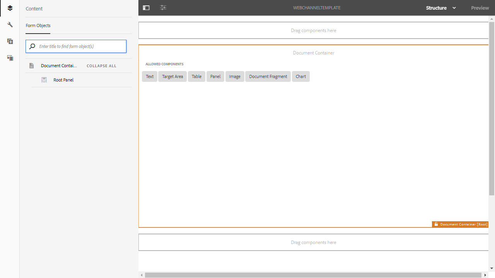

# Canale di stampa e canale web{#print-channel-and-web-channel}

Le comunicazioni interattive possono essere trasmesse attraverso due canali: stampa e web. Il canale di stampa viene utilizzato per creare PDF e comunicazioni su carta, ad esempio una lettera stampata come promemoria per il pagamento del premio assicurativo, mentre il canale web viene utilizzato per fornire esperienze online, ad esempio un estratto conto della carta di credito su un sito web.

Gli autori di comunicazioni interattive possono riutilizzare risorse quali frammenti di documento e immagini per creare versioni di comunicazione interattiva sia per la stampa che per il Web.

Uno dei prerequisiti per [Creazione di una comunicazione interattiva](../../forms/using/create-interactive-communication.md) è la disponibilità sul server dei modelli per la stampa e/o il canale web. Mentre gli autori di modelli creano il modello di canale web in AEM, il modello di canale di stampa XDP viene creato in Adobe Forms Designer e caricato sul server.

## Canale di stampa {#printchannel}

Il canale di stampa di una comunicazione interattiva utilizza il modello di modulo XFA, XDP. Un XDP è progettato in Adobe Forms Designer. Per ulteriori informazioni sulla creazione di modelli per canali di stampa, vedere [Progettazione layout](../../forms/using/layout-design-details.md). Per utilizzare un modello di canale di stampa nella comunicazione interattiva, è necessario caricare il modello sul server AEM Forms.

### Carica modello di canale di stampa di comunicazione interattiva {#upload-interactive-communication-print-channel-template}

Per caricare il modello, devi essere un membro del gruppo forms-user. Utilizza i seguenti passaggi per caricare il modello del canale di stampa (XDP) in AEM Forms:

1. Seleziona **[!UICONTROL Forms]** > **[!UICONTROL Forms &amp; Documents]**.

1. Tocca **[!UICONTROL Crea]** > **[!UICONTROL Caricamento file]**.

   Naviga e seleziona il modello di canale di stampa appropriato (XDP) e tocca **[!UICONTROL Apri]**.

## Canale web {#web-channel}

Gli autori e gli amministratori dei modelli possono creare, modificare e abilitare i modelli web. Per consentire ad altri utenti di creare modelli web, devi assegnare loro i diritti. Per ulteriori informazioni, consulta [Amministrazione di utenti, gruppi e diritti di accesso](/help/sites-administering/user-group-ac-admin.md).

### Creazione di un modello per il canale web {#authoring-web-channel-template}

Per creare un modello di canale web, devi innanzitutto creare una cartella Template. Dopo aver creato un modello Web all’interno di una cartella di modelli, è necessario abilitare il modello per consentire agli utenti dei moduli di creare un canale Web di una comunicazione interattiva basata sul modello.

Per creare un modello di canale web, completa i passaggi seguenti:

1. Crea una cartella Template per mantenere i modelli Web di comunicazione interattiva, se non ne hai già uno. Per ulteriori informazioni, consultare Cartelle dei modelli in [Modelli di pagina - Modificabili](/help/sites-developing/page-templates-editable.md).

   1. Tocca **[!UICONTROL Strumenti]**  > **[!UICONTROL Browser di configurazione]**.
      * Per ulteriori informazioni, consulta la documentazione [Browser configurazioni](/help/sites-administering/configurations.md) .
   1. Nella pagina Browser configurazioni, tocca **[!UICONTROL Crea]**.
   1. Nella finestra di dialogo Crea configurazione , specifica un titolo per la cartella, seleziona **[!UICONTROL Modelli modificabili]** e tocca **[!UICONTROL Crea]**.

      La cartella viene creata ed elencata nella pagina Browser configurazioni.

1. Passa alla cartella di modelli appropriata e crea un modello web.

   1. Passa alla cartella del modello appropriata selezionando **[!UICONTROL Strumenti]** > **[!UICONTROL Modelli]** > **`[Folder]`**.
   1. Tocca **[!UICONTROL Crea]**.
   1. Seleziona **[!UICONTROL Comunicazione interattiva - Canale web]** e tocca **[!UICONTROL Avanti]**.
   1. Immetti un titolo e una descrizione del modello, quindi tocca **[!UICONTROL Crea]**.

      Il modello viene creato e viene visualizzata una finestra di dialogo.

   1. Tocca **[!UICONTROL Apri]** per aprire il modello creato nell’editor modelli.

      Viene visualizzato l’Editor modelli.

      

      Quando si crea o si modifica un modello, è possibile definire diversi aspetti. La creazione o la modifica di un modello è simile alla creazione delle pagine. Per ulteriori informazioni, consulta Modifica di modelli - Autori di modelli in [Creazione di modelli di pagina](/help/sites-authoring/templates.md).

1. Per consentire l’utilizzo di questo modello per la creazione di comunicazioni interattive, abilita il modello .

   1. Tocca **[!UICONTROL Strumenti]**  > **[!UICONTROL Modelli]**.
   1. Passa al modello appropriato, selezionalo e tocca **[!UICONTROL Abilita]** e, nel messaggio di avviso, tocca **[!UICONTROL Abilita]**.

      Il modello è abilitato e il suo stato viene visualizzato come Abilitato. Ora puoi procedere alla creazione di una comunicazione interattiva in cui puoi utilizzare il modello di canale web appena creato.

### Canale di stampa come master per il canale web {#print-channel-as-master-for-web-channel}

Durante la creazione di una comunicazione interattiva, gli autori possono selezionare questa opzione per creare il canale web sincronizzato con il canale di stampa. L&#39;utilizzo del canale di stampa come master per il canale web garantisce che il contenuto, l&#39;ereditarietà e il binding dei dati del canale web siano derivati dal canale di stampa e le modifiche apportate nel canale di stampa potrebbero riflettersi nel canale web. Gli autori delle comunicazioni interattive possono tuttavia interrompere l’ereditarietà di componenti specifici nel canale web, a seconda delle necessità.

 

