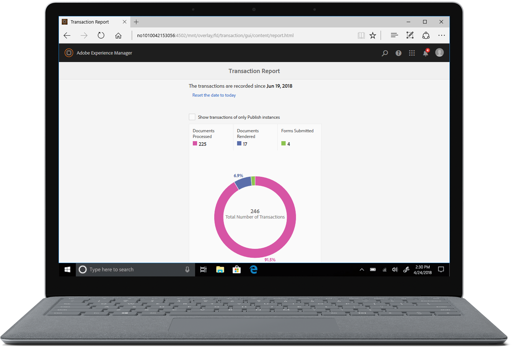

# Riepilogo delle nuove funzionalità | AEM 6.5 Forms{#new-features-summary-aem-forms}

## Rapporti sulle transazioni {#transaction-reports}

| Versione | Collegamento articolo |
| -------- | ---------------------------- |
| AEM as a Cloud Service | [Fai clic qui](https://experienceleague.adobe.com/docs/experience-manager-cloud-service/content/forms/forms-overview/latest-innovations.html) |
| AEM 6.5 | Questo articolo |

I rapporti sulle transazioni consentono di acquisire e registrare il numero di moduli inviati, documenti elaborati e documenti sottoposti a rendering. L&#39;obiettivo del tracciamento di queste transazioni è prendere una decisione informata sull&#39;utilizzo del prodotto e riequilibrare gli investimenti in hardware e software. Alcuni esempi di transazioni includono:

* Invio di un modulo adattivo, di un modulo HTML5 o di un set di moduli
* Rappresentazione di una stampa o versione web di una comunicazione interattiva
* Conversione di un documento da un formato di file a un altro

Per informazioni sulla configurazione e l&#39;utilizzo dei report sulle transazioni, vedere [Panoramica dei rapporti sulle transazioni](../../forms/using/transaction-reports-overview.md).

## Comunicazioni interattive {#interactive-communications}

**Definire i pattern di visualizzazione dei dati**

Gli autori delle comunicazioni interattive possono ora definire [pattern di visualizzazione dei dati](create-interactive-communication.md#datadisplaypatterns) per campi, variabili ed elementi del modello dati del modulo. Ad esempio, formati di data, valuta o telefono.

**Utilizzare nuovi tipi di grafici**

Ora puoi aggiungere [Grafici a quadrante con serie multiple](../../forms/using/chart-component-interactive-communications.md) alle comunicazioni interattive.

**Ordinare le colonne in una tabella**

Ora puoi [ordinare le colonne di una tabella](../../forms/using/create-interactive-communication.md#sortcolumns) nella comunicazione interattiva. È possibile associare e ordinare le colonne di una tabella a oggetti di testo statico o di modello dati.

**Utilizzare nuovi componenti in un canale web**

Ora puoi aggiungere i componenti Pulsante e Separatore al canale web. Per ulteriori informazioni, consulta [Aggiungi componente Pulsante al canale web](../../forms/using/create-interactive-communication.md#add-button-component-to-the-web-channel) e [Componente separatore nel canale web](../../forms/using/create-interactive-communication.md#separatorcomponent).

**Modalità Layout per ridimensionare i componenti**

Ora puoi passare a [Modalità Layout](../../forms/using/resize-using-layout-mode.md) per ridimensionare i componenti nel canale web utilizzando un’interfaccia WYSIWYG.

**Miglioramenti a livello di usabilità**

Gli autori delle comunicazioni interattive possono ora utilizzare varie operazioni di facile utilizzo durante la creazione di corrispondenze. L&#39;elenco delle operazioni comprende:

* [Eseguire azioni di annullamento e ripristino nei canali di stampa e web](../../forms/using/create-interactive-communication.md#undoredoactions)
* [Aggiungere variabili in un frammento di documento utilizzando il simbolo @](../../forms/using/texts-interactive-communications.md#searchvariables)
* [Aggiungere elementi del modello dati in un frammento di documento utilizzando il simbolo @](../../forms/using/texts-interactive-communications.md#searchdatamodelproperties)
* [Eliminare o aggiungere un canale web a una comunicazione interattiva esistente](../../forms/using/create-interactive-communication.md#edit-interactive-communication-properties)
* [Associare gli elementi dell’origine dati a campi e variabili mediante azioni di trascinamento della selezione](../../forms/using/create-interactive-communication.md#binddatasourceelements)
* [Evidenzia campi e variabili non associati durante la creazione di comunicazioni interattive](../../forms/using/create-interactive-communication.md#distinguishunboundfields)
* [Eseguire azioni aggiuntive come copiare, raggruppare o altro sui componenti ereditati in un canale web](../../forms/using/create-interactive-communication.md#componenttoolbar)

**Miglioramenti nel processo di sincronizzazione**

Sono stati apportati diversi miglioramenti al layout del canale web generato automaticamente utilizzando il canale Stampa.

## Moduli adattivi {#adaptive-forms}

### Utilizzare le firme digitali basate su cloud di Adobe Sign in Adaptive Forms {#use-adobe-sign-s-cloud-based-digital-signatures-in-adaptive-forms}

[Firme digitali basate su cloud](https://helpx.adobe.com/sign/kb/digital-certificate-providers.html) Le firme remote rappresentano una nuova generazione di firme digitali che funzionano su desktop, dispositivi mobili e web e soddisfano i massimi livelli di conformità e garanzia per l&#39;autenticazione dei firmatari. Ora puoi [firmare un modulo adattivo](../../forms/using/working-with-adobe-sign.md) con firme digitali basate su cloud.

#### Incorporare un modulo adattivo o una comunicazione interattiva nelle applicazioni a pagina singola di AEM Sites {#embed-an-adaptive-form-or-interactive-communcation-in-aem-sites-single-page-applications}

AEM Forms consente di: [incorporare facilmente un modulo adattivo](../../forms/using/embed-adaptive-form-aem-sites-spa.md) o comunicazione interattiva in un’applicazione AEM Sites a pagina singola (SPA). Il modulo adattivo e la comunicazione interattiva incorporati sono completamente funzionanti e gli utenti possono compilare e inviare il modulo senza uscire dalla pagina. Aiuta l’utente a rimanere nel contesto di altri elementi della pagina web e a interagire contemporaneamente con il modulo adattivo o la comunicazione interattiva.

#### Ordinare le colonne delle tabelle dei moduli adattivi {#sort-columns-of-adaptive-form-tables}

È possibile [ordinare le colonne di una tabella Modulo adattivo](../../forms/using/adaptive-forms-tables.md#sortcolumnstable) in ordine crescente o decrescente. È possibile applicare l&#39;ordinamento alle colonne di tabella con testo statico, proprietà di oggetti modello dati o una combinazione di testo statico e proprietà di oggetti modello dati.

#### Limitare la disponibilità di modelli di Forms adattivi a percorsi specifici {#restrict-the-availability-of-adaptive-forms-templates-to-specific-paths}

Ai moduli adattivi è stato aggiunto il supporto per la proprietà cq:allowedPaths. La proprietà [limita la disponibilità dei modelli di Forms adattivi a percorsi specifici](creating-adaptive-form.md#adaptive-form-templates).

#### Aggiungere dinamicamente le caselle di controllo al modulo adattivo {#add-check-boxes-to-the-adaptive-form-dynamically}

Ora puoi definire le regole da [aggiungere dinamicamente le caselle di controllo al modulo adattivo](../../forms/using/rule-editor.md#setpropertyrule) in base a una funzione personalizzata, un oggetto modulo o una proprietà oggetto.

## Flussi di lavoro AEM {#aem-workflows}

### Utilizzare le variabili nei flussi di lavoro AEM {#use-variables-in-aem-workflows}

Le variabili consentono ai passaggi del flusso di lavoro di conservare e trasmettere metadati tra i passaggi del flusso di lavoro in fase di esecuzione. Puoi creare diversi tipi di variabili per memorizzare diversi tipi di dati. Ad esempio, numeri interi, stringhe, documenti o istanze di modelli dati modulo. In genere, si utilizza una variabile o una raccolta di variabili quando è necessario prendere una decisione in base al valore in essa contenuto o per memorizzare le informazioni necessarie in un secondo momento di un processo.

Le variabili sono un’estensione di [MetaDataMap](https://helpx.adobe.com/experience-manager/6-5/sites/developing/using/reference-materials/javadoc/com/adobe/granite/workflow/metadata/MetaDataMap.html) disponibile nella versione precedente. Consente di risparmiare tempo dedicato allo sviluppo di codice ECMAScript personalizzato utilizzato per recuperare e aggiornare i valori dei metadati. Continuate a usare l&#39;interfaccia MetaDataMap e il codice ECMAScript per manipolare i metadati. Alcuni vantaggi dell’utilizzo delle variabili rispetto a MetaDataMap ed ECMAScript sono:

* Memorizza, aggiorna e utilizza in modo dinamico i valori memorizzati in una variabile nel flusso di lavoro senza fare affidamento sul codice personalizzato
* Recuperare e aggiornare i valori direttamente in un modello dati modulo e in un file dati (XML/JSON) di un modulo inviato
* Memorizzare i documenti completi in una variabile per eseguire l&#39;elaborazione dei documenti

Il passaggio Vai a, il passaggio di suddivisione OR e tutti i passaggi del flusso di lavoro di AEM Forms supportano le variabili. È possibile utilizzare l’interfaccia MetaDataMap per accedere alle variabili nei passaggi del flusso di lavoro che non dispongono di supporto nativo per le variabili. Per ulteriori informazioni, consulta [Variabili nei flussi di lavoro AEM](../../forms/using/variable-in-aem-workflows.md).

#### Utilizzare un flusso di lavoro con diversi Forms adattivi  {#use-a-workflow-with-different-adaptive-forms}

È possibile [specifica un modulo adattivo per l’attività di assegnazione](../../forms/using/aem-forms-workflow-step-reference.md#assign-task-step) e il passaggio del documento di record dei flussi di lavoro basati su moduli in fase di esecuzione. Consente a un flusso di lavoro di funzionare con diversi Forms adattivi. Puoi decidere il metodo di selezione di un modulo adattivo durante la progettazione del flusso di lavoro. Il modulo adattivo può trovarsi in un percorso assoluto, essere inviato come payload al flusso di lavoro o essere disponibile in un percorso calcolato utilizzando una variabile.

#### Utilizzare funzionalità di registrazione avanzate dei passaggi del flusso di lavoro incentrati sui moduli {#use-enhanced-logging-capabilities-of-forms-centric-workflow-steps}

Le funzionalità di registrazione dei passaggi del flusso di lavoro incentrati sui moduli sono standardizzate. Ora tutti i passaggi del flusso di lavoro incentrati su moduli producono registri standardizzati in modo simile. Consente di migliorare la velocità di debug.

## Integrazione dei dati {#data-integration}

Ora puoi:

* [Convalidare i dati di input](../../forms/using/work-with-form-data-model.md#automated-validation-of-input-data) in base a un elenco di vincoli. Consente di garantire che solo i dati validi vengano inviati all’origine dati.
* [Sostituisci endpoint predefinito](../../forms/using/configure-data-sources.md#configure-soap-web-services) definito in un file WSDL (Web Services Description Language).

* [Ignora predefinito](../../forms/using/configure-data-sources.md#configure-restful-web-services) [schema, host e percorso base](../../forms/using/configure-data-sources.md#configure-restful-web-services) definito nel file di definizione Swagger.

## Aggiornamenti alla piattaforma e alla sicurezza {#platform-and-security-updates}

### Aggiornamenti principali della piattaforma {#major-platform-updates}

AEM Forms può essere configurato utilizzando qualsiasi combinazione di sistemi operativi, server applicazioni, database, driver di database, JDK, server LDAP e server e-mail supportati. Di seguito sono riportate le principali modifiche apportate a [piattaforme supportate](../../forms/using/aem-forms-jee-supported-platforms.md):

<table>
 <tbody>
  <tr>
   <td>Componente</td>
   <td>Supporto rimosso</td>
  </tr>
  <tr>
   <td>Sistemi operativi</td>
   <td>
    <ul>
     <li>Microsoft Windows Server 2012 R2</li>
     <li>IBM AIX*</li>
     <li>Sun Solaris*</li>
    </ul> </td>
  </tr>
  <tr>
   <td>Server applicazioni  </td>
   <td>
    <ul>
    <li>Profilo WebSphere Liberty</li>
    <li>Oracle WebLogic</li>
    </ul> </td>
  </tr>
  <tr>
   <td>Database</td>
   <td>
    <ul>
     <li>IBM DB2   </li>
     <li>ORACLE RAC</li>
    </ul> </td>
  </tr>
  <tr>
   <td>Server LDAP</td>
   <td>
    <ul>
     <li>Microsoft Active Directory 2012</li>
     <li>Novell eDirectory 8.8.7 </li>
     <li>IBM Lotus Domino 8.5.0 </li>
    </ul> </td>
  </tr>
  <tr>
   <td>Server e-mail</td>
   <td>
    <ul>
     <li>IBM Lotus Domino 8.5.0 </li>
    </ul> </td>
  </tr>
  <tr>
   <td>Connettori</td>
   <td>
    <ul>
     <li>Connettore per Microsoft Sharepoint 2013</li>
     <li>Connettore per EMC Documentum 7.0</li>
    </ul> </td>
  </tr>
  <tr>
   <td>app AEM Forms  </td>
   <td>
    <ul>
     <li>Supporto di Windows 8.1</li>
    </ul> </td>
  </tr>
  <tr>
   <td>Java </td>
   <td>
    <ul>
     <li>Java 11</li>
    </ul> </td>
  </tr>
 </tbody>
</table>

&#42; Contatta l’Adobe di supporto per informazioni sulla migrazione a una piattaforma diversa

#### Nuove interfacce utente basate su HTML5 {#new-html-based-uis}

In linea con la fine del ciclo di vita pianificata per il Flash Player Adobe e la direzione generale della migrazione di contenuti basati su Flash a standard aperti, AEM 6.5 Forms ha sostituito l’interfaccia utente basata su Flash di Health Monitor, Process Management, Reader Extension e Category Management UI di AEM Forms su JEE Administration Console con l’interfaccia utente basata su HTML.

#### Miglioramenti di sicurezza {#security-improvements}

* L’interfaccia utente della console di amministrazione di Forms per AEM 6.5 su JEE è ora basata su Apache Struts 2.5.
* AEM 6.5 Forms ora utilizza jQuery alla versione 3.2.1 e jQuery UI 1.12.1. Vedi, [documentazione di aggiornamento](/help/forms/home.md) per l&#39;impatto della modifica.

#### Miglioramenti all’accessibilità {#accessibility-improvements}

AEM 6.5 Forms ha migliorato l’accessibilità di AEM Forms Workspace.
