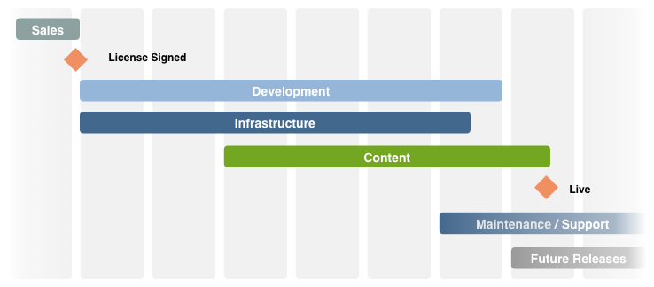

# Elenco di controllo - Altri riferimenti{#the-checklist-further-reference}

Questa pagina fornisce ulteriori dettagli per approfondire e/o integrare i documenti e i principi trattati da [Gestione dei progetti - Elenco di controllo delle best practice](/help/managing/best-practices.md).

## AEM - Cosa intendi utilizzare? {#aem-what-will-you-be-using}

>[!CAUTION]
>
>Gli elenchi di questa sezione secondaria non sono esaustivi, ma intesi come introduzione.

### Funzioni di AEM {#features-within-aem}

Quando implementi AEM (soprattutto la prima volta), controlla le [funzionalità e i flussi di lavoro di AEM](https://business.adobe.com/it/products/experience-manager/adobe-experience-manager.html) per verificare di quali aree necessiti o desideri usufruire.

Valuta le funzionalità di AEM che stai utilizzando e l&#39;impatto sul tuo progetto; ad esempio:

* [Commerce](/help/commerce/cif-classic/administering/ecommerce.md)
* [Screens](https://experienceleague.adobe.com/docs/experience-manager-screens/user-guide/aem-screens-introduction.html?lang=it)
* [Risorse](/help/assets/assets.md)
* [Tag](/help/sites-administering/tags.md)
* [Gestione multisito e traduzione](/help/sites-administering/msm-and-translation.md)
* [Forms](/help/forms/using/introduction-aem-forms.md)
* [Community](/help/communities/deploy-communities.md)

Controlla inoltre le [Note sulla versione](/help/release-notes/release-notes.md), relative alle varie versioni di AEM per vedere quando sono state aggiunte nuove funzionalità.

### Integrazioni {#integrations}

AEM può essere integrato con altri prodotti Adobe, con servizi di terze parti o con entrambi. Questi flussi di lavoro possono aumentare la potenza e la funzionalità a tua disposizione.

Per informazioni complete, consulta [Integrazione di soluzioni](/help/sites-administering/integration.md).

## Eseguire la migrazione o l’aggiornamento? {#migrate-or-upgrade}

Un aspetto importante da considerare è se desideri:

* Aggiorna l’installazione esistente.
* Eseguire la migrazione del contenuto dal sistema corrente a una nuova installazione.

Durante il passaggio da una versione precedente alla versione corrente, sono disponibili due opzioni:

* Utilizzare [Gestione pacchetti](/help/sites-administering/package-manager.md) per esportare tutto il contenuto e il codice dell’applicazione dal sistema precedente a quello nuovo.
* [Aggiornare](/help/sites-deploying/upgrade.md) il sistema precedente in uso. Questo metodo è in genere la scelta consigliata.

## Regole di base {#basic-ground-rules}

Come per qualsiasi progetto, è fondamentale stabilire regole di base il prima possibile. Alcune di queste sono:

>[!NOTE]
>
>Questi punti sono generici, l’[elenco di controllo delle best practice](/help/managing/best-practices.md) tratta le specifiche relative ad AEM.

* **Ruoli**

  I ruoli dovrebbero essere chiaramente definiti e resi noti a tutti coloro che sono coinvolti nel progetto. Inoltre, è opportuno evidenziare:

   * Responsabili decisionali
   * Punti di contatto

* **Responsabilità**

   * Per ogni ruolo, una chiara definizione delle responsabilità correlate al progetto aiuta a evitare confusione.

* **Coinvolgimento**

  Coinvolgendo al più presto le parti interessate, puoi incoraggiarle a diventare *stakeholder* nel progetto. Così facendo, aumenterebbe il loro impegno nel successo del progetto.

   * Per quanto riguarda la clientela, questo ruolo include gli autori che lavorano quotidianamente con il sistema
   * All’interno del team del progetto, questo coinvolgimento include anche le persone responsabili del controllo qualità. Maggiore è la loro comprensione delle esigenze della clientela, migliore sarà la pianificazione dei test.

* **Percorsi di comunicazione**

   * Sebbene i percorsi di comunicazione non debbano essere eccessivamente formalizzati, definizioni specifiche dovrebbero garantire che le persone chiave siano sempre informate e quindi aggiornate. Particolare attenzione dovrebbe essere prestata alla comunicazione con le parti esterne.

* **Processi**

  I processi definiti dipendono dal singolo progetto. Di nuovo, prova a mantenere questi processi semplici, tenendo in considerazione:

   * Definizione di processi (e percorsi di comunicazione) per interagire con terze parti; ad esempio, agenzie di progettazione e fornitori di software di terze parti, tra gli altri.
   * Spesso la clientela dispone di procedure e strumenti propri per la gestione dei progetti e il reporting.

* **Strumenti di tracciamento**

  Sono disponibili molti strumenti per il tracciamento di informazioni su bug, attività e altri aspetti del progetto. Per ulteriori dettagli, consulta [Panoramica sugli strumenti potenziali](#overview-of-potential-tools).

   * In questo caso, è importante conservare una sola copia delle informazioni e condividerle (e quindi accedere allo strumento utilizzato). Questo flusso di lavoro semplifica la manutenzione e aiuta a evitare discrepanze.

* **Ambito**

  Definisci con chiarezza gli elementi che devono essere coperti dal progetto ai vari livelli:

   * le singole versioni (se viene utilizzato un processo di rilascio iterativo e indipendentemente dal fatto che vengano consegnate alla clientela o al team di test interno).
   * il progetto AEM.
   * l’intero progetto, incluso qualsiasi software di terze parti, il loro impatto sui test, sui problemi organizzativi e molti altri.
   * Per alcuni aspetti, può essere utile anche indicare ciò che *non* rientra nell’ambito del progetto. Questa idea può aiutare a evitare confusione e supposizioni errate, anche se andrebbe limitata alle questioni essenziali.

* **Reporting**

  Definisci chiaramente quali informazioni desideri segnalare, in quale formato, con quale frequenza e a chi indirizzarle.

* **Terminologia**

   * Definisci eventuali abbreviazioni e/o terminologia specifica della clientela da utilizzare.

* **Ipotesi**

   * Definisci le ipotesi da effettuare.

Queste informazioni possono essere definite all’interno di un manuale di progetto; l’utilizzo di una Wiki può inoltre contribuire a garantire che le modifiche in corso vengano gestite in modo efficiente. Ovunque vengano definite tali ipotesi, i fattori chiave sono i seguenti:

* Le informazioni sono ben definite e gestite
* Le informazioni vengono comunicate in modo chiaro a tutte le persone coinvolte. Sebbene la gestione dei progetti sia una pratica standard, è sempre importante ribadire che una chiara definizione dei ruoli e una buona comunicazione possono essere determinanti per il successo o il fallimento di un progetto.
* Viene mantenuta una sola versione per ciascuna informazione tracciata, ad esempio nel caso del tracciamento di bug e problemi.

## Indicatori di prestazioni chiave e metriche di destinazione {#key-performance-indicators-and-target-metrics}

Le organizzazioni utilizzano gli indicatori chiave di prestazioni (KPI) per valutare i progressi nel raggiungimento degli obiettivi. Questi indicatori sono valori misurabili che servono a dimostrare l’efficacia con cui vengono raggiunti degli obiettivi specifici.

Possono essere:

* Azienda:

   * Utilizzato per misurare gli obiettivi aziendali chiave.
   * È importante scegliere i KPI appropriati per la propria azienda o scenario, con definizioni chiare di cosa rappresentano, come vengono misurati, utilizzati e da chi.

* Prestazioni:

   * Definisce come misurare le prestazioni del sistema.
   * Alcuni esempi includono il tempo di caricamento della pagina, il tempo di risposta del server e le prestazioni delle query sul database.

Certi indicatori, sebbene non tutti, possono basarsi su metriche di destinazione da te identificate e definite.

### Metriche di destinazione {#target-metrics}

Le metriche vengono utilizzate per definire misurazioni quantitative relative alla qualità del tuo sito web. In sostanza, costituiscono una definizione degli obiettivi prestazionali che desideri raggiungere e possono essere utilizzate per determinare i tuoi [KPI (indicatori prestazioni chiave)](#key-performance-indicators-and-target-metrics).

È possibile definire molte metriche, ma spesso quelle definite coprono obiettivi relativi a prestazioni e simultaneità. In particolare, fattori che possono essere difficili da quantificare e che sono spesso soggetti a valutazione *emotiva*:

* “oggi il sito web è *troppo lento*”: quando è possibile qualificarlo come *lento*?

* &quot;ogni volta che il mio collega effettua l’accesso, tutto *si blocca*”: quanti utenti simultanei possono essere supportati dal sistema?
* “quando eseguo una ricerca, il sistema *si blocca*”: quali richieste di ricerca stanno avendo un impatto sul sistema?
* “il download del file richiede *un’infinità di tempo*”: quali sono i tempi di download accettabili (in condizioni di rete normali)?

Le metriche di destinazione vengono definite all’inizio di un progetto per:

* indicare le dimensioni previste del sito web che puoi offrire
* indicare la qualità minima che desideri ottenere
* definire come vengono misurati questi fattori
* essere utilizzate come base per gli [indicatori di prestazioni chiave](#key-performance-indicators-and-target-metrics)

Come sempre, presta molta attenzione durante la definizione delle metriche di destinazione:

* se impostate su un valore troppo alto, potrebbero risultare irraggiungibili
* se impostate su un valore troppo basso, le fluttuazioni potrebbero non risultare in evidenza
* per garantirne una misurazione ripetibile e coerente
* per fornire un equilibrio tra i diversi fattori misurati
* certe metriche riguardano un ambiente di test, ma alcune dovrebbero riflettere scenari reali in quanto devono essere misurabili e riproducibili sul sito web di produzione
* assegnane la priorità in base al loro significato per il sito web
* limitale a un set che può essere monitorato

Durante lo sviluppo del progetto, possono essere aggiornate e regolate in modo appropriato. Una volta che il progetto è stato implementato correttamente, è possibile utilizzarle per controllare l’installazione e monitorare/mantenere i livelli di servizio richiesti per il funzionamento continuo.

Se utilizzate adeguatamente, queste metriche possono costituire un valido strumento; un utilizzo improprio, può comportare una distrazione e una perdita di tempo. Come sempre, è importante comprendere cosa stai misurando, come lo stai facendo e perché.

>[!NOTE]
>
>Questa sezione descrive i principi di base e le questioni da considerare. Ogni installazione è diversa, pertanto i valori effettivi da misurare tendono a differire.

### Tutto si basa sulla progettazione del progetto {#everything-rests-on-your-project-design}

Tutte le metriche misurate sono influenzate dalla progettazione complessiva. D’altra parte, molti problemi possono essere risolti al meglio con modifiche alla progettazione.

Pertanto, definisci le metriche di destinazione *prima* di decidere la progettazione. In questo modo è possibile ottimizzare la progettazione in base a questi fattori. Dopo aver sviluppato il progetto, è difficile rispettare i principi di progettazione di base.

Quando crei la struttura del sito web, segui la struttura consigliata per i siti web di AEM. Assicurati di comprendere i seguenti problemi e/o principi:

* Come strutturare il contenuto del sito web.
* Funzionamento di modelli e componenti.
* Come funziona la memorizzazione in cache.
* L’impatto dei contenuti personalizzati.
* Come opera la funzione di ricerca.
* Come utilizzare i CSS e le tecnologie correlate per creare codice HTML compatto e non ridondante.

Se ritieni che la tua progettazione non segua le linee guida o se non sei sicuro di certe implicazioni, chiarisci queste questioni. Agisci prima di avviare la fase di programmazione o di compilare il contenuto.

### Infrastruttura {#infrastructure}

Per definire o valutare l’infrastruttura, è utile definire valori di destinazione, quali:

* visitatori/giorno; sia media che picco
* hit/giorno; sia media che picco
* numero di pagine web rese disponibili
* volume di contenuti web

A seconda della situazione e dell’importanza strategica del sito web, definire l’infrastruttura può aiutarti nella valutazione e nelle scelte relative a questa:

* numero di server
* numero di istanze di AEM (authoring e pubblicazione)

### Prestazioni {#performance}

È possibile valutare diversi fattori di prestazione:

* tempi di risposta per singole pagine, tenendo conto di:

   * tempi di risposta in un ambiente di authoring
   * tempi di risposta nell’ambiente di pubblicazione

* tempi di risposta per le richieste di ricerca

Questa sezione può essere letta insieme a [Ottimizzazione delle prestazioni](/help/sites-deploying/configuring-performance.md), la quale approfondisce i dettagli tecnici relativi alla misurazione effettiva delle prestazioni.

#### Tempi di risposta per singole pagine {#response-times-for-individual-pages}

Un problema chiave è il tempo impiegato dal sito web per rispondere alle richieste dei visitatori.

Anche se questo valore varia per ogni richiesta, è possibile definire un valore target medio. Una volta dimostrato che questo valore è sia realizzabile che gestibile, può essere utilizzato per monitorare le prestazioni del sito web e indicare lo sviluppo di potenziali problemi

Destinazioni diverse per ambienti di authoring e pubblicazione

I tempi di risposta desiderati sono diversi per gli ambienti di authoring e pubblicazione, a seconda del pubblico target:

* **Ambiente di authoring**

  Questo ambiente viene utilizzato dagli autori che inseriscono e aggiornano il contenuto, pertanto deve:

   * considerare alcuni utenti che generano un numero elevato di richieste durante l’aggiornamento delle pagine di contenuto e dei singoli elementi in tali pagine
   * essere il più veloce possibile per massimizzare la loro produttività per ottenere i contenuti sul tuo sito web

* **Ambiente di pubblicazione**

  Questo ambiente contiene contenuti che rendi disponibili agli utenti:

   * la velocità è ancora fondamentale, ma è spesso più lenta rispetto a un ambiente di authoring
   * spesso vengono applicati meccanismi aggiuntivi per migliorare le prestazioni:

      * il contenuto è memorizzato in cache
      * viene applicato il bilanciamento del carico

#### Impostazione dei tempi di risposta target {#setting-target-response-times}

Come puoi decidere i tempi di risposta (medi) ottenibili? La domanda e la risposta sono spesso una questione di esperienza:

* esperienza sul sito web
* esperienza con AEM
* riconoscimento di pagine complesse con tempi di risposta superiori alla media (se possibile, queste pagine devono essere ottimizzate singolarmente)

Tuttavia, in circostanze controllate, possono essere applicate le seguenti linee guida:

* il 70% delle richieste di pagine dovrebbe rispondere in meno di 100 ms.
* Il 25% delle richieste di pagine dovrebbe rispondere in meno di 100-300 ms.
* Il 4% delle richieste di pagine dovrebbe rispondere in meno di 300-500 ms.
* L’1% delle richieste di pagine dovrebbe rispondere in meno di 500-1000 ms.
* Nessuna pagina deve rispondere a un tempo inferiore a 1 secondo.

I numeri di cui sopra presuppongono le seguenti condizioni:

* misurato al momento della pubblicazione (nessun ambiente di authoring e/o sovraccarico CFC)
* misurato sul server (nessun sovraccarico di rete)
* non memorizzato in cache (nessuna cache di output AEM, nessuna cache Dispatcher)
* solo per gli elementi complessi con molte dipendenze (HTML, JS, PDF, ...)
* nessun altro carico sul sistema

Esistono diversi meccanismi che è possibile utilizzare per monitorare i tempi di risposta:

* **Monitoraggio dei tempi di risposta con il request.log di AEM**

  Un buon punto di partenza per l’analisi delle prestazioni è il registro delle richieste. Tra le altre informazioni, puoi vedere i tempi di risposta delle singole richieste. Per ulteriori dettagli, consulta [Ottimizzazione delle prestazioni](/help/sites-deploying/configuring-performance.md).

* **Monitoraggio dei tempi di risposta con i commenti HTML**

  I commenti HTML possono essere utilizzati per includere informazioni sui tempi di risposta all’interno dell’origine di ciascuna pagina:

  `</body> </html>v <-- Page took 58 milliseconds to be rendered by the server --> Response times for search requests`

#### Richieste di ricerca {#search-requests}

Le richieste di ricerca possono avere un impatto significativo sul sito web, in termini sia di:

* Tempo di risposta della ricerca effettiva

   * Una funzione di ricerca rapida è un obiettivo di qualità per il tuo sito web

* Impatto sulle prestazioni generali

   * Poiché una funzione di ricerca deve analizzare sezioni (potenzialmente grandi) del contenuto o un indice estratto in modo speciale, questa capacità, se non ottimizzata, può influire sulle prestazioni dell’intero sistema

L’impostazione di target per le richieste di ricerca è, ancora una volta, una questione di esperienza che dipende da:

* esperienza di AEM
* una valutazione della frequenza con cui la ricerca viene utilizzata rispetto ad altri obiettivi
* gestore della persistenza
* indice di ricerca
* la complessità della funzione di ricerca; una funzione di ricerca di base che consente di inserire un termine di ricerca è più rapida di una ricerca avanzata che consente all’utente di creare istruzioni di ricerca complesse utilizzando AND/OR/NOT.

Queste richieste di ricerca devono essere pianificate e integrate fin dall’inizio del progetto. I meccanismi di monitoraggio disponibili comprendono:

* **Monitoraggio dei tempi di risposta delle ricerche con il request.log di AEM**

  Anche in questo caso il request.log può essere utilizzato per monitorare i tempi di risposta delle richieste di ricerca; per ulteriori dettagli, consulta [Ottimizzazione delle prestazioni](/help/sites-deploying/configuring-performance.md).

* **Meccanismi programmati per la misurazione dei tempi di risposta delle ricerche**

  Per personalizzare le informazioni raccolte sulle richieste di ricerca e sulle relative prestazioni, è consigliabile includere la raccolta di informazioni nel codice sorgente del progetto. Per ulteriori informazioni, consulta [Ottimizzazione delle prestazioni](/help/sites-deploying/configuring-performance.md).

### Simultaneità {#concurrency}

Rendi il tuo sito web disponibile a un certo numero di utenti e visitatori, sia nell’ambiente di authoring che in quello di pubblicazione. Tale numero è spesso superiore a quello utilizzato durante i test, oltre che variabile e difficile da prevedere. Progetta il tuo sito web per un numero medio di utenti e visitatori simultanei senza tener conto di un impatto negativo sulle prestazioni. Utilizza di nuovo `request.log` per eseguire test di concorrenza. Per ulteriori dettagli, consulta [Ottimizzazione delle prestazioni](/help/sites-deploying/configuring-performance.md).

Gli obiettivi per il numero di utenti simultanei dipendono dal tipo di ambiente:

* **Ambiente di authoring**

   * Di solito è possibile stimare con precisione il numero di utenti simultanei. Puoi sapere quanti autori hai in totale, anche se (probabilmente) non tutti sono attivi contemporaneamente.

* **Ambiente di pubblicazione**

   * L’ambiente di pubblicazione è più difficile da prevedere, pertanto è necessario selezionare un valore target. Anche in questo caso, dovrebbe basarsi sull’esperienza del tuo sito web attuale insieme alle aspettative realistiche del nuovo sito web.
   * Eventi speciali (ad esempio, quando pubblichi nuovi contenuti popolari) possono superare le aspettative o persino le funzionalità (come talvolta riportato dalla stampa quando i biglietti per determinati eventi sono resi disponibili per la vendita).

### Capacità e volume {#capacity-and-volume}

Prima di illustrare le metriche correlate, ecco una rapida definizione dei termini:

* **Volume**

   * La quantità di output elaborata e consegnata dal sistema.

* **Capacità**

   * La capacità del sistema di erogare il volume.
   * Ad ogni passaggio, la capacità e il volume vengono misurati in modo diverso, come illustrato nella tabella seguente. Per ottenere prestazioni ottimali, verifica che la capacità corrisponda al volume in ogni passaggio e che sia la capacità che il volume siano condivisi in tutti i passaggi. Ad esempio, puoi calcolare la navigazione nel computer client o inserirla nella cache, invece di calcolarla sul server per ogni richiesta.

* **Capacità e volume**

  | Cosa/Dove | Capacità | Volume |
  |---|---|---|
  | Client | Potenza di calcolo del computer dell’utente. | Complessità del layout della pagina. |
  | Rete | Larghezza di banda di rete. | Dimensione della pagina (codice, immagini e così via). |
  | Cache di Dispatcher | Memoria del server Web (memoria principale e disco rigido). | Server Web (memoria principale e disco rigido). Numero e dimensioni delle pagine memorizzate in cache. |
  | Cache di output | Memoria del server AEM (memoria principale e disco rigido). | Numero e dimensioni delle pagine nella cache di output, numero di dipendenze per pagina. La cache di Dispatcher abbassa questo volume. |
  | Server web | Potenza di elaborazione del server web. | Numero di richieste. La memorizzazione in cache abbassa questo volume. |
  | Modello | Potenza di elaborazione del server web. | Complessità dei modelli. |
  | Archivio | Prestazione dell’archivio. | Numero di pagine caricate dall’archivio. |

### Altre metriche {#other-metrics}

Le sezioni precedenti descrivono nel dettaglio le metriche principali da definire.

A seconda delle esigenze specifiche, potrebbe essere utile definire metriche aggiuntive, sia singolarmente che tenendo conto delle classificazioni di cui sopra.

Tuttavia, è preferibile disporre di un piccolo insieme di metriche accurate e fondamentali che funzionano in modo semplice e affidabile, piuttosto che cercare di misurare e definire ogni aspetto del sito web. Per sua stessa natura, il tuo sito web inizia a cambiare ed evolversi quando viene consegnato ai tuoi utenti.

## Protezione {#security}

La protezione è fondamentale e una sfida in continua crescita. ***Deve*** essere considerata e pianificata fin dalle prime fasi del progetto.

L’[elenco di controllo della protezione](/help/sites-administering/security-checklist.md) descrive i passaggi da eseguire per garantire la protezione dell’installazione di AEM al momento della distribuzione. Altri aspetti di protezione sono trattati in [Protezione (durante lo sviluppo)](/help/sites-developing/security.md) e [Amministrazione utente e protezione](/help/sites-administering/security.md).

## Attività parallele e iterative {#parallel-and-iterative-tasks}

>[!NOTE]
>
>Le seguenti:
>
>* Offre una panoramica relativa alla *prima* implementazione di un progetto AEM.
>* Si tratta di una panoramica astratta. Per informazioni su fasi, attività cardine e attività specifiche, consulta [Elenco di controllo progetti](/help/managing/best-practices.md).
>* Qualsiasi scala temporale è teorica.
>

Per una nuova implementazione di un progetto AEM standard, tieni presente attività quali:

* Consegna dal processo di vendita.
* Implementazione dell’applicazione del cliente (**Sviluppo**).
* Installazione e configurazione dell’infrastruttura (e dei processi correlati) nel sito del cliente (**Infrastruttura**).
* Creazione o migrazione del contenuto (**Contenuto**).
* Consegna alle operazioni (**Manutenzione/Supporto**).
* Versioni di follow-up.

Per tutti gli aspetti si raccomanda di utilizzare un approccio iterativo:

>[!NOTE]
>
>Per consentire la messa a punto, l’ottimizzazione e la formazione degli utenti in condizioni realistiche nell’ambiente di produzione, dividi il lancio del progetto in **Soft Launch** (disponibilità ridotta, più iterazioni) e **Hard Launch** (disponibilità completa - Live).

>[!NOTE]
>
>Consulta l’[elenco di controllo del progetto](/help/managing/best-practices.md) per esempi di attività da eseguire (o valutare) durante il ciclo di vita del progetto.

Alcuni punti da notare per ogni categoria sono:

* **Sviluppo**

   * Definisci prima l’architettura di base.
   * Utilizza diverse iterazioni (sprint) per lo sviluppo:

      * Primo sprint equivale al primo ciclo di sviluppo completo.
      * Il primo sprint determina la prima distribuzione nell’ambiente di test.
      * Ogni sprint ha un risultato eseguibile.
      * Ogni sprint ottiene una conclusione del cliente (minimo di test strutturati con feedback).

   * Pianifica l’eventualità di un aggiornamento della versione di AEM disponibile durante il progetto.
   * Pianifica i test e l’ottimizzazione durante gli sprint.
   * Pianifica le fasi di stabilizzazione e ottimizzazione.
   * Crea un registro di elementi da pianificare per le prossime versioni.
   * Pianifica il coinvolgimento e la consegna dei partner.

* **Infrastruttura**

   * Definisci prima l’architettura di base:

      * Definisci i requisiti delle prestazioni.
      * Definisci gli obiettivi delle prestazioni (ovvero, definisci chiaramente le aspettative).
      * Definisci l’architettura hardware e dell’infrastruttura, incluse le dimensioni.
      * Definisci la distribuzione.

   * Utilizza diverse iterazioni; per il primo sprint e la configurazione iniziale, prepara:

      * Ambiente di sviluppo.
      * Processo di sviluppo.
      * Ambiente di test.
      * Processo di distribuzione (inclusa la gestione della configurazione).

   * Pianifica diversi test di carico.
   * Pianifica i test e l’ottimizzazione durante gli sprint.
   * Pianifica una fase di stabilizzazione e ottimizzazione.
   * Distribuisci all’ambiente di produzione il prima possibile (fai in modo che il team operativo configuri il sistema per acquisire esperienza).
   * Utilizza il prima possibile utenti denominati e ruoli definiti.
   * Pianifica la formazione (ad esempio la formazione degli amministratori).
   * Pianifica la consegna alle operazioni.

* **Contenuto**

   * Architettura di base:
      * Sfrutta la gerarchia dei contenuti
      * Consente di definire il concetto di contenuto.
      * Definisce l’utilizzo e il layout di MSM.
      * Definisce ruoli, gruppi, flussi di lavoro e autorizzazioni.
   * Valuta se la creazione di pagine offline sia utile.
   * Pianifica la creazione anticipata di prime pagine e contenuti (da utilizzare nei test e nei feedback).
   * Pianifica la migrazione dei contenuti esistenti.
   * Pianifica la “migrazione in-sprint” dopo il refactoring.
   * Pianifica il “burndown dei contenuti” (mappa del sito per i contenuti pubblicati).

## Stima di tempo e impegno {#estimating-time-and-effort}

A seconda dell’elenco di attività risultante, è quindi possibile effettuare una stima iniziale del tempo e dell’impegno necessari per le definizioni di attività (di alto livello). Queste stime devono includere un’indicazione di chi (cliente o partner) fa cosa e quando.

L’elenco seguente mostra approssimazioni standard e interrelazioni di impegno coinvolte, e quindi costi:

>[!CAUTION]
>
>Questi calcoli possono essere utilizzati solo per stime iniziali. Uno sviluppatore AEM esperto deve effettuare l’analisi dettagliata.

| Fase | Tentativo |
|---|---|
| Sviluppo | Una stima approssimativa di 2-4 ore per ciascun nodo componente che copre tutti i requisiti di sviluppo. |
| Test sviluppatore | 15% dello sviluppo |
| Follow-up | 10% dello sviluppo |
| Documentazione | 15% dello sviluppo |
| Documentazione JavaDoc | 10% dello sviluppo |
| Correzione di bug | 15% dello sviluppo |
| Gestione progetto | 20% dei costi del progetto per una continua gestione e governance |

Una pianificazione dettagliata può quindi fare riferimento alle risorse disponibili o necessarie con le scadenze e i costi.

## Architettura di riferimento {#reference-architecture}

L’architettura di riferimento è fornita per offrire una soluzione modello per l’architettura AEM. L&#39;architettura di riferimento risolve i problemi più comuni dei sistemi aziendali, tra cui scalabilità, affidabilità e protezione.

È necessario definire le metriche del sito seguenti:

| Classificazione | Definizione |
|---|---|
| Numero di siti Internet |  |
| Numero di siti Intranet |  |
| Numero di basi di codice (ad esempio, se Internet e Intranet sono diversi) |  |
| Numero di singole pagine |  |
| Numero di visite del sito per giorno |  |
| Numero di visualizzazioni di pagina per giorno |  |
| Volume (in GB) di trasferimento dati per giorno |  |
| Numero di utenti simultanei (gruppo utenti chiuso) |  |
| Numero di visitatori simultanei (pubblicazione) |  |
| Numero di autori simultanei |  |
| Numero di autori registrati |  |
| Numero di attivazioni di pagina per giorno lavorativo |  |
| Numero di attivazioni di pagina durante la distribuzione |  |

## Panoramica dei potenziali strumenti {#overview-of-potential-tools}

Il seguente elenco fornisce informazioni sugli strumenti che possono essere utilizzati. Si tratta di un’introduzione, non di un elenco completo di consigli, e non dovrebbe scoraggiarti dall’utilizzare altri strumenti.

<table>
 <tbody>
  <tr>
   <td><strong>Prodotto</strong></td>
   <td><strong>Descrizione</strong></td>
  </tr>
  <tr>
   <td>AEM</td>
   <td>
AEM offre una serie di meccanismi per monitorare, testare, analizzare ed eseguire il debug dell’applicazione, tra cui:

    <ul>
     <li><a href="/help/sites-developing/developer-mode.md">Modalità Sviluppatore</a></li>
     <li>La <a href="/help/sites-developing/hobbes.md">Console di test</a></li>
     <li><a href="/help/sites-administering/operations-dashboard.md">Dashboard operazioni</a></li>
     <li><a href="/help/sites-authoring/content-insights.md">Approfondimenti contenuto</a></li>
     <li>La <a href="/help/sites-authoring/author-environment-tools.md#content-tree">Struttura contenuto</a></li>
    </ul> </td>
  </tr>
  <tr>
   <td> </td>
   <td> </td>
  </tr>
  <tr>
   <td>Selenium</td>
   <td><a href="https://www.selenium.dev/">Selenium</a> è uno strumento di test Open Source. I test vengono eseguiti direttamente nel browser, emulando il funzionamento degli utenti.</td>
  </tr>
  <tr>
   <td>Progetto Microsoft®</td>
   <td>Strumento di gestione dei progetti di uso comune.</td>
  </tr>
  <tr>
   <td>Jira</td>
   <td><a href="https://www.atlassian.com/software/jira">Jira</a> è uno strumento Open Source per il tracciamento e la gestione dei dettagli dei bug di software. I flussi di lavoro possono essere imposti sui dettagli del bug in base alle esigenze.</td>
  </tr>
  <tr>
   <td>Git</td>
   <td><a href="https://git-scm.com/">Git</a> è un software di controllo della revisione.</td>
  </tr>
  <tr>
   <td>Eclipse</td>
   <td>
Eclipse è un IDE Open Source, composto da vari progetti. Si concentra sulla creazione di una piattaforma di sviluppo aperta composta da framework estensibili, strumenti e runtime per la creazione, l’implementazione e la gestione del software durante l’intero ciclo di vita.
 
Consulta <a href="/help/sites-developing/howto-projects-eclipse.md">Come sviluppare progetti AEM utilizzando Eclipse</a> per ulteriori informazioni.
 </td>
  </tr>
  <tr>
   <td>IntelliJ</td>
   <td>
Un IDE professionale (e quindi soggetto a costi di licenza) che offre una gamma completa di funzioni. 
 
Per ulteriori informazioni, scopri <a href="/help/sites-developing/ht-intellij.md">come sviluppare progetti AEM utilizzando IntelliJ IDEA</a>.
 </td>
  </tr>
  <tr>
   <td>Maven</td>
   <td><a href="https://maven.apache.org/">Maven</a> è uno strumento software di gestione e comprensione dei progetti che consente di gestire il processo di compilazione di un progetto (software e documentazione).</td>
  </tr>
 </tbody>
</table>

## Ulteriori informazioni {#further-reading}

Sono inoltre di particolare interesse le seguenti sezioni:

* [Guida introduttiva](/help/sites-deploying/deploy.md#getting-started)
* [Requisiti tecnici](/help/sites-deploying/technical-requirements.md)
* [Monitoraggio e manutenzione dell’istanza](/help/sites-deploying/monitoring-and-maintaining.md)

### Best practice {#best-practices}

Adobe fornisce ulteriori best practice per tutte le fasi e per tutti i tipi di pubblico:

* [Implementazione](/help/sites-deploying/best-practices.md)
* [Authoring](/help/sites-authoring/best-practices.md)
* [Amministrazione](/help/sites-administering/administer-best-practices.md)
* [Sviluppo](/help/sites-developing/best-practices.md)
* [Gestione progetto](/help/managing/best-practices.md)
