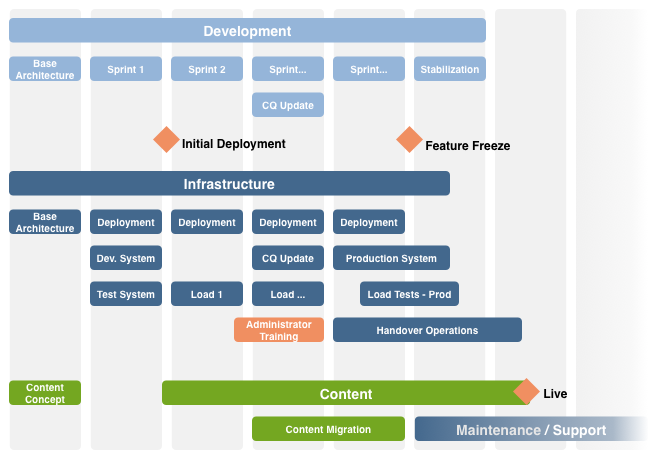

# Elenco di controllo - Ulteriori riferimenti{#the-checklist-further-reference}

Questa pagina fornisce ulteriori dettagli per approfondire e/o integrare i documenti e i principi coperti da [Gestione dei progetti - Lista di controllo delle best practice](/help/managing/best-practices.md).

## AEM - Cosa userai? {#aem-what-will-you-be-using}

>[!CAUTION]
>
>Gli elenchi di questa sottosezione non sono esaustivi, ma sono intesi come introduzione.

### Funzioni in AEM {#features-within-aem}

Quando implementi AEM (in particolare per la prima volta), rivedi il [capacità e flussi di lavoro di AEM](https://business.adobe.com/products/experience-manager/adobe-experience-manager.html) per essere sicuri di quali aree desideri o di cui hai bisogno.

Considera le caratteristiche dell’AEM in uso e l’impatto sulla progettazione; ad esempio:

* [Commerce](/help/commerce/cif-classic/administering/ecommerce.md)
* [Screens](https://experienceleague.adobe.com/docs/experience-manager-screens/user-guide/aem-screens-introduction.html?lang=it)
* [Risorse](/help/assets/assets.md)
* [Tag](/help/sites-administering/tags.md)
* [Gestione e traduzione multisito](/help/sites-administering/msm-and-translation.md)
* [Forms](/help/forms/home.md)
* [Communities](/help/communities/deploy-communities.md)

Inoltre, controlla il [Note sulla versione](/help/release-notes/release-notes.md), per le varie versioni di AEM, per vedere quando sono state aggiunte nuove funzioni.

### Integrazioni {#integrations}

AEM può essere integrato con altri prodotti Adobe, con servizi di terze parti o con entrambi. Questi flussi di lavoro possono aumentare la potenza e le funzionalità a tua disposizione.

Vedi [Integrazione di soluzioni](/help/sites-administering/integration.md) per informazioni complete.

## Migrazione o aggiornamento? {#migrate-or-upgrade}

È importante considerare se si desidera:

* Aggiorna l&#39;installazione esistente.
* Eseguire la migrazione del contenuto dal sistema corrente a una nuova installazione.

Quando si passa da una versione precedente alla versione corrente, sono disponibili due opzioni:

* Utilizza la [Gestione pacchetti](/help/sites-administering/package-manager.md) per esportare tutti i contenuti e il codice dell&#39;applicazione dal vecchio sistema a quello nuovo.
* [Aggiornamento](/help/sites-deploying/upgrade.md) il vecchio sistema sul posto. Questo metodo è in genere la scelta consigliata.

## Regole base di messa a terra {#basic-ground-rules}

Come per qualsiasi progetto, è fondamentale stabilire al più presto regole di base. Queste regole includono:

>[!NOTE]
>
>Questi punti sono generici, [Lista di controllo delle best practice](/help/managing/best-practices.md) si occupa delle specifiche in relazione alle AEM.

* **Ruoli**

   I ruoli devono essere chiaramente definiti e resi noti a tutti coloro che partecipano al progetto. Inoltre, è opportuno evidenziare:

   * Responsabili decisionali
   * Punti di contatto

* **Responsabilità**

   * Per ogni ruolo, una definizione chiara delle responsabilità relative al progetto aiuta a evitare confusione.

* **Partecipazione**

   Coinvolgendo al più presto le parti interessate, puoi incoraggiarle a diventare *parti interessate* nel progetto. In questo modo il loro impegno per il successo aumenta.

   * Dal lato del cliente, questo ruolo include gli autori che lavorano quotidianamente con il sistema
   * All&#39;interno del team di progetto, questo coinvolgimento include anche le persone responsabili della garanzia della qualità. Più capiscono i requisiti del cliente, meglio possono pianificare i test.

* **Percorsi di comunicazione**

   * Sebbene i percorsi di comunicazione non debbano essere formalizzati eccessivamente, definizioni specifiche dovrebbero garantire che le persone chiave siano sempre informate e quindi aggiornate. Occorre prestare particolare attenzione alla comunicazione con le parti esterne.

* **Processi**

   I processi definiti dipendono dal singolo progetto. Di nuovo, cerca di mantenere semplici questi processi, tenendo conto di:

   * definire i processi (e i percorsi di comunicazione) per interagire con terzi; ad esempio, agenzie di progettazione e fornitori di software di terze parti, tra gli altri.
   * Spesso il cliente ha le proprie procedure e strumenti di Project Management e reporting.

* **Strumenti di tracciamento**

   Sono disponibili molti strumenti per monitorare le informazioni su bug, attività e altri aspetti del progetto - consulta [Panoramica dei potenziali strumenti](#overview-of-potential-tools) per ulteriori dettagli.

   * Il punto chiave da notare qui è quello di conservare una sola copia delle informazioni e condividere le informazioni (e quindi l&#39;accesso allo strumento in uso). Questo flusso di lavoro facilita la manutenzione e aiuta a evitare discrepanze.

* **Ambito**

   Definire chiaramente a vari livelli quali saranno i temi del progetto:

   * le singole versioni (se viene utilizzato un processo di rilascio iterativo e indipendentemente dal fatto che siano consegnate ai clienti o al team di test interno).
   * il progetto AEM.
   * l&#39;intero progetto; compresi eventuali software di terze parti, il loro impatto sui test, problemi organizzativi e molti altri.
   * Per alcuni aspetti, può anche essere utile indicare ciò che è *not* nell&#39;ambito del progetto. Questa idea può aiutare a prevenire confusione e ipotesi errate, anche se dovrebbe essere limitata a questioni essenziali.

* **Reporting**

   Definire chiaramente quali informazioni si desidera segnalare, in quale forma, con quale frequenza e a chi.

* **Terminologia**

   * Definire le abbreviazioni e/o la terminologia specifica del cliente da utilizzare.

* **Ipotesi**

   * Definire le ipotesi da fare.

Tali informazioni possono essere definite all&#39;interno di un manuale del progetto; l&#39;utilizzo di un Wiki può anche contribuire a garantire che i cambiamenti in corso siano gestiti in modo efficiente. Ovunque siano definite queste ipotesi, i fattori principali sono i seguenti:

* Le informazioni sono definite e mantenute
* Le informazioni vengono comunicate chiaramente a tutte le persone coinvolte. Anche se la gestione standard dei progetti non può essere ripetuta abbastanza spesso che una definizione chiara del ruolo e una buona comunicazione possono rendere o interrompere un progetto.
* Viene conservata una sola versione di tutte le informazioni che vengono tracciate; ad esempio, tracciamento dei bug e problemi.

## Indicatori delle prestazioni chiave e metriche di Target {#key-performance-indicators-and-target-metrics}

Le organizzazioni utilizzano indicatori di prestazioni chiave (KPI, Key Performance Indicators) per valutare il loro successo nel raggiungimento degli obiettivi. Questi indicatori sono valori misurabili che possono essere utilizzati per dimostrare l&#39;efficacia del conseguimento di obiettivi specifici.

Questi indicatori possono essere:

* Economia:

   * Utilizzato per misurare gli obiettivi aziendali chiave.
   * È importante scegliere KPI appropriati per la tua attività/scenario con definizioni chiare di cosa sono, come vengono misurati, come vengono utilizzati e da chi.

* Prestazioni:

   * Definire come misurare le prestazioni del sistema.
   * Alcuni esempi includono il tempo di caricamento della pagina, il tempo di risposta del server e le prestazioni delle query del database.

Alcuni indicatori, ma non tutti, possono essere basati sulle metriche di destinazione identificate e definite.

### Metriche di Target {#target-metrics}

Le metriche vengono utilizzate per definire misurazioni quantitative per la qualità del sito web. Si tratta fondamentalmente di una definizione degli obiettivi prestazionali che desideri raggiungere e che può essere utilizzata per definire il tuo [Indicatori prestazioni chiave (KPI)](#key-performance-indicators-and-target-metrics).

È possibile definire molte metriche, ma spesso quelle definite coprono gli obiettivi di prestazioni e concorrenza. In particolare, fattori che possono essere difficili da quantificare e che sono spesso soggetti a *emotivo* valutazione:

* &quot;Il sito web è *troppo lento* oggi&quot; - quando *lento* qualificarsi?

* &quot;tutto *si arresta* quando il mio collega accede&quot; - quanti utenti simultanei possono supportare il sistema?
* &quot;quando eseguo una ricerca, il sistema *si arresta* &quot; - quali richieste di ricerca influiscono sul sistema?
* &quot;ci vuole *età* per scaricare il file&quot; - quali sono i tempi di download accettabili (in condizioni di rete normali)?

Le metriche di Target sono definite all&#39;inizio di un progetto per:

* indicano le dimensioni previste del sito web che puoi offrire
* indicare la qualità minima che si desidera ottenere
* definire le modalità di misurazione di questi fattori
* sono utilizzati come base per [Indicatori prestazioni chiave](#key-performance-indicators-and-target-metrics)

Quando definisci le metriche target, devi sempre fare attenzione:

* se sono troppo alti possono essere irraggiungibili
* se le fluttuazioni sono troppo basse non possono essere evidenziate
* per garantire che possano essere misurati ripetutamente e in modo coerente
* per fornire un equilibrio tra i diversi fattori da misurare
* alcune metriche si riferiscono a un ambiente di test, ma alcune dovrebbero riflettere scenari reali in quanto devono essere misurabili e riproducibili sul sito web di produzione
* dare priorità alle metriche in base alla loro importanza per il sito web
* limitare le metriche a un set che può essere monitorato

Durante lo sviluppo del progetto, possono essere aggiornati e sintonizzati secondo necessità. Una volta che il progetto è stato implementato con successo, è possibile utilizzarlo per controllare l’installazione e monitorare/mantenere i livelli di servizio richiesti per il funzionamento continuo.

Se utilizzate correttamente, queste metriche possono fornire uno strumento utile; se usati in modo irresponsabile possono essere una distrazione che perde tempo. Come sempre, capite cosa state misurando, come lo state misurando e perché.

>[!NOTE]
>
>Questa sezione illustra i principi fondamentali e le questioni da considerare. Ogni installazione è diversa, quindi i valori effettivi da misurare tendono a differire.

### Tutto dipende dalla progettazione del progetto {#everything-rests-on-your-project-design}

Tutte le metriche misurate sono influenzate dalla progettazione del progetto. Al contrario, molti problemi sono risolti al meglio con le modifiche alla progettazione.

Di conseguenza, definisci le metriche di destinazione *prima* decidere il tuo design. In questo modo puoi ottimizzare il design in base a questi fattori. Una volta sviluppato il progetto, i principi di progettazione di base sono difficili.

Quando crei la struttura per il sito web, segui la struttura consigliata per AEM siti web. Assicurati di comprendere i seguenti problemi e/o principi:

* Come strutturare il contenuto del sito web.
* Funzionamento di modelli e componenti.
* Come funziona il caching?
* L’impatto dei contenuti personalizzati.
* Funzionamento della funzione di ricerca.
* Come utilizzare CSS e tecnologie correlate per creare codice HTML compatto e non ridondante.

Se ritieni che il tuo design non segua le linee guida o se non sei sicuro di alcune delle implicazioni, chiarisci questi problemi. Eseguite questa operazione prima di iniziare la fase di programmazione o di riempire il contenuto.

### Infrastruttura {#infrastructure}

Per definire o valutare l’infrastruttura, contribuisce a definire valori di destinazione quali:

* visitatori/giorno; media e picco
* hit/giorno; media e picco
* numero di pagine web rese disponibili
* volume di contenuti web

A seconda della tua situazione e del significato strategico del sito web, la definizione dell&#39;infrastruttura può aiutarti a valutare e scegliere l&#39;infrastruttura:

* numero di server
* numero di istanze AEM (autore e pubblicazione)

### Prestazioni {#performance}

È possibile valutare diversi fattori di prestazione:

* tempi di risposta per le singole pagine, tenendo conto di:

   * tempi di risposta in un ambiente di authoring
   * tempi di risposta nell’ambiente di pubblicazione

* tempi di risposta per le richieste di ricerca

Questa sezione può essere letta con [Ottimizzazione delle prestazioni](/help/sites-deploying/configuring-performance.md) che amplia i dettagli tecnici della misurazione effettiva delle prestazioni.

#### Tempi di risposta per le singole pagine {#response-times-for-individual-pages}

Un problema chiave è il tempo impiegato dal sito web per rispondere alle richieste dei visitatori.

Anche se questo valore varia per ogni richiesta, è possibile definire un valore target medio. Una volta dimostrato che questo valore è raggiungibile e maneggevole, può essere utilizzato per monitorare le prestazioni del sito web e indicare lo sviluppo di potenziali problemi

Destinazioni diverse negli ambienti di authoring e pubblicazione

I tempi di risposta desiderati negli ambienti di authoring e pubblicazione sono diversi, in base al pubblico di destinazione:

* **Ambiente di authoring**

   Questo ambiente viene utilizzato dagli autori che immettono e aggiornano i contenuti, pertanto deve:

   * soddisfa alcuni utenti che generano un numero elevato di richieste durante l’aggiornamento delle pagine di contenuto e dei singoli elementi di tali pagine
   * essere il più veloce possibile per massimizzare la loro produttività per inserire i contenuti nel sito web

* **Ambiente di pubblicazione**

   Questo ambiente contiene contenuti che puoi rendere disponibili agli utenti:

   * La velocità rimane fondamentale, ma è spesso più lenta dell’ambiente di authoring
   * vengono spesso applicati ulteriori meccanismi di miglioramento delle prestazioni:

      * il contenuto è memorizzato nella cache
      * si applica il bilanciamento del carico

#### Impostazione dei tempi di risposta target {#setting-target-response-times}

Come puoi decidere i tempi di risposta raggiungibili (medi)? La domanda e la risposta sono spesso una questione di esperienza:

* esperienza sul sito web
* esperienza con AEM
* riconoscimento di pagine complesse con tempi di risposta superiori alla media (se possibile, queste pagine devono essere ottimizzate singolarmente)

Tuttavia, in circostanze controllate, possono essere applicate le seguenti linee guida:

* Il 70% delle richieste di pagine deve rispondere in meno di 100 ms.
* Il 25% delle richieste di pagine deve rispondere in meno di 100ms-300ms.
* Il 4% delle richieste di pagine deve rispondere in meno di 300 ms-500 ms.
* L’1% delle richieste di pagine deve rispondere in meno di 500 ms-1000 ms.
* Nessuna pagina deve rispondere più lentamente di 1 secondo.

I numeri di cui sopra presuppongono le seguenti condizioni:

* misurati al momento della pubblicazione (nessun ambiente di authoring e/o sovraccarico CFC)
* misurati sul server (senza sovraccarico di rete)
* non memorizzato in cache (nessuna cache di output AEM, nessuna cache del Dispatcher)
* solo per elementi complessi con molte dipendenze (HTML, JS, PDF, ...)
* nessun altro carico sul sistema

Sono disponibili diversi meccanismi che puoi utilizzare per monitorare i tempi di risposta:

* **Monitoraggio dei tempi di risposta con AEM request.log**

   Un buon punto di partenza per l’analisi delle prestazioni è il registro delle richieste. Ad esempio, puoi vedere i tempi di risposta delle singole richieste. Vedi [Ottimizzazione delle prestazioni](/help/sites-deploying/configuring-performance.md) per ulteriori dettagli.

* **Monitoraggio dei tempi di risposta con i commenti di HTML**

   I commenti di HTML possono essere utilizzati per includere informazioni sui tempi di risposta all’interno dell’origine di ogni pagina:

   `</body> </html>v <-- Page took 58 milliseconds to be rendered by the server --> Response times for search requests`

#### Richieste di ricerca {#search-requests}

Le richieste di ricerca possono avere un impatto significativo sul sito web, in termini di:

* Tempo di risposta della ricerca effettiva

   * Una funzione di ricerca rapida è un obiettivo di qualità per il tuo sito web

* Impatto sulle prestazioni generali

   * Poiché una funzione di ricerca deve analizzare (potenzialmente grandi) sezioni del contenuto, o un indice appositamente estratto, questa capacità può influire sulle prestazioni dell&#39;intero sistema, se non ottimizzata

L’impostazione dei target per le richieste di ricerca è, ancora una volta, una questione di esperienza a seconda:

* esperienza di AEM
* una valutazione della frequenza con cui viene utilizzata la ricerca rispetto ad altri obiettivi
* il tuo responsabile della persistenza
* l&#39;indice di ricerca
* la complessità della funzione di ricerca; una funzione di ricerca di base che consente di inserire un termine di ricerca, è più rapida di una ricerca avanzata che consente all’utente di creare istruzioni di ricerca complesse utilizzando AND/OR/NOT.

Queste richieste di ricerca devono essere pianificate e integrate fin dall’inizio del progetto. I meccanismi disponibili per il monitoraggio comprendono:

* **Monitoraggio dei tempi di risposta della ricerca con AEM request.log**

   Anche in questo caso, request.log può essere utilizzato per monitorare i tempi di risposta per le richieste di ricerca; vedere [Ottimizzazione delle prestazioni](/help/sites-deploying/configuring-performance.md) per ulteriori dettagli.

* **Meccanismi programmati per misurare i tempi di risposta alla ricerca**

   Per personalizzare le informazioni raccolte sulle richieste di ricerca e le relative prestazioni, è consigliabile includere la raccolta di informazioni nel codice sorgente del progetto; vedere [Ottimizzazione delle prestazioni](/help/sites-deploying/configuring-performance.md) per ulteriori dettagli.

### Concorrenza {#concurrency}

Rendi il tuo sito web disponibile ad alcuni utenti e visitatori, sia negli ambienti di authoring che di pubblicazione. I numeri sono spesso più di quelli utilizzati durante il test, ma anche fluttuanti e difficili da prevedere. Progetta il tuo sito web per un numero medio di utenti e visitatori simultanei senza notare un impatto negativo sulle prestazioni. Di nuovo, utilizza `request.log` per eseguire test di concorrenza. Vedi [Ottimizzazione delle prestazioni](/help/sites-deploying/configuring-performance.md) per ulteriori dettagli.

I target per il numero di utenti simultanei dipendono dal tipo di ambiente:

* **Ambiente di authoring**

   * Di solito il numero di utenti simultanei può essere stimato con precisione. Puoi sapere quanti autori hai in totale, anche se (probabilmente) non tutti sono attivi allo stesso tempo.

* **Ambiente di pubblicazione**

   * L’ambiente di pubblicazione è più difficile da prevedere, quindi devi selezionare un valore di destinazione. Anche in questo caso, dovrebbe essere basato sull&#39;esperienza del tuo sito web attuale insieme alle aspettative realistiche del tuo nuovo sito web.
   * Eventi speciali (ad esempio, quando pubblichi nuovi contenuti popolari) possono superare le aspettative - o addirittura le capacità (come talvolta riportato sulla stampa quando i biglietti per alcuni eventi sono messi a disposizione per la vendita).

### Capacità e volume {#capacity-and-volume}

Prima di discutere le metriche correlate, una rapida definizione dei termini:

* **Volume**

   * La quantità di output elaborata e consegnata dal sistema.

* **Capacità**

   * La capacità del sistema di fornire il volume.
   * Ad ogni passo, la capacità e il volume vengono misurati in modo diverso, come illustrato nella tabella seguente. Per ottenere le migliori prestazioni, assicurati che la capacità corrisponda al volume in ogni fase e che sia la capacità che il volume siano condivisi in tutti i passaggi. Ad esempio, puoi calcolare la navigazione sul computer client o inserirla nella cache, invece di calcolarla sul server per ogni richiesta.

* **Capacità e volume**

   | Cosa / Dove | Capacità | Volume |
   |---|---|---|
   | Client | Potenza computazionale del computer dell&#39;utente. | Complessità del layout di pagina. |
   | Rete | Larghezza di banda della rete. | Dimensioni della pagina (codice, immagini e così via). |
   | Cache del dispatcher | Memoria server del server Web (memoria principale e disco rigido). | Server web (memoria principale e disco rigido). Numero e dimensione delle pagine memorizzate nella cache. |
   | Cache di output | Memoria server del server AEM (memoria principale e disco rigido). | Numero e dimensione delle pagine nella cache di output, il numero di dipendenze per pagina. La cache del Dispatcher riduce questo volume. |
   | Server web | Potenza computazionale del server web. | Numero di richieste. La memorizzazione in cache abbassa questo volume. |
   | Modello | Potenza computazionale del server web. | Complessità dei modelli. |
   | Archivio | Prestazioni dell’archivio. | Numero di pagine caricate dal repository. |

### Altre metriche {#other-metrics}

Nelle sezioni precedenti sono descritte le metriche principali da definire.

A seconda dei requisiti specifici, potrebbe essere utile definire metriche aggiuntive, isolatamente o tenendo conto delle classificazioni di cui sopra.

Tuttavia, è preferibile avere un piccolo set di metriche di base precise che funzionino facilmente e in modo affidabile, invece di cercare di misurare e definire ogni aspetto del sito web. Per sua stessa natura, il tuo sito web inizia a cambiare ed evolvere quando viene consegnato ai tuoi utenti.

## Sicurezza {#security}

La sicurezza è fondamentale e una sfida in continua crescita. It ***deve*** essere considerati e pianificati fin dalle prime fasi del progetto.

La [Lista di controllo sicurezza](/help/sites-administering/security-checklist.md) descrive i passaggi da seguire per garantire che l’installazione AEM sia sicura quando distribuita. Gli altri aspetti relativi alla sicurezza sono trattati nella [Sicurezza (durante lo sviluppo)](/help/sites-developing/security.md) e [Amministrazione degli utenti e sicurezza](/help/sites-administering/security.md).

## Attività parallele e iterative {#parallel-and-iterative-tasks}

>[!NOTE]
>
>quanto segue:
>
>* Offre una panoramica relativa al *first* attuazione di un progetto AEM.
>* è inteso come una panoramica astratta; vedi [Elenco di controllo del progetto](/help/managing/best-practices.md) per fasi/tappe/attività specifiche.
>* Ogni scala temporale è teorica.
>

Per una nuova implementazione di un progetto AEM standard, considera attività quali:

* Consegna dal processo di vendita.
* Implementazione della domanda del cliente (**Sviluppo**).
* Installazione e configurazione dell&#39;infrastruttura (e dei relativi processi) sul sito del cliente (**Infrastruttura**).
* Creazione (o migrazione) del contenuto (**Contenuto**).
* Passaggio alle operazioni (**Manutenzione e supporto**).
* Segui le versioni.

Per tutti gli aspetti si consiglia di utilizzare un approccio iterativo:

>[!NOTE]
>
>Per ottimizzare, ottimizzare e migliorare la formazione degli utenti in condizioni realistiche nell&#39;ambiente di produzione, suddividi il lancio del progetto in **Lancio morbido** (disponibilità ridotta, iterazioni multiple) e **Lancio rigido** (disponibilità completa - Live).

>[!NOTE]
>
>Consulta la sezione [Elenco di controllo del progetto](/help/managing/best-practices.md) per esempi di attività da eseguire (o valutare) durante il ciclo di vita del progetto.

Alcuni punti da notare per ciascuna categoria sono:

* **Sviluppo**

   * Definisci prima l&#39;architettura di base.
   * Utilizza diverse iterazioni (sprint) per lo sviluppo:

      * Il primo scatto equivale al primo ciclo di sviluppo completo.
      * Il primo sprint si traduce nella prima distribuzione nell’ambiente di test.
      * Ogni scatto ha un risultato scorrevole.
      * Ogni sprint ottiene una conclusione da parte del cliente (minimo di test strutturato con feedback).
   * Pianifica l’eventuale aggiornamento della versione AEM disponibile durante il progetto.
   * Pianificare test e ottimizzazione durante gli spruzzi.
   * Piano delle fasi di stabilizzazione e ottimizzazione.
   * Crea un registro di elementi da pianificare per ulteriori versioni.
   * Pianificare il coinvolgimento e la consegna dei partner.

* **Infrastruttura**

   * Definisci prima l&#39;architettura di base:

      * Definire i requisiti di prestazioni.
      * Definire obiettivi prestazionali (ovvero definire chiaramente le aspettative).
      * Definire l&#39;architettura dell&#39;hardware e dell&#39;infrastruttura; compreso il dimensionamento.
      * Definire la distribuzione.
   * Utilizzare diverse iterazioni; per la preparazione della prima velocità e della configurazione iniziale:

      * Ambiente di sviluppo.
      * Processo di sviluppo.
      * Ambiente di test.
      * Processo di distribuzione (compresa la gestione della configurazione).
   * Pianificare diversi test di carico.
   * Pianificare test e ottimizzazione durante gli spruzzi.
   * Pianificare una fase di stabilizzazione e ottimizzazione.
   * Distribuire all&#39;ambiente di produzione il prima possibile (lasciare che il team operativo configuri il sistema per acquisire esperienza).
   * Utilizza gli utenti con nome e i ruoli definiti il prima possibile.
   * Pianifica la formazione (ad esempio, la formazione degli amministratori).
   * Pianificare la consegna alle operazioni.

* **Contenuto**

   * Architettura di base:
      * Guida la gerarchia dei contenuti.
      * Consente di definire il concetto di contenuto.
      * Definisce l’utilizzo e il layout di MSM.
      * Definisce ruoli, gruppi, flussi di lavoro e autorizzazioni.
   * Valuta se la creazione di pagine offline è utile.
   * Pianifica la creazione anticipata di prime pagine e contenuti (da utilizzare nei test e nei feedback).
   * Pianifica la migrazione dei contenuti esistenti.
   * Piano per la &quot;migrazione in-sprint&quot; dopo il refactoring.
   * Pianifica il &quot;menu a discesa dei contenuti&quot; (mappa del sito per contenuti live).

## Stima del tempo e dello sforzo {#estimating-time-and-effort}

A seconda dell&#39;elenco di attività risultante, è quindi possibile effettuare le prime stime del tempo e dello sforzo necessario per le definizioni di attività (di alto livello). Tali stime dovrebbero includere un&#39;indicazione di chi (cliente o partner) fa cosa e quando.

L&#39;elenco seguente mostra le approssimazioni standard e le interrelazioni di sforzo implicate e quindi i costi:

>[!CAUTION]
>
>Queste cifre possono essere utilizzate solo per le stime iniziali. Uno sviluppatore AEM esperto deve effettuare l’analisi dettagliata.

| Fase | Sforzo |
|---|---|
| Ambiente di sviluppo | Una stima approssimativa di 2 - 4 ore per ogni nodo di componente che copre tutti i requisiti di sviluppo. |
| Test per sviluppatori | 15% di sviluppo |
| Seguito | 10% di sviluppo |
| Documentazione | 15% di sviluppo |
| Documentazione di JavaDoc | 10% di sviluppo |
| Correzione degli bug | 15% di sviluppo |
| Gestione progetto | 20% dei costi del progetto per la gestione e la governance dei progetti in corso |

Una pianificazione dettagliata può quindi riguardare le risorse disponibili o necessarie a scadenze e costi.

## Architettura di riferimento {#reference-architecture}

L&#39;architettura di riferimento è fornita per fornire una soluzione modello per l&#39;architettura AEM. L&#39;architettura di riferimento affronta i problemi più comuni dei sistemi aziendali, tra cui scalabilità, affidabilità e sicurezza.

È necessario definire le seguenti metriche del sito:

| Classificazione | Definizione |
|---|---|
| Numero di siti Internet |  |
| Numero di siti Intranet |  |
| Numero di basi di codice (ad esempio se Internet e Intranet sono diversi) |  |
| Numero di singole pagine |  |
| Numero di visite al sito/giorno |  |
| Numero di visualizzazioni di pagina/giorno |  |
| Volume (in GB) del trasferimento dati/giorno |  |
| Numero di utenti simultanei (gruppo utenti chiuso) |  |
| Numero di visitatori simultanei (pubblicare) |  |
| Numero di autori simultanei |  |
| Numero di autori registrati |  |
| Numero di attivazioni di pagina/giorno lavorativo |  |
| Numero di attivazioni di pagina durante la distribuzione |  |

## Panoramica dei potenziali strumenti {#overview-of-potential-tools}

Viene fornito l’elenco seguente per informarti sugli strumenti che possono essere utilizzati. Si tratta di un’introduzione, non di un elenco completo delle raccomandazioni, e non deve dissuadervi dall’utilizzare altri strumenti.

<table>
 <tbody>
  <tr>
   <td><strong>Prodotto</strong></td>
   <td><strong>Descrizione</strong></td>
  </tr>
  <tr>
   <td>AEM</td>
   <td>
AEM fornisce una serie di meccanismi che consentono di monitorare, testare, esaminare ed eseguire il debug dell'applicazione; compresi:

    <ul>
     <li><a href="/help/sites-developing/developer-mode.md">Modalità Sviluppatore</a></li>
     <li>La <a href="/help/sites-developing/hobbes.md">Console del test</a></li>
     <li><a href="/help/sites-administering/operations-dashboard.md">Dashboard operazioni</a></li>
     <li><a href="/help/sites-authoring/content-insights.md">Approfondimenti contenuto</a></li>
     <li>La <a href="/help/sites-authoring/author-environment-tools.md#content-tree">Struttura contenuto</a></li>
    </ul> </td>
  </tr>
  <tr>
   <td> </td>
   <td> </td>
  </tr>
  <tr>
   <td>Selenio</td>
   <td><a href="https://www.selenium.dev/">Selenio</a> è uno strumento di test Open Source. I test vengono eseguiti direttamente nel browser, emulando il funzionamento degli utenti.</td>
  </tr>
  <tr>
   <td>Progetto Microsoft®</td>
   <td>Strumento di gestione del progetto di uso comune.</td>
  </tr>
  <tr>
   <td>Jira</td>
   <td><a href="https://www.atlassian.com/software/jira">Jira</a> è uno strumento Open Source per il tracciamento e la gestione dei dettagli dei bug software. I flussi di lavoro possono essere imposti sui dettagli del bug come richiesto.</td>
  </tr>
  <tr>
   <td>Git</td>
   <td><a href="https://git-scm.com/">Git</a> è un software di controllo della revisione.</td>
  </tr>
  <tr>
   <td>Eclipse</td>
   <td>
Eclipse è un IDE open source composto da vari progetti. Si concentra sulla creazione di una piattaforma di sviluppo aperta composta da framework, strumenti e tempi di esecuzione estensibili per la creazione, l'implementazione e la gestione del software nel corso del ciclo di vita.
 
Vedi <a href="/help/sites-developing/howto-projects-eclipse.md">Come sviluppare progetti AEM utilizzando Eclipse</a> per ulteriori informazioni.
 </td>
  </tr>
  <tr>
   <td>IntelliJ</td>
   <td>
Un IDE professionale (e quindi soggetto a costi di licenza) che offre una vasta gamma di funzioni. 
 
Vedi <a href="/help/sites-developing/ht-intellij.md">Come sviluppare progetti AEM utilizzando IntelliJ IDEA</a> per ulteriori informazioni.
 </td>
  </tr>
  <tr>
   <td>Maven</td>
   <td><a href="https://maven.apache.org/">Maven</a> è uno strumento di gestione e comprensione del progetto software che può gestire il processo di creazione di un progetto (software e documentazione).</td>
  </tr>
 </tbody>
</table>

## Ulteriori informazioni {#further-reading}

Sono inoltre di particolare interesse le seguenti sezioni:

* [Guida introduttiva](/help/sites-deploying/deploy.md#getting-started)
* [Requisiti tecnici](/help/sites-deploying/technical-requirements.md)
* [Monitoraggio e manutenzione dell’istanza](/help/sites-deploying/monitoring-and-maintaining.md)

### Best practice   {#best-practices}

L&#39;Adobe fornisce ulteriori best practice per tutte le fasi e i tipi di pubblico:

* [Distribuzione](/help/sites-deploying/best-practices.md)
* [Authoring  ](/help/sites-authoring/best-practices.md)
* [Amministrazione](/help/sites-administering/administer-best-practices.md)
* [Sviluppo](/help/sites-developing/best-practices.md)
* [Gestione progetto](/help/managing/best-practices.md)
