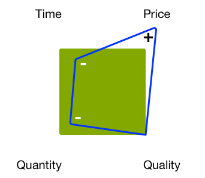

# Gestione dei progetti - Lista di controllo delle best practice{#managing-projects-best-practices-checklist}

La gestione di un progetto per l’implementazione di Adobe Experience Manager (AEM) richiede pianificazione e comprensione al fine di essere consapevoli dei problemi e delle decisioni (correlate) da prendere (sia prima che durante l’implementazione del progetto).

Per aiutarti, le best practice consistono in:

* Un [checklist interattiva](/help/managing/best-practices-checklist.md) che consente di monitorare e monitorare i progressi con queste best practice.

   * Definisce gli input e i risultati finali in base a fase, cardine e tipo.
   * Fornisce panorami automatizzati (qualità, integrità e completezza) per indicare il progresso e lo stato di salute del progetto.

* Documentazione, basata direttamente sul [elenco a discesa](/help/managing/best-practices-checklist.md), che descrive in dettaglio:

   * [Heartbeat progetto](#projectheartbeat) analisi.
   * [Stato per ruolo](#status-by-role) panoramica.
   * [Fasi e tappe fondamentali](#phases-and-milestones).
   * [Persona chiave](#persona) e il loro coinvolgimento in ogni fase (pertinente).
   * A [Glossario](/help/managing/best-practices-glossary.md) del [Documenti richiesti e risultati finali](#required-documents-and-deliverables).

* [Ulteriore riferimento](/help/managing/best-practices-further-reference.md) materiale per fornire maggiori dettagli su aree specifiche.

## Dashboard di Project Heartbeat {#project-heartbeat-dashboard}

La **Heartbeat progetto** Il foglio di lavoro fornisce una panoramica grafica delle metriche critiche per il progetto:

* **Qualità fase**

   * Indica la qualità del [Documenti richiesti e risultati finali](#required-documents-and-deliverables) in tutto il progetto.

* **Salute a fase**

   * Un indicatore di stato di alto livello per il progetto; utile per evidenziare le aree che potrebbero essere a rischio.

* **Completamento fase**

   * In qualsiasi momento del progetto, indica il livello di completamento per ogni fase del progetto.

## Stato per ruolo {#status-by-role}

La **Stato per ruolo** Il foglio di lavoro mostra la suddivisione dettagliata di [**Salute**, **Qualità** e **Completezza**](#projectheartbeat) da **[Fase](#phases-and-milestones)** e **[Persona](#persona)**.

## Fasi e tappe fondamentali {#phases-and-milestones}

Il piano del progetto è suddiviso in fasi distinte (ad alto livello).

Ogni fase contiene le proprie tappe. Per ogni [persona](#persona) (o ruolo), sono elencate le tappe pertinenti, insieme ai documenti necessari per produrre i risultati finali definiti.

>[!NOTE]
>
>Non esiste una relazione diretta 1:1 tra i singoli documenti richiesti e i risultati finali.

### Preparazione {#preparation}

La preparazione del progetto costituisce la base dell’intero progetto. È necessario definire i requisiti chiave insieme a obiettivi e aspettative chiari per:

* **Motivazione aziendale**

   * Le ragioni e le motivazioni fondamentali per l&#39;esecuzione del progetto.

* **Ambito e programma**

   * È opportuno mettere a disposizione un ambito di applicazione di base e un calendario approssimativo per definire ciò che è necessario e entro quale arco di tempo; se aiuta a chiarire la situazione, puoi anche definire cosa si trova al di fuori dell’ambito.

Le modalità di preparazione, pianificazione ed esecuzione del progetto e dell&#39;implementazione della soluzione saranno influenzate dalle restrizioni utilizzate, ad esempio budget fisso, scadenze fisse, quantità di contenuto, qualità richiesta.

Come sempre, la regolazione di uno qualsiasi dei fattori avrà un impatto sugli altri. Ad esempio, ridurre il tempo, ma richiedere lo stesso livello di qualità probabilmente aumenterà il prezzo e ridurrà la quantità di contenuto che è possibile soddisfare. Il bilancio è spesso un fattore chiave per cui tali relazioni non possono essere dimenticate.

I Quattro Fattori:

#### Milestone {#milestones}

* **Convalida**

   In questa fase è necessario convalidare e confermare gli obiettivi del progetto; ad esempio:

   * Cosa desideri ottenere/fornire?
   * Chi ne beneficerà?
   * Qual è il campo di applicazione?

      * Se aiuta a chiarire la situazione, puoi anche definire cosa si trova al di fuori dell&#39;ambito.
   * Come definirai il successo?
   * Come misurerai il successo?
   * Quali sono i requisiti, aziendali e tecnici?
   * Esistono sistemi legacy da sostituire e, in caso affermativo, esistono dati da migrare?
   * Chi sarà coinvolto?
   * Come misurerai il progresso?
   * Con quale frequenza esaminerai i progressi compiuti durante la durata del progetto?

* **Bilancio**

   Prima di iniziare un progetto è necessario disporre di una stima affidabile e realistica dei costi di implementazione:

   * Utilizzare le informazioni del cardine di convalida come base per le stime.
   * Siate realistici nelle vostre stime.
   * Valuta e rispetta tutte le linee guida, i processi o le restrizioni dei clienti a cui il cliente può essere soggetto.
   * Valutare i processi di contingenza e di revisione nel caso in cui sia necessaria una revisione o un perfezionamento del budget in una fase successiva.
   * Ricordate che i costi si presentano in molte forme; acquisti, utilizzo di risorse e commissioni, tra l&#39;altro.

### Pianificazione {#planning}

La pianificazione del progetto consolida la preparazione. Qui è necessario iniziare a convertire gli obiettivi e le aspettative in una roadmap ben definita costituita da compiti concreti, vincolati da una comunicazione chiara, con revisioni rigorose per misurare il progresso.

#### Milestone {#milestones-1}

* **Consegna**

   Un cambio di consegna sicuro assicura che l’utente/i gruppi appropriati siano consapevoli delle proprie responsabilità all’interno del progetto.

   Devono essere forniti/generati dettagli completi per garantire una piena comprensione di tutti gli aspetti pertinenti, compresi la roadmap, l’ambito, gli obiettivi, i requisiti e i KPI.

* **Valutazione del rischio**

   Per evitare sorprese sgradevoli, utilizzare la valutazione del rischio per identificare e quantificare eventuali rischi potenziali insieme al loro impatto e alla loro probabilità.

   Ciò dovrebbe essere fatto all&#39;inizio del ciclo di vita del progetto per garantire che le eventuali variabilità siano individuate e valutate. Sulla base dei risultati puoi riferire alle parti interessate se è possibile implementare tutti i requisiti e, se necessario, se è possibile pianificare azioni appropriate da intraprendere e monitorate.

* **Comunicazione**

   La comunicazione è sempre fondamentale per il successo di qualsiasi progetto. Devi comunicare in modo chiaro ed efficiente per garantire che tutti siano:

   * Lavorare verso gli stessi obiettivi fondamentali
   * Dalla stessa base di informazioni
   * Con gli stessi canali

* **Spegnimento**

   L&#39;incontro Kick Off è usato per sensibilizzare l&#39;opinione pubblica sull&#39;inizio del progetto. Si tratta di una buona opportunità per:

   * invitare tutte le parti interessate (o almeno i rappresentanti del gruppo).
   * Presentare i fatti chiave sul progetto.
   * Rispondi alle domande.
   * Assicurati che tutti abbiano la stessa base di conoscenze.
   * Ottenere l&#39;impegno da tutti coloro che saranno coinvolti - questo dovrà essere guadagnato.

      * Coinvolgendo i primi giocatori (inclusi i potenziali autori) all&#39;inizio del progetto, aumenta le possibilità di ottenere il loro impegno per il progetto.

### Preparazione allo sviluppo {#development-preparation}

Pianificare lo sviluppo è fondamentale per garantire che il progetto sia basato su un progetto solido di un team che disponga delle conoscenze necessarie.

#### Milestone {#milestones-2}

* **Team di Sviluppo Personalizzato e Formato**

   Prima di iniziare qualsiasi progetto, è necessario assicurarsi che il team di sviluppo disponga di personale adeguato e che tutti i membri del team siano formati per l’attività in corso.

* **Architettura dei contenuti**

   L&#39;architettura dei contenuti definisce e descrive la futura architettura dei contenuti; compresi:

   * Struttura del contenuto; incluse le risorse
   * Strutture di base; incluse le campagne, ecc.
   * Strutture multisito e multilingue (MSM, traduzione, ecc.)
   * Contenuto supportato (compresi tag e concetti di assegnazione tag)
   * Strategie di memorizzazione nella cache e di riutilizzo dei contenuti

* **Architettura del sistema**

   L&#39;architettura del sistema definisce la vista concettuale del sistema; tra cui (tra l&#39;altro):

   * [Struttura del sistema](/help/sites-deploying/recommended-deploys.md#deployment-scenarios) per tutti gli ambienti richiesti
   * Sottosistemi
   * Sistemi di terze parti
   * Interfacce; hardware, software e interazione umana
   * Server per ogni ambiente; vedi [Requisiti tecnici](/help/sites-deploying/technical-requirements.md) e [Linee guida per il dimensionamento dell&#39;hardware](/help/managing/hardware-sizing-guidelines.md)

   * Processi per ciascun ambiente; ad esempio, requisiti di distribuzione e manutenzione
   * Attività di manutenzione (GC Datastore, ottimizzazione TarPM, ecc.)
   * Memorizzazione in cache di Dispatcher
   * [Clustering](/help/sites-deploying/recommended-deploys.md#deployment-scenarios) Pubblica/Condividi autore
   * Prestazioni lato client (minimizzazione JS, concat, sprites css, numero totale di richieste http e altre)

* **Architettura dell&#39;applicazione**

   L&#39;architettura dell&#39;applicazione definisce e descrive il comportamento delle applicazioni proposte.

   Si concentra su:

   * Come interagiranno tra loro e con gli utenti.
   * I dati da consumare e produrre dalle applicazioni, anziché la loro struttura interna.

   Le definizioni dovrebbero riguardare:

   * Struttura del codice di base per il progetto
   * Artefatti di codice (bundle, pacchetti, ecc.)
   * Suddivisioni dei modelli/componenti e delle loro relazioni
   * Dettagli di alto livello sulle personalizzazioni richieste (in seguito verranno visualizzate sovrapposizioni specifiche)
   * Progettazione di flussi di lavoro richiesti dalla soluzione (ad esempio, creazione di contenuti, approvazione, pubblicazione, trasformazioni, importazioni, esportazioni, ecc.)
   * Considerazione speciale per tutti i moduli complessi, ad esempio MSM, Commerce, integrazione di terze parti

* **Integrazione di sistema**

   L’integrazione del sistema richiede la pianificazione (e quindi l’implementazione):

   * Come tutti i sottosistemi e [integrazioni di soluzioni](/help/sites-administering/integration.md) sarà riunito per funzionare come un unico sistema coerente
   * Come verranno integrati i sistemi di terze parti; insieme a qualsiasi considerazione particolare, ad esempio offline/online, lato client/lato browser o gestione del failover quando un sistema di terze parti è inattivo

* **Concetto di prova**

   Prima di iniziare lo sviluppo è necessario elaborare un concetto approfondito e completo di tutti [test](/help/sites-developing/planning.md) requisiti del progetto.

   Ciò dovrebbe includere (tra l&#39;altro):

   * Dettagli di tutte le prove da eseguire
   * Preparazione del contenuto necessario per tali test
   * Informazioni su eventuali strumenti di prova da utilizzare
   * indicazione ad alto livello di chi sarà coinvolto nelle prove; specialmente i gruppi esterni al team QA
   * dettagli dell&#39;automazione dei test; ad esempio, con modalità Selenium o AEM Developer

* **Progettazione esperienza**

   Experience Design (XD) prevede la progettazione dell&#39;esperienza utente per la soluzione.

   L’esperienza utente deve essere analizzata e sviluppata sia per gli autori che per gli utenti finali del sito web.

* **Configurazione del supporto**

   Prima di sviluppare tutti i processi di supporto, necessari per distribuire, rilasciare, testare e segnalare i problemi, devono essere impostati.

   Vedi anche [Adobe Support Portal](https://helpx.adobe.com/it/marketing-cloud/contact-support.html).

### Pianificazione e operazioni {#operations-planning-and-operations}

Analogamente, le operazioni devono essere pianificate in modo appropriato per garantire l&#39;esistenza degli ambienti necessari per tutte le fasi del ciclo di vita del progetto. È inoltre necessario disporre dei processi appropriati per la loro manutenzione.

#### Milestone {#milestones-3}

* **Autorizzazioni**

   Devi pianificare e quindi implementare un concetto di ruoli e diritti per tutti gli utenti/gruppi che utilizzeranno la soluzione.

   Esempio:

   * Un elenco di ruoli (ovvero gruppi) con `read`/ `write` definizioni di accesso per ogni

   * Definizione dell&#39;uso dei privilegi che interessano l&#39;ambiente di pubblicazione; ad esempio, `replicate`
   * Per gli utenti con privilegi minimi, è necessario definire i flussi di lavoro
   * Utenti nel `editor` il gruppo non deve avere `admin` i diritti e non far parte del `administrators` gruppo

   Per ulteriori informazioni, consulta [Amministrazione degli utenti e sicurezza](/help/sites-administering/security.md).

* **Monitoraggio e manutenzione**

   Il monitoraggio e la manutenzione sono aspetti fondamentali per garantire il funzionamento ottimale della soluzione una volta che questa è attiva. A questo scopo è necessario definire:

   * Che cosa richiede il monitoraggio
   * compiti di manutenzione; sia regolari che per casi speciali

   Vedi anche [Monitoraggio e manutenzione](/help/sites-deploying/monitoring-and-maintaining.md) per ulteriori informazioni.

* **Migrazione**

   Eventuali contenuti del sistema legacy devono essere rivisti e convalidati per la migrazione.

* **Piano di ripristino**

   Assicurati di disporre di un piano di ripristino. In una situazione di emergenza ciò deve essere disponibile per garantire l&#39;uso della produzione di AEM. Questo dovrebbe coprire situazioni quali backup, ripristino, fallover e altre.

### Sviluppo {#development}

Lo sviluppo è una fase cruciale che richiede qualcosa di più che una semplice codifica.

#### Milestone {#milestones-4}

* **Ambiente di sviluppo**

   Pianifica e documenta l&#39;ambiente di sviluppo, tra cui:

   * Architettura
   * [Strumenti di sviluppo](/help/sites-developing/dev-tools.md)

      * Un ambiente tipico è costituito da:

         * un sistema di tracciamento dei problemi; come Jira
         * un IDE; come Eclipse
         * uno strumento di gestione della costruzione; come Maven
         * uno strumento di integrazione continua; come Jenkins
         * uno strumento per il controllo della versione; come GIT/SVN
         * un gestore dell’archivio degli artefatti; come Archiva/Nexus
   * Integrazione/dipendenze di software di terze parti
   * [Integrazione/dipendenze della soluzione](/help/sites-administering/integration.md)
   * Frequenza di distribuzione

* **Sistema di prova**

   Pianifica e documenta l’ambiente di test, tra cui:

   * Architettura
   * Dipendenze dalle costruzioni di sviluppo; incluse le build notturne
   * Possibilità o limitazioni di test dell&#39;integrazione/dipendenze di software di terze parti
   * Strumenti di test
   * Strategia di test automatizzata

* **Sistema di produzione**

   Pianifica e documenta l&#39;ambiente di produzione, tra cui:

   * Architettura
   * Frequenza di distribuzione
   * Integrazione/dipendenze di software di terze parti
   * Configurazione della sicurezza
   * Prestazioni della linea di base verificate mediante l’esecuzione di [Test giornalieri difficili](/help/sites-developing/tough-day.md) sulla configurazione di produzione
   * Requisiti per le prove di prestazione; vedere [Best practice per la garanzia della qualità](/help/sites-deploying/configuring-performance.md#best-practices-for-quality-assurance)

* **Integrazione**

   Pianificare, documentare e testare tutti gli aspetti del sistema e [integrazione delle soluzioni](/help/sites-administering/integration.md), tra cui:

   * Una strategia di test automatizzata
   * Processi automatizzati per [spostare le applicazioni dallo sviluppo al test, quindi alla produzione](/help/managing/enterprise-devops.md#code-movement)
   * Processi automatizzati per [spostare i contenuti dalla produzione al test e allo sviluppo](/help/managing/enterprise-devops.md#content-movement)

* **Migrazione**

   Pianificare, documentare e testare tutti gli aspetti della migrazione dei contenuti; compresi:

   * Architettura dei contenuti
   * Strategia di migrazione

* **Comunicazione**

   Assicurati che tutti i membri del team e l’utente tipo del progetto siano aggiornati in base alle esigenze.

* **Documentazione**.

   Documentare pienamente la soluzione; compresi:

   * Manuale operativo
   * Eventuali personalizzazioni che possono influenzare gli aggiornamenti
   * Note sulla versione

### Prestazioni e test {#performance-and-testing}

Una volta che la nuova applicazione sarà disponibile, dovrà sottoporsi a test rigorosi, sia per la funzionalità che per [prestazioni](/help/sites-deploying/configuring-performance.md).

>[!NOTE]
>
>Qualsiasi team di test deve poter rimanere neutrale e fornire i risultati dei test.
>
>Spetta al responsabile del progetto valutare le eventuali implicazioni dei risultati e decidere le azioni appropriate.

#### Milestone {#milestones-5}

* **Test di accettazione da parte dell&#39;utente finale**

   [Test di accettazione degli utenti](/help/sites-developing/acceptance-signoff.md) (UAT) è fondamentale per garantire che:

   * La soluzione soddisfa i requisiti utente/cliente
   * I clienti/utenti accettano la soluzione (funzione, progettazione e prestazioni)

   Dovrebbe essere prevista una lista di controllo ufficiale per la consegna del cliente; idealmente automatizzato ed eseguito su base notturna contro un&#39;istantanea. I risultati devono essere inviati al project manager e al team di sviluppo

* **Test di prestazioni e di carico**

   I test di prestazione e carico sono utilizzati per garantire che la soluzione soddisfi i livelli di prestazioni richiesti, in media e nei carichi di picco.

   Per ulteriori informazioni sui test delle prestazioni, vedi:

   * [Test delle prestazioni](/help/sites-deploying/configuring-performance.md)
   * [Come pianificare ed eseguire i test](/help/sites-developing/planning.md)

   * [Linee guida sulle prestazioni di base](/help/sites-deploying/configuring-performance.md#basic-performance-guidelines)
   >[!NOTE]
   >
   >Questo processo dovrà essere proseguito durante il normale uso di AEM, ma queste fasi iniziali sono le più cruciali.

### Rollout {#rollout}

Il rollout della tua nuova applicazione richiede un&#39;attenta pianificazione per garantire un Go Live fluido. Ciò include la conferma di un elevato livello di sicurezza, la formazione di tutti i potenziali utenti e l&#39;esecuzione di più prove per confermare che tutte le questioni sono state affrontate.

#### Milestone {#milestones-6}

* **Preparazione**

   La preparazione e la pianificazione contribuiranno a garantire un rollout uniforme.

* **Formazione**

   Assicurare che tutto il personale coinvolto sia stato formato.

   Vedi [Adobe Experience Manager](https://training.adobe.com/training/courses.html#solution=adobeExperienceManager) nel catalogo dei corsi.

* **Amministratori formati**

   Assicurati che gli amministratori delle soluzioni abbiano:

   * Formati
   * Ricevuto materiale di formazione adeguato
   * Ricevuta la documentazione appropriata

* **Utenti formati**

   Assicurati che gli autori abbiano:

   * Formati
   * Ricevuto materiale di formazione adeguato
   * ha ricevuto la documentazione appropriata; ad esempio, la Guida utente

* **Test di penetrazione**

   I test di penetrazione simulano un attacco su un sistema informatico per identificare potenziali carenze di sicurezza.

* **Test di penetrazione/sicurezza**

   Per garantire la sicurezza della soluzione, esegui test di penetrazione specifici insieme a una più ampia gamma di test di sicurezza.

   Consulta la sezione [Lista di controllo sicurezza](/help/sites-administering/security-checklist.md) per ulteriori dettagli.

### Vai in diretta {#go-live}

Vuoi che il tuo Go Live sia il più liscio possibile. Anche in questo caso, i passaggi finali devono essere pianificati per l&#39;esecuzione pulita.

#### Milestone {#milestones-7}

* **Preparazione**

   La preparazione e la pianificazione contribuiranno a garantire un buon Go Live.

* **Sicurezza**

   Conferma la sicurezza della soluzione per gli utenti interni ed esterni e i relativi contenuti.

* **Regresso**

   Assicurati che tutti i sistemi, le procedure e i meccanismi necessari per il fallback siano in atto prima di iniziare il ciclo di vita.

* **Supporto**

   Assicurati che i servizi di supporto siano in-place e pronti.

* **Transizione**

   Pianifica ed esegui la transizione al tuo ambiente di produzione e agli utenti.

* **Uscita**

   Prepara ed esegui i test di fumo.

## Persona {#persona}

Le liste di controllo sono progettate da persone. Questi sono i ruoli con un significativo coinvolto nel ciclo di vita del progetto.

Ci sono anche alcuni [altra persona](#other-persona) che sono coinvolti in compiti specifici.

### Sponsor del progetto {#project-sponsor}

Lo sponsor del progetto è:

* Responsabile della fornitura/presentazione del business case per il progetto.
* La definizione e la definizione della portata del progetto; compresi:

   * la definizione e i criteri del successo
   * KPI principali

* Fornisci le tappe principali in base alla roadmap del cliente.

### Project Manager {#project-manager}

Il project manager è:

* Responsabile della consegna complessiva del progetto in base ai requisiti (ad esempio ambito, KPI, criteri di successo e definizione) forniti dal promotore del progetto.
* Responsabile della definizione del budget e delle risorse del progetto in base a tale budget.
* Il punto principale di comunicazione per tutti coloro che partecipano al progetto.

### Architetto {#architect}

Architetto della soluzione:

* È responsabile della progettazione di alto livello della soluzione e del sistema.
* Consente di definire la strategia di implementazione per AEM. Ad esempio, se implementare un’installazione in cluster o una standby a freddo oppure quando è necessaria una rete di distribuzione dei contenuti (CDN).
* Definisci anche l&#39;architettura della soluzione AEM in base ai requisiti del cliente. Ciò può includere il concetto di ruoli utente (con i diritti correlati), la relazione tra modelli e componenti o quando utilizzare la gestione multisito.

### Analista aziendale {#business-analyst}

L&#39;analista:

* È principalmente responsabile della raccolta e dell&#39;analisi dei requisiti di alto livello, trasformandoli poi in specifiche:

   * per il project manager da utilizzare per la pianificazione dello sviluppo
   * affinché il team di sviluppo possa lavorare da durante la progettazione e lo sviluppo.

* Lavora a stretto contatto con il cliente per analizzare i requisiti. I loro punti di corrispondenza sono:

   * La definizione di successo.
   * I criteri di successo.
   * KPI (sia aziendali che basati sulle prestazioni).

### Lead di sviluppo {#development-lead}

Il ruolo guida nello sviluppo:

* È responsabile della fornitura tecnica del progetto.
* È responsabile della selezione di una metodologia di sviluppo conforme ai requisiti dei clienti.
* Elaborare la strategia di sviluppo:

   * garantire l’allineamento con i KPI aziendali e prestazionali
   * tenendo conto dei criteri di successo e della definizione

* Lavora a stretto contatto con l&#39;architetto (in particolare quando elabora la strategia di sviluppo per AEM) per definire aspetti quali la relazione tra modelli e componenti, la strategia di integrazione per applicazioni di terze parti e qualsiasi funzionalità specializzata.

### Piombo di qualità {#quality-lead}

Il piombo di qualità:

* è responsabile della qualità della consegna; garantire che soddisfi i criteri di successo e gli eventuali KPI definiti dal client.
* Definisce le metriche di qualità, in linea con tutte le parti interessate, elabora i piani di test e ne assicura l’esecuzione.
* Crea e distribuisce rapporti alle parti interessate del progetto.

### Ingegnere del sistema {#system-engineer}

Il tecnico del sistema:

* È responsabile della supervisione dell&#39;infrastruttura del progetto.
* È responsabile di:

   * configurazione di ambienti di sviluppo e test interni
   * per la corrispondenza di tali sistemi ai sistemi client

* Fornisce consigli hardware, controlla le varie implementazioni e fornisce supporto operativo sia prima che dopo.

### Lead di sicurezza {#security-lead}

Responsabile della sicurezza:

* È responsabile del concetto di sicurezza globale della soluzione, garantendo che sia allineata con eventuali requisiti e criteri del cliente.
* fornisce un concetto di sicurezza, operazioni di sicurezza e consigli per qualsiasi concetto di sicurezza basato su hardware; quali zone e firewall.

### Altro Persona {#other-persona}

* Parti interessate

   * Persone (spesso provenienti dal mondo degli affari) che hanno un interesse (partecipazione) nel successo del progetto. Spesso contribuiscono al bilancio.

* Legale

   * È necessaria una consulenza legale quando si negoziano i contratti.

* Formatori

   * A seconda delle dimensioni e della natura del progetto, i formatori specializzati possono essere utilizzati per sviluppare e presentare sessioni di formazione per i gruppi interessati.

* Scrittori tecnici

   * A seconda delle dimensioni e della natura del progetto, gli autori tecnici specializzati possono essere utilizzati per scrivere linee guida e manuali per gruppi specifici; Ad esempio, un manuale di manutenzione per gli amministratori di sistema o una guida utente per gli autori.

* Amministratori di sistema

   * Responsabile del funzionamento continuo del sistema.

* Autori e utenti finali

   * Le persone che utilizzeranno il sistema per creare e gestire il contenuto del sito web.

## Documenti richiesti e risultati finali {#required-documents-and-deliverables}

Le liste di controllo coprono le **Documenti richiesti** e **Risultati finali** per ogni cardine.

* Non esiste una relazione 1:1 tra questi; ad esempio, un gruppo di documenti richiesti può dare luogo a un singolo recapito.
* Un risultato finale da una persona può essere un documento obbligatorio per un’altra persona durante lo stesso cardine.

### Documenti richiesti {#required-documents}

La **Documenti richiesti** sono necessarie per l’utente di destinazione appropriato al momento della produzione dei relativi risultati finali.

Per ogni **Documento richiesto** l’utente tipo deve indicare:

* **Y/N**: se è stato ricevuto.
* **1-3**: un&#39;indicazione della qualità del documento ricevuto.

### Risultati finali {#deliverables}

Per ogni tappa, l’utente appropriato è responsabile della consegna di documenti specifici e quindi della realizzazione delle proprie responsabilità per una specifica tappa.

Per ogni **Consegna** l’utente deve indicare:

* **Y/N**: se è stato completato.

I risultati finali sono spesso utilizzati come **Documenti richiesti** per l&#39;attività cardine corrente o successiva.

## Best practice correlate {#related-best-practices}

Per le best practice su distribuzione, amministrazione, sviluppo o authoring, consulta:

* Altre best practice e linee guida relative alla gestione di un progetto AEM:
   * [Linee guida per le dimensioni dell’hardware](/help/managing/hardware-sizing-guidelines.md)
   * [DevOps aziendale ](/help/managing/enterprise-devops.md)
   * [Best practice per SEO e gestione degli URL](/help/managing/seo-and-url-management.md)
   * [Linee guida sull’accessibilità di AEM per il Web](/help/managing/web-accessibility.md)
   * [Regolamento generale sulla protezione dei dati](/help/managing/data-protection-and-privacy.md)* [Best practice di distribuzione e manutenzione](/help/sites-deploying/best-practices.md)
* [Best practice di amministrazione](/help/sites-administering/administer-best-practices.md)
* [Best practice di sviluppo](/help/sites-developing/best-practices.md)
* [Best practice di authoring](/help/sites-authoring/best-practices.md)

## Aree principali della documentazione {#key-documentation-areas}

* AEM Documentazione Inoltre, le seguenti sezioni della documentazione AEM sono di particolare interesse (tuttavia, questo elenco non è esaustivo):

   * [Sicurezza](/help/sites-developing/security.md)
   * [Implementazioni consigliate](/help/sites-deploying/recommended-deploys.md)
   * [DevOps aziendale ](/help/managing/enterprise-devops.md)
   * [Ridimensionamento hardware](/help/managing/hardware-sizing-guidelines.md)
   * Concetti di AEM:

      * [Sviluppo - Nozioni di base](/help/sites-developing/the-basics.md)
      * [Concetti MSM](/help/sites-administering/msm.md)
      * [Linguaggio dei modelli di HTML (HTL)](https://docs.adobe.com/content/help/it-IT/experience-manager-htl/using/overview.html)

* Documentazione correlata

   * Adobe Experience Cloud - [Pianificazione per Adobe Experience Cloud](https://helpx.adobe.com/marketing-cloud/how-to/planning.html)
