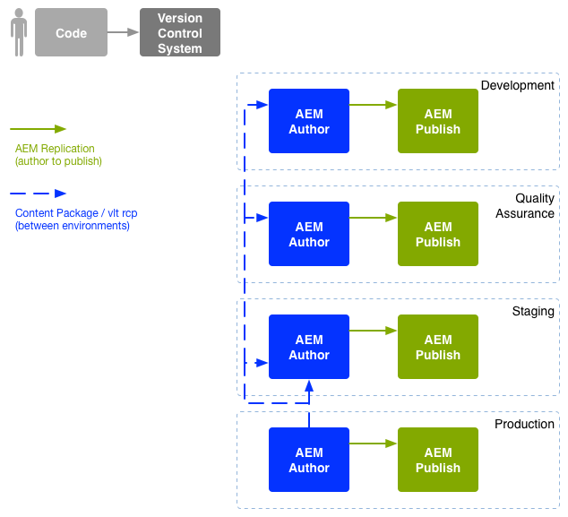

# DevOps Enterprise{#enterprise-devops}

DevOps descrive i processi, i metodi e la comunicazione necessari per:

* Semplificazione dell&#39;implementazione del software in diversi ambienti.
* Semplificate la collaborazione tra i team di sviluppo, test e implementazione.

DevOps mira a evitare problemi come:

* Errori manuali.
* Elementi dimenticati; ad esempio, file, dettagli di configurazione.
* Discrepanze; ad esempio, tra l&#39;ambiente locale di uno sviluppatore e altri ambienti.

## Ambienti {#environments}

Una distribuzione Adobe Experience Manager (AEM) in genere consiste di più ambienti, utilizzati per scopi diversi a diversi livelli:

* [Sviluppo](#development)
* [Garanzia di qualità](#quality-assurance)
* [Staging](#staging)
* [Produzione](#production-author-and-publish)

>[!NOTE]
>
>L’ambiente di produzione deve avere almeno un ambiente di creazione e pubblicazione.
>
>È consigliabile che tutti gli altri ambienti siano composti anche da un ambiente di creazione e pubblicazione che rifletta l’ambiente di produzione e che consenta di eseguire i test in anticipo.

### Sviluppo {#development}

Gli sviluppatori sono responsabili dello sviluppo e della personalizzazione del progetto proposto (sito Web IT, applicazioni mobili, implementazione DAM, ecc.), con tutte le funzionalità richieste. Tali procedure:

* sviluppare e personalizzare gli elementi necessari; ad esempio, modelli, componenti, flussi di lavoro, applicazioni
* realizzare il progetto
* sviluppare i servizi e gli script necessari per implementare le funzionalità richieste

La configurazione dell&#39;ambiente di [sviluppo](/help/sites-developing/best-practices.md) può dipendere da vari fattori, anche se in genere è composta da:

* Un sistema di sviluppo integrato con controllo della versione per fornire una base di codice integrata. Viene utilizzato per unire e consolidare il codice dei singoli ambienti di sviluppo utilizzati da ogni sviluppatore.
* Un ambiente personale per ogni sviluppatore; di solito residente sulla loro macchina locale. A intervalli appropriati il codice viene sincronizzato con il sistema di controllo della versione

A seconda delle dimensioni del sistema, nell’ambiente di sviluppo possono essere presenti istanze di creazione e pubblicazione.

### Garanzia di qualità {#quality-assurance}

Questo ambiente viene utilizzato dal team di controllo della qualità per [testare](/help/sites-developing/test-plan.md) in modo esaustivo il nuovo sistema; progettazione e funzione. Deve disporre di ambienti di creazione e pubblicazione, con contenuti appropriati, e fornire tutti i servizi necessari per abilitare una suite completa di test.

### Staging {#staging}

L&#39;ambiente di staging deve essere un mirror dell&#39;ambiente di produzione: configurazione, codice e contenuto:

* Viene utilizzato per verificare gli script utilizzati per implementare la distribuzione effettiva.
* Può essere utilizzato per i test finali (progettazione, funzionalità e interfacce) prima di distribuirlo negli ambienti di produzione.
* Anche se non è sempre possibile che l&#39;ambiente di gestione temporanea sia identico all&#39;ambiente di produzione, dovrebbe essere il più vicino possibile per consentire il test delle prestazioni e del carico.

### Produzione - Autore e pubblicazione {#production-author-and-publish}

L’ambiente di produzione è costituito dagli ambienti necessari per [creare e pubblicare](/help/sites-authoring/author.md#concept-of-authoring-and-publishing) l’implementazione.

Un ambiente di produzione è costituito da almeno un’istanza di creazione e un’istanza di pubblicazione:

* Un’istanza di [creazione](#author) per l’input di contenuto.
* Un’istanza di [pubblicazione](#publish) per il contenuto reso disponibile ai visitatori/utenti.

A seconda delle dimensioni del progetto, è spesso composto da più istanze di creazione e/o pubblicazione. A un livello inferiore, il repository può essere raggruppato in più istanze.

#### Authoring {#author}

Le istanze dell&#39;autore si trovano in genere dietro il firewall interno. Questo è l’ambiente in cui tu e i tuoi colleghi eseguirete le attività di authoring, ad esempio:

* amministrare l&#39;intero sistema
* inserire il contenuto
* configurare il layout e la progettazione del contenuto
* attivare i contenuti nell’ambiente di pubblicazione

Il contenuto attivato viene inserito in un pacchetto e nella coda di replica dell’ambiente di authoring. Il processo di replica trasferisce quindi tale contenuto nell’ambiente di pubblicazione.

Per ripristinare all’ambiente di authoring i dati generati in un ambiente di pubblicazione, un listener di replica nell’ambiente di authoring esegue un sondaggio nell’ambiente di pubblicazione e recupera tali contenuti dalla casella in uscita della replica inversa dell’ambiente di pubblicazione.

#### Pubblicazione {#publish}

Un ambiente di pubblicazione si trova in genere nella zona demilitarizzata (DMZ). Questo è l’ambiente in cui i visitatori accederanno al contenuto (ad esempio tramite un sito Web o sotto forma di applicazione mobile) e interagiscono con esso; essere pubblico o all’interno della rete Intranet. Un ambiente di pubblicazione:

* contiene contenuto replicato dall&#39;ambiente di authoring
* rende tale contenuto disponibile ai visitatori
* memorizza i dati utente generati dai visitatori, quali commenti o altri invii di moduli
* può essere configurato per aggiungere tali dati utente a una casella in uscita, per la replica inversa nell’ambiente di authoring

L’ambiente di pubblicazione genera i contenuti in tempo reale in modo dinamico e può essere personalizzato per ogni singolo utente.

## Spostamento codice {#code-movement}

Il codice deve sempre essere propagato dal basso verso l’alto:

* il codice viene inizialmente sviluppato sugli ambienti di sviluppo locali e integrati
* seguito da un&#39;approfondita verifica sull&#39;ambiente o sugli ambienti QA
* quindi testato nuovamente negli ambienti di gestione temporanea
* solo allora il codice deve essere distribuito agli ambienti di produzione

Il codice (ad esempio, funzionalità di applicazioni Web personalizzate e modelli di progettazione) viene in genere trasferito esportando e importando pacchetti tra i diversi repository di contenuti. Se necessario, questa replica può essere configurata come processo automatico.

I progetti AEM spesso attivano la distribuzione del codice:

* Automaticamente: per il trasferimento agli ambienti di sviluppo e di controllo della qualità.
* Manualmente: le operazioni di installazione negli ambienti di produzione e di produzione sono effettuate in modo più controllato, spesso manuali; anche se l&#39;automazione è possibile se richiesto.

## Spostamento dei contenuti {#content-movement}

Il contenuto creato per la produzione deve essere **sempre** creato nell’istanza di creazione dell’autore di produzione.

Il contenuto non deve seguire il codice che si sposta dagli ambienti inferiori a quelli superiori, in quanto fare in modo che gli autori creino contenuti su computer locali o in ambienti inferiori e quindi lo spostino nell&#39;ambiente di produzione non è una buona prassi e potrebbe introdurre errori e incoerenze.

Il contenuto di produzione deve essere spostato dall&#39;ambiente di produzione all&#39;ambiente di pre-produzione per garantire che l&#39;ambiente di pre-produzione fornisca un ambiente di test efficiente e accurato.

>[!NOTE]
>
>Ciò non significa che il contenuto dell&#39;area di gestione temporanea debba essere continuamente sincronizzato con la produzione, che gli aggiornamenti regolari siano sufficienti, ma soprattutto prima di testare una nuova iterazione del codice. I contenuti negli ambienti di QA e di sviluppo non devono essere aggiornati con la stessa frequenza, ma solo una buona rappresentazione dei contenuti di produzione.

Il contenuto può essere trasferito:

* Tra i diversi ambienti - esportando e importando pacchetti.
* Tra istanze diverse - replicando direttamente (replicaAEM) il contenuto (mediante una connessione HTTP o HTTPS).

