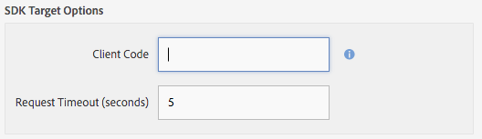

# Configurazione  Cloud Service Adobe Target {#configuring-adobe-target-cloud-service}

>[!NOTE]
>
> Adobe consiglia di utilizzare l&#39;editor SPA per i progetti che richiedono il rendering lato client basato sul framework dell&#39;applicazione a pagina singola (ad es. React). [Per saperne di più](/help/sites-developing/spa-overview.md).

>[!NOTE]
>
>Questo documento fa parte della [Guida introduttiva  AEM Mobile](/help/mobile/getting-started-aem-mobile.md) Guide, un punto di partenza consigliato per  riferimento AEM Mobile.

È necessario procedere in diversi modi per collaborare prima che gli autori dei contenuti possano iniziare a generare contenuto mirato per le app mobili: È disponibile il set di autorizzazioni corretto per utenti e gruppi, creazione di servizi cloud, configurazione dell&#39;applicazione per l&#39;attività e infine generazione del contenuto.

Si presume che l&#39;applicazione [ AEM Mobile Hybrid Reference Application](https://github.com/Adobe-Marketing-Cloud-Apps/aem-mobile-hybrid-reference) sia stata implementata e accessibile tramite  AEM Mobile Dashboard.

## Autorizzazioni  {#permissions}

Gli utenti che devono accedere alla console di personalizzazione devono far parte del gruppo `target-activity-authors`. Si consiglia di aggiungere il gruppo target-activity al gruppo apps-admins come parte della configurazione di utenti e gruppi. Aggiungendo il gruppo target-activity-authors, gli utenti potranno vedere la voce di menu di navigazione Personalizzazione.

Se si dimentica di aggiungere gli utenti o i gruppi a cui si desidera accedere alla console di amministrazione della personalizzazione al gruppo target-activity-authors, gli utenti non potranno vedere la console di personalizzazione.

## Cloud Services {#cloud-services}

Per far funzionare il contenuto di destinazione per le applicazioni mobili, sono necessari due servizi: Il  Adobe Target Service e il  Adobe Mobile Services.  Adobe Target Service fornisce il motore per l&#39;elaborazione delle richieste dei clienti e la restituzione dei contenuti personalizzati. Il servizio  Mobile Services fornisce la connessione tra i servizi di Adobe  e l’applicazione mobile tramite il file ADBMobileConfig.json che viene utilizzato dal plug-in AMS Cordova. Dalla  AEM Mobile Dashboard potete configurare l&#39;applicazione aggiungendo i due servizi.

##  Cloud Service Adobe Target {#adobe-target-cloud-service}

Dal  AEM Mobile Dashboard, individuate i Cloud Services Gestisci e fate clic sul pulsante +.

Dalla procedura guidata Aggiungi Cloud Service, selezionate la scheda del servizio cloud &quot; Adobe Target&quot; e fate clic su Avanti.

Dal menu a discesa Selezionate una configurazione potete creare una nuova configurazione oppure selezionarla da una già esistente. Per creare una nuova configurazione, selezionate &quot;Crea configurazione&quot; dal menu a discesa. Immettete un titolo per la configurazione di Target. Immetti il codice cliente, l&#39;e-mail e la password associati al tuo account Target. Se non conosci i valori di questi campi, contatta il supporto Adobe Target . Fare clic sul pulsante &quot;Verifica&quot; per convalidare le credenziali. Una volta verificato, fate clic sul pulsante Invia per creare il servizio cloud.

Il servizio cloud creato viene automaticamente associato all’applicazione mobile tramite la procedura guidata. Il valore della proprietà cq:cloudserviceconfigs viene impostato sul nodo jcr:content del nodo del gruppo delle app. Per l&#39;esempio di app ibrida viene impostato su /content/mobileapps/ibrido-reference-app/jcr:content con il valore che indica il nodo di framework generato automaticamente che si trova in /etc/cloudservices/testandtarget/adobe-target—aem-apps/framework. Per impostazione predefinita, il nodo framework ha due proprietà: genere ed età. Il framework viene utilizzato solo AEM anteprima e non ha alcun impatto sul dispositivo.

Dopo il completamento della procedura guidata, la sezione Gestione Cloud Service conterrà il servizio cloud Target, ma contiene un avviso relativo a un account Mobile Service  Adobe mancante.

##  Adobe Mobile Service {#adobe-mobile-service}

È necessario collegare un account  Mobile Services (AMS) all’applicazione, il servizio AMS fornisce il file ADBMobileConfig.json richiesto che contiene le informazioni sul codice client di Target. Prima di creare un&#39;associazione con l&#39;account AMS, l&#39;account AMS deve essere modificato da un utente che dispone delle autorizzazioni per AMS.

### Codice cliente {#client-code}

Per accedere ai servizi AMS, visita [https://mobilemarketing.adobe.com](https://mobilemarketing.adobe.com/), seleziona l&#39;applicazione mobile e fai clic sulle impostazioni. Individuate il campo Opzioni SDK Target, inserite il codice client nel campo e fate clic su Salva.

Ora che il codice client è stato associato all’applicazione mobile, quando il servizio cloud AMS viene configurato tramite il dashboard mobile  Adobe, le impostazioni per le impostazioni del servizio verranno distribuite tramite il file ADBMobileConfig.json.

###  Adobe Mobile Service potrebbe servire {#adobe-mobile-service-could-service}

Ora che AMS è stato configurato, è ora di associare l&#39;applicazione mobile nel dashboard Mobile del Adobe . Dal  AEM Mobile Dashboard, individuate i Cloud Services Gestisci e fate clic sul pulsante +.

Selezionate la scheda  Adobe Mobile Services e fate clic su Avanti.

Dal passaggio della procedura guidata Crea o Seleziona, selezionate il menu a discesa Mobile Service e la voce Crea configurazione. Fornire un titolo, una società, un nome utente e una password e selezionare il data center appropriato. Se non conosci questi valori, contatta il tuo amministratore  Adobe di Mobile Services per ottenerli. Una volta completati tutti i campi, fate clic sul pulsante Verifica. Il processo di verifica va ad AMS e verifica le credenziali per l&#39;account. Una volta eseguita la convalida, un elenco di Applicazioni mobili verrà popolato nel punto in cui si seleziona l&#39;applicazione mobile associata dal menu a discesa. Fare clic sul pulsante Invia per completare la procedura guidata. Il processo potrebbe richiedere un po&#39; di tempo per ottenere i dati di configurazione e qualsiasi analisi associata all&#39;applicazione. Una volta completato il processo, fate clic sul pulsante Fine dal modale per tornare al dashboard Mobile Adobe .

Tornando alla Mobile Dashboard, la sezione Gestione Cloud Services conterrà il servizio cloud AMS. Inoltre, la sezione Analisi metriche verrà compilata con i rapporti sul ciclo di vita.

## Gestori di sincronizzazione dei contenuti di destinazione {#target-content-sync-handlers}

Per distribuire contenuti al contenuto del dispositivo dell&#39;utente, viene generato il rendering delle offerte create dagli autori AEM contenuto. Per gestire il rendering delle offerte di destinazione, è disponibile un nuovo gestore di sincronizzazione dei contenuti che eseguirà l&#39;elaborazione delle offerte. Utilizzando come esempio l&#39;applicazione di riferimento ibrida, il pacchetto di contenuto en (inglese) contiene ContentSyncConfig con un gestore [mobileappoffers](https://github.com/Adobe-Marketing-Cloud-Apps/aem-mobile-hybrid-reference/blob/master/aem-package/content-author/src/main/content/jcr_root/content/mobileapps/hybrid-reference-app/en/_jcr_content/pge-app/app-config-dev/targetOffers/.content.xml). Il passaggio successivo è fondamentale per il rendering delle offerte sul dispositivo. Il gestore mobileappoffer dispone di una proprietà path che identifica il percorso dell&#39;attività di personalizzazione da utilizzare per l&#39;applicazione.

Ad esempio, se esiste un&#39;attività che si trova in */content/campaign/hybridref*, copiate questo percorso e incollatelo come valore nella proprietà *path* del gestore mobileappoffer.

Per l&#39;applicazione di riferimento ibrido ci sono due gestori di mobileNomers uno per il dev e uno per le produzioni.

Una volta che il percorso attività è stato impostato nella proprietà path del gestore mobileappoffer, salvare il gestore. Il gestore sarà ora pronto per avviare le offerte di rendering per i nostri dispositivi mobili.

### Modalità di rendering {#render-mode}

Il gestore mobileappoffer è configurato in modo diverso per le impostazioni di pubblicazione e di sviluppo. Per le impostazioni di pubblicazione, sul nodo cq:ContentSyncConfig è presente una proprietà denominata *renderingMode* con un valore di *publish* impostato. Il gestore mobileappoffers fa riferimento a renderingMode e, se impostato su Pubblica, modifica l&#39;ID mbox che viene creato. Per impostazione predefinita, alle mbox create da AEM viene aggiunto un valore —author. Questo indica che l&#39;attività non è stata pubblicata e che deve utilizzare la campagna non pubblicata per le risoluzioni delle offerte.

Quando il contenuto viene messo in scena tramite il dashboard mobile del  Adobe, il contenuto in fase viene considerato contenuto pronto per la produzione e viene rappresentato tramite la configurazione di sincronizzazione dei contenuti non-dev. Il rendering in questo modo causerà la rimozione di —author da tutti gli ID mbox e prevede la disponibilità di un&#39;attività pubblicata sul server di Target. Prima di testare il contenuto in fase, accertatevi che l&#39;attività sia stata pubblicata.

## Creazione di contenuti {#creating-content}

Ora che sono stati creati i servizi cloud e che è stato configurato il gestore di mobileappoffer, gli autori dei contenuti possono iniziare a generare esperienze mirate.
