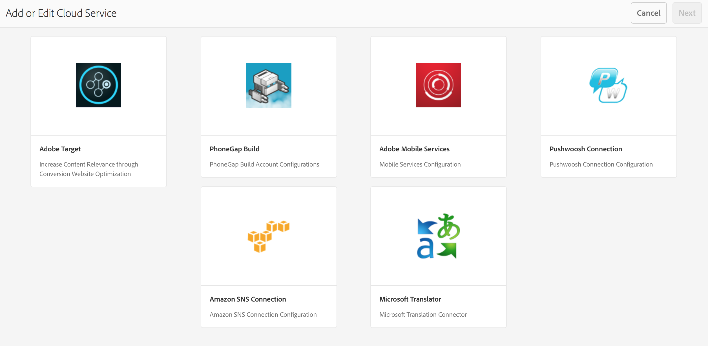
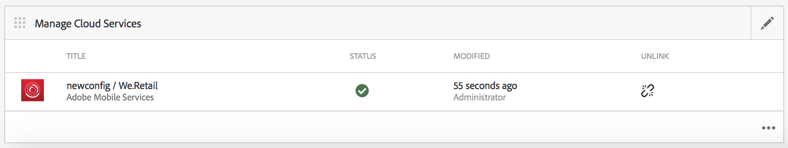

# Configurare il Cloud Service Adobe Mobile Services {#configure-your-adobe-mobile-services-cloud-service}

>[!NOTE]
>
>L’Adobe consiglia di utilizzare l’Editor SPA per i progetti che richiedono il rendering lato client basato su framework di applicazione a pagina singola (ad esempio, React). [Ulteriori informazioni](/help/sites-developing/spa-overview.md).

Il **Sezione metriche di Mobile** sul centro di comando fornisce analisi in tempo reale per la tua app mobile.

Il [Adobe di analisi per dispositivi mobili](https://www.adobe.com/ca/solutions/digital-analytics/mobile-web-apps-analytics.html) L’SDK è reso disponibile tramite un plug-in PhoneGap. Le metriche vengono raccolte e memorizzate nella cache del dispositivo fino a quando il dispositivo non è connesso, momento in cui i dati vengono inviati all’Adobe Mobile Services Cloud per scopi di reporting e analisi.

L’SDK di Adobe Mobile Analytics fornisce quanto segue:

1. **Raccolta di dati per i canali mobili** : raccogli dati completi per i tuoi siti web e app mobili su tutti i principali sistemi operativi.
1. **Analisi del coinvolgimento mobile** - Comprendi il coinvolgimento degli utenti nell’app mobile, nel sito web o nel video, compresa la frequenza con cui i consumatori avviano il canale, se effettuano acquisti da esso e altro ancora.
1. **Dashboard e rapporti dell’app mobile** : ottieni rapporti sull’utilizzo che includono le metriche del ciclo di vita per le app e le metriche dell’app store. Consulta le tendenze per utenti, avvii, durata media della sessione, durata di conservazione e arresti anomali.
1. **Analisi di una campagna mobile** - Quantificare l’efficacia delle campagne specifiche per dispositivi mobili come SMS, annunci di ricerca per dispositivi mobili, annunci di visualizzazione su dispositivi mobili e codici QR.
1. **Analisi della geolocalizzazione** : scopri dove gli utenti dell’app avviano e interagiscono con le tue esperienze mobili tramite la posizione GPS o i punti di interesse.
1. **Analisi dei percorsi** : scopri come gli utenti si spostano nell’app per determinare quali schermate ed elementi dell’interfaccia utente coinvolgono gli utenti e quali causano l’abbandono.

>[!CAUTION]
>
>Il **Analizzare le metriche** Il riquadro viene visualizzato nel dashboard, solo se hai configurato Cloud Services.

Sezione metriche del centro di comando AEM

## Configurazione del Cloud Service {#configuring-the-cloud-service}

Per sfruttare i vantaggi di Adobe Mobile Services Analytics è necessario configurare AEM Mobile Analytics Cloud Service con le informazioni del tuo account Adobe Analytics.

1. Fai clic sull’icona in alto a destra per aggiungere o modificare i Cloud Service dalla sezione **Gestisci Cloud Service** affiancare dal dashboard dell’app.

   

1. Il **Aggiungi o modifica Cloud Service** schermo. Seleziona **Adobe Mobile Services** e fai clic su **Successivo**.

   

1. Scegli una configurazione esistente da **Mobile Services** o scegli **Crea configurazione** per crearne uno.

   Per la nuova configurazione, immetti **Proprietà di Mobile Services** e fai clic su **Verifica.**

   

   Se le credenziali vengono verificate, il **Verifica** il pulsante diventa **Verificato**. Puoi scegliere un’app per servizio mobile da **Selezionate un servizio app mobile**.

   Clic **Invia** per configurare la configurazione.

   

1. Una volta impostata una configurazione cloud, puoi visualizzarla anche nel dashboard.

   

   >[!NOTE]
   >
   >Dopo aver configurato la configurazione cloud, puoi visualizzare **Analizzare le metriche** Affianca nel dashboard dell’app.

   
