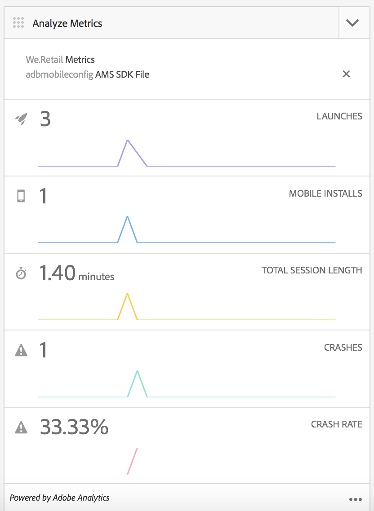

# Configurare il Cloud Service Adobe Mobile Services {#configure-your-adobe-mobile-services-cloud-service}

{{ue-over-mobile}}

Il riquadro delle metriche di **Mobile** nel centro comandi fornisce analisi in tempo reale per la tua app mobile.

Il SDK [Adobe Mobile Analytics](https://www.adobe.com/ca/solutions/digital-analytics/mobile-web-apps-analytics.html) è disponibile tramite un plug-in PhoneGap. Le metriche vengono raccolte e memorizzate nella cache del dispositivo fino a quando il dispositivo non è connesso, momento in cui i dati vengono inviati al cloud di Adobe Mobile Services per scopi di reporting e analisi.

Adobe Mobile Analytics SDK fornisce quanto segue:

1. **Raccolta dati per i canali mobili** - Raccolta di dati completi per i siti Web e le app mobili in tutti i principali sistemi operativi.
1. **Analisi del coinvolgimento mobile** - Comprendi il coinvolgimento degli utenti nell&#39;app mobile, nel sito Web o nel video, compresa la frequenza con cui i consumatori avviano il canale, se effettuano acquisti da esso e altro ancora.
1. **Dashboard e rapporti per app mobili** - Ottieni rapporti sull&#39;utilizzo che includono metriche del ciclo di vita per le tue app e metriche per app store. Vedi le tendenze per utenti, avvii, durata media della sessione, durata di conservazione e arresti anomali.
1. **Analisi campagna mobile** - Quantifica l&#39;efficacia di campagne specifiche per dispositivi mobili come SMS, annunci di ricerca mobile, annunci di visualizzazione mobile e codici QR.
1. **Analisi della geolocalizzazione** - Trova il punto in cui gli utenti dell&#39;app avviano e interagiscono con le tue esperienze mobili in base alla posizione GPS o ai punti di interesse.
1. **Analisi dei percorsi**: scopri come gli utenti si spostano nell&#39;app per determinare quali schermate ed elementi dell&#39;interfaccia utente coinvolgono gli utenti e quali causano l&#39;abbandono.

>[!CAUTION]
>
>Il riquadro **Analizza metriche** viene visualizzato nel dashboard solo se sono stati configurati servizi cloud.

Sezione metriche del centro di comando AEM

## Configurazione del Cloud Service {#configuring-the-cloud-service}

Per sfruttare i vantaggi di Adobe Mobile Services Analytics è necessario configurare AEM Mobile Analytics Cloud Service con le informazioni del proprio account Adobe Analytics.

1. Fai clic sull&#39;icona in alto a destra per aggiungere o modificare i Cloud Service dal riquadro **Gestione Cloud Service** dal dashboard dell&#39;app.

   

1. Viene visualizzata la schermata **Aggiungi o modifica Cloud Service**. Seleziona **Adobe Mobile Services** e fai clic su **Avanti**.

   

1. Scegli una configurazione esistente da **Mobile Services** oppure scegli **Crea configurazione** per crearne una.

   Per la nuova configurazione, immetti **Proprietà Mobile Services** e fai clic su **Verifica.**

   

   Se le credenziali vengono verificate, il pulsante **Verifica** diventa **Verificato**. Puoi scegliere un&#39;app per servizio mobile da **Seleziona un servizio per app mobile**.

   Fai clic su **Invia** per configurare la configurazione.

   

1. Una volta impostata una configurazione cloud, puoi visualizzarla anche nel dashboard.

   

   >[!NOTE]
   >
   >Dopo aver configurato la configurazione cloud, puoi visualizzare il riquadro **Analizza metriche** nel dashboard dell&#39;app.

   
