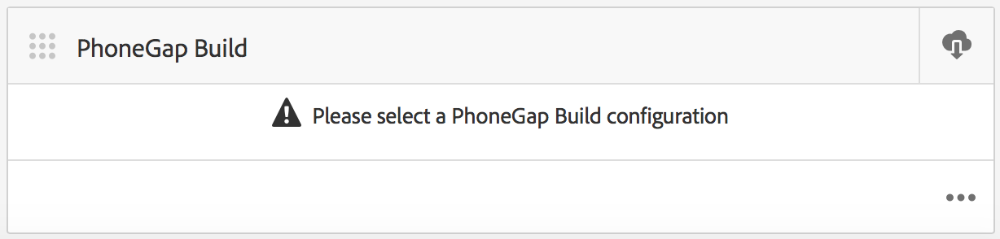
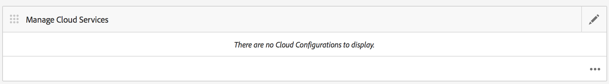
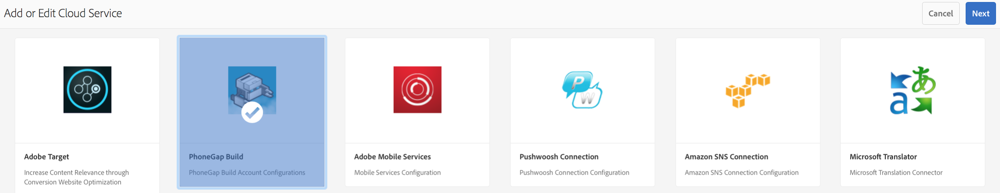
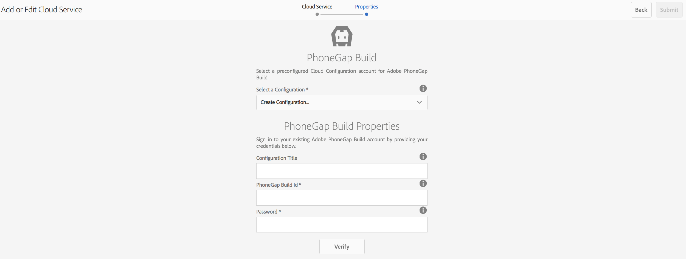
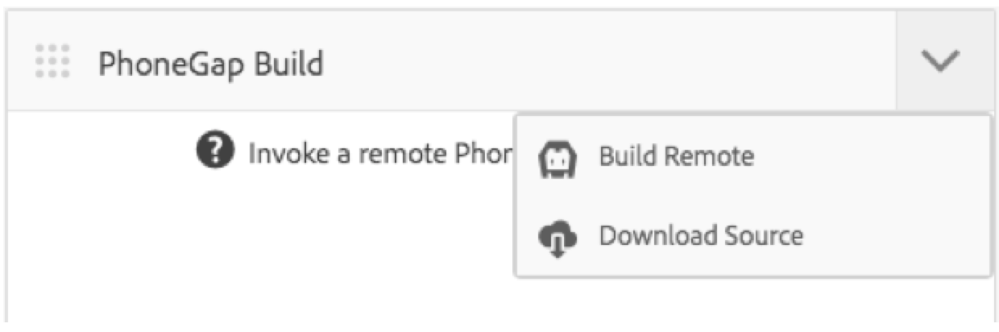

# Configurare Adobe PhoneGap Build Cloud Service {#configure-your-adobe-phonegap-build-cloud-service}

{{ue-over-mobile}}

Il riquadro **PhoneGap Build** nel dashboard dell&#39;applicazione consente di generare e distribuire l&#39;app mobile PhoneGap tramite il servizio Adobe PhoneGap Build.

Tutte le piattaforme supportate definite nel riquadro **Gestione app** sono compilate con PhoneGap Build quando si invia una build remota con il riquadro **PhoneGap Build**.

È possibile inviare una build remota a `https://build.phonegap.com` o scaricare l&#39;origine da compilare localmente con PhoneGap CLI in `https://docs.phonegap.com/references/phonegap-cli/`.



## Configurazione di Cloud Service {#configuring-the-cloud-service}

Per sfruttare PhoneGap Build, devi configurare AEM PhoneGap Build Cloud Service con le informazioni dell&#39;account PhoneGap Build.

Se al momento non disponi di un account, passa a `https://build.phonegap.com` e registrati. Se hai un abbonamento a Adobe Creative Cloud, puoi avere il supporto per un massimo di 25 app private (non open source).

Dopo aver verificato che l&#39;account PhoneGap Build è attivo, accedi alla console di gestione di AEM Cloud, in particolare a [PhoneGap Build Cloud Service](http://localhost:4502/etc/cloudservices/phonegap-build.html) (http://localhost:4502/etc/cloudservices/phonegap-build.html).

Utilizza il riquadro **Gestisci servizi cloud** per configurare una nuova configurazione di servizio cloud.

### Utilizzo del riquadro Gestisci servizi cloud {#using-manage-cloud-services-tile}

Prima di iniziare a creare l&#39;app utilizzando il riquadro **PhoneGap Build**, è necessario configurare i servizi cloud utilizzando il riquadro **Gestisci servizi cloud** dal dashboard di AEM Mobile.

Per configurare i servizi cloud per l’app, effettua le seguenti operazioni:

1. Fai clic sull&#39;angolo in alto a destra del riquadro **Gestione servizi cloud**.

   

1. Scegliere l&#39;opzione **PhoneGap Build** dalla schermata **Aggiungi o modifica Cloud Service**.

   Fai clic su **Avanti**.

   

1. Immetti le credenziali per creare una configurazione cloud.

   Una volta verificata, fare clic su **Invia**. Questa configurazione cloud configurata viene ora visualizzata nel riquadro **Gestisci servizi cloud**.

   

### Creazione dell&#39;applicazione con PhoneGap Build {#building-your-application-with-phonegap-build}

Dopo aver configurato i servizi cloud, puoi creare l&#39;applicazione con il riquadro **PhoneGap Build**. Fai clic sull&#39;angolo in alto a destra per scegliere tra le opzioni **Genera remoto** o **Scarica Source**.



Per richiamare una build remota con Adobe PhoneGap Build, fare clic su **Genera remoto**.

>[!NOTE]
>
>Se la build non riesce per qualsiasi motivo (l’icona rossa di iOS riportata di seguito indica che la piattaforma non è riuscita), puoi passare il puntatore sull’icona per visualizzare il messaggio di errore. In alternativa, è possibile fare clic sul triplo punto, &#39;...&#39; nella parte inferiore del riquadro per passare direttamente a `https://build.phonegap.com` (è necessario eseguire l&#39;autenticazione) e controllare e gestire direttamente la build.

### Creazione dell&#39;applicazione con PhoneGap CLI {#building-your-application-with-phonegap-cli}

PhoneGap fornisce un’interfaccia a riga di comando per generare l’applicazione localmente.

Compilare l&#39;applicazione PhoneGap sul computer utilizzando l&#39;interfaccia CLI (Command-Line Interface) di PhoneGap. Per includere il contenuto di AEM nell’applicazione, AEM crea un file ZIP contenente il contenuto dell’app mobile, le configurazioni di sincronizzazione dei contenuti e altre risorse richieste. Scarica il file ZIP e includilo nella build.

Per sfruttare l&#39;interfaccia CLI di PhoneGap, è necessario configurare l&#39;ambiente locale in modo che includa:

1. Platform SDK (iOS, Android™, WindowsPhone, ...) e
1. CLI di PhoneGap

Ulteriori informazioni sono disponibili qui al `https://docs.phonegap.com/references/phonegap-cli/`.

Una volta installati i prerequisiti, sottoponilo a un semplice test creando una semplice app e attivandola nel simulatore o in modo migliore sul dispositivo, da un terminale, prova:

```xml
phonegap create myApp
cd myApp
phonegap run ios (or android, ...)
```

>[!NOTE]
>
>Aggiungi —emula alla fine di questa riga se non desideri eseguirla sul dispositivo connesso.

Dopo aver verificato il funzionamento di quanto sopra, utilizza il riquadro **PhoneGap Build** per **scaricare Source**. Salva e decomprimi il file sul sistema locale. Una volta fatto:

* passa al file salvato (cartella)
* eseguire phonegap run ios (o android, e così via)

### Risorse aggiuntive {#additional-resources}

Per informazioni sui ruoli e sulle responsabilità di un autore e di uno sviluppatore, consulta le risorse seguenti:

* [Sviluppo per Adobe PhoneGap Enterprise con AEM](/help/mobile/developing-in-phonegap.md)
* [Authoring per Adobe PhoneGap Enterprise in AEM](/help/mobile/phonegap.md)
