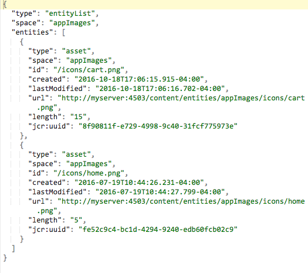

# Consegna dei contenuti{#content-delivery}

>[!NOTE]
>
>Adobe consiglia di utilizzare l’editor di SPA per i progetti che richiedono il rendering lato client basato sul framework di un’applicazione a pagina singola (ad esempio, React). [Per saperne di più](/help/sites-developing/spa-overview.md).

Le app mobili devono essere in grado di utilizzare qualsiasi e tutto il contenuto in AEM in base alle esigenze per fornire l’esperienza con le app mirate.

Ciò include l’utilizzo di risorse, contenuto del sito, contenuto CaaS (over-the-air) e contenuto personalizzato che può avere una propria struttura.

>[!NOTE]
>
>**Contenuto in aria** può provenire da uno qualsiasi dei precedenti tramite gestori ContentSync. Può essere utilizzato per il pacchetto batch e la consegna tramite zip, nonché mantenere gli aggiornamenti o quei pacchetti.

I Content Services forniscono tre tipi principali di materiale:

1. **Risorse**
1. **Contenuto HTML in pacchetto (HTML/CSS/JS)**
1. **Contenuto indipendente dal canale**

## Risorse {#assets}

Le raccolte di risorse sono costrutti AEM che contengono riferimenti ad altre raccolte.

Una raccolta di risorse può essere esposta tramite Content Services. Una chiamata a una raccolta di risorse in una richiesta restituisce un oggetto che è un elenco delle risorse, inclusi i relativi URL. Le risorse sono accessibili tramite un URL. L&#39;URL viene fornito in un oggetto . Esempio:

* Un&#39;entità pagina restituisce JSON (oggetto pagina) che include un riferimento immagine. Il riferimento immagine è un URL utilizzato per ottenere il binario della risorsa per l&#39;immagine.
* Una richiesta di elenco di risorse in una cartella restituisce JSON con dettagli su tutte le entità in quella cartella. Quell&#39;elenco è un oggetto. Il JSON dispone di riferimenti URL che vengono utilizzati per ottenere il binario della risorsa per ogni risorsa in quella cartella.

### Ottimizzazione delle risorse {#asset-optimization}

Un valore chiave di Content Services è la capacità di restituire le risorse ottimizzate per il dispositivo. Questo riduce le esigenze di archiviazione dei dispositivi locali e migliora le prestazioni dell’app.

L’ottimizzazione delle risorse sarà una funzione lato server, basata sulle informazioni fornite nella richiesta API. Laddove possibile, i rendering delle risorse devono essere memorizzati nella cache in modo che richieste simili non richiedano una nuova generazione del rendering delle risorse.

### Flusso di lavoro delle risorse {#assets-workflow}

Il flusso di lavoro delle risorse è il seguente:

1. Riferimento risorse disponibile in AEM pronto all’uso
1. Crea entità di riferimento risorsa in base al suo modello
1. Modifica entità

   1. Selezionare una risorsa o una raccolta di risorse
   1. Personalizzare il rendering JSON

Il diagramma seguente illustra la **Flusso di lavoro di riferimento delle risorse**:

### Gestione delle risorse {#managing-assets}

Content Services fornisce l’accesso AEM risorse gestite a cui potrebbero non essere presenti riferimenti tramite altri contenuti AEM.

#### Risorse gestite esistenti {#existing-managed-assets}

Un utente AEM Sites e Assets esistente utilizza AEM Assets per gestire tutto il materiale digitale per tutti i canali. Stanno sviluppando un’app mobile nativa e devono utilizzare diverse risorse gestite da AEM Assets. Ad esempio loghi, immagini di sfondo, icone di pulsanti, ecc.

Attualmente queste sono diffuse intorno all’archivio Assets. I file a cui l&#39;app deve fare riferimento sono:

* /content/dam/geometrixx-outdoors/brand/logo_light.png
* /content/dam/geometrixx-outdoors/brand/logo_dark.png
* /content/dam/geometrixx-outdoors/styles/backgrounds/gray_blue.jpg
* /content/dam/geometrixx-outdoors/brand/icons/app/cart.png
* /content/dam/geometrixx-outdoors/brand/icons/app/home.png

#### Accesso alle entità risorsa CS {#accessing-cs-asset-entities}

Mettiamo da parte i passaggi per rendere la pagina disponibile tramite l’API per il momento (sarà coperta dalla descrizione dell’interfaccia utente AEM) e supponiamo che sia stata eseguita. Le entità risorsa sono state create e aggiunte allo spazio &quot;appImages&quot;. Ulteriori cartelle sono state create nello spazio a scopo organizzativo. Quindi le entità risorsa vengono memorizzate nel JCR AEM come:

* /content/entity/appImages/logos/logo_light
* /content/entity/appImages/logos/logo_dark
* /content/entity/appImages/bkgnd/grey_blue
* /content/entity/appImages/icone/carrello
* /content/entity/appImages/icone/home

#### Ottenimento di un elenco delle entità risorsa disponibili {#getting-a-list-of-available-asset-entities}

Gli sviluppatori di app possono ottenere un elenco delle risorse disponibili recuperando le entità delle risorse. L’endpoint spazio Content Services può fornire tali informazioni tramite l’SDK API del servizio Web.

Il risultato sarebbe un oggetto in formato JSON che fornirebbe un elenco delle risorse nella cartella &quot;icone&quot;.

#### Ottenimento di un’immagine {#getting-an-image}

Il JSON fornisce all’immagine un URL per ogni immagine, generato da Content Services .

Per ottenere il binario per l&#39;immagine &quot;carrello&quot;, la libreria client viene utilizzata di nuovo.

## Contenuto HTML in pacchetto {#packaged-html-content}

Il contenuto HTML è necessario per i clienti che devono mantenere il layout dei contenuti. Questo è utile per le applicazioni native che utilizzano un contenitore Web, ad esempio una visualizzazione Web Cordova, per visualizzare il contenuto.

AEM Content Services sarà in grado di fornire contenuti HTML all’app mobile tramite l’API . I clienti che desiderano esporre AEM contenuto come HTML creano un’entità pagina HTML che punta all’origine contenuto AEM.

Vengono considerate le seguenti opzioni:

* **File ZIP:** Per avere la migliore possibilità di essere visualizzato correttamente sul dispositivo, tutto il materiale di riferimento della pagina - css, JavaScript, risorse, ecc. - sarà incluso in un singolo file compresso con la risposta. I riferimenti nella pagina HTML verranno regolati in modo da utilizzare un percorso relativo a tali file.
* **Streaming:** Ottenere un manifesto dei file richiesti da AEM. Quindi utilizza quel manifesto per richiedere tutti i file (HTML, CSS, JS, ecc.) con richieste successive.

## Contenuto indipendente dal canale {#channel-independent-content}

Il contenuto indipendente dal canale è un modo per esporre AEM costrutti di contenuto, come le pagine, senza preoccuparsi del layout, dei componenti o di altre informazioni specifiche del canale.

Queste entità di contenuto vengono generate utilizzando un modello di contenuto per tradurre le strutture di AEM in un formato JSON. I dati JSON risultanti contengono informazioni sui dati del contenuto, disaccoppiati dall’archivio AEM. Ciò include la restituzione di metadati e collegamenti di riferimento AEM alle risorse, nonché le relazioni tra le strutture di contenuto, inclusa la gerarchia delle entità.

### Gestione dei contenuti indipendenti dai canali {#managing-channel-independent-content}

Il contenuto può accedere all’app in diversi modi.

1. ZIPS per contenuti di GET tramite AEM Over-the-Air

   * I gestori di sincronizzazione dei contenuti possono aggiornare il pacchetto zip direttamente o chiamando i moduli di rendering dei contenuti esistenti

      * Gestori di piattaforme
      * Gestori AEM
      * Gestori personalizzati

1. GET dei contenuti direttamente tramite i moduli di rendering dei contenuti

   * Rendering Sling predefinito
   * Renderer di contenuti AEM Mobile/Content Services
   * Rendering personalizzati
