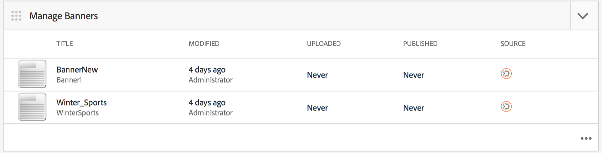

# Dashboard dell’applicazione AEM Mobile {#aem-mobile-application-dashboard}

>[!NOTE]
>
>L’Adobe consiglia di utilizzare l’Editor SPA per i progetti che richiedono il rendering lato client basato su framework di applicazione a pagina singola (ad esempio, React). [Ulteriori informazioni](/help/sites-developing/spa-overview.md).

Puoi gestire il contenuto delle app mobili e dell’applicazione da AEM Mobile Application Dashboard o dal Centro di controllo.

Per visualizzare o modificare i dettagli, è possibile eseguire il drill-through in ogni tessera del Control Center facendo clic su &#39;...&#39; nell&#39;angolo inferiore destro.

>[!NOTE]
>
>È possibile modificare l&#39;ordine delle sezioni facendo clic sull&#39;icona a forma di graffetta (in alto a sinistra di 9 punti). La modifica dell’ordine è specifica per l’utente, diversa per i singoli utenti.

La gestione dei contenuti delle app richiede uno sforzo collettivo da parte di sviluppatori, autori e amministratori di contenuti. Gli autori manipolano le pagine, che a loro volta sono basate su modelli e componenti generati dagli sviluppatori di app.

Infine, gli amministratori pubblicano in modo strategico il contenuto aggiornato dell’app.

## Sezione Gestione app {#the-manage-app-tile}

Il **Gestisci app** Nel riquadro vengono visualizzate le informazioni disponibili sull&#39;applicazione:

* Titolo
* Descrizione
* Icona
* Ultima modifica
* Ultima modifica eseguita da

## Sezione Gestisci connessione {#the-manage-connection-tile}

Il **Gestisci connessione** in questa sezione vengono visualizzate le informazioni sulla connessione ad AEM Mobile On-demand Services:

* Nome configurazione cloud
* Nome e ID progetto
* Stato della connessione

>[!NOTE]
>
>Fai clic sull’ingranaggio in alto a destra per impostare una configurazione di Mobile On-Demand Cloud.
>
>Consulta [Configurazione di Mobile On-Demand Services](/help/mobile/mobile-on-demand-associating-an-on-demand-app-to-cloud-configuration.md) per i dettagli.

## Gestione delle entità {#managing-entities}

Questi 3 riquadri forniscono una panoramica dello stato del contenuto di un’app:

* **banner**
* **articoli**
* **raccolte**

Ogni tessera può essere espansa per fornire una vista elenco più dettagliata facendo clic sui puntini di sospensione (...) nell’angolo in basso a destra. Queste viste elenco forniscono un modo alternativo per accedere alle azioni comuni di Mobile On Demand, come eliminare, caricare e modificare le proprietà.

### Sezione Gestisci banner {#the-manage-banners-tile}

Il **Gestisci banner** sezione consente di gestire il contenuto di un banner. Per un banner vengono visualizzate le seguenti informazioni:

* immagine
* **TITOLO**: nome del banner
* **MODIFICATO**: ultima modifica nell’AEM
* **CARICATO**: ultimo caricamento dall’AEM
* **PUBBLICATO**: ultima richiesta pubblicata del AEM
* **SORGENTE**: origine (AEM locale o remota da Mobile On Demand)

L&#39;immagine seguente mostra **Gestisci banner** riquadro nel dashboard applicazioni di AEM Mobile:

>[!NOTE]
>
>Consulta **[Gestione dei banner](/help/mobile/mobile-on-demand-managing-banners.md)** per creare, eliminare o aggiornare i banner.

### Sezione Gestisci articoli {#the-manage-articles-tile}

Il **Gestisci articoli** sezione consente di gestire il contenuto di un articolo. Per un articolo vengono visualizzate le seguenti informazioni:

* immagine
* **TITOLO**: nome dell’articolo
* **MODIFICATO**: ultima modifica nell’AEM
* **CARICATO**: ultimo caricamento dall’AEM
* **PUBBLICATO**: ultima richiesta pubblicata del AEM
* **SORGENTE**: sorgente (AEM locale o remota da Mobile On-Demand)

L&#39;immagine seguente mostra **Gestisci articoli** riquadro nel dashboard applicazioni di AEM Mobile:

>[!NOTE]
>
>Consulta [**Gestione degli articoli**](/help/mobile/mobile-on-demand-managing-articles.md) per creare, eliminare o aggiornare gli articoli.

### Sezione Gestisci raccolte {#the-manage-collections-tile}

Il **Gestisci raccolte** sezione consente di gestire il contenuto di una raccolta. Per una raccolta vengono visualizzate le seguenti informazioni:

* immagine
* **TITOLO**: nome della raccolta
* **MODIFICATO**: ultima modifica nell’AEM
* **CARICATO**: ultimo caricamento dall’AEM
* **PUBBLICATO**: ultima richiesta pubblicata del AEM
* **SORGENTE**: sorgente (AEM locale o remota da Mobile On-Demand)

L&#39;immagine seguente mostra **Gestisci raccolte** riquadro nel dashboard applicazioni di AEM Mobile:

>[!NOTE]
>
>Consulta **[Gestione delle raccolte](/help/mobile/mobile-on-demand-managing-collections.md)** per creare, eliminare o aggiornare le raccolte.

### Passaggi successivi {#the-next-steps}

Una volta acquisita familiarità con il dashboard dell’applicazione, consulta le seguenti risorse per creare un’app mobile:

* [Azioni di creazione e configurazione delle applicazioni](/help/mobile/mobile-apps-ondemand-application-create-configure-action.md)
* [Associazione di un’app on-demand a una configurazione cloud](/help/mobile/mobile-on-demand-associating-an-on-demand-app-to-cloud-configuration.md)
* [Azioni gestione contenuti](/help/mobile/mobile-apps-ondemand-manage-content-ondemand.md)

### Risorse aggiuntive {#additional-resources}

Per informazioni sui ruoli e sulle responsabilità di un amministratore e di uno sviluppatore, consulta le risorse seguenti:

* [Sviluppo di contenuti AEM per AEM Mobile On-demand Services](/help/mobile/aem-mobile-on-demand.md)
* [Amministrazione di contenuti per l’utilizzo di AEM Mobile On-demand Services](/help/mobile/aem-mobile.md)
