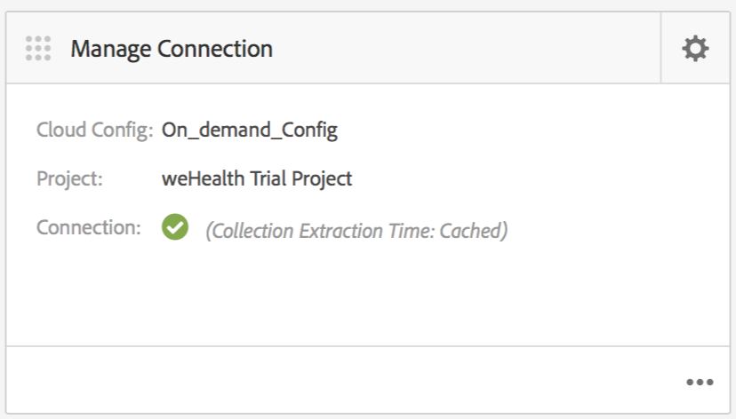

# Configurazione cloud{#cloud-configuration}

>[!NOTE]
>
> Adobe consiglia di utilizzare l&#39;editor SPA per i progetti che richiedono il rendering lato client basato sul framework dell&#39;applicazione a pagina singola (ad es. React). [Per saperne di più](/help/sites-developing/spa-overview.md).

L&#39;associazione di un&#39;app on-demand a una configurazione cloud consente ad Adobe Experience Manager (AEM) di comunicare direttamente con un progetto ospitato da Mobile On-Demand stabilendo un collegamento bidirezionale. Collegando l&#39;app a un progetto Mobile On-Demand, sarete in grado di eseguire la creazione di contenuto, come articoli, banner e raccolte all&#39;interno di AEM, ma anche di servire tale contenuto a Mobile On-Demand.

Da qui diventa possibile pubblicare, visualizzare in anteprima e gestire i contenuti. Potete anche importare contenuto Mobile On-Demand esistente in AEM ed eseguire la modifica del contenuto.

## Configurazione del cloud {#setting-up-cloud-configuration}

>[!CAUTION]
>
>Prima di iniziare a configurare la configurazione cloud per l&#39;app on-demand, è necessario avere familiarità con  provisioning AEM Mobile e configurazione  client AEM Mobile On-demand Services.
>
>Per informazioni dettagliate, vedere [Configurazione  AEM Mobile On-demand Services](/help/mobile/aem-mobile-setup.md) nella sezione Amministrazione.

Per configurare Cloud Services Mobile On-Demand, fate clic sull&#39;ingranaggio superiore nell&#39;angolo superiore destro della sezione **Gestisci connessione** dal dashboard dell&#39;app.

È necessario avere familiarità con il dashboard dell&#39;app e le sezioni disponibili. Per ulteriori informazioni, vedere [ AEM Mobile Application Dashboard](/help/mobile/mobile-apps-ondemand-application-dashboard.md).

### Configurazione del collegamento alla configurazione cloud {#setting-up-link-to-cloud-configuration}

>[!CAUTION]
>
>Accertatevi di disporre di un client on-demand e di una configurazione cloud esistenti.
>
>Per informazioni dettagliate, vedere [Configurazione  AEM Mobile On-demand Services](/help/mobile/aem-mobile-setup.md) nella sezione Amministrazione.

Nei passaggi seguenti viene descritta la configurazione del collegamento alla configurazione cloud:

1. Da **Mobile**, scegliete **App**, quindi l&#39;app Mobile On-Demand dal catalogo.
1. Fare clic sull&#39;icona a forma di ingranaggio nella sezione **Gestisci connessione**.

   

1. Immettere la configurazione già esistente o crearne una nuova immettendo il **Titolo configurazione**, **ID dispositivo** e **Token dispositivo**.

   

1. Dopo aver verificato **ID dispositivo** e **Token dispositivo**, scegliete il progetto on-demand dall&#39;elenco.

   Fare clic su **Invia**.

   

   La sezione **Gestisci connessione** mostra la configurazione cloud.

   

   >[!CAUTION]
   >
   >Se provate a modificare il progetto a cui è associata l&#39;app, durante il passaggio al progetto nel dashboard, riceverete un avviso per i problemi di integrità del contenuto come mostrato nella figura seguente:

   

### Passaggi successivi {#the-next-steps}

Dopo aver configurato la configurazione cloud per l&#39;app, consulta le seguenti risorse per la gestione del contenuto:

* [Gestione degli articoli](/help/mobile/mobile-on-demand-managing-articles.md)
* [Gestione dei banner](/help/mobile/mobile-on-demand-managing-banners.md)
* [Gestione delle raccolte](/help/mobile/mobile-on-demand-managing-collections.md)
* [Caricamento delle risorse condivise](/help/mobile/mobile-on-demand-shared-resources.md)
* [Pubblicazione/annullamento della pubblicazione del contenuto](/help/mobile/mobile-on-demand-publishing-unpublishing.md)
* [Anteprima con verifica preliminare](/help/mobile/aem-mobile-manage-ondemand-services.md)
