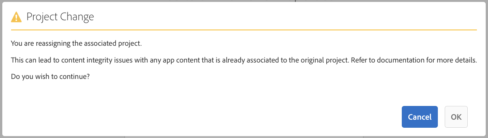

# Configurazione cloud{#cloud-configuration}

>[!NOTE]
>
>L’Adobe consiglia di utilizzare l’Editor SPA per i progetti che richiedono il rendering lato client basato su framework di applicazione a pagina singola (ad esempio, React). [Ulteriori informazioni](/help/sites-developing/spa-overview.md).

L’associazione di un’app on-demand a una configurazione cloud consente a Adobe Experience Manager (AEM) di comunicare direttamente con un progetto ospitato da Mobile On-Demand creando un collegamento bidirezionale. Collegando l’app a un progetto Mobile On-Demand, potrai creare contenuti, ad esempio articoli, banner e raccolte nell’ambito dell’AEM, e distribuirli a Mobile On-Demand.

Da qui, diventa possibile pubblicare, visualizzare in anteprima e gestire i contenuti. Puoi anche importare contenuti Mobile On-Demand esistenti in AEM ed eseguire modifiche al contenuto.

## Configurazione della configurazione cloud {#setting-up-cloud-configuration}

>[!CAUTION]
>
>Prima di iniziare a configurare la configurazione cloud per l’app On-Demand, è necessario avere familiarità con il provisioning e la configurazione di AEM Mobile AEM Mobile On-demand Services Client.
>
>Per ulteriori informazioni, consulta [Configurazione di AEM Mobile On-demand Services](/help/mobile/aem-mobile-setup.md) nella sezione Amministrazione.

Per configurare i Cloud Service Mobile On-Demand, fai clic sull’ingranaggio in alto a destra della schermata **Gestisci connessione** affiancare dal dashboard dell’app.

Dovresti avere familiarità con il dashboard dell’app e i riquadri disponibili. Consulta [Dashboard dell’applicazione AEM Mobile](/help/mobile/mobile-apps-ondemand-application-dashboard.md) per ulteriori dettagli.

### Configurazione del collegamento alla configurazione cloud {#setting-up-link-to-cloud-configuration}

>[!CAUTION]
>
>Assicurati di disporre di una configurazione cloud e client on-demand esistente.
>
>Per ulteriori informazioni, consulta [Configurazione di AEM Mobile On-demand Services](/help/mobile/aem-mobile-setup.md) nella sezione Amministrazione.

I passaggi seguenti descrivono la configurazione del collegamento alla configurazione cloud:

1. Da **Dispositivi mobili**, scegli **App** e poi la tua app Mobile On-Demand dal catalogo.
1. Fai clic sull’icona a forma di ingranaggio nella **Gestisci connessione** affiancare.

   

1. Inserisci la configurazione esistente o creane una immettendo il **Titolo configurazione**, **ID dispositivo**, e **Token dispositivo**.

   

1. Una volta **ID dispositivo** e **Token dispositivo** sono verificati, scegli il tuo progetto on-demand dall’elenco.

   Fai clic su **Invia**.

   

   Il **Gestisci connessione** mostra la configurazione cloud.

   

   >[!CAUTION]
   >
   >Se tenti di modificare il progetto a cui è associata questa app, durante il passaggio da un progetto all’altro nel dashboard, riceverai un avviso per i problemi di integrità del contenuto, come illustrato nella figura seguente:

   

### Passaggi successivi {#the-next-steps}

Dopo aver configurato la configurazione cloud per l’app, consulta le seguenti risorse per la gestione dei contenuti:

* [Gestione degli articoli](/help/mobile/mobile-on-demand-managing-articles.md)
* [Gestione dei banner](/help/mobile/mobile-on-demand-managing-banners.md)
* [Gestione delle raccolte](/help/mobile/mobile-on-demand-managing-collections.md)
* [Caricamento delle risorse condivise](/help/mobile/mobile-on-demand-shared-resources.md)
* [Pubblicazione/annullamento della pubblicazione del contenuto](/help/mobile/mobile-on-demand-publishing-unpublishing.md)
* [Anteprima con verifica preliminare](/help/mobile/aem-mobile-manage-ondemand-services.md)
