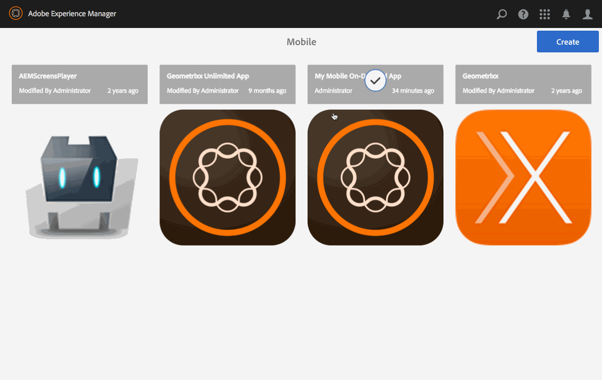

# Gestione degli articoli{#managing-articles}

>[!NOTE]
>
>L’Adobe consiglia di utilizzare l’Editor SPA per i progetti che richiedono il rendering lato client basato su framework di applicazione a pagina singola (ad esempio, React). [Ulteriori informazioni](/help/sites-developing/spa-overview.md).

Le azioni di gestione dei contenuti sono gli elementi costitutivi che consentono di creare e gestire gli articoli all’interno di un’applicazione. Le seguenti azioni vengono eseguite sugli articoli all’interno dell’applicazione.

## Panoramica degli articoli {#articles-overview}

Gli articoli rappresentano il testo basato sull&#39;arte per trasmettere informazioni.

>[!NOTE]
>
>Consulta le seguenti risorse nella Guida in linea per scoprire i seguenti argomenti nelle app AEM Mobile:
>
>* [Considerazioni di progettazione](https://helpx.adobe.com/digital-publishing-solution/help/design-app.html)
>
>* [Gestione degli articoli](https://helpx.adobe.com/digital-publishing-solution/help/creating-articles.html)
>

## Creazione di un articolo {#creating-an-article}

Il flusso di lavoro generale per la creazione di un articolo è il seguente:

1. Seleziona **Dispositivi mobili** dalla barra laterale.
1. In Mobile, scegli la tua app Mobile On-Demand dal catalogo.
1. Fare clic sulla freccia rivolta verso il basso nell&#39;angolo superiore destro della **Gestisci articoli** affiancare.
1. Scegli un modello di articolo e fai clic su **Successivo**.
1. Segui i passaggi della procedura guidata per continuare a creare il nuovo articolo.
1. Quando è pronto, fai clic su **Crea**.
1. Il nuovo articolo viene visualizzato in **Gestisci articoli** affiancare.

## Importazione di un nuovo articolo {#importing-a-new-article}

Il contenuto Mobile On-Demand esistente può essere scaricato (importato) da Mobile On-Demand a AEM. Ciò consente di modificare e visualizzare contenuti locali.

>[!NOTE]
>
>L&#39;importazione non include immagini.

Flusso di lavoro per importare un nuovo articolo

1. In Mobile, scegli la tua app Mobile On-Demand dal catalogo.
1. Fare clic sulla freccia rivolta verso il basso nell&#39;angolo superiore destro della **Gestisci articoli** affiancare e selezionare Importa articoli.
1. Clic **Importa articoli** nella finestra di dialogo, quindi Chiudi.
1. Gli articoli Mobile On-Demand vengono ora visualizzati nel **Gestisci articoli** affiancare.

>[!CAUTION]
>
>Associate prima una connessione Mobile On-Demand.

## Modifica di un articolo {#editing-an-article}

Utilizza l’editor integrato di trascinamento AEM per aggiungere o modificare un articolo. È possibile aggiungere/rimuovere componenti quali testo e immagini. È possibile inserire immagini da Risorse DAM.

>[!CAUTION]
>
>Solo gli articoli creati nell’AEM possono essere aperti nell’editor.

Flusso di lavoro per modificare un articolo:

1. In Mobile, scegli la tua app Mobile On-Demand dal catalogo.
1. Seleziona un articolo originato da AEM dalla sezione **Gestisci articoli** affiancare.
1. Fai clic sull’articolo evidenziato dalla vista a elenco per aprirlo nell’editor di contenuti.
1. Utilizza l’editor dei contenuti per trascinare il contenuto degli articoli (manoscritti, immagini, testo e così via).

### Visualizzazione e modifica dei metadati all’interno di un articolo {#viewing-and-editing-the-metadata-within-an-article}

Contenuti come articoli, banner e così via hanno numerose proprietà come titoli, descrizioni, immagini. Questa azione viene utilizzata per visualizzare e modificare tali proprietà. Facoltativamente, queste modifiche possono essere caricate su Mobile On-Demand al momento del salvataggio.

Il flusso di lavoro generale per visualizzare/modificare un articolo:

1. In Mobile, scegli la tua app Mobile On-Demand dal catalogo.
1. Scegli un articolo dalla **Gestisci articoli** affiancare.

1. Seleziona **Visualizza proprietà** dalla barra delle azioni.
1. Visualizza tutti i metadati disponibili per tale articolo.
1. Se necessario, modifica i metadati e fai clic su **Salva** al termine.
1. Se necessario, carica le modifiche immediatamente in Mobile On-Demand.

## Caricare un articolo {#uploading-an-article}

L’azione di caricamento copia il contenuto selezionato e lo aggiunge a un progetto Mobile On-Demand. Il contenuto Mobile On-Demand esistente viene sostituito dalla nuova versione.

Il flusso di lavoro generale per caricare un articolo:

1. Da **Dispositivi mobili**, scegli la tua app Mobile On-Demand dal catalogo.
1. In **Gestisci articoli** , seleziona un articolo da caricare su Mobile On-Demand.
1. Se necessario, aggiungi altri articoli dalla vista a elenco.
1. Seleziona **Carica** dalla barra delle azioni, fai clic su Carica nella finestra di dialogo.
1. I tuoi articoli sono ora caricati su Mobile On-Demand.

## Eliminazione di un articolo {#deleting-an-article}

Questa operazione elimina il contenuto selezionato da Mobile On-Demand e, facoltativamente, dall’istanza AEM locale.

Flusso di lavoro generale per eliminare un articolo:

1. In Mobile, scegli la tua app Mobile On-Demand dal catalogo.
1. Seleziona l’articolo da eliminare nel **Gestisci articoli** affiancare.
1. Assicurati che sia selezionato nell’elenco; seleziona gli altri da eliminare in base alle esigenze.
1. Clic **Elimina** dalla barra delle azioni.
1. Seleziona questa opzione se desideri eliminarla da AEM e Mobile On-Demand.
1. Fai clic su **Elimina**.
1. L&#39;articolo è stato rimosso dall&#39;elenco.

### Passaggi successivi {#the-next-steps}

Per informazioni sulla gestione degli articoli, consulta

* [Gestione dei banner](/help/mobile/mobile-on-demand-managing-banners.md)
* [Gestione delle raccolte](/help/mobile/mobile-on-demand-managing-collections.md)
* [Caricamento delle risorse condivise](/help/mobile/mobile-on-demand-shared-resources.md)
* [Pubblicazione/annullamento della pubblicazione del contenuto](/help/mobile/mobile-on-demand-publishing-unpublishing.md)
* [Anteprima con verifica preliminare](/help/mobile/aem-mobile-manage-ondemand-services.md)
