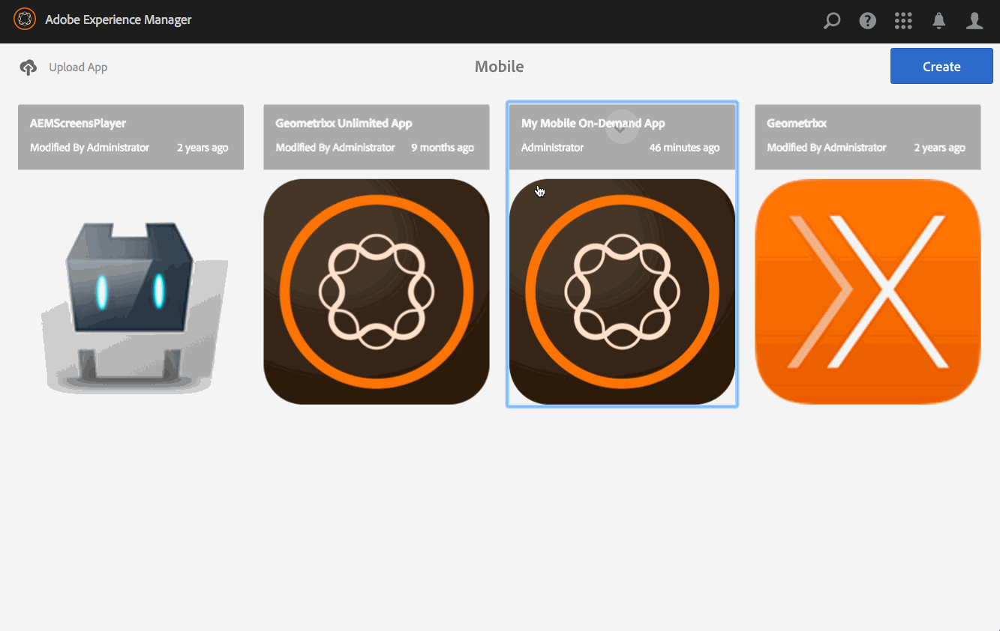

# Pubblicare un contenuto di annullamento pubblicazione{#publish-unpublish-content}

>[!NOTE]
>
>Adobe consiglia di utilizzare l’editor di SPA per i progetti che richiedono il rendering lato client basato sul framework di un’applicazione a pagina singola (ad esempio, React). [Per saperne di più](/help/sites-developing/spa-overview.md).

Una volta acquisita familiarità con le azioni di gestione dei contenuti su articoli, banner e raccolte, puoi pubblicare i contenuti. Puoi anche annullare la pubblicazione dei contenuti.

>[!NOTE]
>
>Per ulteriori informazioni sulle considerazioni di progettazione per le app AEM Mobile, consulta [Considerazioni sulla progettazione per le app AEM Mobile](https://helpx.adobe.com/digital-publishing-solution/help/design-app.html) nella Guida in linea.

## Pubblicazione/annullamento della pubblicazione del contenuto {#publishing-unpublishing-the-content}

Ciò è diverso da una &quot;pubblicazione AEM&quot;. Non stiamo inviando i contenuti a un’istanza del server AEM Publish per renderli pubblicamente visibili. In questo caso, stiamo informando Mobile On-Demand che il contenuto selezionato debba essere reso pubblico all’interno dell’app Mobile On-Demand in tempo reale.

>[!NOTE]
>
>Il contenuto deve essere caricato su Mobile On-Demand prima di poter essere pubblicato.

Flusso di lavoro generale per pubblicare/annullare la pubblicazione di un articolo:

1. Da Mobile, scegli l’app Mobile On-Demand dal catalogo.
1. Seleziona un articolo.
1. Se necessario, aggiungete altri articoli dalla vista a elenco.
1. Seleziona Pubblica nella barra delle azioni. Dopo alcuni istanti, i vostri articoli saranno ora pubblici.
1. Utilizza gli stessi passaggi precedenti per annullare la pubblicazione degli articoli.

<!-- FAIL >>[!NOTE]
>
>Generally, you should preflight before publishing. See [Previewing with Preflight](/content/docs/en/aem/6-3/administer/mobile-apps/aem-mobile/previewing-with-preflight-on-demand-services.md) for more details.-->

### Passaggi successivi {#the-next-steps}

Una volta appresa la creazione e la pubblicazione dei contenuti, consulta

* [Sviluppo di contenuti AEM per AEM Mobile On-demand Services](/help/mobile/aem-mobile-on-demand.md)
* [Amministrazione di contenuti per l’utilizzo di AEM Mobile On-demand Services](/help/mobile/aem-mobile.md)

Oppure è necessario conoscere gli argomenti relativi all’authoring, consulta

[Creazione di contenuti AEM per le app AEM Mobile On-demand Services](/help/mobile/mobile-apps-ondemand.md)
