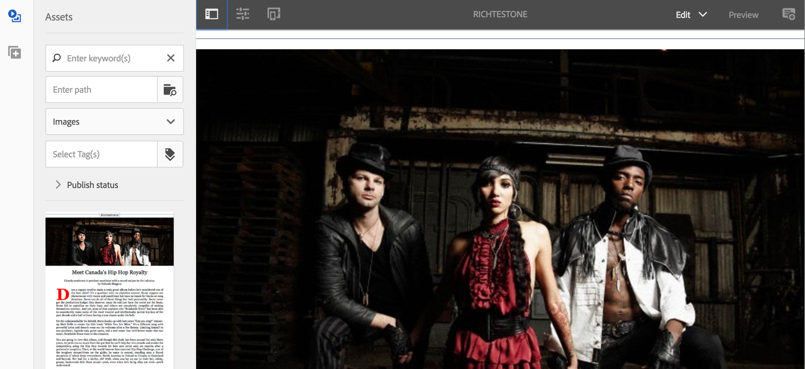

# Creazione e aggiunta di modelli e componenti {#creating-and-adding-templates-and-components}

>[!NOTE]
>
>L’Adobe consiglia di utilizzare l’Editor SPA per i progetti che richiedono il rendering lato client basato su framework di applicazione a pagina singola (ad esempio, React). [Ulteriori informazioni](/help/sites-developing/spa-overview.md).

AEM Mobile On-Demand fornisce un modello di app, un modello di articolo e componenti per articoli completamente configurati.

L&#39;app We.Unlimited è un modello di esempio che rappresenta la shell di un&#39;applicazione AEM Mobile On-Demand completamente configurabile e gestibile.

La selezione di questo modello di esempio durante la creazione di un’app offre una dashboard con funzioni avanzate di AEM Mobile.

>[!NOTE]
>
>Per gestire il contenuto delle applicazioni e delle app mobili da AEM Mobile Apps Control Center, vedi [Dashboard dell’applicazione AEM Mobile](/help/mobile/mobile-apps-ondemand-application-dashboard.md).

## Creazione di modelli di app {#creating-app-templates}

Un modello di app viene utilizzato per creare un’app e funge da raccolta di modelli di pagina e componenti che rappresentano una linea di base o le basi di un’app. Il modello timbra alcune proprietà fondamentali per condurre l’app nel modo appropriato. In generale, un cliente non creerebbe troppe app in totale.

I modelli di app offrono un modo semplice di utilizzare le progettazioni esistenti create dagli sviluppatori e utilizzate per la creazione di nuove app nell’ambito dell’AEM.

Quando crei un’app basata sul modello di un’altra app, otterrai un’app con un punto di partenza rappresentativo dell’app da cui è stata creata.

Passaggi per creare un’app basata su un modello di app:

1. Passa al catalogo delle app AEM Mobile: *&lt;server-url>/aem/apps.html/content/mobileapps*
1. Seleziona **Crea** —> **App** come mostrato di seguito

Dopo aver creato un’app utilizzando questo modello, puoi aggiungere all’app articoli, banner e raccolte. Per rivedere, creare articoli, banner e raccolte, consulta [Azioni gestione contenuti](/help/mobile/mobile-apps-ondemand-manage-content-ondemand.md).

>[!NOTE]
>
>In alternativa, puoi anche selezionare un modello di app di esempio, ad esempio, **We.Unlimited** , messo a tua disposizione da uno sviluppatore AEM. Se utilizzi questo modello di esempio per la tua app, otterrai alcuni articoli e raccolte di esempio su cui lavorare. Potrai utilizzare i modelli e i componenti di esempio, personalizzare quelli esistenti o crearne di nuovi per la tua app.

>[!CAUTION]
>
>Impostazione ***redirectTarget*** proprietà
>
>Quando utilizza uno dei modelli di app, lo sviluppatore definisce il contenuto dell’applicazione. Tuttavia, lo sviluppatore deve sapere dove viene creata l’applicazione nel file jcr e il valore di ***redirectTarget*** proprietà.
>
>Il ***redirectTarget*** viene calcolato come parte dell’operazione create app e tenta di risolvere un percorso, se nel modello di app è disponibile una proprietà redirectTarget e il valore di redirectTarget è definito come relativo. Quando il processo di creazione dell&#39;app trova un valore relativo per redirectTarget nel modello di app, il valore viene aggiunto alla posizione risolta di creazione dell&#39;app.
>
>Ad esempio, se un modello di app definisce un ***redirectTarget*** con un valore di &quot;*master di lingua/it*&quot;, e l’app è stata creata in &quot;*/content/mobileapps/fooApp*&quot;, il valore finale per redirectTarget dopo la creazione dell’app sarà &quot;*/content/mobileapps/fooApp/language-masters/it*&quot;.
>

## Creazione di modelli di contenuto {#creating-content-templates}

Ogni tipo di entità dispone di due modelli predefiniti. Secondo questi principi, il contenuto deve essere:

* **Modelli predefiniti:** utilizzato per la creazione di contenuti con proprietà/struttura predefinite applicabili
* **Modelli importati:** utilizzato per importare contenuto da AEM Mobile con proprietà/struttura predefinite applicabili

### Modelli di articolo {#article-templates}

L’articolo Unlimited è un modello di esempio che rappresenta un layout di articolo AEM Mobile On-Demand tipico.

1. In entrata **Gestisci articoli**, seleziona **+**  per creare un articolo. Puoi scegliere una delle seguenti opzioni: **Articolo Unlimited** o un **Articolo Rich Text**. L’immagine seguente mostra l’opzione che consente di scegliere uno di questi due modelli di articolo.

1. Clic **Successivo** per definire i metadati di un articolo, ad esempio nome/titolo dell’articolo, descrizione, autore, riassunto, reparto, immagine miniatura, accesso all’articolo e così via.
1. Clic **Successivo** per compilare le Proprietà annuncio.
1. Clic **Successivo** per inserire l&#39;immagine dell&#39;articolo o l&#39;immagine del social media
1. Clic **Successivo** per scegliere una raccolta, collega questo nuovo articolo a.
1. Clic **Successivo** per inserire i dettagli per la condivisione tramite social network.
1. Clic **Crea** per completare il processo di creazione di un articolo utilizzando l&#39;esempio. Fai clic su **Fine** o **Modifica articolo** per modificare le proprietà di questo articolo.

### Aggiunta di componenti all’articolo {#adding-components-to-article}

Una volta creato, un autore può modificare il contenuto di un articolo aggiungendo componenti come testo e immagini. Gli articoli sono un’estensione dei modelli di pagina dell’AEM.

Seleziona un articolo da modificare e fai clic su **Modifica** per aggiungere componenti all’articolo.

 

Scegli il &#39;**+**&quot; nel pannello a sinistra per aggiungere componenti all’articolo.

### Creazione di modelli predefiniti {#creating-out-of-the-box-templates}

Non sono presenti modelli di articolo predefiniti, tuttavia è disponibile un modello predefinito che i modelli personalizzati devono estendere, vedi la sezione dell’app Geometrixx Unlimited [Esempio di modello di articolo](http://localhost:4502/crx/de/index.jsp#/apps/geometrixx-unlimited-app/templates/article).

Le proprietà chiave oltre il normale modello AEM richiesto includono:

***dps-resourceType=&quot;dps:Article&quot;***

Questa proprietà assicura che la pagina AEM sia riconosciuta come pagina di articolo di destinazione di AEM Mobile.

In base ai modelli AEM, puoi aggiungere tutte le proprietà predefinite o i nodi secondari al ***jcr:content***.

### Banner e modelli di raccolta {#banner-and-collection-templates}

>[!CAUTION]
>
>I banner e le raccolte non hanno contenuto, pertanto la loro creazione non supporta i modelli personalizzati.

## Creazione e aggiunta di componenti {#creating-and-adding-components}

I componenti utilizzano e consentono l’accesso ai widget che vengono utilizzati per eseguire il rendering del contenuto.

Un componente semplice è incluso nell’archivio del codice, la cui origine è reperibile in AEM. Successivamente può essere aperto anche a livello locale in CRXDE Lite.

>[!NOTE]
>
>Non sono attualmente disponibili componenti predefiniti per AEM Mobile.
>

Puoi aggiungere componenti alla pagina. Qualsiasi componente può essere utilizzato in un’app AEM Mobile, ma se applicato potrebbe non essere riprodotto correttamente.

Tuttavia, i componenti personalizzati potrebbero non esportare e caricare correttamente in AEM Mobile On-demand Services senza un gestore di sincronizzazione del contenuto di esportazione personalizzato con rendering in AEM.

Una volta che il componente è già stato incluso in una pagina AEM, insieme ad alcuni altri componenti del blocco predefinito, puoi aggiungerne un altro alla pagina o modificarne uno esistente.

**Per aggiungere un altro componente alla pagina:**

1. Scegli quella pagina e accertati di essere in modalità Modifica, tramite il menu a discesa in alto a destra dell’intestazione dell’editor
1. Attiva/disattiva il pannello laterale utilizzando l’icona più a sinistra nell’intestazione dell’editor
1. Seleziona la **Componenti** scheda
1. Trascina uno dei componenti disponibili nella pagina

**Per modificare un componente esistente:**

1. Scegli quella pagina e assicurati di essere in **Modifica** e seleziona il componente
1. Tocca l’icona chiave inglese per configurare il componente

>[!NOTE]
>
>Puoi creare un componente in AEM e personalizzarlo utilizzando [Sviluppo con CRXDE Liti](/help/sites-developing/developing-with-crxde-lite.md). Dopo aver personalizzato il componente esistente in base alle tue esigenze, puoi aggiungerlo alla pagina utilizzando **Modifica** opzione in **Gestisci articoli** come illustrato nella figura precedente.

>[!NOTE]
>
>Fai riferimento a [Best practice per lo sviluppo di modelli e componenti](/help/mobile/best-practices-aem-mobile.md) in AEM Mobile.

### Passaggi successivi {#the-next-steps}

* [Utilizzo delle proprietà del contenuto per esportare il contenuto](/help/mobile/on-demand-content-properties-exporting.md)
* [Dispositivi mobili con sincronizzazione contenuti](/help/mobile/mobile-ondemand-contentsync.md)
