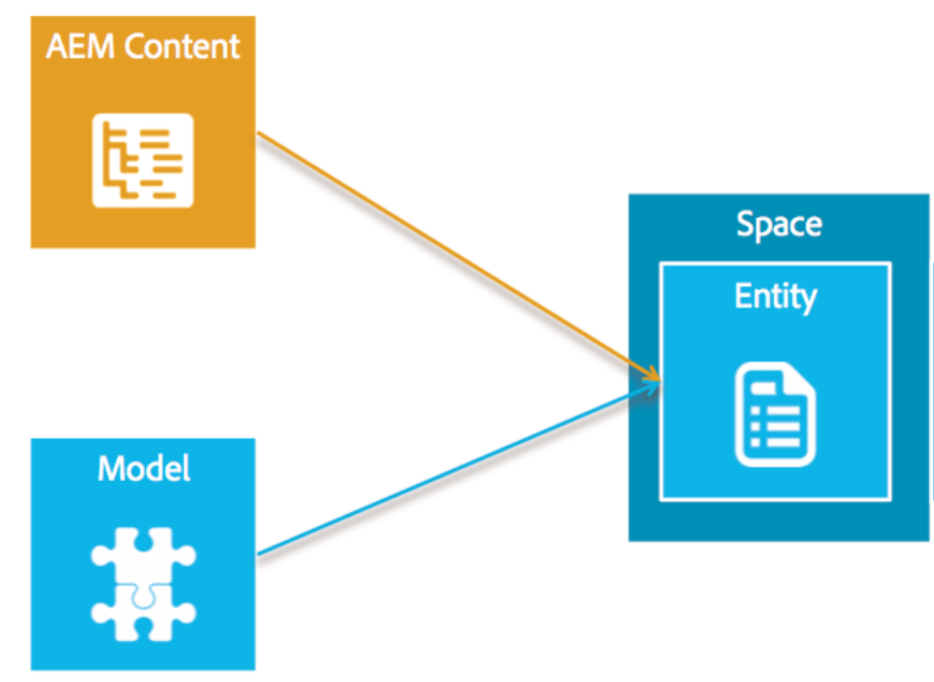

# Panoramica dei modelli{#models-overview}

>[!NOTE]
>
>L’Adobe consiglia di utilizzare l’Editor SPA per i progetti che richiedono il rendering lato client basato su framework di applicazione a pagina singola (ad esempio, React). [Ulteriori informazioni](/help/sites-developing/spa-overview.md).

La gestione dei modelli comporta la creazione e la gestione di modelli allo scopo di associarli a eventuali oggetti dati. Ogni modello include tutte le proprietà e le definizioni dei campi necessarie per facilitare la creazione e il rendering degli oggetti.

Gestione dei modelli comporta la creazione di **modelli**, **entità**, e **spazi**. Il diagramma seguente illustra la relazione tra il contenuto dell’AEM e i modelli.

## Il modello di contenuto {#the-content-model}

Un modello descrive il tipo di contenuto e indica quali informazioni saranno disponibili per l&#39;applicazione nativa. È una descrizione di ciò che costituisce un contenuto. Un modello di contenuto è costituito dalle regole per la creazione di un contenuto. Il modello di contenuto include i dati disponibili, le risorse utilizzabili, la relazione tra risorse e dati, la relazione con altri modelli di contenuto e i metadati disponibili.

I modelli fungono anche da modo per trasformare i contenuti AEM esistenti in oggetti che possono essere facilmente utilizzati dalle app native per dispositivi mobili.

Content Services fornisce alcuni modelli predefiniti per gli oggetti più comuni, ad esempio risorse, raccolte di risorse, pagine HTML, configurazioni di app e pagine indipendenti dal canale. Questi saranno configurabili in modo da soddisfare le esigenze specifiche dei clienti senza richiedere attività di sviluppo AEM.

L’utente può creare i propri modelli. In questo modo è possibile creare nuovi tipi di contenuto non ancora gestiti dall’AEM. La creazione del modello viene eseguita tramite un&#39;interfaccia utente che utilizza i tipi primitivi esistenti.

Il diagramma seguente illustra il modello di contenuto per le app AEM Mobile e il modo in cui entità, cartelle e spazi vengono assegnati a un’app.

### Modelli {#the-models}

I modelli vengono utilizzati per determinare la modalità di creazione delle entità. Definiscono cosa è disponibile in un’entità e come quei dati vengono generati dal contenuto dell’AEM. Prima di iniziare a lavorare con spazi, cartelle ed entità, è necessario avere familiarità con la creazione e la gestione dei modelli.

>[!NOTE]
>
>Esiste un modello all’esterno di un’app, poiché può essere utilizzato da più app.

Consulta **[Modelli](/help/mobile/administer-mobile-apps.md)** per creare e gestire modelli nel dashboard e nell’archivio.

### Entità nel modello di contenuto {#entities-in-content-model}

Un&#39;entità è un&#39;istanza di un modello di contenuto. Un’entità viene esposta alla libreria lato client tramite l’API di Content Services e consente a un’app nativa di accedere al contenuto in modo indipendente dal canale.

Nel caso di contenuti AEM esistenti, un’entità viene generata utilizzando un modello e la fonte di contenuti AEM. Ad esempio, un’entità pagina è un oggetto indipendente dal canale e dal layout generato da una pagina AEM e dal modello della pagina.

Le modifiche al contenuto di riferimento di un’entità determineranno una modifica dell’entità. Ad esempio, se un *cq:page* viene aggiornato, verranno aggiornate anche tutte le entità basate su tale pagina.

Consulta **[Utilizzo delle entità](/help/mobile/spaces-and-entities.md)** per creare entità personalizzate dai modelli.

>[!NOTE]
>
>Se il modello non corrisponde a un contenuto AEM esistente, ad esempio il cliente ha creato un nuovo modello, sarà disponibile un’interfaccia utente che consentirà al cliente di creare una nuova entità.

### Spazi nel modello di contenuto {#spaces-in-content-model}

Viene utilizzato uno spazio per organizzare le entità in modo da semplificarne l&#39;accesso. Uno spazio può contenere uno o più tipi di entità e può contenere sottocartelle.

Sul lato AEM, uno spazio è un modo conveniente per gestire le entità correlate. Può anche essere utilizzato per assegnare autorizzazioni di autorizzazione. È possibile autorizzare uno spazio, che proteggerà quindi le entità che si trovano in tale spazio.

*Ad esempio*,

Un utente dispone di tre classificazioni generali di entità. Una è solo per uso interno, un’altra è approvata per l’uso pubblico e ancora una terza è per le entità comuni utilizzate da molte app. Per semplificarne la gestione, l’utente crea tre spazi: *interno*, *pubblico* (con contenuti sia in inglese che in francese), e *comune* per la gestione delle entità appropriate, come indicato di seguito:

* /content/entities/internal
* /content/entities/public/it
* /content/entities/public/fr
* /content/entities/common

Verrà fornito un endpoint di servizio allo spazio in modo che la libreria client nativa possa richiedere un elenco dei contenuti di uno spazio. Questa &quot;voce&quot; verrà restituita come oggetto JSON.

Consulta **[Spazi ed entità](/help/mobile/spaces-and-entities.md)** per creare e pubblicare spazi.

>[!NOTE]
>
>Uno spazio può essere utilizzato da molte app e un&#39;app può utilizzare più spazi.

### Cartelle nel modello di contenuto {#folders-in-content-model}

Le cartelle consentono agli utenti di organizzare le entità in base alle esigenze e facilitano un controllo ACL più preciso. Gli spazi possono includere cartelle per organizzare ulteriormente il contenuto e le risorse dello spazio. Un utente può creare la propria gerarchia sotto uno spazio.

Consulta **[Utilizzo delle cartelle in uno spazio](/help/mobile/spaces-and-entities.md)** per creare e gestire cartelle all&#39;interno di uno spazio.
