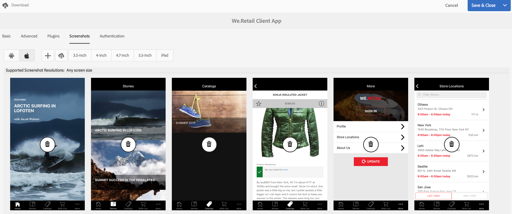

# Gestisci sezione app{#manage-app-tile}

>[!NOTE]
>
>L’Adobe consiglia di utilizzare l’Editor SPA per i progetti che richiedono il rendering lato client basato su framework di applicazione a pagina singola (ad esempio, React). [Ulteriori informazioni](/help/sites-developing/spa-overview.md).

Il **Gestisci app** Il riquadro nel dashboard delle app consente di modificare i dettagli dell’applicazione. Per aprire la pagina Dettagli, fai clic sul collegamento dei dettagli del riquadro Gestisci app. Dalla pagina Gestisci app puoi modificare le impostazioni di configurazione dell&#39;applicazione PhoneGap (config.xml) e preparare l&#39;applicazione per l&#39;invio ai vari archivi dell&#39;applicazione.


## Informazioni sulla sezione Gestione app {#understanding-the-manage-app-tile}

Puoi eseguire il drill-through in ogni sezione della **Gestisci app** per visualizzare o modificare i dettagli fai clic su &quot;...&quot; nell’angolo in basso a destra.

### Scheda Base {#the-basic-tab}

Puoi modificare i **Nome**, **Autore**, **Descrizione breve** e **Descrizione** per la tua app da questa scheda.


### Scheda Avanzate {#the-advanced-tab}

Ogni piattaforma di applicazioni mobili descrive i dati raccolti, con targeting specifico per ogni archivio applicazioni.

Le piattaforme visualizzate sono guidate dal contenuto config.xml di PhoneGap:

```xml
<widget>
<gap:platform name="ios"/>
<gap:platform name="android"/>
</widget>
```

Per visualizzare i dettagli dell’applicazione ai clienti, ogni negozio di applicazioni del fornitore, ad esempio Apple App Store o Google Play Store, richiede una o più schermate dell’app mobile. Queste schermate possono avere requisiti rigidi relativi a dimensioni e contenuto (in pratica devono rappresentare realmente l’applicazione). Le app AEM supportano la selezione e la gestione di queste schermate per le piattaforme supportate e la visualizzazione delle dimensioni delle porte in base alle esigenze dell&#39;archivio applicazioni di ciascun fornitore.

>[!NOTE]
>
>L’app AEM Verify consente di inviare screenshot direttamente ai dettagli dell’app nell’AEM.
>
>Consulta [Mobile Quickstart per la verifica dell’AEM](/help/mobile/phonegap-mobile-quickstart.md) per ulteriori dettagli.


### Metadati {#metadata}

>[!NOTE]
>
>Una volta acquisita familiarità con **Gestisci app** sezione, vedi [Modifica dei metadati dell’app](/help/mobile/phonegap-editmetadata.md) per visualizzare e modificare i metadati.

#### Metadati comuni {#common-metadata}

A ogni applicazione devono essere associati metadati che facilitano la configurazione di diversi aspetti dell’applicazione. La pagina Gestione app è separata in due aree diverse relative alla raccolta dei metadati. Metadati specifici della piattaforma e metadati comuni.

Tutte le piattaforme dispongono di una configurazione e di metadati comuni.

In questa sezione puoi definire l’URL del server di aggiornamento dei contenuti, la pagina di destinazione dell’app mobile, la versione di PhoneGap da compilare, la versione dell’applicazione, il nome, la descrizione e altro ancora.

**Versione app** è la versione funzionante dell’applicazione. Si consiglia di utilizzare una notazione a 3 decimali e iniziare al di sotto di 1.0.0 prima della prima versione.

**Versione PhoneGap** è la versione in cui desideri compilare l’applicazione con PhoneGap. Si consiglia di mantenere la versione corrente per essere certi di ottenere le funzioni e le correzioni di bug più recenti e avanzate.

**URL server di aggiornamento contenuti** è l&#39;URL che verrà utilizzato dall&#39;applicazione per richiamare gli aggiornamenti di ContentSync. Deve essere impostato sull’URL del dispatcher o, se non lo si utilizza, su una delle istanze di pubblicazione che verranno utilizzate per distribuire gli aggiornamenti ContentSync all’applicazione.


>[!NOTE]
>
>Questa sezione può apparire vuota a meno che non siano presenti dati che popolano i campi.
>
>Nella parte superiore della visualizzazione dei dettagli, sono visibili la versione dell’applicazione, la versione di PhoneGap e l’URL di aggiornamento; ciascuno di questi valori può essere impostato nella sezione Metadati comuni. Tuttavia, non è possibile modificare l’ID applicazione.

#### Metadati piattaforma {#platform-metadata}

Ogni piattaforma definita nel file config.xml di PhoneGap può contenere proprietà di piattaforma personalizzate. Uno sviluppatore AEM deve contribuire con la struttura del contenuto per acquisire queste proprietà. Un esempio fornito di proprietà specifiche per la piattaforma è disponibile per iOS.

Ora i metadati per tutte le piattaforme configurate vengono visualizzati contemporaneamente nella scheda Avanzate del riquadro Gestione app.

>[!NOTE]
>
>Le sezioni dei metadati della piattaforma non vengono utilizzate da PhoneGap durante una build CLI o Remote PhoneGap, ma l’AEM tenta di acquisire i metadati per le piattaforme in modo che possano essere utilizzati in un secondo momento durante l’invio all’archivio applicazioni del fornitore di destinazione.

Per le piattaforme che non sono comprese dall’AEM, uno sviluppatore AEM può comunque estendere l’interfaccia utente per acquisire questi metadati, che in seguito possono essere esportati e utilizzati durante il processo di invio delle applicazioni.

#### Metadati iOS {#ios-metadata}

Per inviare l&#39;applicazione per la distribuzione, Apple AppStore richiede metadati aggiuntivi. La sezione metadati di iOS tenta di raccogliere le informazioni richieste che possono essere utilizzate dallo strumento iTMSTransporter di Apple per pubblicare i metadati sull’account dello sviluppatore Apple associato.

Per ottenere i metadati specifici di Apple, devi prima creare l’applicazione su [https://itunesconnect.apple.com](https://itunesconnect.apple.com/). Al momento della creazione dell’applicazione, Apple genera i metadati richiesti dalla sezione dei metadati di iOS se desideri utilizzare lo strumento Apple iTMSTransporter per convalidare e caricare i metadati in itunesconnect.apple.com. Se desideri solo ottenere i metadati da raccogliere, non devi necessariamente compilare i metadati specifici di iOS. Puoi comunque esportare i metadati che uniranno iOS e i metadati comuni e raccogliere tutte le schermate in un file zip scaricabile in qualsiasi momento.

Il file zip scaricato contiene un file itmsp che può essere esaminato per il file metadata.xml. Il file itmsp contiene i metadati esportati (all’interno del file metadata.xml), insieme a tutte le schermate associate.

La funzionalità di esportazione consente di raccogliere in modo semplice le schermate e i metadati che possono essere trasmessi all’editore dell’applicazione per l’input nell’archivio applicazioni specifico del fornitore.


#### Metadati Android {#android-metadata}

Quando si seleziona la piattaforma Android, a questo punto non è possibile impostare metadati personalizzati. Quando si fa clic sul pulsante di download, viene generato un file zip con un file delle proprietà che contiene tutti i metadati e le schermate associate.

La funzionalità di esportazione consente di raccogliere in modo semplice le schermate e i metadati che possono essere trasmessi all’editore dell’applicazione per l’input nell’archivio applicazioni specifico del fornitore.


### URL server per aggiornamento contenuti {#content-update-server-url}

Una delle caratteristiche principali delle app AEM è la capacità di un’app mobile di richiedere nuovi contenuti tramite ContentSync, dove il contenuto può essere costituito da risorse html, pagine, video, immagini, testo e altro ancora. Una volta che un autore di contenuti ha aggiornato il contenuto e lo pubblica, il server ne rende disponibile l’aggiornamento per il download dell’app mobile.

La proprietà URL del server di aggiornamento dei contenuti è l&#39;URL che deve puntare a un&#39;istanza di pubblicazione, direttamente o tramite il dispatcher o la rete CDN. Il formato dell’URL è semplicemente:

`https://[hostname]:[port]`

>[!NOTE]
>
>Se l’istanza del server di authoring si replica su più istanze del server di pubblicazione (architettura comune per AEM), ogni server di pubblicazione avrà lo stesso contenuto di aggiornamento perché l’aggiornamento è basato sull’autore e replicato in tutte le istanze di pubblicazione. In pratica, il bilanciamento del carico e il failover sono completamente supportati.

### Scheda Plug-in {#the-plugins-tab}

Il **Plug-in** descrive i plug-in associati alla tua app. Queste informazioni verranno utilizzate per recuperare il plug-in appropriato durante una generazione.


### Scheda Schermate {#the-screenshots-tab}

Il **Schermate** Questa scheda mostra le risoluzioni supportate per le schermate su piattaforme diverse.



>[!NOTE]
>
>Per aggiungere e rimuovere le schermate, vedi [Modifica dei metadati dell’app](/help/mobile/phonegap-editmetadata.md).

### Scheda Autenticazione {#the-authentication-tab}

Il **Autenticazione** consente di selezionare un client OAuth da associare all&#39;applicazione e consente a uno sviluppatore di utilizzare l&#39;autenticazione OAuth di Adobe Experience Manager.


### Passaggi successivi {#the-next-steps}

Dopo aver appreso come gestire il riquadro app nel dashboard dell’applicazione, consulta le seguenti risorse per altri ruoli di authoring:

* [Modifica dei metadati dell’app](/help/mobile/phonegap-editmetadata.md)
* [Definizioni delle app](/help/mobile/phonegap-app-definitions.md)
* [Creazione di una nuova app mediante la Creazione guidata app](/help/mobile/phonegap-create-new-app.md)
* [Importa un&#39;app ibrida esistente](/help/mobile/phonegap-adding-content-to-imported-app.md)
* [Content Services](/help/mobile/develop-content-as-a-service.md)

### Risorse aggiuntive {#additional-resources}

Per informazioni sui ruoli e sulle responsabilità di un amministratore e di uno sviluppatore, consulta le risorse seguenti:

* [Sviluppo per Adobe PhoneGap Enterprise con AEM](/help/mobile/developing-in-phonegap.md)
* [Amministrazione di contenuti per Adobe PhoneGap Enterprise con AEM](/help/mobile/administer-phonegap.md)
