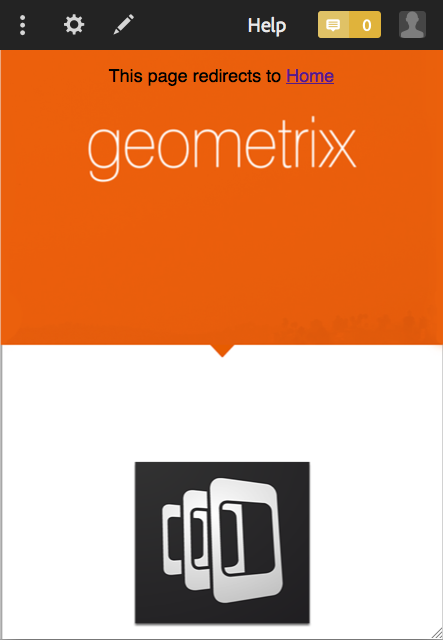

# Creazione e modifica di app tramite la console App{#creating-and-editing-apps-using-the-apps-console}

>[!NOTE]
>
>L’Adobe consiglia di utilizzare l’Editor SPA per i progetti che richiedono il rendering lato client basato su framework di applicazione a pagina singola (ad esempio, React). [Ulteriori informazioni](/help/sites-developing/spa-overview.md).

Il processo di sviluppo delle applicazioni mobili dell&#39;AEM riconosce che gli utenti di diverse competenze contribuiscono allo sviluppo delle applicazioni mobili. La mappa di processo riportata di seguito illustra l&#39;ordine generale in cui gli autori di contenuti e gli sviluppatori di applicazioni eseguono le attività.

In questa pagina vengono visualizzate informazioni su come eseguire le attività dell’addetto marketing. Per informazioni sulle attività per sviluppatori, consulta Creazione di applicazioni PhoneGap.

## La struttura delle applicazioni mobili {#the-structure-of-mobile-applications}

AEM Mobile fornisce il blueprint dell’app PhoneGap per la creazione di applicazioni mobili. Il blueprint definisce la struttura delle applicazioni create. Le applicazioni sono costituite dai seguenti elementi:

* Pagina principale.
* Le varianti di lingua dell’applicazione.
* Pagina principale della variante di lingua.

### Directory principale di un&#39;app PhoneGap {#the-root-of-a-phonegap-app}

La pagina principale delle app mobili create in AEM viene visualizzata nella console App.

La pagina root viene memorizzata sotto la proprietà Percorso di destinazione dell’applicazione specificata al momento della creazione dell’applicazione (il percorso predefinito è /content/phonegap/apps). Il nome della pagina è la proprietà Name dell&#39;applicazione. Ad esempio, l’URL predefinito della pagina principale del sito denominata `myphonegapapp` è `http://localhost:4502/content/phonegap/apps/myphonegapapp.html`.

### La variante di lingua di un&#39;app PhoneGap {#the-language-variation-of-a-phonegap-app}

Le prime pagine figlie della pagina principale sono le varianti di lingua dell’applicazione. Il nome di ogni pagina è la lingua per la quale viene creata l’applicazione. Ad esempio, Inglese è il nome della variante inglese dell’applicazione.

**Nota:** Il blueprint PhoneGap predefinito crea solo un&#39;applicazione inglese. Il tuo sviluppatore può modificare la blueprint in modo da poter creare più varianti di lingua.

La pagina relativa alla lingua ha due finalità:

* Il contenuto della pagina è la pagina spash per la variante di lingua dell’applicazione.
* Le proprietà della pagina controllano diversi aspetti della progettazione dell’applicazione, ad esempio l’URL da utilizzare per richiedere gli aggiornamenti del contenuto e le informazioni sulla connessione alla build cloud e sull’integrazione dei servizi Adobe Analytics.

### Home page {#the-home-page}

All&#39;apertura dell&#39;applicazione viene visualizzata la home page o la pagina index.html di una variante di lingua di un&#39;applicazione. La home page fornisce agli utenti un menu di collegamenti a varie pagine dell’applicazione. Il sistema paragrafo consente di aggiungere componenti alla pagina per la creazione di contenuti.

## Creazione di un’applicazione mobile {#creating-a-mobile-application}

Le applicazioni mobili si basano su una blueprint che definisce la struttura e le proprietà di una pagina. Puoi configurare le seguenti proprietà dell’applicazione:

* **Titolo:** Titolo dell’applicazione.
* **Percorso di destinazione:** Posizione nell&#39;archivio in cui è memorizzata l&#39;applicazione. Lascia l’impostazione predefinita per creare un percorso basato sul nome dell’app.

* **Nome:** Il valore predefinito è il valore della proprietà Title con spazi rimossi. Il nome viene utilizzato in CQ per fare riferimento all’applicazione, ad esempio per il nodo dell’archivio che rappresenta l’applicazione.
* **Descrizione:** Descrizione dell&#39;applicazione.
* **URL server:** L’URL che fornisce aggiornamenti di contenuto OTA (Over-the-Air) all’applicazione. Il valore predefinito è l’URL del server di pubblicazione dell’istanza utilizzata per creare un’applicazione (derivata dal servizio esternalizzatore). Nota: questa deve essere un’istanza del server di pubblicazione anziché un’istanza Autore, che richiede l’autenticazione.

Puoi anche fornire un file di immagine da utilizzare come miniatura dell’applicazione, selezionare la configurazione di PhoneGap Build da utilizzare e selezionare la configurazione di analisi dell’app mobile da utilizzare. Ad Experience Manager, questa immagine viene utilizzata solo come miniatura per rappresentare l’app mobile nella console delle app mobili.

Sono disponibili schede aggiuntive (e facoltative) per build Cloud Service e per l’integrazione del plug-in SDK di Adobe Mobile Services nell’app.

* Genera: fai clic su Gestisci configurazioni e configura il servizio di build build.phonegap.com qui. Quindi, dall’elenco a discesa, potrai selezionare il servizio cloud PhoneGap Build appena creato.
* Analytics: fai clic su Gestisci configurazioni e configura il tuo [SDK di Adobe Mobile Services](https://experienceleague.adobe.com/docs/mobile-services/using/home.html) servizio cloud. Quindi, dal menu a discesa, puoi selezionare il servizio mobile appena creato da integrare nell’app mobile.

>[!NOTE]
>
>Gli sviluppatori possono utilizzare PhoneGap Starter Kit per AEM per creare app e aggiungerle alla console.

La procedura seguente utilizza l’interfaccia utente touch per creare un’app mobile.

1. Nella barra, fai clic su App.
1. Fai clic sull’icona Crea.

   

1. (Facoltativo) Nella scheda Avanzate, fornisci una descrizione dell’applicazione e, se necessario, modifica l’URL del server.
1. (Facoltativo) Se si utilizza la PhoneGap Build per compilare l&#39;applicazione, nella scheda Genera selezionare la configurazione da utilizzare.

   Per creare una configurazione di PhoneGap Build, fai clic su Gestisci configurazioni.

1. (Facoltativo) Se utilizzi il SiteCatalyst per tenere traccia dell’attività dell’applicazione, nella scheda Analytics seleziona la configurazione da utilizzare.

   Per creare una configurazione di app mobile, fai clic su Gestione configurazioni.

1. (Facoltativo) Per fornire l&#39;icona di un&#39;applicazione, fare clic sul pulsante Sfoglia, selezionare il file di immagine dal file system e fare clic su Apri.
1. Fai clic su Crea.

### Modifica delle proprietà di un’applicazione mobile {#changing-the-properties-of-a-mobile-application}

Dopo aver creato un’app mobile, puoi modificarne le proprietà.

#### Modifica titolo, descrizione e icona {#change-the-title-description-and-icon}

1. Nella barra, tocca o fai clic su App.
1. Seleziona l’applicazione da configurare e fai clic sull’icona Visualizza proprietà pagina.

   

1. Per modificare i valori delle proprietà, tocca o fai clic sull’icona Modifica.

   

1. Configura le proprietà Base e Avanzate, quindi tocca o fai clic sull&#39;icona Fine.

   

#### Configurare una variante di lingua dell’applicazione {#configure-a-language-variation-of-the-application}

1. Nella barra, fai clic su App.
1. Fai clic su per approfondire l’app mobile da modificare nell’Admin Console delle app. Selezionare la versione della lingua dell&#39;applicazione da configurare e fare clic sull&#39;icona Visualizza proprietà applicazione.

   

1. Per modificare i valori delle proprietà, tocca o fai clic sull’icona Modifica.

   

1. Configura le proprietà nelle schede Base, Avanzate, Genera e Analytics, quindi tocca o fai clic sull’icona Fine.

   

### Authoring del contenuto di un’applicazione mobile {#authoring-the-content-of-a-mobile-application}

Dopo aver creato l’app mobile, aggiungi il contenuto utilizzato come interfaccia utente dell’applicazione.

1. Nella barra, tocca o fai clic su App.
1. Tocca o fai clic sull’applicazione, quindi tocca o fai clic su Inglese.
1. Modifica la home page o aggiungi pagine figlie come richiesto.

### Spostamento dei contenuti nelle applicazioni mobili {#moving-content-to-mobile-applications}

La cache di sincronizzazione dei contenuti nell’istanza di pubblicazione dell’AEM viene utilizzata come archivio dei contenuti per le app mobili:

* Il contenuto nella cache di sincronizzazione dei contenuti viene incluso nell’applicazione quando gli sviluppatori la compilano.
* Il contenuto nella cache è disponibile per le applicazioni mobili installate per l’aggiornamento del contenuto dell’applicazione.

Le applicazioni mobili includono un comando Updates che scarica e installa il contenuto aggiornato dell’applicazione. Quando un’istanza dell’applicazione invia una richiesta di aggiornamento, il servizio Sincronizzazione contenuto determina quale contenuto è stato modificato dall’ultimo aggiornamento o installazione dell’applicazione e fornisce il nuovo contenuto.

Per rendere il contenuto aggiornato disponibile alle applicazioni, aggiorna la cache di sincronizzazione contenuti. La prima volta che aggiorni la cache, viene aggiunto tutto il contenuto pubblicato. Aggiornamenti successivi aggiunge solo il contenuto pubblicato che è stato modificato rispetto all’aggiornamento precedente.

Content Sync tiene inoltre traccia di quando si verificano gli aggiornamenti. Con queste informazioni, la sincronizzazione dei contenuti può determinare quale aggiornamento della cache inviare a un’app mobile.

Eseguire la procedura seguente sull&#39;istanza in cui si desidera aggiornare la cache. Ad esempio, se l’applicazione richiede aggiornamenti dall’istanza Publish, esegui la procedura sull’istanza Publish.

1. Nella barra, tocca o fai clic su App, quindi tocca o fai clic sull’applicazione.
1. Seleziona la pagina iniziale e tocca o fai clic sull’icona Aggiorna cache.

   

### Utilizzo dei modelli di app {#using-app-templates}

Questa funzione è disponibile con Apps 6.1 Feature Pack 2 e consente di sfruttare facilmente i modelli di app esistenti per creare nuove app per l’AEM.

Che cos’è un modello di app? Consideralo come una raccolta di modelli di pagina e componenti che rappresentano una linea di base o le basi di un’app.
Quando crei una nuova app basata sul modello di un’altra app, otterrai un’app con un punto di partenza rappresentativo dell’app da cui è stata creata.

Per utilizzare questa funzione è necessario disporre di un modello di app mobile esistente (o di un’app con un modello di app installato).

L’ultimo pacchetto di esempi delle app AEM 6.1 include una versione aggiornata dell’app Geometrixx con un modello di app. In alternativa, è possibile installare StarterKit che fornisce anche un modello.

Passaggi per creare una nuova app basata su un modello di app:

1. Assicurati di aver installato il pacchetto di funzioni e i pacchetti di esempi di riferimento per le app AEM 6.1 più recenti
1. Fai clic su App nella barra a sinistra.

1. Fai clic sul pulsante + Crea in alto e seleziona Crea app.
1. Una volta visualizzato l’elenco dei modelli di app, selezionane uno:

1. Fai clic su Avanti.
1. Specifica un ID app e un titolo, tuttavia potresti voler includere anche un nome e una descrizione.

   1. Inoltre, puoi fornire un’icona PNG (formato di icona PhoneGap supportato) sfogliando le risorse AEM.
   1. Ricorda che puoi modificare tutti questi campi dopo la creazione dell’app nel riquadro Gestione app. Ad eccezione dell’ID app, una volta impostato l’ID app non puoi modificarlo.

1. Fai clic sul pulsante Crea per visualizzare 2 opzioni: Fine (torna alla vista del catalogo delle app) o Gestione app (apre la dashboard dell’app).
1. Una volta creata, la nuova app dovrebbe essere elencata nel catalogo delle app:

1. Fai clic sull’app per aprirla; hai creato correttamente una nuova app basata sul modello di un’app esistente.

>[!NOTE]
>
>Se disinstalli il pacchetto dell’app di riferimento Geometrixx Outdoors dall’AEM e disponi di un’app creata in base al relativo modello, l’app non funzionerà più. L’app Geometrixx Outdoors può essere rimossa, ma il modello di app deve rimanere se viene utilizzato da altre applicazioni mobili.

## Esplorazione dell’app dei Geometrixx Outdoors di esempio {#exploring-the-sample-geometrixx-outdoors-app}

L’app Geometrixx Outdoors è un esempio di applicazione PhoneGap che illustra le funzioni della blueprint predefinita dell’applicazione PhoneGap e dei componenti mobili di esempio.

Per aprire l’applicazione, dalla barra fai clic su Applicazioni mobili, quindi seleziona App Geometrixx Outdoors.

### Funzioni comuni per le pagine - App mobile Geometrixx {#common-page-features-geometrixx-mobile-app}

Ogni pagina dell’app mobile include le seguenti funzioni:

* Pulsante Indietro per tornare alla pagina padre. Il pulsante Indietro non viene visualizzato nella home page.
* Barra espandibile che offre un menu di comandi e collegamenti:

   * Aprire la pagina Posizioni.
   * Apri il carrello.
   * Accedi.
   * Aggiorna l’applicazione.

* Il sistema paragrafo, per aggiungere componenti e creare contenuti.

### Home Page - App mobile Geometrixx {#the-home-page-geometrixx-mobile-app}

Il contenuto della home page è costituito dai seguenti strumenti di navigazione:

* Un componente Elenco menu che fornisce collegamenti alle pagine figlie Ingranaggio, Recensioni, Notizie e Informazioni su di noi.
* Componente Carosello scorrevole che mostra le pagine figlie.

### Pagina Ingranaggio - App Geometrixx Mobile {#the-gear-page-geometrixx-mobile-app}

La pagina Ingranaggio consente agli utenti di accedere alle pagine dei prodotti. Un componente Elenco menu consente di accedere alle pagine figlie della pagina Ingranaggio. Le pagine figlie sono categorie di prodotti disponibili nel sito Web.

* Stagione
* Abbigliamento
* Genere
* Attività

Ogni pagina categoria utilizza la stessa struttura di contenuto della pagina Ingranaggio. Il carosello consente di accedere a pagine figlie che sono sottocategorie di prodotti. Le pagine delle sottocategorie contengono elenchi di prodotti che forniscono collegamenti alle pagine dei prodotti.

### Pagina Prodotti - App Geometrixx Mobile {#the-products-page-geometrixx-mobile-app}

La pagina Prodotti e la relativa gerarchia di pagine figlie implementano un sistema di classificazione per le pagine di prodotti. Le pagine più basse in ciascun ramo della gerarchia sono pagine di prodotti che contengono un componente Prodotto ng.

La pagina Prodotti non è disponibile per gli utenti dell’applicazione. La pagina Ingranaggio consente di accedere a ogni pagina di prodotto.

### Pagina Recensioni - App Geometrixx Mobile {#the-reviews-page-geometrixx-mobile-app}

Contiene un pulsante Indietro. Il sistema paragrafo consente di aggiungere componenti.

Quando si utilizza l’applicazione, la pagina Recensioni è disponibile dal carosello nella pagina inglese.

### La pagina delle notizie - App mobile Geometrixx {#the-news-page-geometrixx-mobile-app}

Contiene un pulsante Indietro. Il sistema paragrafo consente di aggiungere componenti.

Quando si utilizza l’applicazione, la pagina Notizie è disponibile dal carosello nella pagina inglese.

### Pagina Informazioni su di noi - App mobile Geometrixx {#the-about-us-page-geometrixx-mobile-app}

La pagina Informazioni su di noi contiene diversi componenti Riga a due colonne. Ogni colonna contiene un componente Immagine o Testo. I componenti sono modificabili e il sistema paragrafo consente di aggiungere componenti.

Quando si utilizza l’applicazione, la pagina About Us (Informazioni su di noi) è disponibile dal carosello nella pagina inglese.

### Pagina Posizioni - App mobile Geometrixx {#the-locations-page-geometrixx-mobile-app}

La pagina Posizioni contiene un componente Posizioni.

Quando si utilizza l&#39;applicazione, la pagina Percorsi è disponibile dall&#39;elenco dei menu nella pagina inglese.

## Componenti mobili di esempio {#sample-mobile-components}

Diversi componenti sono immediatamente disponibili in Sidekick durante l’authoring delle pagine di un’app mobile. I componenti appartengono al gruppo di componenti PhoneGap.

### Carosello scorrevole {#swipe-carousel}

Il componente Carosello scorrevole è uno strumento per la visualizzazione e la navigazione delle pagine del sito. Il componente include un carosello che scorre le immagini per le pagine al di sopra di un elenco di collegamenti di pagina. Modifica il componente per specificare le pagine da esporre e il comportamento del carosello.

Tieni presente che le immagini vengono visualizzate nel carosello per le pagine associate a un’immagine in un modo specifico. Quando le pagine non sono associate a immagini, viene visualizzato solo l’elenco dei collegamenti.

**Scheda Proprietà carosello**

Configura il comportamento del carosello:

* Velocità di riproduzione: tempo in millisecondi in cui ogni immagine viene visualizzata prima di mostrare l’immagine successiva.
* Tempo di transizione: la durata in millisecondi dell’animazione per le transizioni di immagini.
* Stile controlli: il tipo di controlli forniti per lo spostamento tra immagini.

**Scheda Proprietà elenco**

Specifica come viene generato l’elenco di pagine:

* Build List Using: metodo da utilizzare per specificare le pagine da includere nel carosello. Consulta Creazione dell’elenco pagine.
* Ordina per: selezionare una proprietà di pagina da utilizzare per l&#39;ordinamento dell&#39;elenco delle pagine. Ad esempio, selezionare jcr:title per ordinare alfabeticamente le pagine in base al titolo.
* Limite: il numero massimo di pagine da includere. Questa proprietà è appropriata per i metodi di ricerca per la creazione dell&#39;elenco delle pagine.

#### Creazione dell’elenco pagine {#building-the-page-list}

Il componente Scorri carosello fornisce i seguenti valori per la proprietà Build List Using. La finestra di dialogo per modifica cambia in base al valore selezionato:

**Pagine figlie**

Il componente elenca tutte le pagine figlie di una pagina specifica. Dopo aver selezionato questo valore, selezionare la pagina nella scheda Pagine secondarie oppure non specificare alcun valore per elencare i figli della pagina corrente.

**Elenco fisso**

Specifica un elenco di pagine da includere. Dopo aver selezionato questo valore, configurare l&#39;elenco nella scheda Elenco fisso visualizzata quando si seleziona Elenco fisso:

* Per aggiungere una pagina, fai clic su Aggiungi elemento, quindi individua la pagina.
* Utilizza le icone freccia su e freccia giù per spostare la pagina all’interno dell’elenco.
* Fare clic sul pulsante Rimuovi per rimuovere una pagina dall&#39;elenco.

La proprietà Order By non influisce sull&#39;ordine degli elenchi fissi.

**Ricerca**

Compila l’elenco utilizzando i risultati di una ricerca per parola chiave. La ricerca viene eseguita negli elementi figlio di una pagina specificata:

1. Per specificare la pagina principale della ricerca, utilizzare la proprietà Start In per selezionare il percorso della pagina. Non specificare alcun percorso per la ricerca sotto la pagina corrente.
1. Nella proprietà Query di ricerca immettere le parole chiave di ricerca.

**Ricerca avanzata**

Popolare l’elenco utilizzando una [Query Builder](/help/sites-developing/querybuilder-api.md) query.

### Immagine {#image}

Aggiungi un&#39;immagine al contenuto dell&#39;applicazione.

### Testo {#text}

Aggiungere testo RTF al contenuto dell&#39;applicazione.

### Località negozio {#store-locations}

Il componente Store Locations fornisce agli utenti gli strumenti per trovare i punti vendita:

* Ricerca
* Elenca le posizioni vicine o distanti dalle coordinate GPS del dispositivo.

Il componente richiede che l’archivio contenga informazioni sulla posizione per ogni archivio. Le posizioni di esempio vengono installate nel nodo /etc/commerce/locations/adobe. 

### Riga a due colonne {#two-column-row}

Consente di aggiungere componenti affiancati a una pagina.

