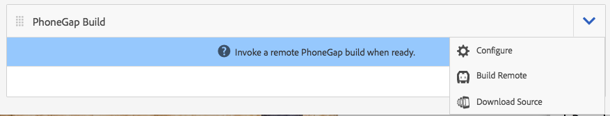

# Sviluppo di app con PhoneGap CLI{#developing-apps-with-phonegap-cli}

>[!NOTE]
>
>L’Adobe consiglia di utilizzare l’Editor SPA per i progetti che richiedono il rendering lato client basato su framework di applicazione a pagina singola (ad esempio, React). [Ulteriori informazioni](/help/sites-developing/spa-overview.md).

In qualsiasi momento, come sviluppatore puoi eseguire l’app su un dispositivo o all’interno di un emulatore, purché sia stato configurato l’ambiente di sviluppo.

Per eseguire i seguenti esempi è necessario un sistema che esegua OSx (Mac) con Xcode oppure un sistema Mac/Win/Linux con l&#39;SDK Android installato.

## Bootstrap l’ambiente di sviluppo {#bootstrap-your-development-environment}

[Configurare PhoneGap CLI](https://docs.phonegap.com/en/4.0.0/guide_cli_index.md.html#The%20Command-Line%20Interface)

Per iOS: per sviluppare per iPhone e iPad, è necessario Apple Xcode IDE.

* Scaricala gratuitamente [qui](https://developer.apple.com/xcode/downloads/).
* [Guida alla piattaforma iOS PhoneGap](https://docs.phonegap.com/en/4.0.0/guide_platforms_ios_index.md.html#iOS%20Platform%20Guide)

Per Android: per sviluppare per iPhone e iPad, è necessario Google Android Studio IDE.

* Scaricala gratuitamente [qui](https://developer.android.com/sdk/index.html).
* [Guida alla piattaforma Android PhoneGap](https://docs.phonegap.com/en/4.0.0/guide_platforms_android_index.md.html#Android%20Platform%20Guide)

## Scarica l’origine {#download-the-source}

Dopo aver caricato correttamente l’ambiente di sviluppo, scarica l’origine dal riquadro di build dell’app AEM:

* Fai clic sulla freccia a discesa del riquadro PhoneGap Build.



* Fai clic su Scarica origine.
* Seleziona l’origine desiderata dal modale Scarica origine.


>[!NOTE]
>
>L’origine di sviluppo contiene lo stato più recente dell’app, comprese le modifiche non di staging. Utilizza l’origine Staging per creare le versioni candidate per l’invio ai fornitori degli app store.
>
>Se non metti mai in scena l&#39;app, selezionando Staging viene attivato il flusso di lavoro di staging (suggerimento: verrà visualizzata come app di staging nell&#39;app del visualizzatore Enterprise di PhoneGap disponibile in AppStore e Google PlayStore).

* Fai clic su Scarica e salva il file ZIP nel computer.
* Estrai il file zip scaricato nell’area di lavoro.

## Creare e caricare l’app (dall’origine) {#build-and-load-the-app-from-source}

PhoneGap CLI può creare un progetto di piattaforma, compilare l’origine e distribuire l’app in un unico comando.

>[!NOTE]
>
>Puoi eseguire tutti questi passaggi separatamente, vedi [Documentazione di PhoneGap CLI](https://phonegap.com/blog/2014/11/13/phonegap-cli-3-6-3/).

1. Verifica di aver installato PhoneGap CLI, vedi sopra.
1. In una finestra della console (o del terminale), passa alla directory principale della sorgente estratta.
1. Immetti il comando seguente:

```xml
phonegap run android

// -- or -- //

phonegap run ios
```

>[!NOTE]
>
>In caso di problemi a questo punto, torna alle nozioni di base per la risoluzione dei problemi -
>
>1. Creare una nuova cartella (test mkdir)
>1. Passa a questa nuova cartella (test cd)
>1. Esegui &#39;phonegap create helloWorld&#39;
>1. Navigare in helloWorld (cd helloWorld)
>1. Esegui phonegap run android (o sostituisci android con ios come sopra).
>1. L’emulatore apre l’esecuzione dell’app PhoneGap appena creata, indicando &quot;Device Ready&quot; (Pronto per il dispositivo) se il bridge JavaScript per native è operativo.

>
>Questo consente di verificare che l’ambiente di sviluppo CLI di PhoneGap sia funzionante correttamente.

## Debug di Javascript con il debug di Safari e IOS {#debug-javascripts-with-safari-and-ios-debug}

Puoi eseguire il debug degli script JavaScript dell’app utilizzando gli strumenti per sviluppatori di Safari, allo stesso modo che faresti con un’applicazione web.

## Abilitare gli strumenti per sviluppatori Safari {#enable-safari-developer-tools}

Per abilitare gli strumenti per sviluppatori:

* Apri le preferenze di Safari

   * Fai clic su Safari nella barra dei menu
   * Fai clic su Preferenze

* Fare clic su Avanzate nella finestra Preferenze


* Seleziona &quot;Mostra menu Sviluppo nella barra dei menu&quot;
* Chiudi la finestra Preferenze

## Connettere Safari ad iOS {#connect-safari-to-ios}

È possibile collegare Safari a un dispositivo o a un emulatore iOS.

* In una finestra della console, passa alla directory principale dell&#39;origine estratta.
* Immetti il seguente comando per avviare l&#39;app sul dispositivo o sull&#39;emulatore.

```xml
phonegap run <platform> --device

// -- or -- //

phonegap run <platform> --emulator
```

* Apri Safari
* Fai clic su Sviluppo nella barra dei menu.
* Seleziona il sottomenu iOS Simulator
* Fai clic su home.html


## Debug di JavaScript con Safari Web Inspector {#debug-javascript-with-safari-s-web-inspector}

È possibile impostare i punti di interruzione in qualsiasi punto dell&#39;origine. Quando interagisci con l’emulatore o il dispositivo, l’esecuzione dell’app si interrompe in corrispondenza di tali punti di interruzione. Puoi scorrere l’esecuzione e controllare i valori nelle variabili.

* Fare clic su Risorse nella finestra Controllo Web
* Navigare nella struttura di origine e fare clic sul file di origine desiderato
* Fare clic sul numero di riga adiacente per aggiungere un punto di interruzione
* Interagire con il dispositivo o l’emulatore


* Utilizza i pulsanti di controllo per continuare l’esecuzione, passare al di sopra, passare ai metodi e uscire dai metodi:


>[!NOTE]
>
>Per visualizzare i valori delle variabili, nel metodo corrente, passa il puntatore del mouse.

## Passaggi successivi {#the-next-steps}

Dopo aver appreso come sviluppare app con PhoneGap CLI, consulta [Accesso alle funzioni del dispositivo](/help/mobile/phonegap-access-device-features.md).
