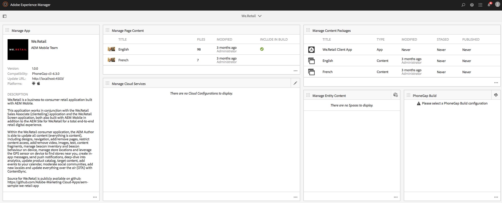
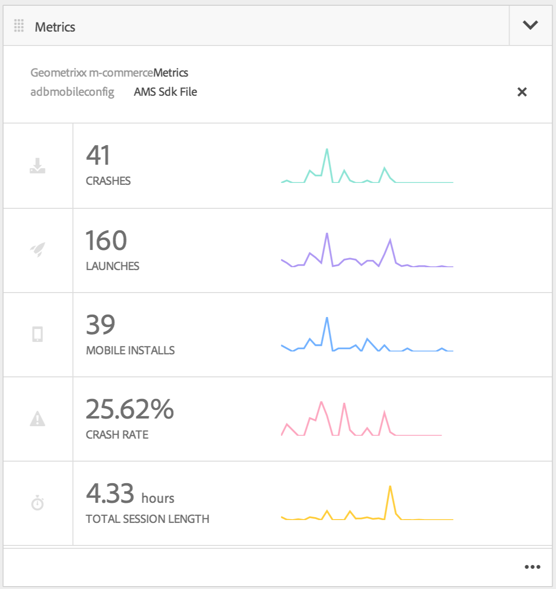

# Creazione di applicazioni mobili{#authoring-mobile-applications}

>[!NOTE]
>
>Adobe consiglia di utilizzare l’editor di SPA per i progetti che richiedono il rendering lato client basato sul framework di un’applicazione a pagina singola (ad esempio, React). [Per saperne di più](/help/sites-developing/spa-overview.md).

Il dashboard di AEM Mobile consente di creare, creare e distribuire l’app mobile, creare, eliminare e modificare i metadati dell’applicazione. Una volta che l’applicazione è attiva, puoi analizzare l’analisi delle applicazioni, incluse le metriche relative al ciclo di vita e all’utilizzo, per migliorare la conversione dei clienti e la fedeltà al marchio.

Per creare l&#39;applicazione AEM Mobile, vedi [Creazione di applicazioni mobili](/help/mobile/building-app-mobile-phonegap.md) pagina.

Per configurare l’ambiente e iniziare, consulta [Amministrazione AEM utilizzare AEM PhoneGap Enterprise](/help/mobile/administer-phonegap.md).

## Catalogo delle app AEM Mobile {#the-aem-mobile-apps-catalog}

La [Catalogo delle app AEM Mobile](http://localhost:4502/aem/apps.html/content/phonegap) visualizza tutta la tua app mobile gestita in AEM.

Considera questo catalogo come la &quot;pagina di destinazione&quot; di AEM Mobile, in cui gli amministratori possono avviare una nuova applicazione AEM Mobile creando in base a un modello o caricando un&#39;app esistente già avviata da uno sviluppatore di dispositivi mobili.

Per passare alla pagina di destinazione del catalogo delle app, effettua le seguenti operazioni:

1. Sfoglia per **Navigazione** e poi scegliere **Mobile**.

1. Scegli **App** per aprire il catalogo delle app.

## Dashboard dell&#39;app AEM Mobile {#the-aem-mobile-app-dashboard}

Quando si seleziona un’app AEM Mobile dal catalogo, viene visualizzata la relativa dashboard. Qui puoi gestire l’applicazione, visualizzare le statistiche, generare, distribuire e gestire il contenuto dell’app mobile.

Per visualizzare o modificare i dettagli in ogni riquadro del dashboard di AEM Mobile, fai clic su &quot;..&quot; nell&#39;angolo in basso a destra.

### La sezione Gestione app {#the-manage-app-tile}

Il riquadro Gestisci app visualizza l&#39;icona dell&#39;applicazione, il nome, la descrizione, le piattaforme supportate, la pagina principale per gli aggiornamenti URL e le informazioni sulla versione. È possibile eseguire il drill-through in questa sezione per modificare e gestire la configurazione dell&#39;applicazione PhoneGap (config.xml) e preparare l&#39;applicazione per l&#39;invio ai vari archivi delle applicazioni per la distribuzione.

Fai clic su [qui](/help/mobile/phonegap-app-details-tile.md) per i dettagli.

### Sezione Gestisci contenuto pagina {#the-manage-page-content-tile}

Il contenuto può essere creato, aggiornato ed eliminato in AEM Mobile nello stesso modo in cui lo si fa in AEM Sites. La **Gestisci sezione contenuto pagina** visualizza il numero di pagine del contenuto gestito e dell&#39;ultima modifica. Per approfondire i contenuti e creare, copiare, spostare, eliminare e aggiornare le pagine, fai clic su ogni record della tessera. Una volta aggiornato il contenuto, puoi inviare un aggiornamento del contenuto ai clienti tramite **Gestisci pacchetti di contenuto riquadro.**

### Sezione Gestisci pacchetti di contenuti {#the-manage-content-packages-tile}

Dopo aver aggiunto o modificato il contenuto tramite la sezione Gestione contenuto pagina , puoi inviare tali modifiche ai clienti con un aggiornamento della versione del contenuto.

Il pacchetto di contenuti consente all’autore dell’app AEM di gestire il contenuto della pagina in AEM e, fa sì che il team di sviluppo apporti modifiche all’applicazione PhoneGap Shell (ad esempio, framework o infrastruttura dell’app) e poi invii tali modifiche ai clienti in modo rapido e senza dover coinvolgere uno sviluppatore per inviare nuovamente i vari store da distribuire.

Pacchetto di contenuto crea un file ZIP, considerato pacchetto di rilascio del contenuto, per ogni aggiornamento. Questi pacchetti contengono risorse html e pagine html generate durante il rendering dell&#39;app ed è sufficientemente intelligente da creare un pacchetto solo per i file che devono essere modificati dall&#39;ultimo aggiornamento.

La sezione Gestione pacchetti contenuti **Tipo** La colonna verrà visualizzata come &quot;App&quot; per indicare il contenuto della shell dell’applicazione, ad esempio il framework o l’infrastruttura dell’app gestita da uno sviluppatore oppure come &quot;Contenuto&quot; che rappresenta il contenuto della pagina gestito dall’autore del contenuto.

Il contenuto può essere rappresentato come una lingua o come una parte particolare dell’app in cui più pacchetti di rilascio del contenuto vengono utilizzati dall’app. La scelta della modalità di raggruppamento dei contenuti è progettata per essere flessibile e completamente all’altezza della modalità di gestione dei contenuti per l’applicazione.

La **Modificato** indica quando le pagine sono state modificate più di recente.

La **Staging** mostra quando è stato creato l’ultimo aggiornamento del contenuto. Per creare un nuovo aggiornamento del contenuto e creare uno stage delle modifiche, apri qualsiasi record nel riquadro e crea un nuovo aggiornamento.

La **Pubblicato** mostra quando l’ultimo aggiornamento del contenuto è stato pubblicato e reso disponibile per il consumo da parte dei clienti. Per pubblicare il contenuto, devi prima eseguirne il stage e quindi pubblicare l’aggiornamento eseguendo il drilling in questo riquadro e pubblicando dalla console Dettagli rilascio contenuto .

 

Questa icona rappresenta un pacchetto di rilascio del contenuto per la shell dell’app

Queste icone rappresentano un pacchetto di rilascio del contenuto dell’app

### Tile PhoneGap Build {#the-phonegap-build-tile}

La **PhoneGap Build** si connette con [https://build.phonegap.com](https://build.phonegap.com) per creare e ospitare le build remote. Una volta generata, la build viene resa disponibile come download o direttamente sul tuo dispositivo tramite un codice QR.

In alternativa, è possibile scaricare l&#39;origine del dispositivo per generare localmente attraverso il [CLI di PhoneGap](https://docs.phonegap.com/en/3.5.0/guide_cli_index.md.html).

### Riquadro Metriche {#the-metrics-tile}

>[!CAUTION]
>
>La sezione Metriche viene visualizzata solo dopo la configurazione del servizio cloud.
>
>Vedi [Configurare il Cloud Service Adobe Mobile Services](/help/mobile/configure-adobe-mobile-cloud-service.md) per i dettagli.

AEM Mobile si integra con Adobe Analytics tramite [Adobe Mobile Services SDK](https://www.adobe.com/ca/solutions/digital-marketing/mobile-services/app-sdk.html) (AMS).

Centro di controllo **Riquadro metriche** visualizza le analisi di riepilogo estratte da AMS per l’applicazione. Per approfondire il dashboard di analytics, fai clic su &quot;..&quot; in basso a destra.

### La sezione Gestisci contenuto entità {#the-manage-entity-content-tile}

La sezione Gestione contenuto entità consente di aggiungere e gestire le definizioni delle app. Le definizioni delle app sono un modo per identificare gli spazi (e altre configurazioni) appropriati per l’app. In questo modo è possibile aggiungere un nuovo spazio senza dover ricompilare l’app. La definizione dell’app viene aggiornata e include le informazioni per eventuali nuovi spazi.

Fai clic su [qui](/help/mobile/phonegap-app-definitions.md) per creare e gestire le definizioni delle app.

Per approfondire il dashboard gestisci contenuto entità, fai clic su &quot;..&quot; in basso a destra.

#### Risorse aggiuntive {#additional-resources}

Per informazioni sui ruoli e le responsabilità di un amministratore e sviluppatore, consulta le risorse seguenti:

* [Sviluppo per Adobe PhoneGap Enterprise con AEM](/help/mobile/developing-in-phonegap.md)
* [Amministrazione di contenuti per Adobe PhoneGap Enterprise con AEM](/help/mobile/administer-phonegap.md)
