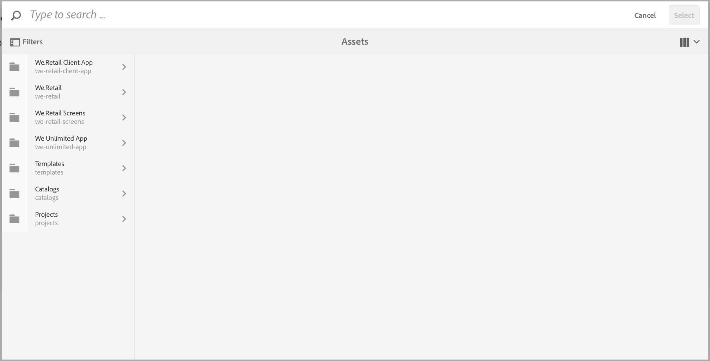
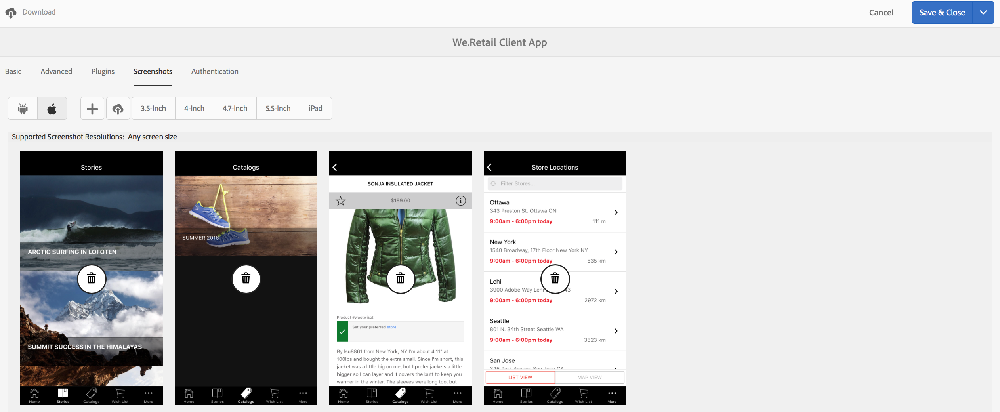

# Modifica dei metadati dell’app {#editing-app-metadata}

>[!NOTE]
>
>L’Adobe consiglia di utilizzare l’Editor SPA per i progetti che richiedono il rendering lato client basato su framework di applicazione a pagina singola (ad esempio, React). [Ulteriori informazioni](/help/sites-developing/spa-overview.md).

Il **Gestisci app** Il riquadro e la pagina &quot;Gestione app&quot; consentono di visualizzare e modificare i metadati dell’applicazione. I metadati dell’app sono dettagli necessari per rilasciare un’applicazione nello store di un fornitore. Possono includere metadati comuni, metadati iOS e schermate. Consulta la [Gestisci sezione app](/help/mobile/phonegap-app-details-tile.md) per ulteriori dettagli sui metadati comuni e di iOS.

## Modifica dei dati dell’app {#editing-the-app-data}

Per modificare i metadati dell’app:

1. Passa alla pagina del dashboard dell’app.

   

1. Per visualizzare o modificare i dettagli facendo clic su &#39;...&#39; nell&#39;angolo inferiore destro della **Gestisci app** affiancare.

1. Immetti o visualizza i dettagli in una delle cinque schede disponibili, come illustrato nella figura riportata di seguito.

   

## Modifica dei metadati comuni e di IOS {#editing-common-and-ios-metadata}

Puoi modificare i metadati comuni e di IOS:

* Seleziona la **Avanzate** dalla pagina di descrizione dell’app.
* Modifica o visualizza i metadati comuni e di IOS. Per ulteriori informazioni, consulta le figure riportate di seguito.

 

## Aggiungi e rimuovi schermate {#add-and-remove-screenshots}

Puoi includere le schermate dell’app nel rollup dei metadati. Alcuni fornitori richiedono schermate accurate quando inviano un’app al proprio app store. Queste immagini devono già esistere in Assets. Consulta [Selettore risorse](../assets/search-assets.md#assetpicker) per caricare le schermate.

### Aggiungi schermate {#add-screenshots}

Per aggiungere una risorsa come schermata:

1. In modalità di modifica del **Gestisci app** , fare clic su aggiungi (icona più).
1. Seleziona la risorsa e fai clic su **Seleziona** per aggiungere la risorsa.

   

1. Seleziona la risorsa e fai clic su **Seleziona** per aggiungere la risorsa.

>[!NOTE]
>
>La schermata deve corrispondere alla risoluzione dello schermo del dispositivo di destinazione.

### Elimina schermate {#delete-screenshots}

Per rimuovere una schermata:

Fai clic sul pulsante Elimina sulla risorsa.

## Passaggi successivi {#the-next-steps}

Per ulteriori informazioni su altri ruoli di authoring, consulta le risorse seguenti:

* [Sezione Gestione app](/help/mobile/phonegap-app-details-tile.md)
* [Definizioni delle app](/help/mobile/phonegap-app-definitions.md)
* [Creazione di una nuova app mediante la Creazione guidata app](/help/mobile/phonegap-create-new-app.md)
* [Importa un&#39;app ibrida esistente](/help/mobile/phonegap-adding-content-to-imported-app.md)
* [Content Services](/help/mobile/develop-content-as-a-service.md)

### Risorse aggiuntive {#additional-resources}

Per informazioni sui ruoli e sulle responsabilità di un amministratore e di uno sviluppatore, consulta le risorse seguenti:

* [Sviluppo per Adobe PhoneGap Enterprise con AEM](/help/mobile/developing-in-phonegap.md)
* [Amministrazione di contenuti per Adobe PhoneGap Enterprise con AEM](/help/mobile/administer-phonegap.md)
