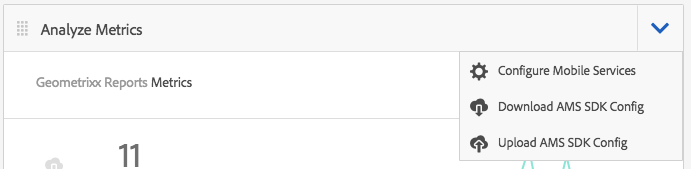

# Tracciare le prestazioni dell’app con Adobe Mobile Analytics{#track-app-performance-with-adobe-mobile-analytics}

>[!NOTE]
>
>Adobe consiglia di utilizzare l’editor di SPA per i progetti che richiedono il rendering lato client basato sul framework di un’applicazione a pagina singola (ad esempio, React). [Per saperne di più](/help/sites-developing/spa-overview.md).

Vuoi incrementare le conversioni e la fedeltà dei clienti.

Vuoi offrire esperienze rilevanti e coinvolgenti ai tuoi clienti.

Cosa fa la tua app AEM Mobile per le tue campagne di marketing?

Come ottimizzare le applicazioni mobili per offrire agli utenti la migliore esperienza possibile?

Ad Adobe, Mobile Services ti consente di ottenere informazioni approfondite sulle modalità di utilizzo delle app mobili da parte degli utenti, monitorando l’utilizzo, gli arresti anomali dell’app, i dettagli del dispositivo e molte altre metriche critiche per le tue app mobili.

Adobe Experience Manager Mobile fornisce un&#39;occhiata ai dettagli delle tue analisi mobili direttamente dalla dashboard delle applicazioni AEM Mobile. La **Riquadro delle metriche di Mobile** nel dashboard fornisce analisi in tempo reale per la tua app mobile, consentendo agli sviluppatori, agli autori e agli amministratori di ottenere un rapido esempio dello stato di salute della tua app mobile. Sotto le coperture che alimentano l&#39;analisi è il [Adobe Mobile Analytics](https://www.adobe.com/ca/solutions/digital-analytics/mobile-web-apps-analytics.html) SDK. L’SDK di Adobe Mobile Analytics può essere collegato alle tue applicazioni in modo nativo o tramite un plug-in PhoneGap bridge per le visualizzazioni web. Le metriche vengono raccolte e memorizzate nella cache del dispositivo fino a quando il dispositivo non viene connesso, al quale i dati vengono inviati ad Adobe Mobile Services Cloud per scopi di reporting e analisi.

Adobe Mobile Analytics SDK fornisce quanto segue:

1. **Raccolta di dati per i canali mobili** - Raccogliere dati completi per i siti web e le app mobili su tutti i principali sistemi operativi.
1. **Analisi del coinvolgimento mobile** - Comprendere il coinvolgimento degli utenti all’interno della tua app mobile, del tuo sito web o del tuo video, tra cui la frequenza con cui i consumatori avviano il canale, se ne fanno acquisti e altro ancora.
1. **Dashboard e rapporti per app mobili** - Ottieni rapporti sull&#39;utilizzo che includono metriche sul ciclo di vita per le tue app e metriche dell&#39;app store: vedi tendenze per gli utenti, avvii, lunghezza media della sessione, durata della conservazione e arresti anomali.
1. **Analisi delle campagne mobile** - Quantificare l’efficacia delle campagne specifiche per dispositivi mobili come SMS, annunci di ricerca mobile, annunci display mobile e codici QR.
1. **Analisi della geolocalizzazione** - Trova dove gli utenti dell’app avviano e interagiscono con le tue esperienze mobili in base alla posizione GPS o ai punti di interesse.
1. **Analisi dei percorsi** - Scopri come gli utenti navigano nell’app per determinare quali schermate e elementi dell’interfaccia utente coinvolgono gli utenti e quali causano il rilascio.

Questa sezione descrive come [Sviluppatori AEM](#developers) In seguito, puoi imparare a dotare le app AEM Mobile del tracciamento di Analytics.

Infine, [Amministratori AEM](#administrators) impara a:

* creare un servizio cloud per Adobe Mobile Services
* creare una configurazione del servizio mobile e associare una suite di rapporti
* associare la configurazione del servizio mobile a un’app mobile
* visualizzare le metriche tramite il Centro comandi app AEM
* assegnare la configurazione SDK AMS all’app mobile

## Per sviluppatori: integrare Analytics nell’app {#for-developers-integrate-analytics-into-your-app}

**Prerequisito:** AEM gli amministratori devono configurare la configurazione cloud di Adobe Mobile Services, [come indicato di seguito](#amscloudserviceconfig).

Gli sviluppatori sono responsabili per [aggiunta di analytics a un&#39;app AEM Mobile](/help/mobile/phonegap-add-analytics-to-apps.md) per tenere traccia, generare rapporti e comprendere in che modo gli utenti interagiscono con il contenuto dell’app mobile e misurare le metriche del ciclo di vita chiave, come gli avvii, il tempo nell’app e la frequenza degli arresti anomali.

## Per gli amministratori: configurare il Cloud Service Adobe Mobile Services {#for-administrators-configure-the-adobe-mobile-services-cloud-service}

Per sfruttare l’Adobe Mobile Services, devi configurare il Cloud Service Adobe Mobile Services AEM con le informazioni sul tuo account Adobe Analytics. Il centro di comando App fornisce un **Analizzare le metriche** in cui puoi creare e associare il servizio cloud con la tua app mobile.

Per configurare il servizio cloud per l’app mobile, fai clic sull’icona a forma di ingranaggio nella sezione Analizza metriche .

Fai clic sull’icona a forma di ingranaggio nella sezione Analizza metriche per aprire la finestra di dialogo modale &quot;Configura analisi di Mobile Services&quot;. Seleziona la configurazione dal menu a discesa Seleziona una configurazione di Mobile Services . Per creare una nuova configurazione, fai clic sul pulsante chiave inglese .

Per creare un servizio cloud Adobe Mobile Services sono necessari due passaggi: la connessione al servizio e la selezione della suite di rapporti da assegnare alla configurazione.

Per iniziare, fai clic sul pulsante &quot;+&quot; nel riquadro Gestisci Cloud Services del dashboard.

Facendo clic su &#39;**+** il pulsante **Aggiungi Cloud Service** verrà visualizzata la procedura guidata.

Seleziona o crea una nuova configurazione del servizio mobile compilando i campi richiesti come mostrato di seguito. Per creare correttamente la connessione ad Adobe Mobile Services, l’amministratore AEM dovrà disporre di queste informazioni.

Una volta completate le impostazioni account di Mobile Services, ti verrà richiesto di selezionare un’app. In questo modo si collega il reporting di Adobe Mobile Services Analytics a tale applicazione.

Seleziona il servizio mobile desiderato e fai clic su &#39;Aggiorna&#39; per assegnare la configurazione del servizio mobile e chiudere la finestra di dialogo.

Dopo aver associato la configurazione del servizio mobile all’app AEM Mobile, la sezione inizia a recuperare i dati della metrica e a iniziare a generare rapporti.

### File di configurazione dell’SDK di Adobe Mobile Services {#adobe-mobile-services-sdk-config-file}

A questo punto l’app mobile è associata a un servizio cloud, tuttavia l’app mobile non sa ancora come comunicare le metriche mobili raccolte ad Adobe Analytics. Per collegare l’app mobile ad Adobe Analytics, è necessario aggiungere ad Adobe Experience Manager il file di configurazione SDK di Adobe Mobile Services .

Dalla sezione Analizza metriche , fai clic sull’icona a forma di freccia per visualizzare le voci del menu Scarica/Carica configurazione SDK AMS .

Il primo passo è quello di ottenere la configurazione SDK da Adobe Mobile Services. Facendo clic su &quot;Scarica configurazione SDK AMS&quot;, verrai reindirizzato al sito web Adobe Mobile Services da cui puoi scaricare il file di configurazione. Una volta ottenuto il file ADBMobileConfig.json, fai clic su &quot;Carica configurazione SDK AMS&quot; per caricare il file di configurazione in AEM.

Fai clic sul pulsante &quot;Carica file di configurazione dell’applicazione Mobile Services di Adobe Mobile Services&quot; e cerca il file ADBMobileConfig.json, quindi fai clic su &quot;Carica&quot;.

Ora che l’app mobile ha accesso al file ADBMobileConfig.json , ha la conoscenza su come comunicare di nuovo ad Adobe Analytics e iniziare a generare rapporti su questi valori importanti delle metriche che contribuiranno al successo delle app.

## Novità? {#what-s-next}

1. [Avvia la mia esperienza con l’app AEM Mobile](/help/mobile/starting-aem-phonegap-app.md)
1. [Gestire il contenuto dell’app](/help/mobile/phonegap-manage-app-content.md)
1. [Creare l&#39;applicazione](/help/mobile/building-app-mobile-phonegap.md)
1. [Monitora le prestazioni della mia app con Adobe Mobile Analytics](/help/mobile/phonegap-intro-to-app-analytics.md)
1. [Fornire un’esperienza di app personalizzata con Adobe Target](/help/mobile/phonegap-aem-mobile-content-personalization.md)
1. [Inviare messaggi importanti ai miei utenti](/help/mobile/phonegap-push-notifications.md)
