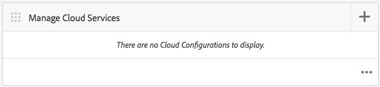

# Tracciare le prestazioni delle app con  Adobe Mobile Analytics{#track-app-performance-with-adobe-mobile-analytics}

>[!NOTE]
>
> Adobe consiglia di utilizzare l&#39;editor SPA per i progetti che richiedono il rendering lato client basato sul framework dell&#39;applicazione a pagina singola (ad es. React). [Per saperne di più](/help/sites-developing/spa-overview.md).

Desideri promuovere conversioni e fedeltà più elevate dei clienti.

Desideri offrire ai tuoi clienti esperienze pertinenti e coinvolgenti.

Cosa fa la tua app AEM Mobile  per le tue campagne di marketing?

Come ottimizzare le applicazioni mobili per offrire agli utenti la migliore esperienza possibile?

Con  Adobe Mobile Services puoi ottenere informazioni approfondite su come i tuoi utenti utilizzano le tue app mobili monitorando l&#39;utilizzo, gli arresti anomali delle app, i dettagli del dispositivo e molte altre metriche critiche per le tue app mobili.

Adobe Experience Manager Mobile fornisce un&#39;occhiata ai dettagli dell&#39;analisi mobile direttamente dal  AEM Mobile Application Dashboard. La sezione **Mobile Metrics Tile** nel dashboard fornisce analisi in tempo reale per l&#39;applicazione mobile, consentendo a sviluppatori, autori e amministratori di ottenere un rapido esempio dello stato di salute dell&#39;app mobile. Sotto le copertine che alimentano l&#39;analisi è l&#39;SDK [ Adobe Mobile Analytics](https://www.adobe.com/ca/solutions/digital-analytics/mobile-web-apps-analytics.html). L&#39;SDK di Mobile Analytics  Adobe può essere collegato alle applicazioni in modo nativo oppure tramite un plug-in per bridge PhoneGap per le visualizzazioni Web. Le metriche vengono raccolte e memorizzate nella cache del dispositivo fino a quando il dispositivo non è connesso, al quale i dati vengono inviati al  Adobe Mobile Services Cloud per la generazione di report e l&#39;analisi.

 Adobe Mobile Analytics SDK fornisce quanto segue:

1. **Raccolta di dati per i canali**  mobili: raccolta di dati completi per i siti Web e le app mobili su tutti i principali sistemi operativi.
1. **Analisi**  del coinvolgimento dei dispositivi mobili - Comprendi il coinvolgimento degli utenti all’interno dell’app mobile, del sito Web o del video, inclusa la frequenza con cui i consumatori avviano il canale, sia che effettuino acquisti da esso, e molto altro.
1. **Dashboard e rapporti**  delle app per dispositivi mobili: ottieni rapporti sull’utilizzo che includono metriche del ciclo di vita per le tue app e metriche dell’app store; visualizza le tendenze per utenti, avvii, lunghezza di sessione media, durata di conservazione e arresti anomali.
1. **Analisi**  delle campagne per dispositivi mobili - Consente di quantificare l&#39;efficacia delle campagne per dispositivi mobili, come SMS, annunci di ricerca per dispositivi mobili, annunci display per dispositivi mobili e codici QR.
1. **Analisi**  della geolocalizzazione - Scopri dove gli utenti dell&#39;app avviano e interagiscono con le tue esperienze mobili in base alla posizione GPS o ai punti di interesse.
1. **Analisi**  dei percorsi - Scopri in che modo gli utenti si spostano all&#39;interno dell&#39;app per determinare quali schermate ed elementi dell&#39;interfaccia utente coinvolgono gli utenti e quali causano il loro rilascio.

In questa sezione viene descritto come [AEM Developers](#developers) può quindi imparare a utilizzare  app AEM Mobile con il tracciamento dell&#39;analisi.

Infine, [AEM Amministratori](#administrators) impara a:

* creazione di un servizio cloud per  Adobe Mobile Services
* creare una configurazione di servizio mobile e associare una suite di rapporti
* associare la configurazione del servizio mobile a un&#39;app mobile
* visualizzare le metriche tramite il centro di comando AEM Apps
* assegna configurazione SDK AMS all&#39;app mobile

## Per sviluppatori - Integrare Analytics nell&#39;app {#for-developers-integrate-analytics-into-your-app}

**Prerequisito:** AEM amministratori devono configurare la configurazione cloud  Adobe Mobile Services,  [come descritto di seguito](#amscloudserviceconfig).

Gli sviluppatori sono responsabili dell&#39; [aggiunta di analisi a un&#39;app AEM Mobile ](/help/mobile/phonegap-add-analytics-to-apps.md), in base alle esigenze, per tenere traccia, segnalare e comprendere in che modo gli utenti interagiscono con il contenuto dell&#39;app mobile e per misurare le metriche chiave del ciclo di vita come avvii, tempo nell&#39;app e frequenza degli arresti anomali.

## Per gli amministratori - Configura il Cloud Service  Adobe Mobile Services {#for-administrators-configure-the-adobe-mobile-services-cloud-service}

Per sfruttare  Adobe Mobile Services devi configurare il Cloud Service AEM  Adobe Mobile Services con le informazioni  account Adobe Analytics. Il centro comandi delle app fornisce una sezione **Analisi metriche** in cui potete creare e associare il servizio cloud all&#39;app mobile.

Per configurare il servizio cloud per l’app mobile, fai clic sull’icona a forma di ingranaggio nella sezione Analizza metriche.

Facendo clic sull&#39;icona a forma di ingranaggio nella sezione Analizza metriche si aprirà la finestra di dialogo modale &#39;Configura Mobile Services Analytics&#39;. Seleziona la configurazione dal menu a discesa &#39;Seleziona una configurazione di Mobile Services&#39;. Per creare una nuova configurazione, fate clic sul pulsante chiave inglese.

Per creare un servizio cloud  Adobe Mobile Services sono necessari due passaggi: la connessione al servizio e la selezione della suite di rapporti da assegnare alla configurazione.

Per iniziare, fate clic sul pulsante &quot;+&quot; nella sezione Gestisci Cloud Services del dashboard.

Facendo clic sul pulsante &#39;**+**&#39;, verrà visualizzata la procedura guidata **Aggiungi Cloud Service**.

Seleziona o crea una nuova configurazione di servizio mobile compilando i campi richiesti come mostrato di seguito. L&#39;amministratore AEM richiederà queste informazioni per creare correttamente la connessione a  Adobe Mobile Services.

Una volta completate le impostazioni dell&#39;account di Mobile Services, ti verrà richiesto di selezionare un&#39;app. In questo modo,  rapporti di analisi di Adobe Mobile Services viene collegata a tale applicazione.

Selezionate il servizio mobile desiderato e fate clic su &#39;Aggiorna&#39; per assegnare la configurazione del servizio mobile e chiudere la finestra di dialogo.

Ora che hai associato la configurazione del servizio mobile all&#39;app AEM Mobile , la sezione inizierà a recuperare i dati delle metriche e a iniziare a generare rapporti.

###  file di configurazione SDK Mobile Services {#adobe-mobile-services-sdk-config-file}

A questo punto l&#39;applicazione mobile è associata a un servizio cloud, tuttavia l&#39;applicazione mobile non sa ancora come comunicare le metriche mobili raccolte ad  Adobe Analytics. Per collegare l&#39;app mobile a  Adobe Analytics, è necessario aggiungere ad Adobe Experience Manager il file di configurazione SDK di  Adobe Mobile Services.

Nella sezione Analizza metriche, fai clic sull’icona a forma di freccia per visualizzare le voci del menu Scarica/Carica configurazione SDK AMS.

Il primo passaggio consiste nell&#39;ottenere il file di configurazione dell&#39;SDK  Adobe Mobile Services. Facendo clic su &quot;Scarica configurazione SDK AMS&quot;, potrai accedere al sito Web di  Adobe Mobile Services da cui puoi scaricare il file di configurazione. Dopo aver ottenuto il file ADBMobileConfig.json, fai clic su &quot;Carica configurazione SDK AMS&quot; per caricare il file di configurazione in AEM.

Fai clic sul pulsante &quot;Carica  configurazione applicazione Mobile Services&quot; e cerca il file ADBMobileConfig.json, quindi fai clic su &quot;Carica&quot;.

Ora che l’app mobile ha accesso al file ADBMobileConfig.json ha la conoscenza su come comunicare  Adobe Analytics e iniziare a generare report su questi valori di metriche importanti che aiuteranno a promuovere il successo delle app.

## Cosa succede dopo? {#what-s-next}

1. [Avvia la mia esperienza  app AEM Mobile](/help/mobile/starting-aem-phonegap-app.md)
1. [Gestione del contenuto dell&#39;app](/help/mobile/phonegap-manage-app-content.md)
1. [Creare l&#39;applicazione](/help/mobile/building-app-mobile-phonegap.md)
1. [Monitora le prestazioni dell&#39;app con  Adobe Mobile Analytics](/help/mobile/phonegap-intro-to-app-analytics.md)
1. [Esperienza app personalizzata con  Adobe Target](/help/mobile/phonegap-aem-mobile-content-personalization.md)
1. [Invio di messaggi importanti agli utenti](/help/mobile/phonegap-push-notifications.md)