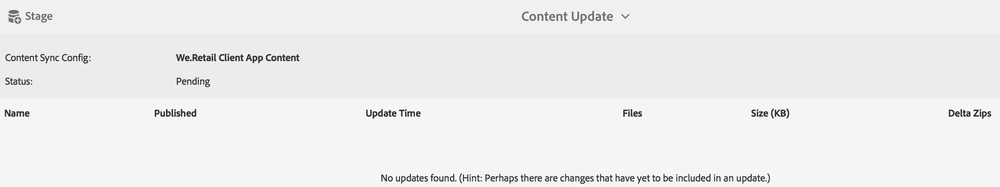

# Creazione e gestione del contenuto delle app{#creating-and-managing-app-content}

>[!NOTE]
>
>L’Adobe consiglia di utilizzare l’Editor SPA per i progetti che richiedono il rendering lato client basato su framework di applicazione a pagina singola (ad esempio, React). [Ulteriori informazioni](/help/sites-developing/spa-overview.md).

La gestione del contenuto delle app richiede uno sforzo collettivo da parte di [sviluppatori](#developer), contenuto [autori](#author), e [amministratori](#administrator). Gli autori manipolano le pagine, basate su modelli e componenti generati dagli sviluppatori di app.

Infine, gli amministratori pubblicano in modo strategico il contenuto aggiornato dell’app.

>[!NOTE]
>
>**Prerequisito**:
>
>In entrata [Distribuzione e manutenzione](/help/sites-deploying/deploy.md), gli sviluppatori hanno acquisito familiarità con i componenti e i modelli di sistema in Adobe Experience Manager (AEM).

## Sezione Gestione contenuto pagina {#the-manage-page-content-tile}

>[!CAUTION]
>
>Se non utilizzi un modello di app predefinito, per abilitare la pubblicazione del nuovo contenuto dell’app OTA devi configurare un gestore di sincronizzazione contenuti.
>
>Consulta [Dispositivi mobili con sincronizzazione contenuti](/help/mobile/phonegap-contentsync.md) Per ulteriori informazioni, consulta la sezione per sviluppatori.

Qui, il contenuto può essere creato, modificato ed eliminato in AEM Mobile nello stesso modo in cui si creerebbe all’interno di AEM Sites.

Il **Gestisci sezione Contenuto pagina** visualizza il numero di pagine del contenuto gestito e dell’ultima modifica apportata per un determinato payload. È possibile eseguire il drill-in del contenuto per creare, copiare, spostare, eliminare e aggiornare le pagine facendo clic su ogni record nella sezione.

Una volta aggiornato il contenuto, gli amministratori possono pubblicare ai clienti un payload di aggiornamento del contenuto Over-the-Air (OTA) tramite **Riquadro Gestione pacchetti di contenuti.**

Seleziona uno dei pacchetti di contenuti elencati per creare o modificare contenuti quali la creazione, la modifica o la rimozione di pagine, la modifica della navigazione e dell’ordine delle pagine, la creazione o l’aggiornamento di contenuti quali copia (testo) e file multimediali.

Nota *tutto è contenuto*, ovvero stili di applicazione, copia (testo), file multimediali, pagine, navigazione e targeting dei contenuti possono essere modificati e aggiornati OTA, senza dover recarsi in un app store.

Per modificare il contenuto di AEM Mobile, *gli autori AEM *avranno bisogno di una solida conoscenza dell’interfaccia di modifica dei contenuti AEM: [Creazione di pagine in AEM.](/help/sites-authoring/qg-page-authoring.md)

## Sezione Gestione pacchetti di contenuti {#the-manage-content-packages-tile}

Qui, *Amministratori AEM* possono aggiornare in modo rapido e semplice le app per fornire esperienze coinvolgenti e contenuti aggiornati, per promuovere il brand engagement e raggiungere gli obiettivi di business senza dover ricorrere a uno sviluppatore o a un nuovo invio in app store.

Una volta *Autori AEM* aver aggiunto o modificato contenuti tramite il riquadro Gestione contenuto, *Amministratori AEM* sono in grado di inviare tali modifiche ai clienti con un aggiornamento dei pacchetti di contenuti.

L’azione Pacchetto di contenuti consente *Autore AEM* per creare e modificare il contenuto della pagina mentre il team di sviluppo apporta modifiche alla progettazione e all&#39;implementazione di un&#39;applicazione host, inclusi navigazione, stile, logica lato server, modelli e componenti, quindi invia tali modifiche OTA ai clienti senza dover inviare nuovamente i contenuti ai vari store per la distribuzione.

**Per pubblicare contenuti nuovi o aggiornati**

Seleziona un pacchetto di contenuti dalla sezione, in questo esempio il pacchetto inglese. In una finestra di dialogo per l&#39;aggiornamento del contenuto sono elencati i *Sincronizzazione contenuti* configurazione. Se il contenuto dell’app è stato modificato dopo un aggiornamento precedente, viene visualizzato lo stato *In sospeso*, come illustrato di seguito.

Quindi, seleziona la **Fase** azione in alto a destra durante la creazione dell’aggiornamento del contenuto. Aggiungi le informazioni di aggiornamento appropriate e premi Fine.

Il *Sincronizzazione contenuti* quindi crea i pacchetti richiesti formando un delta (un pacchetto di *solo* che cosa è cambiato). Una volta completato, questo pacchetto di contenuti per l’aggiornamento è stato aggiunto all’area intermedia come mostrato di seguito.

La gestione temporanea di un aggiornamento del contenuto consente di effettuare diversi aggiornamenti prima di pubblicarli su dispositivi mobili OTA.

>[!NOTE]
>
>Il contenuto in staging può essere verificato utilizzando l&#39;app Verifica AEM prima della pubblicazione.
>
>Consulta [Mobile Quickstart per la verifica dell’AEM](/help/mobile/phonegap-mobile-quickstart.md) per maggiori dettagli sull’app AEM Verify.

Quando sei pronto a fornire nuovi contenuti agli utenti dell’app con Content Sync OTA (Sincronizzazione contenuti), seleziona **Pubblica** come mostrato di seguito.

### Passaggi successivi {#the-next-steps}

Dopo aver appreso le informazioni su Creazione e gestione del contenuto delle app nel dashboard dell’applicazione, consulta le risorse seguenti per altri ruoli di authoring:

* [Sezione Gestione app](/help/mobile/phonegap-app-details-tile.md)
* [Modifica dei metadati dell’app](/help/mobile/phonegap-editmetadata.md)
* [Definizioni delle app](/help/mobile/phonegap-app-definitions.md)
* [Creazione di una nuova app mediante la Creazione guidata app](/help/mobile/phonegap-create-new-app.md)
* [Importa un&#39;app ibrida esistente](/help/mobile/phonegap-adding-content-to-imported-app.md)

### Risorse aggiuntive {#additional-resources}

Per informazioni sui ruoli e sulle responsabilità di un amministratore e di uno sviluppatore, consulta le risorse seguenti:

* [Sviluppo per Adobe PhoneGap Enterprise con AEM](/help/mobile/developing-in-phonegap.md)
* [Amministrazione di contenuti per Adobe PhoneGap Enterprise con AEM](/help/mobile/administer-phonegap.md)
