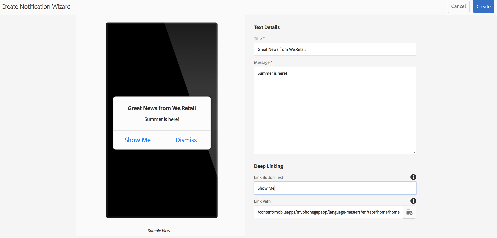

# Notifiche push{#push-notifications}

>[!NOTE]
>
>L’Adobe consiglia di utilizzare l’Editor SPA per i progetti che richiedono il rendering lato client basato su framework di applicazione a pagina singola (ad esempio, React). [Ulteriori informazioni](/help/sites-developing/spa-overview.md).

Poter avvisare immediatamente gli utenti della tua app AEM Mobile con notifiche importanti è fondamentale per il valore di un’app mobile e delle sue campagne di marketing. Descriviamo i passaggi da effettuare per consentire all’app di ricevere notifiche push e come configurare e inviare push da AEM Mobile all’app installata sul telefono. Inoltre, questa sezione descrive come configurare [Collegamenti profondi](#deeplinking) alle notifiche push.

>[!NOTE]
>
>*La consegna delle notifiche push non è garantita; sono più simili agli annunci. Il modo migliore per assicurarsi che tutti li ricevano, ma non sono un meccanismo di consegna garantito. Inoltre, il tempo necessario per inviare una notifica push può variare da meno di un secondo fino a mezz&#39;ora.*

L’utilizzo di notifiche push con AEM richiede alcune tecnologie diverse. Innanzitutto, è necessario utilizzare un provider di servizi di notifica push per gestire notifiche e dispositivi (finora non è stato l’AEM). Con l’AEM sono configurati due provider pronti all’uso: [Servizio di notifica semplice di Amazon](https://aws.amazon.com/sns/) (o SNS) e [Pushwoosh](https://www.pushwoosh.com/). In secondo luogo, la tecnologia push per il sistema operativo mobile deve passare attraverso il servizio appropriato: Apple Push Notification Service (o APNS) per i dispositivi iOS e Google Cloud Messaging (o GCM) per i dispositivi Android. Sebbene l’AEM non comunichi direttamente con questi servizi specifici della piattaforma, alcune informazioni di configurazione correlate devono essere fornite dall’AEM insieme alle notifiche affinché questi servizi possano eseguire il push.

Una volta installato e configurato (come spiegato di seguito) funziona così:

1. Viene creata una notifica push in AEM e inviata al provider di servizi (Amazon SNS o Pushwoosh).
1. Il provider di servizi lo riceve e lo invia al provider di base (APNS o GCM).
1. Il provider di base invia la notifica a tutti i dispositivi registrati per tale push. Per ogni dispositivo utilizza la rete dati cellulare o WiFi, a seconda di quale sia attualmente disponibile sul dispositivo.
1. La notifica viene visualizzata sul dispositivo se l’app per la quale è registrata non è in esecuzione. Un utente che tocca la notifica avvierà l’app e la visualizzerà all’interno dell’app. Se l’applicazione è già in esecuzione, viene visualizzata solo la notifica in-app.

Questa versione dell’AEM supporta i dispositivi mobili iOS e Android.

## Panoramica e procedura {#overview-and-procedure}

Per utilizzare le notifiche push in un’app AEM Mobile, è necessario eseguire i seguenti passaggi di alto livello.

In genere, uno sviluppatore Experience Manager esegue le seguenti operazioni:

1. Registrati ad Apple e ai servizi di messaggistica Google
1. Registrati a un servizio di messaggistica push e configuralo
1. Aggiungere supporto push all’app
1. Prepara un telefono per il test

Mentre un amministratore di Experience Manager esegue le seguenti operazioni:

1. Configurare il push sulle app AEM
1. Creare e distribuire l’app
1. Inviare una notifica push
1. Configurare i collegamenti profondi *(facoltativo)*

### Passaggio 1: registrati ad Apple e ai servizi di messaggistica Google {#step-register-with-apple-and-google-messaging-services}

#### Utilizzo del servizio APNS (Apple Push Notification Service) {#using-the-apple-push-notification-service-apns}

Vai alla pagina di Apple [qui](https://developer.apple.com/documentation/usernotifications#//apple_ref/doc/uid/TP40008194-CH8-SW1) per acquisire familiarità con il servizio Apple Push Notification.

Per utilizzare i numeri APN è necessario un **Certificato** file (un file con estensione cer), un file push **Chiave privata** (un file .p12) e un **Password chiave privata** da Apple. Le istruzioni su come farlo sono reperibili [qui](https://developer.apple.com/library/archive/documentation/NetworkingInternet/Conceptual/RemoteNotificationsPG/).

#### Utilizzo del servizio Google Cloud Messaging (GCM) {#using-the-google-cloud-messaging-gcm-service}

>[!NOTE]
>
>Google sta sostituendo GCM con un servizio simile denominato Firebase Cloud Messaging (FCM). Per ulteriori informazioni su FCM, fare clic su [qui](https://developers.google.com/cloud-messaging/faq).

Vai alla pagina Google [qui](https://developer.android.com/google/gcm/index.html) per acquisire familiarità con Google Cloud Messaging per Android.

Dovrai seguire i passaggi [qui](https://developer.android.com/google/gcm/gs.html) a **Creare un progetto API Google**, **Abilitare il servizio GCM**, e **Ottenere una chiave API**. Avrai bisogno di **Chiave API** per inviare notifiche push a dispositivi Android. Inoltre, registra **Numero progetto**, a volte chiamato anche **ID mittente GCM**.

I passaggi seguenti mostrano un metodo diverso di creazione delle chiavi API GCM:

1. Accedi a google e vai su [Pagina per sviluppatori di Google](https://developers.google.com/mobile/add?platform=android&amp;cntapi=gcm).
1. Scegli la tua app dall’elenco (o creane una nuova).
1. In Nome pacchetto Android, inserisci l’ID app, ad esempio `com.adobe.cq.mobile.weretail.outdoorsapp`. Se non funziona, riprova con &quot;test.test&quot;.
1. Clic **Continua a scegliere e configurare i servizi**
1. Seleziona Messaggistica cloud, quindi fai clic su **Abilita messaggistica Google Cloud**.
1. Vengono quindi visualizzati la nuova chiave API server e l’ID mittente (nuovo o esistente).

>[!NOTE]
>
>Registra la chiave API del server. Questo valore viene immesso sul sito del provider push.

### Passaggio 2: registrare e configurare un servizio di messaggistica push {#step-register-and-configure-a-push-messaging-service}

AEM è configurato per utilizzare uno dei tre servizi per le notifiche push:

* Amazon SNS
* Pushwoosh
* Adobe Mobile Services

*AMAZON SNS* e *Pushwoosh* Le configurazioni consentono di inviare messaggi push dall’interno di schermi AEM.

*Adobe Mobile Services* La configurazione di consente di configurare e inviare notifiche push da Adobe Mobile Services utilizzando un account Adobe Analytics (ma l’app deve essere creata con questa configurazione impostata per abilitare le notifiche push AMS).

#### Utilizzo del servizio di messaggistica Amazon SNS {#using-the-amazon-sns-messaging-service}

>[!NOTE]
>
>*Sono disponibili informazioni su Amazon SNS e un collegamento per la creazione di un nuovo account AWS [qui](https://aws.amazon.com/sns/). Puoi ottenere un account gratuito per un anno.*

Se non desideri utilizzare Amazon SNS, puoi saltare questi passaggi.

Segui questi passaggi per configurare Amazon SNS per le notifiche push:

1. **Registrati ad Amazon SNS**

   1. Registra l&#39;ID account. Il formato deve essere composto da dodici cifre senza spazi o trattini, ovvero &quot;123456789012&quot;.
   1. Assicurati di trovarti nell’area &quot;us-east&quot; o &quot;eu&quot;, in quanto un passaggio successivo (creazione del pool di identità) richiede una di queste.
   1. Dopo la registrazione, accedi alla console di gestione e seleziona [SNS](https://console.aws.amazon.com/sns/) (Servizio di notifica push). Fare clic su &quot;Inizia&quot; se viene visualizzato.

1. **Crea ID e chiave di accesso**

   1. Fai clic sul nome di accesso in alto a destra dello schermo e scegli Credenziali di sicurezza dal menu.
   1. Fare clic su Tasti di accesso e nello spazio sottostante fare clic su **Crea nuova chiave di accesso**.
   1. Clic **Mostra chiave di accesso** e copia e salva l&#39;ID chiave di accesso e la chiave di accesso segreta visualizzati. Se scegli l’opzione per scaricare le chiavi, otterrai un file csv che contiene gli stessi valori.
   1. In questa pagina è possibile gestire altri certificati relativi alla sicurezza e altri certificati.

   >[!NOTE]
   >
   >Una chiave di accesso può essere utilizzata per più app.

   Per le organizzazioni che utilizzano un account &quot;AWS Sandbox&quot;, i passaggi sono molto simili e sono descritti qui:

   1. Fai clic sul nome di accesso in alto a destra dello schermo e scegli Credenziali di sicurezza personali dal menu.
   1. Fai clic su Utenti nell’elenco di azioni a sinistra e scegli il tuo nome utente.
   1. Fare clic sulla scheda Credenziali di protezione.
   1. Da qui puoi vedere le tue chiavi e crearne di nuove. Salva le chiavi per un uso successivo.

1. **Crea un argomento**

   1. Clic **Crea argomento** e scegliere un nome di argomento. Registra tutti i campi come Argomento ARN, Proprietario argomento, Area geografica, Nome visualizzato.
   1. Clic **Altre azioni argomento** > **Modifica criterio argomento**. Sotto **Consenti a questi utenti di iscriversi a questo argomento**, seleziona **Tutti.**
   1. Clic **Aggiorna criterio**.

   >[!NOTE]
   >
   >Puoi creare più argomenti per diversi scenari, ad esempio sviluppo, test, demo e così via. Il resto della configurazione SNS può rimanere lo stesso. Crea l’app con un argomento diverso; le notifiche push inviate a tale argomento verranno ricevute solo dall’app creata con tale argomento.

1. **Creare applicazioni Platform**

   1. Fai clic su Applicazioni, quindi su Crea applicazione Platform. Scegli un nome e seleziona una piattaforma (APNS per iOS, GCM per Android). A seconda della piattaforma, dovranno essere compilati altri campi:

      1. Per APNS, è necessario immettere un file P12, una password, un certificato e una chiave privata. Questi risultati avrebbero dovuto essere ottenuti nella fase *Utilizzo del servizio APNS (Apple Push Notification Service)* sopra.
      1. Per GCM, è necessario immettere una chiave API. Questo dato avrebbe dovuto essere ottenuto nel passaggio *Utilizzo del servizio Google Cloud Messaging (GCM)* sopra.

   1. Ripetere il passaggio precedente una volta per ogni piattaforma supportata. Per poter inviare messaggi push sia ad iOS che ad Android, è necessario creare due applicazioni Platform.

1. **Creare un pool di identità**

   1. Utilizzare [Cognito](https://console.aws.amazon.com/cognito) per creare un pool di identità, in cui verranno memorizzati i dati di base degli utenti non autenticati. Al momento, Amazon Cognito supporta solo le aree &quot;us-east&quot; e &quot;eu&quot;.
   1. Assegna un nome e seleziona la casella &quot;Abilita l’accesso alle identità non autenticate&quot;.
   1. Alla pagina successiva (&quot;*Le tue identità di Cognito richiedono l’accesso alle tue risorse*&quot;) fare clic su Consenti.
   1. In alto a destra, fai clic sul collegamento &quot;*Modifica pool di identità&quot;*. Viene visualizzato l’ID del pool di identità. Salva questo testo per dopo.
   1. Sulla stessa pagina, scegli il menu a discesa accanto a &quot;Ruolo non autenticato&quot; e assicurati che abbia il ruolo Cognito_&lt;pool name=&quot;&quot;>UnauthRole selezionato. Salva le modifiche.

1. **Configura accesso**

   1. Accedi a [Gestione di identità e accessi](https://console.aws.amazon.com/iam/home) (IAM)
   1. Seleziona Ruoli
   1. Fai clic sul ruolo creato nel passaggio precedente, denominato Cognito_&lt;youridentitypoolname>Unauth_Role. Registrare l&#39;ARN del ruolo visualizzato.
   1. Apri &quot;Criteri in linea&quot; se non è già aperto. Dovresti trovare un criterio con un nome come oneClick_Cognito_&lt;youridentitypoolname>Unauth_Role_1234567890123.
   1. Fare clic su Modifica criterio. Sostituisci il contenuto del documento dei criteri con questo frammento di JSON:

   <table>
    <tbody>
     <tr>
     <td>
 
 
{
 
 "Version": "2012-10-17",
 
 "Dichiarazione": [
 
 {
 
 "Azione": [
 
 "mobileanalytics:PutEvents",
 
 "cognito-sync:*",
 
 "SNS:CreatePlatformEndpoint",
 
 "SNS:Sottoscrivi"
 
 ],
 
 "Effetto": "Consenti",
 
 "Risorsa": [
 
 "*"
 
 ]
 
 }
 
 ]
 
}
 
 
 </td>
     </tr>
    </tbody>
    </table>

   1. Fai clic su **Applica criterio**

#### Utilizzo del servizio di messaggistica Pushwoosh {#using-the-pushwoosh-messaging-service}

Se non desideri usare Pushwoosh, puoi saltare questo passaggio.

Per utilizzare Pushwoosh:

1. **Registrati con Pushwoosh**

   1. Vai a pushwoosh.com e crea un nuovo account.

1. **Creare un token di accesso API**

   1. Nel sito Pushwoosh, vai alla voce di menu Accesso API per generare un token di accesso API. Dovrai registrarlo in modo sicuro.

1. **Create una nuova app**

   1. Per il supporto Android, devi fornire la tua chiave API GCM.
   1. Durante la configurazione dell’app, scegli Cordova come framework.
   1. Per il supporto di iOS è necessario fornire il file del certificato (.cer), il certificato push (.p12) e la password della chiave privata; questi devono essere stati ottenuti dal sito APNS di Apple. Per Framework, scegliere Cordova.
   1. Pushwoosh genera un ID app per tale app, nel formato &quot;XXXXX-XXXXX&quot;, dove ogni X è un valore esadecimale (da 0 a F).

>[!NOTE]
>
>*Se una seconda app è configurata in AEM con lo stesso ID app (e altri valori correlati: token di accesso API e ID GCM), tutte le notifiche push inviate tramite la seconda app su AEM andranno a qualsiasi altra app con tale ID app.*

### Passaggio 3: aggiungere il supporto push all’app {#step-add-push-support-to-the-app}

#### Aggiungi configurazione ContentSync {#add-contentsync-configuration}

Crea due nodi di contenuto (uno in app-config e uno in app-config-dev) denominati notificationsConfig:

* /content/`<your app>`/shell/jcr:content/pge-app/app-config-dev/notificationsConfig
* /content/`<your app>`/shell/jcr:content/pge-app/app-config/notificationsConfig

Con queste proprietà (file .content.xml):
&lt;jcr:root xmlns:jcr=&quot; &lt;span id=&quot; translate=&quot;no&quot; />https://developer.adobe.com/experience-manager/reference-materials/spec/jcr/1.0/index.html](https://developer.adobe.com/experience-manager/reference-materials/spec/jcr/1.0/index.html)&quot; xmlns:nt=&quot; [https://developer.adobe.com/experience-manager/reference-materials/spec/jcr/1.0/index.html](https://developer.adobe.com/experience-manager/reference-materials/spec/jcr/1.0/index.html)&quot; jcr:primaryType=&quot;nt:unstructured&quot; excludeProperties=&quot;[appAPIAccessToken]&quot; path=&quot;../../../...&quot;
[
targetRootDirectory=&quot;www&quot; type=&quot;notificationsconfig&quot;/>

>[!NOTE]
>
>Il gestore di sincronizzazione dei contenuti cerca tali nodi e, se non sono presenti, non scrive il file pge-notifications-config.json.

#### Aggiungere librerie client {#add-client-libraries}

Le librerie client delle notifiche push devono essere aggiunte all’app seguendo questi passaggi:

In CRXDE Lite:

1. Accedi a */etc/designs/phonegap/&lt;app name=&quot;&quot;>/clientlibsall.*
1. Fai doppio clic sulla sezione incorpora nel riquadro delle proprietà.
1. Nella finestra di dialogo visualizzata, aggiungi una nuova libreria client facendo clic sul pulsante +.
1. Nel nuovo campo di testo, aggiungi &quot;cq.mobile.push&quot; e fai clic su OK.
1. Aggiungi un altro chiamato cq.mobile.push.amazon e fai clic su OK.
1. Salva le modifiche.

>[!NOTE]
>
>Se le notifiche push vengono rimosse o non vengono utilizzate, per considerazioni sullo spazio nell’app e per evitare messaggi di errore della console, rimuovi queste clientlibs dall’app.

### Passaggio 4: preparare un telefono per il test {#step-prepare-a-phone-for-testing}

>[!NOTE]
>
>*Per le notifiche push, devi eseguire il test su un dispositivo effettivo, in quanto gli emulatori non sono in grado di ricevere le notifiche push.*

#### IOS {#ios}

Per iOS è necessario utilizzare un computer con sistema operativo Mac e partecipare al [Programma per sviluppatori di iOS](https://developer.apple.com/programs/ios/). Alcune società dispongono di licenze aziendali che possono essere disponibili per tutti gli sviluppatori.

Con Xcode 8.1, prima di utilizzare le notifiche push devi passare alla scheda Capacità nel tuo progetto e attivare l’opzione Notifiche push.

#### Android {#android}

Per installare l’app su un telefono Android utilizzando CLI (vedi di seguito: **Passaggio 6: creare e distribuire l’app**), devi innanzitutto mettere il telefono in &quot;modalità sviluppatore&quot;. Consulta [Abilitazione delle opzioni per gli sviluppatori su dispositivo](https://developer.android.com/tools/device.html#developer-device-options) per i dettagli su come eseguire questa operazione.

### Passaggio 5: configurare le app push su AEM {#step-configure-push-on-aem-apps}

Prima di creare e distribuire sul dispositivo mobile configurato, devi configurare le impostazioni di notifica per il servizio di messaggistica che hai deciso di utilizzare.

1. Crea i gruppi di autorizzazione appropriati per le notifiche push.
1. Accedi all’AEM come utente appropriato, fai clic sulla scheda App.
1. Fai clic sull’app.
1. Trova il riquadro Gestisci Cloud Services e fai clic sulla matita per modificare le configurazioni cloud.
1. Seleziona Amazon SNS Connection, Pushwoosh Connection o Adobe Mobile Services come configurazione della notifica.
1. Immettere le proprietà del provider e fare clic su Invia per salvarle, quindi su Fine. In questa fase non vengono verificati a distanza, tranne nel caso di AMS.
1. Ora dovresti vedere la configurazione appena immessa nella sezione Gestisci Cloud Services.

### Passaggio 6: creare e distribuire l’app {#step-build-and-deploy-the-app}

**Nota:** Consulta anche le nostre istruzioni [qui](/help/mobile/building-app-mobile-phonegap.md) sulla creazione di applicazioni PhoneGap.

Ci sono due modi per generare e distribuire la tua app utilizzando PhoneGap.

**Nota:** Per il test delle notifiche push, gli emulatori non sono sufficienti, perché le notifiche push utilizzano un protocollo distinto tra il provider push (Apple o Google) e il dispositivo. L&#39;hardware e gli emulatori Mac/PC correnti non supportano questa funzionalità.

1. *PhoneGap Build* è un servizio offerto da PhoneGap che consente di creare l&#39;app sui server e di scaricarla direttamente sul dispositivo. Consulta la documentazione sulle PhoneGap Build all’indirizzo `https://build.phonegap.com/` per scoprire come impostare e utilizzare PhoneGap Build.

1. *Interfaccia della riga di comando PhoneGap* (CLI) consente di utilizzare un set completo di comandi PhoneGap sulla riga di comando per generare, eseguire il debug e distribuire l&#39;app. Consulta la documentazione per gli sviluppatori di PhoneGap (`https://docs.phonegap.com/en/edge/guide_cli_index.md.html#The%20Command-Line%20Interface`) per scoprire come impostare e utilizzare PhoneGap CLI.

### Passaggio 7: inviare una notifica push {#step-send-a-push-notification}

Per creare una nuova notifica e inviarla, segui la procedura riportata di seguito.

1. Crea una nuova notifica

   * Nel dashboard dell’app AEM Mobile, individua il riquadro Notifiche push.
   * Nel menu in alto a destra, scegli &quot;Crea&quot;. Tieni presente che questo pulsante non sarà disponibile fino a quando non verrà impostata per la prima volta la configurazione cloud.
   * Nella Creazione guidata notifica, inserisci un titolo e un messaggio, quindi fai clic sul pulsante &quot;Crea&quot;. La notifica è ora pronta per l’invio immediato o successivo. Può essere modificato, il messaggio e/o il titolo possono essere modificati e salvati.

1. Inviare la notifica

   * Nel dashboard App, individua il riquadro Notifiche push.
   * Seleziona la notifica o fai clic sul pulsante dei dettagli in basso a destra (. . .), per visualizzare l&#39;elenco delle notifiche. Questo elenco indica anche se una notifica è pronta per essere inviata, se è già stata inviata o se si è verificato un errore durante l’invio.
   * Selezionare la casella di controllo per una notifica (solo) e fare clic sul pulsante &quot;Send Notification&quot; sopra l&#39;elenco. Avrai la possibilità di &quot;Annullare&quot; o &quot;Inviare&quot; la notifica nella finestra di dialogo visualizzata.

1. Gestione dei risultati

   * Se il servizio di notifica push (Amazon SNS o Pushwoosh) riceve la richiesta di invio, la conferma come valida e la invia correttamente ai provider nativi (APNS e GCM), la finestra di dialogo di invio si chiude senza alcun messaggio. Nell’elenco delle notifiche, lo stato di tale notifica sarà elencato come Inviato.
   * Se l’invio push non riesce, nella finestra di dialogo viene visualizzato un messaggio che indica il problema. Nell’elenco delle notifiche, lo stato di tale notifica sarà elencato come Errore, ma se il problema viene risolto, la notifica può essere inviata di nuovo. In caso di errore, nel registro degli errori del server dovrebbero essere visualizzate informazioni aggiuntive.
   * Tieni presente che esistono alcune differenze di piattaforma tra le notifiche push iOS e Android. Tra questi:

      * La generazione con CLI avvierà l’app dopo che sarà stata distribuita su Android. Su iOS, devi avviarlo manualmente. Poiché il passaggio di registrazione push si verifica all’avvio, le app Android possono ricevere immediatamente le notifiche push (poiché saranno avviate e registrate), mentre le app iOS no.
      * Su Android, il testo del pulsante OK è in maiuscolo (e in tutti gli altri pulsanti aggiunti alla notifica in-app), mentre in iOS non lo è.

Per le notifiche push AMS, le notifiche devono essere composte e inviate dal server AMS. AMS fornisce funzionalità di notifica push aggiuntive rispetto a quelle fornite dalle notifiche AEM con AWS e Pushwoosh.

>[!NOTE]
>
>*La consegna delle notifiche push non è garantita; sono più simili agli annunci. È stato fatto il massimo sforzo per assicurarsi che tutti lo sentano, ma non sono un meccanismo di consegna garantito. Inoltre, il tempo necessario per inviare una notifica push può variare da meno di un secondo fino a mezz&#39;ora.*

### Configurazione dei collegamenti profondi con le notifiche push {#configuring-deep-linking-with-push-notifications}

Cos&#39;è il collegamento profondo? Nel contesto di una notifica push, si tratta di un mezzo per consentire a un’app di essere aperta o indirizzata (se aperta) a una posizione specificata all’interno dell’app.

Come funziona? L’autore di una notifica push aggiunge facoltativamente un’etichetta di pulsante (ad esempio, &quot;Mostra&quot;) alla notifica e seleziona la pagina da collegare nella notifica, tramite un browser del percorso visivo. Quando viene inviato, il push è normale, tranne per il fatto che nel messaggio in-app il pulsante OK è sostituito da un pulsante &quot;Ignora&quot; e il nuovo pulsante specificato (&quot;Mostra&quot;) viene visualizzato. Facendo clic sul nuovo pulsante, l’app passa alla pagina specificata all’interno dell’app. Se fai clic su Ignora, il messaggio verrà semplicemente ignorato.

Se l’app non è aperta, l’ombreggiatura apparirà normale. Intervenendo sulla notifica nell’ombra, l’app viene aperta e quindi vengono presentati all’utente i pulsanti di collegamento profondo in base alla configurazione della notifica push.

Crea la notifica, aggiungi il testo di un pulsante e il percorso del collegamento per il collegamento profondo facoltativo:

>[!CAUTION]
>
>.Per accedere al riquadro Notifica push nel dashboard, segui la procedura riportata di seguito.

1. Fai clic sul pulsante Modifica nell’angolo in alto a destra della sezione **Gestisci Cloud Services** affiancare.

   

1. Seleziona la **Connessione Pushwoosh**. Fai clic su **Avanti**.

   

1. Immetti i dettagli delle proprietà e fai clic su **Invia**.

   

   Una volta inviata la configurazione, la **Notifiche push** nel dashboard viene visualizzata una sezione.

   

### Creazione guidata notifica {#create-notification-wizard}

Una volta **Notifiche push** nel dashboard, utilizza la procedura guidata crea notifica per aggiungere il contenuto:

1. Fare clic sul simbolo di aggiunta nell&#39;angolo superiore destro del **Notifiche push** riquadro per aprire **Creazione guidata notifica**.

   

1. Facendo clic sull’icona Sfoglia nel percorso del collegamento, si presenta all’utente la struttura del contenuto dell’app.

   Dopo aver selezionato il percorso, fai clic sull’icona di controllo.

   

   >[!NOTE]
   >
   >Il testo del pulsante di collegamento può contenere un massimo di 20 caratteri.
   >
   >Se l’utente finale non dispone della versione più recente dell’applicazione e il percorso collegato non è disponibile, la conferma dell’azione del collegamento profondo porterà l’utente alla pagina principale dell’app.

1. Inserisci il **Dettagli testo** nel **Creazione guidata notifica** e fai clic su **Crea**.

   

   Apri i dettagli facendo clic sulla notifica push creata da **Notifiche push** affiancare.

   Puoi modificare le proprietà, inviare notifiche o eliminare la notifica.

   

>[!NOTE]
>
>**Informazioni aggiuntive**:
>
>Pushwoosh e Amazon SNS non saranno supportati dopo la versione 6.4 e saranno disponibili come componente aggiuntivo dalla condivisione pacchetti.

### Passaggi successivi {#the-next-steps}

Una volta compresi i dettagli delle notifiche push per l’app, consulta [Personalizzazione dei contenuti AEM Mobile](/help/mobile/phonegap-aem-mobile-content-personalization.md).
