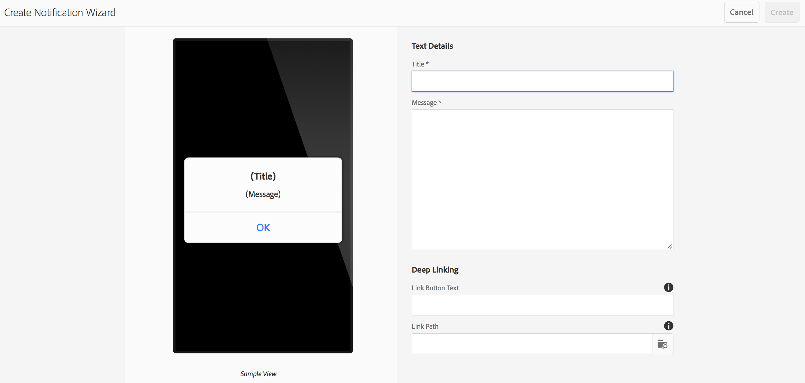

# Notifiche push{#push-notifications}

>[!NOTE]
>
>Adobe consiglia di utilizzare l’editor di SPA per i progetti che richiedono il rendering lato client basato sul framework di un’applicazione a pagina singola (ad esempio, React). [Ulteriori informazioni](/help/sites-developing/spa-overview.md).

La possibilità di avvisare immediatamente gli utenti dell’app AEM Mobile con notifiche importanti è fondamentale per il valore di un’app mobile e delle sue campagne di marketing. Qui descriviamo i passaggi da seguire per consentire alla tua app di ricevere notifiche push, e come configurare e inviare messaggi push da AEM Mobile all’app installata sul telefono. Inoltre, questa sezione descrive come configurare il [Collegamenti profondi](#deeplinking) alle notifiche push.

>[!NOTE]
>
>*Le notifiche push non sono garantite; sono più come annunci. Si fa il massimo sforzo per assicurarsi che tutti li ricevano ma non sono un meccanismo di consegna garantito. Inoltre, il tempo necessario per la consegna di un push può variare da meno di un secondo a fino a mezz’ora.*

L’utilizzo delle notifiche push con AEM richiede alcune tecnologie diverse. Innanzitutto, devi utilizzare un provider di servizi di notifica push per gestire le notifiche e i dispositivi (AEM non lo fa ancora). Due provider sono configurati out-of-the-box con AEM: [Servizio di notifica semplice Amazon](https://aws.amazon.com/sns/) (o SNS) e [Pushwoosh](https://www.pushwoosh.com/). In secondo luogo, la tecnologia push per il sistema operativo mobile specificato deve passare attraverso il servizio appropriato — Apple Push Notification Service (o APNS) per i dispositivi iOS; e Google Cloud Messaging (o GCM) per dispositivi Android. Sebbene AEM non comunichi direttamente con questi servizi specifici della piattaforma, alcune informazioni di configurazione correlate devono essere fornite da AEM insieme alle notifiche affinché questi servizi eseguano il push.

Una volta installato e configurato (come spiegato di seguito) funziona così:

1. Viene creata una notifica push in AEM e inviata al provider di servizi (Amazon SNS o Pushwoosh).
1. Il provider di servizi lo riceve e lo invia al provider di base (APNS o GCM).
1. Il provider di base invia la notifica a tutti i dispositivi registrati per quel push. Per ogni dispositivo utilizza la rete dati cellulare o WiFi, a seconda di quale sia attualmente disponibile sul dispositivo.
1. La notifica viene visualizzata sul dispositivo se l’app per la quale è registrata non è in esecuzione. Un utente che tocca una notifica avvia l’app e la visualizza all’interno dell’app. Nel caso in cui l&#39;applicazione sia già in esecuzione, viene visualizzata solo la notifica in-app.

Questa versione di AEM supporta dispositivi mobili iOS e Android.

## Panoramica e procedura {#overview-and-procedure}

Per utilizzare le notifiche push in un’app AEM Mobile, devi effettuare le seguenti operazioni di alto livello.

In genere, uno sviluppatore di Experienci Manager effettua le seguenti operazioni:

1. Registrati ai servizi di messaggistica Apple e Google
1. Registrati con un servizio di messaggistica push e configuralo
1. Aggiungere supporto push all&#39;app
1. Preparare un telefono per il test

Un amministratore di Experience Manager esegue le seguenti operazioni:

1. Configurare il push nelle app AEM
1. Creare e distribuire l’app
1. Inviare una notifica push
1. Configurare i collegamenti profondi *(facoltativo)*

### Passaggio 1: Registrati ai servizi di messaggistica Apple e Google {#step-register-with-apple-and-google-messaging-services}

#### Utilizzo del servizio APNS (Apple Push Notification Service) {#using-the-apple-push-notification-service-apns}

Vai alla pagina Apple [qui](https://developer.apple.com/documentation/usernotifications#//apple_ref/doc/uid/TP40008194-CH8-SW1) per acquisire familiarità con il servizio di notifica push di Apple.

Per utilizzare APN è necessario un **Certificato** file (un file .cer), un push **Chiave privata** (un file .p12) e un **Password chiave privata** da Apple. Le istruzioni su come farlo sono disponibili [qui](https://developer.apple.com/library/archive/documentation/NetworkingInternet/Conceptual/RemoteNotificationsPG/).

#### Utilizzo del servizio Google Cloud Messaging (GCM) {#using-the-google-cloud-messaging-gcm-service}

>[!NOTE]
>
>Google sta sostituendo GCM con un servizio simile denominato Firebase Cloud Messaging (FCM). Per ulteriori informazioni su FCM, fai clic su [qui](https://developers.google.com/cloud-messaging/faq).

Vai alla pagina Google [qui](https://developer.android.com/google/gcm/index.html) per acquisire familiarità con Google Cloud Messaging per Android.

Dovrai seguire i passaggi [qui](https://developer.android.com/google/gcm/gs.html) a **Creare un progetto API Google**, **Attivare il servizio GCM** e **Ottenere una chiave API**. Avrai bisogno di **Chiave API** per inviare notifiche push ai dispositivi Android. Inoltre, registra il tuo **Numero progetto**, che a volte viene chiamato anche **ID mittente GCM**.

I passaggi seguenti mostrano un metodo diverso per creare le chiavi API GCM:

1. Accedi a google e vai al [Pagina per sviluppatori di Google](https://developers.google.com/mobile/add?platform=android&amp;cntapi=gcm).
1. Scegli l’app dall’elenco (o creane una nuova).
1. In Nome pacchetto Android, immetti il tuo ID app, ovvero `com.adobe.cq.mobile.weretail.outdoorsapp`. (Se questo non funziona, riprova con &quot;test.test&quot;.)
1. Fai clic su **Continua a scegliere e configurare i servizi**
1. Seleziona Messaggistica Cloud e fai clic su **Abilitare i messaggi di Google Cloud**.
1. Verrà quindi visualizzata la nuova chiave API server e l’ID mittente (nuovo o esistente).

>[!NOTE]
>
>Registra la chiave API del server. Questo valore viene immesso sul sito del provider push.

### Passaggio 2: Registrare e configurare un servizio di messaggistica push {#step-register-and-configure-a-push-messaging-service}

AEM è configurato per utilizzare uno dei tre servizi per le notifiche push:

* Amazon SNS
* Pushwoosh
* Adobe Mobile Services

*Amazon SNS* e *Pushwoosh* Le configurazioni consentono di inviare i messaggi inviati dall&#39;interno AEM schermate.

*Adobe Mobile Services* La configurazione ti consente di configurare e inviare notifiche push dall’interno di Adobe Mobile Services utilizzando un account Adobe Analytics (ma l’app deve essere creata con questa configurazione impostata per abilitare le notifiche push AMS).

#### Utilizzo del servizio di messaggistica SNS di Amazon {#using-the-amazon-sns-messaging-service}

>[!NOTE]
>
>*Puoi trovare informazioni su Amazon SNS e un collegamento per creare un nuovo account AWS. [qui](https://aws.amazon.com/sns/). Puoi ottenere un account gratuito per un anno.*

Se non desideri utilizzare Amazon SNS puoi saltare questi passaggi.

Per configurare Amazon SNS per le notifiche push, effettua le seguenti operazioni:

1. **Registrati con Amazon SNS**

   1. Registra il tuo ID account. Il formato deve essere composto da dodici cifre senza spazi o trattini, vale a dire &quot;123456789012&quot;.
   1. Assicurati di essere nell’area &quot;us-east&quot; o &quot;eu&quot;, come un passaggio successivo (creazione del pool di identità) richiede uno di questi.
   1. Dopo la registrazione, accedi alla console di gestione e seleziona [SNS](https://console.aws.amazon.com/sns/) (Servizio notifiche push). Fai clic su &quot;Inizia&quot; se viene visualizzato.

1. **Crea ID e chiave di accesso**

   1. Fare clic sul nome di accesso in alto a destra della schermata e scegliere Credenziali di protezione dal menu.
   1. Fare clic su Chiavi di accesso e nello spazio sottostante fare clic su **Crea nuova chiave di accesso**.
   1. Fai clic su **Mostra chiave di accesso**, e copia e salva l&#39;ID chiave di accesso e la chiave di accesso segreto visualizzati. Se scegli l’opzione per scaricare le chiavi, otterrai un file csv contenente gli stessi valori.
   1. È possibile gestire altri certificati relativi alla sicurezza e altri certificati in questa pagina.

   >[!NOTE]
   >
   >Una chiave di accesso può essere utilizzata per più app.

   Per le organizzazioni che utilizzano un account &quot;AWS Sandbox&quot;, i passaggi sono molto simili e descritti di seguito:

   1. Fare clic sul nome di accesso in alto a destra della schermata e scegliere Credenziali di protezione personali dal menu.
   1. Fai clic su Utenti nell’elenco a sinistra delle azioni e scegli il nome utente.
   1. Fare clic sulla scheda Credenziali di protezione.
   1. Da qui puoi vedere le tue chiavi e creare nuove chiavi. Salva le chiavi per un utilizzo successivo.

1. **Creare un argomento**

   1. Fai clic su **Crea argomento** e scegliere un nome per l&#39;argomento. Registrare tutti i campi, ad esempio ARN argomento, Proprietario argomento, Regione, Nome visualizzato.
   1. Fai clic su **Altre azioni argomento** > **Modifica criterio argomento**. Sotto **Consenti a questi utenti di iscriversi a questo argomento**, seleziona **Tutti.**
   1. Fai clic su **Aggiorna criterio**.

   >[!NOTE]
   >
   >Puoi creare più argomenti per diversi scenari, ad esempio dev, test, demo e così via. Il resto della configurazione SNS può rimanere lo stesso. Crea l’app con un argomento diverso; le notifiche push inviate a tale argomento verranno ricevute solo dall’app creata con tale argomento.

1. **Creare applicazioni Platform**

   1. Fare clic su Applicazioni, quindi su Crea applicazione piattaforma. Scegli un nome e seleziona una piattaforma (APNS for iOS, GCM for Android). A seconda della piattaforma, è necessario compilare altri campi:

      1. Per APNS è necessario immettere un file P12, una password, un certificato e una chiave privata. Tali risultati avrebbero dovuto essere ottenuti nella fase *Utilizzo del servizio APNS (Apple Push Notification Service)* sopra.
      1. Per GCM, è necessario immettere una chiave API. Ciò avrebbe dovuto essere ottenuto nella fase *Utilizzo del servizio Google Cloud Messaging (GCM)* sopra.
   1. Ripeti il passaggio precedente una volta per ogni piattaforma che supporterai. Per poter inviare messaggi push sia ad iOS che ad Android, è necessario creare due applicazioni Platform.

1. **Creare un pool di identità**

   1. Utilizzo [Cognito](https://console.aws.amazon.com/cognito) per creare un pool di identità, che memorizzerà i dati di base degli utenti non autenticati. Al momento, solo le regioni &quot;us-east&quot; e &quot;eu&quot; sono supportate da Amazon Cognito.
   1. Assegna un nome e seleziona la casella &quot;Abilita accesso alle identità non autenticate&quot;.
   1. Nella pagina successiva (&quot;*Le tue identità Cognito richiedono l&#39;accesso alle tue risorse*&quot;) fare clic su Consenti.
   1. In alto a destra della pagina, fai clic sul link &quot;*Modifica pool di identità&quot;*. Viene visualizzato l’ID del pool di identità. Salva il testo in un secondo momento.
   1. Nella stessa pagina, scegli il menu a discesa accanto a &quot;Ruolo non autenticato&quot; e assicurati che abbia il ruolo Cognito_&lt;pool name=&quot;&quot;>UnauthRole selezionato. Salva le modifiche.

1. **Configura accesso**

   1. Accedi a [Gestione di identità e accesso](https://console.aws.amazon.com/iam/home) (IAM)
   1. Seleziona ruoli
   1. Fai clic sul ruolo creato nel passaggio precedente, denominato Cognito_&lt;youridentitypoolname>Unauth_Role. Registrare il &quot;Role ARN&quot; visualizzato.
   1. Apri &quot;Criteri in linea&quot; se non è già aperto. Dovresti visualizzare un criterio con un nome simile a oneClick_Cognito_&lt;youridentitypoolname>Unauth_Role_1234567890123.
   1. Fai clic su &quot;Modifica criterio&quot;. Sostituisci il contenuto del documento criteri con questo frammento di JSON:

   <table>
    <tbody>
     <tr>
     <td>
 
 
{
 
 "Versione": "2012-10-17",
 
 "Dichiarazione": [
 
 {
 
 "Azione": [
 
 "mobileanalytics:PutEvents",
 
 "cognito-sync:*",
 
 "SNS:CreatePlatformEndpoint",
 
 "SNS:Subscribe"
 
 ],
 
 "Effetto": "Consenti",
 
 "Risorsa": [
 
 "*"
 
 ]
 
 }
 
 ]
 
}
 
 
 </td>
     </tr>
    </tbody>
    </table>

   1. Fai clic su **Applica criterio**

#### Utilizzo del servizio di messaggistica Pushwoosh {#using-the-pushwoosh-messaging-service}

Se non si desidera utilizzare Pushwoosh, è possibile saltare questo passaggio.

Per utilizzare Pushwoosh:

1. **Registrati con Pushwoosh**

   1. Vai su pushwoosh.com e crea un nuovo account.

1. **Creare un token di accesso API**

   1. Nel sito Pushwoosh, vai alla voce di menu Accesso API per generare un token di accesso API. Sarà necessario registrare in modo sicuro questo.

1. **Create una nuova app**

   1. Per il supporto Android, devi fornire la chiave API GCM.
   1. Durante la configurazione dell’app, scegli Cordova come framework.
   1. Per il supporto di iOS devi fornire il file del certificato (.cer), il certificato push (.p12) e la password della chiave privata; questi avrebbero dovuto essere ottenuti dal sito APNS di Apple. Per Framework, scegliere Cordova.
   1. Pushwoosh genera un App Id per quell’app, nel formato &quot;XXXXX-XXXXX&quot;, dove ogni X è un valore esadecimale (da 0 a F).

>[!NOTE]
>
>*Se una seconda app è configurata in AEM con lo stesso ID app (e altri valori correlati): Token di accesso alle API (e ID GCM), tutte le notifiche push inviate tramite la seconda app in AEM andranno a qualsiasi altra app con tale ID app.*

### Passaggio 3: Aggiungere supporto push all&#39;app {#step-add-push-support-to-the-app}

#### Aggiungi configurazione ContentSync {#add-contentsync-configuration}

Crea due nodi di contenuto (uno in app-config e uno in app-config-dev) denominati notificationsConfig:

* /content/`<your app>`/shell/jcr:content/pge-app/app-config-dev/notificationsConfig
* /content/`<your app>`/shell/jcr:content/pge-app/app-config/notificationsConfig

Con queste proprietà (file .content.xml) :
&lt;jcr:root xmlns:jcr=&quot; &lt;span id=&quot; translate=&quot;no&quot; />https://developer.adobe.com/experience-manager/reference-materials/spec/jcr/1.0/index.html](https://developer.adobe.com/experience-manager/reference-materials/spec/jcr/1.0/index.html)&quot; xmlns:nt=&quot; [https://developer.adobe.com/experience-manager/reference-materials/spec/jcr/1.0/index.html](https://developer.adobe.com/experience-manager/reference-materials/spec/jcr/1.0/index.html)&quot; jcr:primaryType=&quot;nt:unstructured&quot; excludeProperties=&quot;[appAPIAccessToken]&quot; path=&quot;../../../../..&quot;
[
targetRootDirectory=&quot;www&quot; type=&quot;notificationsconfig&quot;/>

>[!NOTE]
>
>Il gestore di sincronizzazione dei contenuti cerca questi nodi e, se non ci sono, non scrive il file pge-notifications-config.json.

#### Aggiungi librerie client {#add-client-libraries}

Le librerie client di notifica push devono essere aggiunte all&#39;app seguendo questi passaggi:

In CRXDE Lite:

1. Passa a */etc/designs/phonegap/&lt;app name=&quot;&quot;>/clientlibsall.*
1. Fare doppio clic sulla sezione di incorporamento nel riquadro delle proprietà.
1. Nella finestra di dialogo visualizzata, aggiungi una nuova libreria client facendo clic sul pulsante + .
1. Nel nuovo campo di testo, aggiungi &quot;cq.mobile.push&quot; e fai clic su OK.
1. Aggiungi un altro nome cq.mobile.push.amazon e fai clic su OK.
1. Salva le modifiche.

>[!NOTE]
>
>Se le notifiche push vengono rimosse o non vengono utilizzate per considerazioni sullo spazio nell’app e per evitare messaggi di errore della console, rimuovi questi clientlibs dall’app.

### Passaggio 4: Preparare un telefono per il test {#step-prepare-a-phone-for-testing}

>[!NOTE]
>
>*Per le notifiche push, devi eseguire il test su un dispositivo effettivo, in quanto gli emulatori non sono in grado di ricevere notifiche push.*

#### IOS {#ios}

Per iOS è necessario utilizzare un computer Mac OS e iscriversi al gruppo [Programma per sviluppatori iOS](https://developer.apple.com/programs/ios/). Alcune aziende dispongono di licenze aziendali che possono essere disponibili per tutti gli sviluppatori.

Con Xcode 8.1, prima di utilizzare le notifiche push devi passare alla scheda Capacità del progetto e attivare l’opzione Notifiche push.

#### Android {#android}

Per installare l’app su un telefono Android utilizzando CLI (vedi di seguito: **Passaggio 6: creare e distribuire l’app**), devi prima mettere il telefono in &quot;modalità sviluppatore&quot;. Vedi [Abilitazione delle opzioni per gli sviluppatori su dispositivi](https://developer.android.com/tools/device.html#developer-device-options) per informazioni dettagliate su come eseguire questa operazione.

### Passaggio 5: Configurare il push nelle app AEM {#step-configure-push-on-aem-apps}

Prima di generare e distribuire sul dispositivo mobile configurato, devi configurare le impostazioni di notifica per il servizio di messaggistica che hai deciso di utilizzare.

1. Crea i gruppi di autorizzazione appropriati per le notifiche push.
1. Accedi a AEM come utente appropriato, fai clic sulla scheda App .
1. Fai clic sull’app.
1. Trova il riquadro Gestisci Cloud Services e fai clic sulla matita per modificare le configurazioni cloud.
1. Seleziona Connessione Amazon SNS, Connessione Pushwoosh o Adobe Mobile Services come configurazione di notifica.
1. Immetti le proprietà del provider e fai clic su Invia per salvarle, quindi su Fine. In questa fase non vengono verificati a distanza, tranne nel caso di AMS.
1. Ora dovresti vedere la configurazione appena inserita nella sezione Gestione Cloud Services .

### Passaggio 6: Creare e distribuire l’app {#step-build-and-deploy-the-app}

**Nota:** Fai riferimento anche alle nostre istruzioni [qui](/help/mobile/building-app-mobile-phonegap.md) sulla creazione di applicazioni PhoneGap.

Esistono due modi per creare e distribuire l’app utilizzando PhoneGap.

**Nota:** Per il test delle notifiche push, gli emulatori non saranno sufficienti perché le notifiche push utilizzano un protocollo distinto tra il provider push (Apple o Google) e il dispositivo. L&#39;hardware e gli emulatori Mac/PC correnti non supportano questa funzione.

1. *PhoneGap Build* è un servizio offerto da PhoneGap che creerà la tua app per te sui loro server e ti permetterà di scaricarla direttamente sul tuo dispositivo. Fai riferimento a [Documentazione sulle PhoneGap Build](https://build.phonegap.com/) per imparare come impostare e utilizzare le PhoneGap Build.

1. *Interfaccia della riga di comando PhoneGap* (CLI) consente di utilizzare un set completo di comandi PhoneGap sulla riga di comando per generare, eseguire il debug e distribuire l’app. Fai riferimento a [Documentazione per gli sviluppatori di PhoneGap](https://docs.phonegap.com/en/edge/guide_cli_index.md.html#The%20Command-Line%20Interface) per scoprire come configurare e utilizzare PhoneGap CLI.

### Passaggio 7: Inviare una notifica push {#step-send-a-push-notification}

Per creare una nuova notifica e inviarla, segui questi passaggi.

1. Creare una nuova notifica

   * Nel dashboard dell’app AEM Mobile, trova la sezione Notifiche push .
   * Nel menu in alto a destra, scegli &quot;Crea&quot;. Tieni presente che questo pulsante non sarà disponibile finché non viene impostata la configurazione cloud.
   * Nella Creazione guidata notifica, inserire un titolo e un messaggio, quindi fare clic sul pulsante &quot;Crea&quot;. La notifica è ora pronta per l’invio immediato o successivo. Può essere modificato e il messaggio e/o il titolo possono essere modificati e salvati.

1. Invia la notifica

   * Nel dashboard App, trova il riquadro Notifiche push .
   * Seleziona la notifica o fai clic sul pulsante dei dettagli in basso a destra (. . .), per visualizzare l’elenco delle notifiche. Questo elenco indica anche se una notifica è pronta per essere inviata, se è già stata inviata o se si è verificato un errore durante l’invio.
   * Selezionare la casella di controllo di una notifica (solo) e fare clic sul pulsante &quot;Invia notifica&quot; sopra l&#39;elenco. Puoi &quot;Annullare&quot; o &quot;Inviare&quot; la notifica nella finestra di dialogo visualizzata.

1. Gestione dei risultati

   * Se il servizio di notifica push (Amazon SNS o Pushwoosh) riceve la richiesta di invio, la conferma come valida e la invia correttamente ai provider nativi (APNS e GCM), la finestra di dialogo Invia si chiuderà senza alcun messaggio. Nell’elenco delle notifiche, lo stato di tale notifica viene elencato come Inviato.
   * Se l’invio push non riesce, nella finestra di dialogo viene visualizzato un messaggio che indica il problema. Nell’elenco delle notifiche, lo stato di tale notifica verrà elencato come Errore, ma se il problema viene risolto, la notifica può essere inviata nuovamente. In caso di errore, ulteriori informazioni sull&#39;errore devono essere visualizzate nel registro errori del server.
   * Tieni presente che esistono alcune differenze di piattaforma tra le notifiche push iOS e Android. Tra questi:

      * La creazione con CLI avvierà l’app dopo la distribuzione su Android. Su iOS, è necessario avviarlo manualmente. Dal momento che la fase di registrazione push avviene all&#39;avvio, le app Android possono ricevere notifiche push immediatamente (perché sarà iniziata e registrata) mentre le app iOS no.
      * Su Android, il testo del pulsante OK è in maiuscolo (e in qualsiasi altro pulsante aggiunto alla notifica in-app), mentre in iOS non lo è.

Per le notifiche push AMS, le notifiche devono essere composte e inviate dal server AMS. AMS fornisce funzionalità di notifica push aggiuntive oltre a quelle fornite dalle notifiche AEM con AWS e Pushwoosh.

>[!NOTE]
>
>*Le notifiche push non sono garantite; sono più come annunci. Si fa il possibile per far sì che tutti lo sentano, ma non si tratta di un meccanismo di consegna garantito. Inoltre, il tempo necessario per la consegna di un push può variare da meno di un secondo a fino a mezz’ora.*

### Configurazione dei collegamenti profondi con le notifiche push {#configuring-deep-linking-with-push-notifications}

Cos&#39;è il collegamento profondo? Nel contesto di una notifica push, è un mezzo per consentire l’apertura o la destinazione di un’app (se aperta) in una posizione specifica all’interno dell’app.

Come funziona? L’autore di una notifica push aggiunge facoltativamente un’etichetta di pulsante (ad es. &quot;Mostrami!&quot;) alla notifica e sceglie la pagina che desiderano collegare nella notifica, tramite un browser del percorso visivo. Quando viene inviato, il push si verifica come normale, tranne per il fatto che nel messaggio in-app, il pulsante OK viene sostituito da un pulsante &quot;Ignora&quot; e il nuovo pulsante specificato (&quot;Mostra!&quot;) appare anche. Facendo clic sul nuovo pulsante l’app passa alla pagina specificata nell’app. Fai clic su Ignora per ignorare il messaggio.

Se l’app non è aperta, l’ombreggiatura verrà visualizzata come normale. Intervenendo sulla notifica all’ombra, l’app viene aperta e l’utente presenta i pulsanti di collegamento profondo (deep link) in base a ciò che è stato configurato nella notifica push.

Crea la notifica, aggiungi un testo pulsante e un percorso di collegamento per il collegamento profondo facoltativo:

>[!CAUTION]
>
>.Per accedere al riquadro delle notifiche push nel dashboard, segui i passaggi riportati di seguito.

1. Fai clic sulla modifica nell’angolo in alto a destra del **Gestire i Cloud Services** piastrelle.

   

1. Seleziona la **Connessione Pushwoosh**. Fai clic su **Avanti**.

   

1. Immetti i dettagli delle proprietà e fai clic su **Invia**.

   

   Una volta inviata la configurazione, la **Notifiche push** viene visualizzato nel dashboard.

   

### Creazione guidata notifica {#create-notification-wizard}

Una volta che **Notifiche push** il riquadro viene visualizzato nel dashboard, utilizza la procedura guidata di creazione delle notifiche per aggiungere il contenuto:

1. Fai clic sul simbolo di aggiunta nell’angolo in alto a destra del **Notifiche push** riquadro per aprire **Creazione guidata notifiche**.

   

1. Fai clic sull’icona Sfoglia nel percorso del collegamento per presentare all’utente la struttura del contenuto dell’app.

   Dopo aver selezionato il percorso, fai clic sull’icona di controllo.

   

   >[!NOTE]
   >
   >Il testo del pulsante di collegamento è limitato a 20 caratteri.
   >
   >Se l’utente finale non dispone della versione più recente dell’applicazione e il percorso collegato non è disponibile, la conferma dell’azione del collegamento profondo porta l’utente alla pagina principale dell’app.

1. Inserisci il **Dettagli testo** in **Creazione guidata notifiche** e fai clic su **Crea**.

   

   Apri i dettagli facendo clic sulla notifica push creata dalla **Notifiche push** piastrelle.

   Puoi modificare le proprietà, inviare notifiche o eliminare la notifica.

   

>[!NOTE]
>
>**Informazioni aggiuntive**:
>
>Pushwoosh e Amazon SNS non saranno supportati dopo la versione 6.4 e saranno disponibili come componente aggiuntivo dalla condivisione del pacchetto.

### Passaggi successivi {#the-next-steps}

Una volta inclusi i dettagli delle notifiche push per la tua app, vedi [Personalizzazione dei contenuti AEM Mobile](/help/mobile/phonegap-aem-mobile-content-personalization.md).
