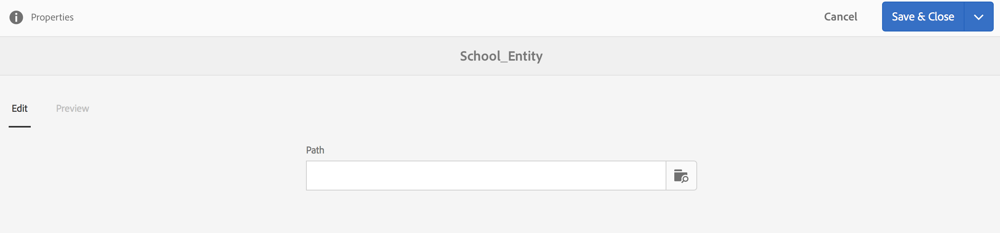

# Spazi ed entità{#spaces-and-entities}

{{ue-over-mobile}}

Uno spazio è una posizione comoda per memorizzare le entità esposte tramite l’API REST di Content Services. Questa funzione è particolarmente utile perché un’app (o qualsiasi canale) può essere associata a più entità. L&#39;imposizione dell&#39;appartenenza delle entità a uno spazio forza la best practice per raggruppare i requisiti di un&#39;app. Facoltativamente, puoi associare un’app in AEM a un numero limitato di spazi.

>[!NOTE]
>
>Per rendere un elemento disponibile per qualsiasi canale da Content Services, deve trovarsi in uno spazio.

## Creazione di uno spazio {#creating-a-space}

Se l’utente desidera esporre una serie di contenuti e risorse a un’app mobile, crea lo spazio utilizzando il dashboard di AEM Mobile.

Per la prima volta che un utente non ha configurato Content Services per l&#39;utilizzo degli spazi, nel dashboard di AEM Mobile vengono visualizzate solo le app dopo aver selezionato **Content Services**.

>[!CAUTION]
>
>**Prerequisiti per l&#39;aggiunta di uno spazio**
>
>Controlla **Abilita Servizi di contenuti AEM** per lavorare con Spaces e abilitalo nel tuo dashboard dell&#39;applicazione AEM Mobile.
>
>Per ulteriori dettagli, vedere [Amministrazione di Content Services](/help/mobile/developing-content-services.md).

Dopo aver configurato gli spazi nel dashboard, effettua le seguenti operazioni per creare gli spazi:

1. Scegliere **Spazi** da Content Services.

   

1. Scegliere **Crea** per creare uno spazio. Immetti **Titolo**, **Nome** e **Descrizione** per lo spazio.

   Fai clic su **Crea**.

   

## Gestione di uno spazio {#managing-a-space}

Dopo aver creato uno spazio, fare clic a sinistra per gestirlo nell&#39;elenco.

È possibile visualizzare le proprietà dello spazio, eliminarlo o pubblicarlo e il relativo contenuto in un&#39;istanza di pubblicazione AEM.

**Visualizzazione e modifica delle proprietà di uno spazio**

1. Selezionare lo spazio dall&#39;elenco
1. Scegli **Proprietà** dalla barra degli strumenti
1. Al termine, fai clic su **Chiudi**

**Pubblicazione di uno spazio** Quando viene pubblicato uno spazio, vengono pubblicate anche tutte le cartelle e le entità in tale spazio.

1. Selezionare lo spazio facendo clic sulla relativa icona nell&#39;elenco Console spazio
1. Scegli **Albero Publish**

>[!NOTE]
>
>È possibile **Annullare la pubblicazione** di uno spazio, che rimuove lo spazio dall&#39;istanza di pubblicazione.
>
>L’immagine seguente illustra le azioni che possono essere eseguite dopo la pubblicazione dello spazio.

## Utilizzo delle cartelle in uno spazio {#working-with-folders-in-a-space}

Gli spazi possono includere cartelle per organizzare ulteriormente il contenuto e le risorse dello spazio. Gli utenti possono creare una propria gerarchia all’interno di uno spazio.

### Creazione di una cartella {#creating-a-folder}

1. Fai clic sullo spazio nell&#39;elenco nella console dello spazio e fai clic su **Crea cartella**

   

1. Immetti **Titolo**, **Nome,** e **Descrizione** per la cartella

   

1. Fai clic su **Crea** per creare la cartella in uno spazio

## Copia per lingua {#language-copy}

>[!CAUTION]
>
>La copia in lingua non è completamente funzionante per questa versione. Imposta solo la struttura.

La funzione **Copia lingua** consente agli autori di copiare la copia master in lingua e quindi creare un progetto e un flusso di lavoro per tradurre automaticamente il contenuto. Copia lingua crea la struttura corretta. Dopo aver aggiunto una cartella in uno spazio, puoi aggiungere una copia in lingua al tuo spazio.

>[!NOTE]
>
>Si consiglia di posizionare qualsiasi contenuto che potrebbe essere tradotto sotto il nodo Copia in lingua.

### Aggiunta della copia per lingua {#adding-language-copy}

1. Dopo aver creato lo spazio, fare clic su tale spazio per creare una copia per lingua.

   Fai clic su **Crea** e scegli **Copia lingua**.

   

   >[!NOTE]
   >
   >I nodi della copia lingua possono esistere solo come figlio diretto dello spazio.

1. Scegliere **Lingua pacchetto contenuti&amp;ast;** e immettere **Titolo&amp;ast;** nella finestra di dialogo **Crea copia lingua**.

   Fai clic su **Crea**.

   

1. Una volta creata, la copia in lingua viene visualizzata nel tuo Windows Live Spaces in **Language Masters**.

   

   >[!NOTE]
   >
   >Seleziona **Master lingua** per visualizzare le cartelle della copia per lingua.

### Rimozione di una cartella dallo spazio {#removing-a-folder-from-the-space}

1. Selezionare la cartella dall&#39;elenco del contenuto dello spazio
1. Fai clic su **Elimina** nella barra degli strumenti

   >[!NOTE]
   >
   >Per spostarsi in una cartella e visualizzarne il contenuto o aggiungere una sottocartella o un&#39;entità, fare clic sul titolo della cartella nell&#39;elenco del contenuto dello spazio.

## Utilizzo delle entità in uno spazio {#working-with-entities-in-a-space}

Le entità rappresentano il contenuto esposto tramite l’endpoint del servizio web. Le entità sono memorizzate in spazi in modo da poter essere facilmente trovate e sono mantenute indipendenti dalla struttura dell’archivio dell’AEM che contiene i relativi contenuti.

È possibile raggruppare le entità in un insieme logico. A questo scopo, puoi creare un numero qualsiasi di cartelle.

Se per la modellazione dei dati vengono raccolti elementi secondari di entità, ovvero altre entità, l’utente sviluppatore può creare &quot;Modelli per gruppo&quot; specifici dal tipo di modello &quot;Gruppo di entità&quot;, fornito come predefinito.

>[!NOTE]
>
>Le entità sono sempre associate a uno spazio, pertanto la maggior parte dell’interfaccia utente delle entità è accessibile tramite la console dello spazio.

### Creazione di un&#39;entità {#creating-an-entity}

1. Apri la console Spazio e fai clic sul titolo dello spazio.

   In alternativa, è possibile passare alla cartella facendo clic sul titolo della cartella nell&#39;elenco.

   

1. Scegliete il modello per l&#39;entità. Questo è il tipo di entità che si desidera creare. Fai clic su Avanti.

   

   >[!NOTE]
   >
   >È possibile scegliere il **modello Assets**, il **modello pagine** o un modello di tipo entità creato in precedenza.
   >
   >Per creare l&#39;entità personalizzata, vedere [Creazione di un modello](/help/mobile/administer-mobile-apps.md).

1. Immetti un **Titolo**, **Nome**, **Descrizione** e **Tag** per l&#39;entità. Fai clic su **Crea**.

   

   Al termine, l&#39;entità viene visualizzata nei discendenti dello spazio.

### Modifica di un&#39;entità {#editing-an-entity}

1. Dopo aver creato un’entità, passa alla cartella o allo spazio e scegli l’entità dalla console Spazio da modificare.

   

1. Selezionare un&#39;entità per la modifica e fare clic su **Modifica**.

   

   >[!CAUTION]
   >
   >A seconda del modello scelto per creare l’entità, l’interfaccia utente sarà diversa per entrambi, per la modifica e la visualizzazione delle proprietà dell’entità. Per ulteriori informazioni, consulta i passaggi seguenti.

   ***Se scegli il modello per la creazione dell&#39;entità come modelli Assets***, facendo clic su **Modifica** puoi aggiungere risorse come illustrato nella figura seguente:

   

   In alternativa, puoi fare clic su **Anteprima** per visualizzare il collegamento JSON.

   

   ***Se scegli il modello per creare l&#39;entità come Modelli di pagine***, facendo clic su **Modifica** puoi aggiungere risorse come illustrato nella figura seguente:

   

   Fai clic sull&#39;icona nel **Percorso** per aggiungere una risorsa

   

   >[!NOTE]
   >
   >Una volta aggiunta un’entità, questa deve essere salvata affinché il collegamento Anteprima funzioni. Per visualizzare l&#39;anteprima, fare clic su **Salva**. Facendo clic su **Anteprima** viene visualizzato il codice JSON della risorsa aggiunta, come illustrato nella figura seguente:

   

   >[!NOTE]
   >
   >Dopo aver aggiunto le risorse all&#39;entità, puoi scegliere **Salva** per salvare le modifiche oppure **Salva e chiudi** per salvare e reindirizzare all&#39;elenco della console Space in cui sono definite le entità.

   Selezionare inoltre un&#39;entità dall&#39;elenco della console dello spazio e fare clic su **Proprietà** per visualizzare e modificare le proprietà di un&#39;entità definita.

   

   Puoi modificare il titolo, la descrizione e i tag e aggiungere le risorse all’entità.

   

### Rimozione di un&#39;entità {#removing-an-entity}

1. Seleziona l’entità dall’elenco dei contenuti dello spazio

   

1. Fai clic su **Elimina** nella barra degli strumenti per rimuovere l&#39;entità specifica dallo spazio

### Pubblicazione di un&#39;entità {#publishing-an-entity}

È possibile scegliere **Albero Publish** o **Publish rapido** per pubblicare l&#39;entità.

1. Selezionate un&#39;entità dall&#39;elenco della console dello spazio e fate clic su **Albero Publish (Tree) **per pubblicare l&#39;entità e i relativi elementi figlio.

   

   **O**,

   Fai clic su **Publish rapido** per pubblicare l&#39;entità specifica.
