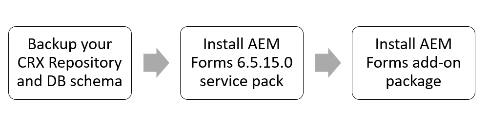

# Istruzioni per l&#39;installazione di AEM 6.5 Forms Service Pack {#aem-form-patch-installation-instructions}

## Informazioni sulla versione

| Prodotto | Adobe Experience Manager 6.5 Forms |
|---|---|
| Versione | 6.5.15.0 |
| Tipo | Versione Service Pack |
| Data | 01 dicembre 2022 |

## Contenuto in Experience Manager Forms 6.5.15.0

Il service pack di Adobe Experience Manager (AEM) Forms include funzioni nuove e aggiornate, quali miglioramenti chiave richiesti dai clienti, prestazioni, stabilità e sicurezza. AEM Forms rilascia i service pack a intervalli regolari per fornire le funzioni e i miglioramenti più recenti. A seconda dello stack, scegli uno dei percorsi seguenti per scaricare e installare il service pack nell&#39;ambiente:

* [Download e installazione del Service Pack in un ambiente AEM Forms su JEE](#download-and-install-for-jee-service-pack)
* [Download e installazione del Service Pack su un AEM Forms in ambiente OSGi](#download-and-install-for-osgi-service-pack)

>[!NOTE]
>
> Adobe rilascia un programma di installazione completo dopo ogni 6 Service Pack. AEM 6.5 Forms Service Pack 12 (6.5.12.0) su JEE è l’ultimo programma di installazione completo. Il programma di installazione completo fornisce il supporto per le nuove piattaforme, mentre il programma di installazione regolare dei pacchetti di servizi include solo correzioni di bug e miglioramenti generali. Se stai eseguendo una nuova installazione o pianificando l’utilizzo di software più recente per il tuo Forms 6.5 su JEE, Adobe consiglia di utilizzare AEM 6.5.12.0 Forms su JEEfull installer rilasciato il 03 marzo 2022 invece del programma di installazione di Forms 6.5 rilasciato il 08 aprile 2019. Dopo aver utilizzato il programma di installazione completo, installare il service pack più recente.

## Download e installazione del Service Pack in un ambiente AEM Forms su JEE {#download-and-install-for-jee-service-pack}

+++1. Esegui il backup dell&#39;ambiente esistente:

1. Esegui backup [Archivio CRX, schema di database e GDS (Global Document Storage)](https://experienceleague.adobe.com/docs/experience-manager-65/forms/administrator-help/aem-forms-backup-recovery/backing-aem-forms-data.html).
1. Esegui il backup del &lt;*AEM_forms_root*>/distribuisci cartella. È necessario se si decide di disinstallare il service pack.

+++

+++2.Scarica il software richiesto:

* AEM Forms su JEE 6.5.15.0 Service Pack
* AEM 6.5.15.0 Service Pack
* Pacchetto di componenti aggiuntivi per Forms
* Bundle
* Frammenti

+++

+++3. Installa AEM Forms sul service pack JEE:

1. Arresta il server applicazioni.
1. Estrai il **Modulo di installazione di AEM Forms su JEE 6.5.15.0 Service Pack** sul disco rigido:

   * **Windows**
Accedere alla directory appropriata del supporto di installazione o della cartella sul disco rigido in cui è stato copiato il programma di installazione e fare doppio clic sul pulsante 
`aemforms65_cfp_install.exe` file.

      * (Windows a 32 bit) `Windows\Disk1\InstData\VM`
      * (Windows a 64 bit) `Windows_64Bit`\ `Disk1\InstData\VM`
   * **Linux**
Passa alla directory appropriata e da una shell e digita 
`./aem65_cfp_install.bin`.

      * (Linux) `Linux/Disk1/InstData/NoVM`

   Viene avviata una procedura di installazione guidata.

1. Nel pannello introduttivo, fai clic su **[!UICONTROL Avanti]**.
1. Sulla **Scegli cartella di installazione** controlla che la posizione predefinita visualizzata sia corretta per l&#39;installazione esistente oppure fai clic su **[!UICONTROL Sfoglia]** per selezionare la cartella alternativa in cui è installato AEM moduli e fare clic su **[!UICONTROL Successivo]**.
1. Leggere le informazioni di riepilogo del Service Pack e fare clic su **[!UICONTROL Successivo]**.
1. Leggi le informazioni di riepilogo di pre-installazione e fai clic su **[!UICONTROL Installa]**.
1. Al termine dell’installazione, fai clic su **[!UICONTROL Avanti]** per applicare gli aggiornamenti della correzione rapida ai file installati.
1. **[Solo per Windows]:** Esegui uno dei seguenti passaggi:

   * Deseleziona la **Avvia Configuration Manager** prima di fare clic **[!UICONTROL Fine]**. Esegui **Gestione configurazione** utilizzando **ConfigurationManager.bat** file che si trova in `[aem-forms root]\configurationManager\bin`.

   * Oppure deseleziona la **Avvia Configuration Manager** prima di fare clic **[!UICONTROL Fine]**. Prima dell&#39;esecuzione **Gestione configurazione** utilizzo **ConfigurationManager.exe** o **ConfigurationManager_IPv6.exe**, passa a *`<AEMForms_Install_Dir>\configurationManager\bin`* directory e sostituzione [ConfigurationManager.lax](/help/assets/ConfigurationManager.lax) e [ConfigurationManager_IPV6.lax](/help/assets/ConfigurationManager_IPv6.lax) file.

      >[!NOTE]
      >
      > Utilizzo della **ConfigurationManager.bat** file aiuta a evitare di aggiornare manualmente il nome dei file .lax.

1. **[Solo per basati su Unix]:** La **Avvia Configuration Manager** la casella di controllo è selezionata per impostazione predefinita. Fai clic su **[!UICONTROL Fine]** per eseguire Gestione configurazione all&#39;istante o per eseguire **Gestione configurazione** in seguito, deseleziona la **Avvia Configuration Manager** prima di fare clic **[!UICONTROL Fine]**. Puoi iniziare **Gestione configurazione** in seguito utilizzando lo script appropriato nel `[AEM_forms_root]/configurationManager/bin` directory.

1. A seconda del server delle applicazioni, scegli uno dei seguenti documenti e segui le istruzioni in *Configurazione e distribuzione dei moduli AEM* sezione .

   * [Installazione e distribuzione di moduli AEM per JBoss](https://www.adobe.com/go/learn_aemforms_installJBoss_65)
   * [Installazione e distribuzione di moduli AEM per WebSphere](https://www.adobe.com/go/learn_aemforms_installWebSphere_65)
   * [Installazione e distribuzione di AEM Forms per WebLogic](https://www.adobe.com/go/learn_aemforms_installWebLogic_65)

+++

+++4. Installare il frammento del servlet

È obbligatorio installare **frammento servlet** per tutti i server applicazioni, ad eccezione di quelli in esecuzione su JBoss EAP 7.4.0. Per scaricare e installare il frammento del servlet:

1. Se non hai scaricato il frammento, scaricalo da [Distribuzione di software](https://experience.adobe.com/#/downloads/content/software-distribution/en/aem.html?package=/content/software-distribution/en/details.html/content/dam/aem/public/adobe/packages/cq650/featurepack/org.apache.felix.http.servlet-api-1.2.0_fragment_full.jar)

1. Avvia l&#39;application server, attendi che i registri si stabilizzino e controlla lo stato del bundle.

1. Apri i bundle della console Web. L’URL predefinito è `http://[Server]:[Port]/system/console/bundles`.

1. Fai clic su Installa/Aggiorna. Scegli il frammento scaricato, org.apache.felix.http.servlet-api-1.2.0_fragment_full.jar. Fai clic su Installa o Aggiorna. Attesa della stabilizzazione del server applicazioni

1. Arrestare il server applicazioni.

+++

+++5. Installa AEM Service Pack

1. Riavvia l’istanza prima dell’installazione se l’istanza è in modalità di aggiornamento (quando l’istanza è stata aggiornata da una versione precedente). L&#39;Adobe consiglia un riavvio se il tempo di attività corrente per un&#39;istanza è elevato.
1. Prima di installare, scegli uno snapshot o un nuovo backup del tuo [!DNL Experience Manager] istanza.
1. Scarica il service pack da [Distribuzione di software](https://experience.adobe.com/#/downloads/content/software-distribution/en/aem.html?package=/content/software-distribution/en/details.html/content/dam/aem/public/adobe/packages/cq650/servicepack/aem-service-pkg-6.5.15.0.zip). <!-- UPDATE FOR EACH NEW RELEASE -->
1. Apri Gestione pacchetti, quindi seleziona **[!UICONTROL Carica pacchetto]** per caricare il pacchetto. Per ulteriori informazioni, consulta [Gestione pacchetti](/help/sites-administering/package-manager.md).
1. Seleziona il pacchetto, quindi seleziona **[!UICONTROL Installa]**.
1. Per aggiornare il connettore S3, arresta l&#39;istanza dopo l&#39;installazione del Service Pack, sostituisci il connettore esistente con un nuovo file binario fornito nella cartella di installazione e riavvia l&#39;istanza. Vedi [Archivio dati Amazon S3](/help/sites-deploying/data-store-config.md#upgrading-to-a-new-version-of-the-s-connector).

**Installazione automatica**

Esistono due metodi diversi per l&#39;installazione automatica [!DNL ExperienceManager] 6.5.15.0.<!--       UPDATE FOR EACH NEW RELEASE -->

* Inserire il pacchetto in `../crx-quickstart/install` quando il server è disponibile online.
Il pacchetto viene installato automaticamente.

* Utilizza la [API HTTP da Gestione pacchetti](/help/sites-administering/package-manager.md#package-share). Utilizzo     `cmd=install&recursive=true` in modo che i pacchetti nidificati siano installati.

   >[!NOTE]
   >
   >Experience Manager 6.5.15.0 non supporta l’installazione di Bootstrap. <!-- UPDATE FOR EACHNEW RELEASE -->

**Convalida l&#39;installazione**

Per informazioni sulle piattaforme certificate per l’utilizzo con questa versione, consulta [requisiti tecnici](/help/sites-deploying/technical-requirements.md).

1. La pagina delle informazioni sul prodotto (`/system/console/productinfo`) visualizza la stringa di versione aggiornata `Adobe Experience      Manager (6.5.15.0)` sotto [!UICONTROL Prodotti installati].<!-- UPDATE FOR EACH NEW RELEASE -->
1. Tutti i bundle OSGi sono **[!UICONTROL ATTIVO]** o **[!UICONTROL FRAMMENTO]** nella console OSGi (Usa console Web: `/system/console/bundles`).
1. Il bundle OSGi `org.apache.jackrabbit.oak-core` è versione 1.2.13 o successiva (Usa WebConsole: `/system/console/     bundles`).

+++

+++6. Installare AEM pacchetto aggiuntivo di Experience Manager Forms

1. Assicurati di aver installato la [!DNL Experience Manager] service pack.
1. Scarica il pacchetto corrispondente dei componenti aggiuntivi per Forms elencato in [Versioni di AEM Forms](https://experienceleague.adobe.com/docs/experience-manager-release-information/aem-release-updates/forms-updates/aem-forms-releases.html) per il sistema operativo in uso.
1. Installa il pacchetto aggiuntivo di Forms come descritto in [Installazione dei pacchetti aggiuntivi di AEM Forms](/help/forms/using/installing-configuring-aem-forms-osgi.md#install-aem-forms-add-on-package).
1. Se utilizzi le lettere in Experience Manager 6.5 Forms, installa il [pacchetto di compatibilità AEMFDC più recente](https://experienceleague.adobe.com/docs/experience-manager-release-information/aem-release-updates/forms-updates/aem-forms-releases.html).

+++

<!-- 1. (JBoss only) After installing the patch and configuring the server, delete  tmp  and work directories of JBoss application server.

>[!IMPORTANT]
>
>Before installing [AEM 6.5.15.0 service pack](#install-the-aem-service-pack-install-aem-service-pack), for all the AEM Forms on JEE environments using any application servers other than JBoss EAP 7.4.0: 
> * Install  the [org.apache.felix.http.servlet-api-1.2.0_fragment-full.jar](https://experience.adobe.com/#/downloads/content/software-distribution/en/aem.html?package=/content/software-distribution/en/details.html/content/dam/aem/public/adobe/packages/cq650/featurepack/org.apache.felix.http.servlet-api-1.2.0_fragment_full.jar) servlet fragment and wait for the application server to stabilize.
>* If you install the latest [AEM service pack (6.5.15.0)](#install-the-aem-service-pack-install-aem-service-pack), prior to the fragment servlet `org.apache.felix.http.servlet-api-1.2.0_fragment-full.jar` on JEE environment, the CRX/bundle and the start page show service unavailable errors, [click here](/help/forms/using/aem-service-pack-installation-solution.md) to know the troubleshooting steps. 

### !-->

## Download e installazione del Service Pack su un AEM Forms in ambiente OSGi {#download-and-install-for-osgi-service-pack}

+++1. Esegui il backup dell’ambiente esistente:

1. Esegui backup [Archivio CRX e schema di database](https://experienceleague.adobe.com/docs/experience-manager-65/forms/administrator-help/aem-forms-backup-recovery/backing-aem-forms-data.html).

>[!NOTE]
>
> Se si installa il service pack AEM Forms per il database relazionale, è obbligatorio eseguire il backup di DB_schema.

+++

+++2.Scarica il software richiesto:

* [AEM 6.5.15.0 Service Pack](https://experience.adobe.com/#/downloads/content/software-distribution/en/aem.html?package=/content/software-distribution/en/details.html/content/dam/aem/public/adobe/packages/cq650/servicepack/aem-service-pkg-6.5.15.0.zip)
* [Pacchetto di componenti aggiuntivi per Forms](/help/forms/using/installing-configuring-aem-forms-osgi.md#install-aem-forms-add-on-package)

+++

+++3. Installa AEM Service Pack

1. Riavvia l’istanza prima dell’installazione se l’istanza è in modalità di aggiornamento (quando l’istanza è stata aggiornata da una versione precedente). L&#39;Adobe consiglia un riavvio se il tempo di attività corrente per un&#39;istanza è elevato.
1. Prima di installare, scegli uno snapshot o un nuovo backup del tuo [!DNL Experience Manager] istanza.
1. Scarica il service pack da [Distribuzione di software](https://experience.adobe.com/#/downloads/content/software-distribution/en/aem.html?package=/content/software-distribution/en/details.html/content/dam/aem/public/adobe/packages/cq650/servicepack/aem-service-pkg-6.5.15.0.zip). <!-- UPDATE FOR EACH NEW RELEASE -->
1. Apri Gestione pacchetti, quindi seleziona **[!UICONTROL Carica pacchetto]** per caricare il pacchetto. Per ulteriori informazioni, consulta [Gestione pacchetti](/help/sites-administering/package-manager.md).
1. Seleziona il pacchetto, quindi seleziona **[!UICONTROL Installa]**.
1. Per aggiornare il connettore S3, arresta l&#39;istanza dopo l&#39;installazione del Service Pack, sostituisci il connettore esistente con un nuovo file binario fornito nella cartella di installazione e riavvia l&#39;istanza. Vedi [Archivio dati Amazon S3](/help/sites-deploying/data-store-config.md#upgrading-to-a-new-version-of-the-s-connector).

**Installazione automatica**

Esistono due metodi diversi per l&#39;installazione automatica [!DNL Experience Manager] 6.5.15.0.<!--       UPDATE FOR EACH NEW RELEASE -->

* Inserire il pacchetto in `../crx-quickstart/install` quando il server è disponibile online. Il pacchetto viene installato automaticamente.
* Utilizza la [API HTTP da Gestione pacchetti](/help/sites-administering/package-manager.md#package-share). Utilizzo     `cmd=install&recursive=true` in modo che i pacchetti nidificati siano installati.

   >[!NOTE]
   >
   >Experience Manager 6.5.15.0 non supporta l’installazione di Bootstrap. <!-- UPDATE FOR EACH NEW RELEASE -->

**Convalida l&#39;installazione**

Per informazioni sulle piattaforme certificate per l’utilizzo con questa versione, consulta [requisiti tecnici](/help/sites-deploying/technical-requirements.md).

1. La pagina delle informazioni sul prodotto (`/system/console/productinfo`) visualizza la stringa di versione aggiornata `Adobe Experience      Manager (6.5.15.0)` sotto [!UICONTROL Prodotti installati]. <!-- UPDATE FOR EACH NEW RELEASE -->

1. Tutti i bundle OSGi sono **[!UICONTROL ATTIVO]** o **[!UICONTROL FRAMMENTO]** nella console OSGi (Usa console Web: `/system/console/bundles`).

   1. Il bundle OSGi `org.apache.jackrabbit.oak-core` è versione 1.22.13 o successiva (Usa console Web: `/system/console/bundles`).

+++

+++4. Installare AEM pacchetto aggiuntivo di Experience Manager Forms

1. Assicurati di aver installato la [!DNL Experience Manager] service pack.
1. Scarica il pacchetto corrispondente dei componenti aggiuntivi per Forms elencato in [Versioni di AEM Forms](https://experienceleague.adobe.com/docs/experience-manager-release-information/aem-release-updates/forms-updates/aem-forms-releases.html) per il sistema operativo in uso.
1. Installa il pacchetto aggiuntivo di Forms come descritto in [Installazione dei pacchetti aggiuntivi di AEM Forms](/help/forms/using/installing-configuring-aem-forms-osgi.md#install-aem-forms-add-on-package-install-aem-forms-add-on-package).
1. Se utilizzi le lettere in Experience Manager 6.5 Forms, installa il [pacchetto di compatibilità AEM più recente](https://experienceleague.adobe.com/docs/experience-manager-release-information/aem-release-updates/forms-updates/aem-forms-releases.html).

+++

## Risoluzione dei problemi

* Se **Finestra di dialogo nell’interfaccia utente di Gestione pacchetti** esce durante l&#39;installazione del service pack, attendere che i registri di errore si stabilizzino prima di accedere alla distribuzione. Attendi i registri specifici relativi alla disinstallazione del bundle dell’aggiornamento prima di essere certi che le installazioni abbiano esito positivo. In genere questo problema si verifica nel browser Safari ma può verificarsi a intermittenza su qualsiasi browser.

* Controlla i log di monitoraggio (error.log) una volta che l&#39;installazione è completa per qualsiasi attività. Attendi per alcuni minuti finché non vi è alcuna attività nei registri. Riavvia l&#39;istanza AEM.

* Se incontri **errore di servizio non disponibile** dopo aver installato l’ultimo service pack AEM Forms 6.5.15.0, [fai clic qui](/help/forms/using/aem-service-pack-installation-solution.md) per visualizzare i passaggi per la risoluzione dei problemi.
