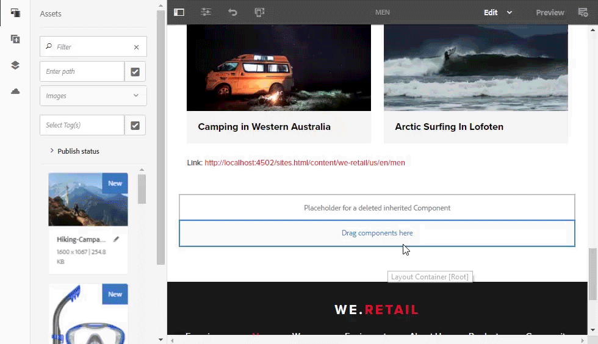

# Note sulla versione di AEM Assets{#aem-assets-release-notes}

Di seguito sono riportate le principali funzioni e caratteristiche di AEM 6.5 Assets.

## Integrazione in Adobe Creative Cloud e flussi di lavoro creativi {#integration-with-adobe-creative-cloud-and-creative-workflows}

AEM offre varie modalità di integrazione in Adobe Creative Cloud e condivisione delle risorse da utilizzare nei flussi di lavoro che coinvolgono i team creativi e quelli di marketing o commerciali. AEM 6.5 continua a sviluppare e semplificare l’integrazione per garantire maggiori opportunità e migliorare i metodi esistenti.

Di seguito sono elencate le funzionalità specifiche e le integrazioni di AEM 6.5 che puoi sfruttare per supportare al meglio i tuoi casi d’uso in relazione alla velocità dei contenuti.

### Adobe Asset Link {#aal}

Adobe Asset Link rafforza la collaborazione tra creativi e addetti al marketing nel processo di creazione dei contenuti. I creativi possono accedere ai contenuti archiviati in Adobe Experience Manager Assets (AEM Assets), senza lasciare le applicazioni che conoscono meglio. Possono sfogliare, ricercare e controllare le risorse utilizzando un apposito pannello disponibile direttamente in Photoshop, Illustrator e InDesign.

Adobe Asset Link fa parte dell’offerta [Creative Cloud for enterprise](https://www.adobe.com/creativecloud/business/enterprise.html). Per ulteriori informazioni, compresa la configurazione necessaria per la distribuzione di AEM, consulta [Adobe Asset Link](https://helpx.adobe.com/enterprise/using/adobe-asset-link.html).

### Integrazione di Adobe Stock {#stock}

L’organizzazione può utilizzare il proprio piano aziendale Adobe Stock all’interno di Risorse AEM per garantire che le risorse su licenza siano ampiamente disponibili per i progetti creativi e di marketing. Puoi trovare, visualizzare in anteprima e concedere in licenza rapidamente le risorse Adobe Stock salvate in AEM, utilizzando le potenti funzionalità DAM di AEM.

Il servizio Adobe Stock offre a designer e aziende l’accesso a milioni di foto, immagini vettoriali, illustrazioni, video, modelli e risorse 3D di alta qualità, curate ed esenti da royalty, per qualsiasi progetto creativo.

Per ulteriori informazioni, consulta [Utilizzare le risorse di Adobe Stock in AEM Assets](/help/assets/aem-assets-adobe-stock.md).

Anteprima di immagini Adobe Stock con possibilità di acquistarne la licenza direttamente da AEM Assets

Ricerca e filtraggio delle immagini di Adobe Stock concesse in licenza in AEM

### Dynamic references in Adobe InDesign {#dynamic-references-in-indesign}

Le risorse AEM Assets utilizzate nei file Adobe InDesign sono dinamiche. I riferimenti vengono aggiornati automaticamente se le risorse a cui si fa riferimento si spostano nella gerarchia di JCR. Per ulteriori informazioni, consulta [Gestione delle risorse composite](/help/assets/managing-linked-subassets.md).

## Funzionalità di Brand Portal {#brand-portal-capabilities}

AEM Assets Brand Portal consente di acquisire facilmente, controllare efficacemente e distribuire in modo sicuro le risorse approvate a fornitori/agenzie esterne e utenti aziendali interni su tutti i dispositivi. Consente di migliorare l’efficienza della condivisione delle risorse, accelera il time-to-market delle risorse ed elimina il rischio di utilizzo non conforme e di accesso non autorizzato.

Per ulteriori informazioni, consulta [Scopri le novità di Brand Portal](https://helpx.adobe.com/experience-manager/brand-portal/using/whats-new.html).

## Risorse collegate {#connectedassets}

Nelle grandi aziende l’infrastruttura necessaria per la creazione di siti web può essere dislocata in luoghi diversi. A volte, le funzioni di creazione di siti web e le risorse digitali richieste risiedono in silos diversi.

AEM Sites offre la funzionalità di creazione di pagine web e AEM Assets è il sistema di gestione delle risorse digitali (DAM) che fornisce le risorse necessarie per i siti web. AEM supporta ora questo tipo di caso d’uso mediante l’integrazione di AEM Sites e AEM Assets.

Per ulteriori informazioni, consulta [Utilizzare le risorse da una risorsa connessa](/help/assets/use-assets-across-connected-assets-instances.md).

Trascinamento di risorse DAM da un’istanza di AEM nella pagina Sites in un’altra istanza di AEM

## Dynamic Media {#dynamic-media}

Dynamic Media fornisce funzionalità avanzate per l’authoring e la distribuzione di contenuti multimediali in AEM Assets per offrire esperienze all’avanguardia, coinvolgenti e personalizzate. Caricando un’unica risorsa principale di alta qualità, è possibile sfruttare le funzionalità avanzate di rendering cloud e visualizzatori per fornire in tempo reale qualsiasi combinazione di rappresentazione per supportare all’istante la strategia multimediale della tua organizzazione.

Per maggiori dettagli sulle nuove funzionalità Dynamic Media, consulta le [note sulla versione per Dynamic Media](https://marketing.adobe.com/resources/help/en_US/s7/release_notes/).

### Supporto per video a 360° {#video-support}

Gestisci i tuoi file di video a 360° direttamente in AEM utilizzando i visualizzatori Dynamic Media all’avanguardia per offrire esperienze di realtà virtuale su desktop, telefoni cellulari e visori VR. Per ulteriori informazioni, consulta [Utilizzare i video a 360°](/help/assets/360-video.md).

### Miniature video personalizzate {#custom-video-thumbnails}

È ora possibile personalizzare le miniature delle risorse video utilizzando fotogrammi dal video stesso o altri contenuti memorizzati nel sistema DAM. Per ulteriori istruzioni, consulta la sezione sulle [miniature video](/help/assets/video.md#about-video-thumbnails-in-dynamic-media-scene-mode).

### Miglioramenti all’accessibilità {#accessibility-enhancements}

I visualizzatori di elementi multimediali dinamici includono ora il supporto per funzioni di accessibilità avanzate come il supporto di Aria, assistenti vocali e testo Alt. Per ulteriori dettagli, consulta le [note sulla versione per i visualizzatori di Dynamic Media](https://marketing.adobe.com/resources/help/en_US/s7/viewers_ref/index.html).

## Miglioramento dell’esperienza di ricerca {#search-experience-enhancement}

A partire da AEM 6.5, gli addetti al marketing possono individuare più rapidamente le risorse desiderate dalla pagina dei risultati di ricerca. I facet di ricerca vengono aggiornati con il numero di risorse anche prima di applicare il filtro di ricerca. La visualizzazione del conteggio previsto per il filtro consente agli utenti di navigare in modo efficiente tra i risultati della ricerca. Per ulteriori informazioni, consultate [Cercare risorse in AEM](../assets/search-assets.md).

Visualizzazione del numero di risorse senza filtrare i risultati nei facet di ricerca.

## Miglioramento dell’usabilità {#usability-enhancement}

Ora è possibile selezionare tutte le risorse all’interno di una cartella o da un risultato di ricerca con una sola operazione. Consente di gestire rapidamente più risorse. La casella di controllo seleziona tutte le risorse che si adattano allo scenario, ad esempio un risultato di ricerca e non solo le risorse che sono visibili nell’interfaccia AEM.

Usa l’opzione Seleziona tutto per selezionare tutte le risorse con un solo clic.

## Miglioramenti dei metadati {#metadata-enhancements}

Assets consente di creare schemi di metadati per le cartelle delle risorse, che definiscono il layout e i metadati visualizzati nelle pagine di proprietà delle cartelle. È ora possibile assegnare uno schema di metadati di una cartella a una cartella esistente o quando si crea una nuova cartella. Per ulteriori informazioni, consulta [Schema metadati cartelle](/help/assets/folder-metadata-schema.md).

Quando si specificano i metadati a cascata, le selezioni possono essere caricate da un file JSON in fase di runtime, ad es. invece di digitare manualmente nel modulo. Per ulteriori informazioni, consulta [Metadati a cascata](/help/assets/cascading-metadata.md).

## Miglioramenti della creazione di rapporti {#reporting-enhancements}

I frammenti di contenuto e le condivisioni di collegamenti sono ora inclusi nel rapporto sulle risorse scaricate. Per ulteriori informazioni, consulta la sezione sui [rapporti sulle risorse](/help/assets/asset-reports.md).
