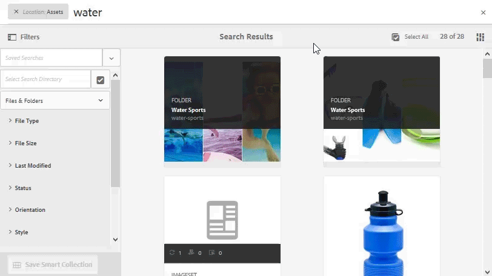

# [!DNL Adobe Experience Manager Assets] note sulla versione  {#aem-assets-release-notes}

Di seguito sono elencate le funzioni e gli elementi di rilievo della versione [!DNL Adobe Experience Manager] 6.5 [!DNL Assets].

## Integrazione con [!DNL Adobe Creative Cloud] e flussi di lavoro creativi {#integration-with-adobe-creative-cloud-and-creative-workflows}

[!DNL Adobe Experience Manager] offre varie modalità di integrazione in e condivisione delle risorse da utilizzare nei flussi di lavoro che coinvolgono i team creativi e quelli di marketing o commerciali.[!DNL Adobe Creative Cloud] [!DNL Experience Manager] 6.5 continua a sviluppare e semplificare l’integrazione per garantire maggiori opportunità e migliorare i metodi esistenti.

Continua a leggere per conoscere le funzionalità e le integrazioni specifiche di [!DNL Experience Manager] 6.5 che puoi sfruttare per supportare al meglio i casi di utilizzo della velocità dei contenuti.

### Adobe Asset Link {#aal}

[!DNL Adobe Asset Link] rafforza la collaborazione tra creativi e professionisti del marketing nel processo di creazione dei contenuti. I creativi possono accedere al contenuto memorizzato in [!DNL Experience Manager Assets], senza uscire dalle app che conoscono di più. I creativi possono sfogliare, cercare, estrarre e archiviare facilmente le risorse utilizzando il pannello in-app nelle [!DNL Adobe Photoshop], [!DNL Adobe Illustrator] e nelle app [!DNL Adobe InDesign].

[!DNL Adobe Asset Link] fa parte della  [Creative Cloud per l&#39;offerta ](https://www.adobe.com/it/creativecloud/business/enterprise.html) imprenditoriale. Per ulteriori informazioni, inclusa la configurazione necessaria della [!DNL Experience Manager] distribuzione, vedere [ collegamento risorsa Adobe](https://helpx.adobe.com/it/enterprise/using/adobe-asset-link.html).

### [!DNL Adobe Stock] integration  {#stock}

L&#39;organizzazione può utilizzare il proprio piano aziendale [!DNL Adobe Stock] all&#39;interno di [!DNL Experience Manager Assets] per garantire che le risorse con licenza siano ampiamente disponibili per i progetti creativi e di marketing. Puoi trovare, visualizzare in anteprima e ottenere la licenza per le risorse [!DNL Adobe Stock] salvate in  Experience Manager, utilizzando le potenti funzionalità DAM di [!DNL Experience Manager].

[!DNL Adobe Stock]Il servizio offre a designer e aziende l’accesso a milioni di foto, immagini vettoriali, illustrazioni, video, modelli e risorse 3D di alta qualità, curate ed esenti da royalty, per qualsiasi progetto creativo.

Per ulteriori informazioni, consultate [Utilizzare  risorse Adobe Stock in  risorse di Experience Manager](/help/assets/aem-assets-adobe-stock.md).

*Figura: Visualizza in anteprima  [!DNL Adobe Stock] immagini e licenze dall&#39;interno  [!DNL Experience Manager Assets].*

*Figura: Cercate e filtrate le  [!DNL Adobe Stock] immagini con licenza in  [!DNL Experience Manager].*

### Riferimenti dinamici in [!DNL Adobe InDesign] {#dynamic-references-in-indesign}

[!DNL Experience Manager Assets] utilizzati nei  [!DNL Adobe InDesign] file sono dinamici. I riferimenti vengono aggiornati automaticamente se le risorse a cui si fa riferimento si spostano nella directory archivio. Per ulteriori informazioni, vedere [come gestire le risorse composte](/help/assets/managing-linked-subassets.md).

## Funzionalità di Brand Portal {#brand-portal-capabilities}

[!DNL Experience Manager Assets Brand Portal] consente di acquisire facilmente, controllare efficacemente e distribuire in modo sicuro le risorse approvate a fornitori/agenzie esterne e utenti aziendali interni su tutti i dispositivi. Consente di migliorare l’efficienza della condivisione delle risorse, accelera il time-to-market delle risorse ed elimina il rischio di utilizzo non conforme e di accesso non autorizzato.

Per ulteriori informazioni, consulta [Scopri le novità di Brand Portal](https://helpx.adobe.com/experience-manager/brand-portal/using/whats-new.html).

## Risorse collegate {#connectedassets}

Nelle grandi aziende l’infrastruttura necessaria per la creazione di siti web può essere dislocata in luoghi diversi. A volte, le funzioni di creazione di siti web e le risorse digitali richieste risiedono in silos diversi.

[!DNL Experience Manager Sites] offre la funzionalità di creazione di pagine web e è il sistema di gestione delle risorse digitali (DAM) che fornisce le risorse necessarie per i siti web. [!DNL Experience Manager Assets] [!DNL Experience Manager] supporta ora il caso d&#39;uso di cui sopra integrando  [!DNL Sites] e  [!DNL Assets]. Vedere [come configurare e utilizzare la funzione Risorse connesse](/help/assets/use-assets-across-connected-assets-instances.md).

![Trascinate una risorsa da una  [!DNL Experience Manager] distribuzione su una  [!DNL Sites] pagina di un’altra  [!DNL Experience Manager] distribuzione](assets/connected-assets-drag-and-drop-only.gif)

*Figura: Trascinate una risorsa da una  [!DNL Experience Manager] distribuzione su una  [!DNL Sites] pagina di un’altra  [!DNL Experience Manager] distribuzione.*

## Dynamic Media {#dynamic-media}

[!DNL Dynamic Media] offre funzionalità avanzate di authoring e distribuzione  [!DNL Experience Manager Assets] per contenuti multimediali per creare esperienze all&#39;avanguardia coinvolgenti e personalizzate. Caricando una singola risorsa principale di alta qualità e utilizzando il rendering cloud e i visualizzatori avanzati, potete distribuire al volo qualsiasi combinazione di rappresentazioni per supportare la strategia media aziendale.

Per ulteriori dettagli sulle nuove funzioni [!DNL Dynamic Media], vedere [Note sulla versione di Dynamic Media](https://experienceleague.adobe.com/docs/dynamic-media-developer-resources/release-notes/s7rn2017.html).

### Supporto video 360 {#video-support}

Gestite i file video a 360° direttamente in [!DNL Experience Manager] utilizzando i visualizzatori all&#39;avanguardia per offrire esperienze VR a desktop, dispositivi mobili e cuffie VR. Per ulteriori informazioni, consulta [Utilizzare i video a 360°](/help/assets/360-video.md).

### Miniature video personalizzate {#custom-video-thumbnails}

È ora possibile personalizzare le miniature delle risorse video utilizzando fotogrammi dal video stesso o altri contenuti memorizzati nel sistema DAM. Per ulteriori istruzioni, consulta la sezione sulle [miniature video](/help/assets/video.md#about-video-thumbnails-in-dynamic-media-scene-mode).

### Miglioramenti dell’accessibilità {#accessibility-enhancements}

[!DNL Dynamic Media] i visualizzatori ora supportano funzioni di accessibilità avanzate come Aria-support, assistenti vocali e Alt-text. Per ulteriori dettagli, consulta le [note sulla versione per i visualizzatori di Dynamic Media](https://experienceleague.adobe.com/docs/dynamic-media-developer-resources/library/home.html).

## Miglioramento dell’esperienza di ricerca {#experience-enhancement-for-searching}

[!DNL Experience Manager] A partire da 6.5, gli addetti al marketing possono individuare più rapidamente le risorse desiderate dalla pagina dei risultati della ricerca. I facet di ricerca vengono aggiornati con il numero di risorse anche prima di applicare il filtro di ricerca. La visualizzazione del conteggio previsto per il filtro consente agli utenti di navigare in modo efficiente tra i risultati della ricerca. Per ulteriori informazioni, consultate [Cercare risorse in  Experience Manager](../assets/search-assets.md).

*Figura: Visualizzate il numero di risorse senza filtrare i risultati di ricerca nei facet di ricerca.*

## Miglioramento dell’usabilità {#usability-enhancement}

Ora potete selezionare tutte le risorse caricate all’interno di una cartella o da un risultato di ricerca in una sola volta. Consente di gestire rapidamente più risorse. La casella di controllo seleziona tutte le risorse adatte allo scenario, ad esempio un risultato di ricerca e non solo le risorse visibili nell&#39;interfaccia [!DNL Experience Manager].

*Figura: Usate l’opzione Seleziona tutto per selezionare tutte le risorse caricate con un solo clic.*

## Miglioramenti dei metadati {#metadata-enhancements}

[!DNL Assets] consente di creare schemi di metadati per le cartelle delle risorse, che definiscono il layout e i metadati visualizzati nelle pagine di proprietà delle cartelle. È ora possibile assegnare uno schema di metadati di una cartella a una cartella esistente o quando si crea una nuova cartella. Per ulteriori informazioni, consulta [Schema metadati cartelle](/help/assets/metadata-config.md#folder-metadata-schema).

Quando si specificano i metadati a cascata, le selezioni possono essere caricate da un file JSON in fase di runtime, ad es. invece di digitare manualmente nel modulo. Per ulteriori informazioni, vedere [CSS](/help/assets/metadata-schemas.md#cascading-metadata).

## Miglioramenti della creazione di rapporti {#reporting-enhancements}

I frammenti di contenuto e le condivisioni di collegamenti sono ora inclusi nel rapporto scaricato. Per ulteriori informazioni, consulta la sezione sui [rapporti sulle risorse](/help/assets/asset-reports.md).
