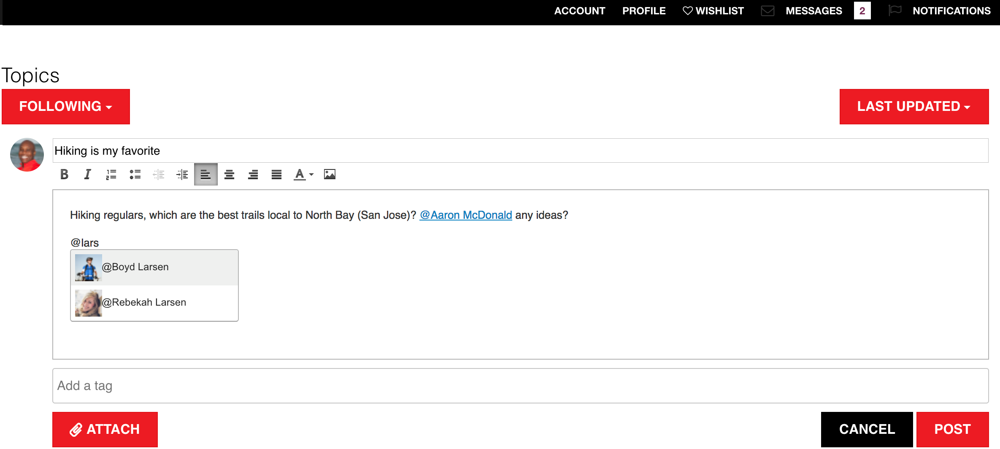

# AEM Communities release notes {#aem-communities-release-notes}

Di seguito sono elencati i miglioramenti apportati ad AEM Communities a partire dalla versione 6.4. To learn about the new features in greater detail, see [AEM 6.5 Communities User Guide](https://helpx.adobe.com/it/experience-manager/6-4/communities/user-guide.html).

To obtain the latest release, see the [Deploying Communities](https://helpx.adobe.com/in/experience-manager/6-4/help/communities/deploy-communities.html#LatestReleases) section of the documentation.

## Miglioramenti principali {#major-enhancements}

### Miglioramenti relativi al coinvolgimento della community {#enhancements-to-community-engagement}

**@Mentions supporta** i AEM Communities ora permettono agli utenti registrati di assegnare tag (menzionare) ad altri membri registrati per attirare la loro attenzione, in Contenuto generato dagli utenti. I membri taggati (menzionati) ricevono quindi una notifica con un collegamento diretto al corrispondente contenuto generato dagli utenti. Tuttavia, gli utenti possono scegliere di disabilitare/abilitare le notifiche Web e e-mail.

Gli utenti della community non devono cercare il loro nome, cognome o nome utente per vedere se qualcuno li ha contattati o richiama la loro attenzione. Inoltre, permette agli autori di contenuti generati dagli utenti di cercare risposte da specifici utenti registrati che possono risolvere al meglio il problema e aggiungere input.

The community administrators need to **Enable Mention** on community components to allow registered users use the functionality on those components.

**Messaggistica di gruppo**

I membri registrati della community possono ora inviare messaggi diretti in blocco a gruppi di utenti attraverso una singola composizione e-mail, invece di inviare lo stesso messaggio ai singoli membri del gruppo. To allow [group messaging](/help/communities/configure-messaging.md), enable both the instances of [Messaging Operations Service](/help/communities/messaging.md#group-messaging).

### Miglioramenti alla moderazione di gruppo {#enhancements-to-bulk-moderation}

Filtri personalizzati in Moderazione di massa

[I filtri](/help/communities/moderation.md#custom-filters) personalizzati ora possono essere sviluppati e aggiunti all&#39;interfaccia utente Moderazione di massa.

Un [progetto di riferimento](https://github.com/Adobe-Marketing-Cloud/aem-communities-extensions/tree/master/aem-communities-moderation-filter) che dimostra le operazioni con filtro tramite tag è disponibile in [Github](https://github.com/Adobe-Marketing-Cloud/aem-communities-extensions/tree/master/aem-communities-moderation-filter). Questo progetto può essere utilizzato come base per sviluppare filtri personalizzati analoghi.

**Visualizzazione a elenco nella moderazione di gruppo**

Nella moderazione di gruppo è stata integrata una nuova visualizzazione a elenco con interfaccia utente migliorata per visualizzare le voci relative ai contenuti generati dagli utenti.

### Miglioramenti alla gestione del sito e dei gruppi {#enhancements-to-site-and-group-management}

**Sito lato autore e amministratori di gruppo**

A partire dalla versione AEM 6.5, Communities consente l’amministrazione (e la gestione) decentrata di diversi siti e gruppi di community e gruppi nidificati. Le organizzazioni che ospitano più siti di community e gruppi nidificati possono ora selezionare i membri per i ruoli di amministratore sul lato autore al momento della creazione del sito (e del gruppo).

Gli amministratori del sito possono creare un gruppo a qualsiasi livello gerarchico e diventare gli amministratori predefiniti. In seguito, questi amministratori possono essere rimossi dagli altri amministratori di gruppo. Gli amministratori del gruppo possono gestire il proprio gruppo (ad esempio G1) e creare un sottogruppo nidificato in G1.

### Miglioramenti all’abilitazione {#enhancements-to-enablement}

**Supporto per SCORM 2017.1**

The enablement functionality of AEM 6.5 Communities support Shareable Content Object Reference Model [(SCORM) 2017.1](https://rusticisoftware.com/blog/scorm-engine-2017-released/) engine.

* Supporto per la navigazione tramite tastiera sui componenti di abilitazione
* I componenti di abilitazione (ad esempio Catalogo e Riproduzione corso, Assegnazioni, Libreria file) nei AEM Communities supportano la navigazione tramite tastiera per una migliore accessibilità.

### Altri miglioramenti {#other-enhancements}

* Supporto Solr 7
* AEM 6.5 Communities supporta la versione Apache Solr 7.0 della piattaforma di ricerca durante la configurazione di MSRP e DSRP.
