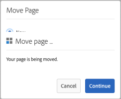

# [!DNL Adobe Experience Manager] 6.5 Note sulla versione di Service Pack {#aem-service-pack-release-notes}

## Informazioni sulla versione {#release-information}

| Prodotti | Adobe Experience Manager 6.5 |
| -------- | ---------------------------- |
| Versione | 6.5.6.0 |
| Tipo | Versione Service Pack |
| Data | 03 settembre 2020 |
| URL di download | [Distribuzione software](https://experience.adobe.com/#/downloads/content/software-distribution/en/aem.html?package=/content/software-distribution/en/details.html/content/dam/aem/public/adobe/packages/cq650/servicepack/aem-service-pkg-6.5.6.zip) |

## Contenuto in Adobe Experience Manager 6.5.6.0 {#what-s-included-in-aem}

Adobe Experience Manager 6.5.6.0 è un aggiornamento importante che include nuove funzioni, miglioramenti fondamentali richiesti dai clienti e miglioramenti a prestazioni, stabilità e sicurezza, rilasciati a partire dalla release 6.5 di **aprile 2019**. Può essere installato sulla parte superiore di Adobe Experience Manager 6.5.

Le funzioni chiave e i miglioramenti introdotti in Adobe Experience Manager 6.5.6.0 includono:

* La pubblicazione delle cartelle contributi risorse da Brand Portal a  risorse Experienci Manager ora è supportata anche tramite il server proxy.

* I gruppi di cartelle private generati automaticamente vengono ora ripuliti al momento dell&#39;eliminazione della cartella privata in [!DNL Experience Manager Assets].

* Le descrizioni dei modificatori nell’editor di predefiniti per [!UICONTROL visualizzatori] video sono state aggiornate in [!DNL Dynamic Media].

* Viene fornita una nuova impostazione aziendale per riflettere lo stato del [!DNL Dynamic Media] connettore.

* Le opzioni predefinite per `test` e `aiprocess` vengono aggiornate a `Thumbnail`, da `Rasterize` precedenti contenuti multimediali dinamici, per garantire che gli utenti debbano creare solo una miniatura e saltare l’estrazione della pagina e l’estrazione delle parole chiave.

* Precompilare un modulo adattivo presso il client.

* Integrazione del modello dati del modulo con le API RESTful su un server con implementazione SSL bidirezionale.

* È stata migliorata la memorizzazione nella cache per le pagine di moduli adattivi convertite.

* Supporto per  tag di testo Adobe Sign in Automated Forms Conversion Service.

* Supporto per la conversione di moduli colorati in moduli adattivi tramite [!DNL Automated Forms Conversion service].

* Supporto per i protocolli SMB 2 e SMB 3.

* Aggiornamento dell’archivio incorporato (Apache Jackrabbit Oak) alla versione 1.22.4.

Per un elenco completo delle funzioni e dei miglioramenti introdotti  Experience Manager 6.5.6.0, consultate [Novità di Adobe Experience Manager 6.5 Service Pack 6](new-features-latest-service-pack.md).

Di seguito è riportato l&#39;elenco delle correzioni fornite nella release [!DNL Experience Manager] 6.5.6.0.

### [!DNL Sites] {#sites-6560}

* In [!DNL Sites] o [!DNL Screens], selezionate un progetto e fate clic su [!UICONTROL Gestione pubblicazioni]. Gli utenti non possono avanzare nella procedura guidata [!UICONTROL Gestisci pubblicazione] a causa di errori nell&#39;interfaccia utente. Nello specifico, l&#39;opzione [!UICONTROL Pubblica] non funziona (NPR-34099).
* La posizione di iParsys (sistema paragrafo ereditato) non viene ripristinata alla posizione predefinita originale dopo aver deselezionato [!UICONTROL Annulla ereditarietà] o [!UICONTROL Disattiva ereditarietà] (NPR-34097).
* Se non `RolloutConfigManagerFactoryImpl` è possibile caricare una configurazione di rollout, non tenta di caricare le configurazioni mancanti. Restituisce le configurazioni memorizzate nella cache (NPR-34092).
* Nel componente di base Testo, dopo aver utilizzato l&#39;opzione di modifica HTML di origine, la classe dal `em` tag viene rimossa (NPR-34081).
* Dopo l&#39;aggiornamento  Experience Manager 6.3.3 a  Experience Manager 6.5.3, il processo di implementazione richiede molto più tempo e il rollout non riesce con un errore di timeout (NPR-34049).
* L&#39;attributo `htmlwriter` non codifica i valori degli attributi. La marcatura presente nella marcatura XF viene esportata con valori attributo decodificati (vale a dire `"` anziché `&#34`). Causa problemi sul lato Target con Visual Experience Composer (Compositore esperienza visivo) che utilizza il file XF esportato (NPR-34048).
* Quando si spostano le pagine in [!DNL Experience Manager Sites], migliorare la registrazione per catturare l&#39;errore di creazione della versione con un motivo (NPR-34014).
* Se [!DNL Rich Text Editor] viene rimosso tutto il testo, viene rimosso anche il tag paragrafo (NPR-33976).
* Quando la `siteadmin` pagina (nell’interfaccia classica) viene aperta o aggiornata, le opzioni del `New` menu sono disattivate (NPR-33949).

   

* Non [!DNL Content Fragment] può essere utilizzato come `TemplatedResource` errore in `ContentFragmentUsePojo` (NPR-33911).
* Le operazioni di spostamento sincrone e asincrone possono causare errori a causa di trasferimenti simultanei. Le operazioni di spostamento delle pagine sono limitate allo spostamento sincrono. Consente lo spostamento simultaneo di pagine (NPR-33875).
* [!UICONTROL L&#39;operazione Gestisci pubblicazione] per replicare il contenuto dall&#39;istanza Author a Publish non riesce e genera un errore JavaScript (NPR-33872).
* Quando per creare versioni sono selezionate più pagine o risorse, la nuova versione viene creata solo per l’ultima pagina o risorsa selezionata (NPR-33866).
* Spostate una pagina di blueprint con copie in tempo reale in un’altra cartella. Quando si sposta nella cartella originale, l&#39;operazione di spostamento non riesce senza errori (NPR-33864).
* Quando si utilizza l&#39;azione Sposta per rinominare una pagina Web nella [!DNL Sites] console, all&#39;ultimo passaggio della procedura guidata vengono visualizzate due finestre di dialogo sovrapposte (NPR-33831).

   

* Le proprietà `cq:acLinks` e `cq:acUUID` le proprietà [!DNL Adobe Campaign] della copia vengono rimosse durante l&#39;operazione di copia e incolla (NPR-33794).
* Quando si tenta di eseguire il rollout su una pagina figlia di una Live Copy principale indipendente, [!DNL Experience Manager] genera un&#39;eccezione di puntatore null (NPR-33676).
* I [!DNL RTE] componenti in un Contenitore di layout non sono visibili quando il Contenitore di layout viene copiato e incollato nuovamente sulla pagina. I [!DNL RTE] componenti non sono modificabili, ma vengono visualizzati all&#39;aggiornamento della pagina (NPR-33662).
* Quando si ridimensiona un componente di layout per diversi punti di interruzione (medio e grande), il layout non funziona come previsto (NPR-33608).
* In modalità di modifica in linea in [!DNL RTE], il trascinamento di un’immagine non funziona per il componente Testo (NPR-33602).
* È possibile creare un componente in una pagina blueprint con lo stesso nome del nome della pagina. Durante il rollout, `_msm_moved` viene assegnato un suffisso per rinominare il componente. Il componente viene spostato alla fine del sistema  paragrafo (NPR-33535).
* Se offTime o onTime è impostato su molte pagine o risorse, il sistema richiede molte risorse e rallenta l&#39;avvio e l&#39;arresto (NPR-33482).
* Un utente con autorizzazioni CRUD su non `/content/experience-fragment` è in grado di eliminare una cartella (NPR-33436).
* Potete selezionare [!UICONTROL HTML e JSON] come opzione per [!UICONTROL formato] di esportazione Adobe Target su una cartella principale nella [!DNL Experience Fragments] sezione. Le stesse proprietà vengono visualizzate nell’interfaccia touch per le sottocartelle di questa cartella principale. Tuttavia, in CRXDE, `cq:adobeTargetExportFormat`viene visualizzato solo HTML invece di visualizzare `html,json` (NPR-33423).
* La pubblicazione o l&#39;annullamento della pubblicazione da un Alias pagina non è supportata. Rimuovere l&#39;opzione che sembra presentare un&#39;altra richiesta (NPR-33415).
* Un tag specifico può essere spostato da una posizione all’altra in [!DNL Experience Manager]. Può essere applicato anche a pagine diverse prima e dopo lo spostamento. Quando si modificano le proprietà delle pagine, il tag non viene visualizzato per la modifica anche se il tag è lo stesso (NPR-33353).
* Il rendering di un modello di pagina non viene eseguito correttamente quando un Contenitore di layout viene eliminato da un modello che contiene più contenitori di layout (NPR-33347).
* Nell’editor modelli, provare a eliminare un modello utilizzato da più di 100000 pagine nella sezione `/content/`. Viene visualizzato un errore senza alcun messaggio di errore (NPR-33312).
* Il reindirizzamento alla [!DNL Experience Manager] pagina con ancoraggio non funziona sull&#39;istanza Author, come `PageRedirectServlets` inserisce una stringa di query dopo un frammento URL o un ancoraggio (NPR-34288).
* La creazione di un marchio in `/content/campaign` una struttura non consente la creazione di campagne. [!UICONTROL L&#39;opzione Crea marchio] lascia il marchio appena creato senza la possibilità di creare [!UICONTROL offerte e attività] in quanto non è disponibile l&#39;opzione [!UICONTROL Crea] (NPR-34113).
* È possibile sospendere la pagina e [!DNL Live Copy] l’ereditarietà viene interrotta come mostrato in modalità Editor. Nelle proprietà della pagina, l&#39;icona che rappresenta l&#39;ereditarietà indica erroneamente che l&#39;ereditarietà esiste e non è interrotta (NPR-34017).
* Le pagine con molti riferimenti non possono essere spostate in modo asincrono e talvolta l&#39;operazione di spostamento non riesce (CQ-4297969).
* Una pagina Web con `/` caratteri nell’URL non risponde durante l’authoring. Quando un componente viene aggiunto durante l’authoring, l’utilizzo della CPU aumenta e il browser smette di rispondere (CQ-4295749).
* In modalità Sfoglia, NVDA non narra un valore selezionato dall&#39;opzione di menu Tipo/Dimensione. L&#39;elemento visivo non è attivo sull&#39;elemento selezionato. Gli utenti che si affidano a un assistente vocale non possono utilizzare la modalità Sfoglia (CQ-4294993).
* Quando create una pagina Web, gli utenti possono selezionare il modello [!UICONTROL Pagina] contenuto. Nella scheda [!UICONTROL Social Media] , gli utenti selezionano una variante [!UICONTROL XF]preferita. Per selezionare un frammento esperienza in modalità di ricerca NVDA, gli utenti non possono utilizzare i tasti di scelta rapida (CQ-4292669).
* Aggiornamento della libreria handlebars alla versione più sicura v4.7.3 (NPR-34484).

### [!DNL Assets] {#assets-6560}

**Miglioramenti dell&#39;accessibilità in Experience Manager Assets**

* Gli utenti ora possono accedere e attivare le opzioni dell&#39;interfaccia utente interattiva nell&#39;elenco [!UICONTROL Riferimenti] delle risorse mediante i tasti di scelta rapida (NPR-34115).

* L&#39;assistente vocale ora annuncia le opzioni nel filtro di ricerca come fisarmoniche espandibili (NPR-34104).

* La pagina di ricerca e i risultati della ricerca ora dispongono di titoli più informativi per una migliore comprensione degli utenti degli assistenti vocali (NPR-34093).

* Gli assistenti vocali annunciano ora le opzioni per eliminare i tag selezionati nella scheda [!UICONTROL Base] dei pulsanti delle [!UICONTROL proprietà] della risorsa per eliminare i tag selezionati (NPR-33972).

* Gli elementi di ciascuna riga nella vista a elenco vengono ora correttamente annunciati come elementi della stessa riga dagli assistenti vocali (NPR-33932).

* Lo stato attivo dell&#39;utente quando si naviga con il tasto Tab ora si sposta correttamente sull&#39;opzione di chiusura nell&#39;anteprima della versione (NPR-33863).

* Lo stato attivo ora si sposta correttamente sull&#39;icona di ricerca dopo la chiusura di Omnisearch (NPR-33705).

* Le opzioni dell&#39;interfaccia utente attivabili ora sono più visibili e con maggior contrasto se utilizzate i tasti della tastiera. Pertanto, gli utenti con una tastiera vedente possono ora differenziare le aree interessate (NPR-33542).

* La funzionalità di trascinamento mediante la tastiera ora funziona correttamente nell&#39;Editor [!UICONTROL schema] metadati in modalità Sfoglia dell&#39;assistente vocale (CQ-4296326).

* Nella finestra di dialogo di condivisione dei collegamenti, quando si naviga in modalità Sfoglia, gli assistenti vocali,

   * ora non riportare le informazioni della tabella non appena la finestra di dialogo viene caricata.

   * Potete passare a tutti i suggerimenti automatici elencati.

   * ora vengono indicati i suggerimenti automatici visualizzati per l&#39;opzione [!UICONTROL Aggiungi indirizzo e-mail/Ricerca] (CQ-4294232).

* L&#39;utilizzo del tasto Esc per rimuovere le icone delle azioni rapide dalla visualizzazione delle miniature non rimuove più lo stato attivo dall&#39;ultimo elemento attivo (CQ-4293554).

* L&#39;assistente vocale ora annuncia alternative testuali che ne descrivono le funzionalità, per le icone (ad esempio le chevron) invece dei loro nomi letterali (CQ-4272943).

* Lo stato attivo ora si sposta con successo su [!UICONTROL Flyout], [!UICONTROL InlineZoom], [!UICONTROL Shoppable_Banner], [!UICONTROL Zoom_dark], [!UICONTROL Zoom_light]  , ZoomVertical_dark, ZoomVertical_light, opzioni di spostamento mediante il tasto Tab nei dettagli delle risorseAnteprima in Dynamic Media (CQ-42422000000000000000000000000000000000000000000000000000000000000000000000090605).

* [!UICONTROL È ora possibile accedere all&#39;opzione Salva e chiudi] nella pagina [!UICONTROL Proprietà] della risorsa utilizzando i tasti di scelta rapida (NPR-34107).

* I messaggi di errore a causa di combinazioni di nome utente e password errate nella pagina di login vengono ora annunciati dagli assistenti vocali ogni volta che si verifica l&#39;errore (NPR-33722).

* Nella sezione [!DNL Experience Manager] dell&#39;intestazione, quando si naviga in modalità Sfoglia, l&#39;assistente vocale ora annuncia,

   * modificate automaticamente i suggerimenti in [!UICONTROL Tipo per effettuare ricerche] in Omnisearch.

   * stato espanso o compresso per le opzioni [!UICONTROL Soluzioni], [!UICONTROL Aiuto], [!UICONTROL Inbox] e [!UICONTROL Utente] .

   * il messaggio di stato della Guida [!UICONTROL di] ricerca che viene visualizzato quando l’utente immette una stringa di ricerca nel campo [!UICONTROL Cerca nella Guida] , nell’opzione [!UICONTROL Aiuto] .

   

   *Figura:[!UICONTROL Cerca Aiuto]nel menu[!UICONTROL Aiuto]*

   * il messaggio di errore se nel campo [!UICONTROL Impersona come] è stato immesso un valore non corretto nell&#39;opzione [!UICONTROL Utente] e lo stato attivo si sposta correttamente nel campo di testo (NPR-33804).

   

   *Figura:[!UICONTROL Impersona come]campo nel menu[!UICONTROL Utente]nell’intestazione*

* L&#39;utente può ora spostare lo stato attivo utilizzando i tasti della tastiera:

   * [!UICONTROL Campo Cerca/Aggiungi indirizzo] e-mail nella finestra di dialogo Condivisione  collegamenti.

   * [!UICONTROL Aggiungi campo Utente o Gruppo] in Gruppo [!UICONTROL utenti] chiuso nella scheda [!UICONTROL Autorizzazioni] delle [!UICONTROL proprietà] della cartella (NPR-34452).

**Problemi risolti in Risorse  Experience Manager**

[!DNL Adobe Experience Manager] 6.5.6.0 Assets risolve i seguenti problemi:

* L&#39;anteprima delle risorse collaterali di marketing (come Brochure, Volantino e Biglietto da visita) create con il modello [!DNL Adobe InDesign] (INDD) non contiene interruzioni di riga e interruzioni di paragrafo (NPR-34268).

* L&#39;estrazione del testo per i file PDF caricati non funziona e la ricerca full-text di alcune parole in un file PDF non riesce a recuperare il file PDF (NPR-34164).

   >[!NOTE]
   >Per risolvere il problema, riavviate l&#39;istanza di Adobe Experience Manager dopo l&#39;installazione di Service Pack 6.5.6.0.

* Nella timeline di risorse con più pagine vengono visualizzate le annotazioni applicate a tutte le risorse secondarie quando si sfoglia la risorsa nella visualizzazione Timeline, invece di visualizzare le annotazioni specifiche per le risorse secondarie specifiche (NPR-34100).

* Le cartelle delle risorse non vengono pubblicate utilizzando l&#39;opzione [!UICONTROL Gestisci pubblicazione] se le cartelle contengono risorse nei formati di file JavaScript, CSS o JSON (NPR-34090).

* Deselezionando o rimuovendo i tag o i filtri applicati in Omnisearch la query di ricerca viene eseguita più volte, con conseguente aumento del tempo di ricerca (NPR-34078).

* Nella vista a schede, quando un flusso di lavoro (su una risorsa in una cartella) è in corso o in sospeso, la pagina viene ricaricata finché il flusso di lavoro non viene completato o terminato. Pertanto, gli autori non possono lavorare sulle risorse nella cartella per la quale devono scorrere verso il basso (NPR-33986).

* Se l’utente sposta una risorsa pubblicata in una nuova posizione, la risorsa viene ripubblicata anche se l’opzione [!UICONTROL Ripubblica] è deselezionata. Questo porta a molte risorse orfane che si trovano nell’istanza di pubblicazione. Il comportamento predefinito, tuttavia, consiste nel fatto che l’operazione di spostamento su una risorsa pubblicata la annulla automaticamente; questa risorsa viene ripubblicata se l’autore seleziona l’opzione [!UICONTROL Ripubblica] quando sposta la risorsa (NPR-33934).

* La pagina [!UICONTROL Sposta risorse] per le risorse nelle raccolte non carica tutto il contenuto HTML, ad esempio l&#39;opzione [!UICONTROL Regola/Ripubblica] . Pertanto, gli utenti non possono completare l&#39;operazione di spostamento (NPR-33860).

* Se spostate una risorsa e aggiungete caratteri speciali nel nome e nel titolo delle risorse spostate, viene creata una cartella aggiuntiva (con lo stesso nome) nella nuova posizione della risorsa (NPR-33826).

* [!UICONTROL Il pulsante Scarica] per una risorsa viene disattivato quando l&#39;opzione [!UICONTROL E-mail] è selezionata nella finestra di dialogo [!UICONTROL Scarica] (NPR-33730).

* L&#39;errore &quot;Request-URI too long&quot; viene rilevato durante l&#39;esecuzione di operazioni in massa sulle risorse, come la modifica in massa dei metadati (NPR-33723).

* Viene rilevato un errore JavaScript e gli utenti non possono selezionare o eliminare le scelte generate nel campo [!UICONTROL a discesa] mediante la funzionalità del percorso [!UICONTROL JSON nell&#39;Editor] moduli schema metadati cartella, se il file JSON caricato ha spazio o caratteri speciali nel valore (NPR-33712).

* Le rappresentazioni statiche delle risorse non vengono aggiornate quando la risorsa viene aggiornata tramite l&#39;opzione [!UICONTROL Apri] in [!DNL desktop app] o [!DNL Adobe Asset Link] e vengono sincronizzate di nuovo in [!DNL Adobe Experience Manager] (CQ-4296279).

* Nella vista a colonne, l’operazione di spostamento su un set di risorse consente inoltre di spostare le risorse selezionate prima di utilizzare l’opzione [!UICONTROL Filtro] . L&#39;utilizzo dell&#39;opzione [!UICONTROL Filtro] deseleziona la selezione precedente (NPR-34018).

* Le barre rovesciate vengono aggiunte prima dei caratteri speciali nei suggerimenti per la ricerca di risorse, che contengono caratteri speciali nel nome (NPR-33834).

* Quando si creano regole per l&#39;elenco a discesa nel modulo [!UICONTROL Schema metadati]cartella, l&#39;utente non può selezionare valori dalla colonna Scelte  campo (CQ-4297530).

* La copia in fase di esecuzione del modello di flusso di lavoro personalizzato delle risorse (creato in `/var/workflow/models/dam`) viene eliminata quando si installa 6.5 Service Pack 5 o versioni precedenti in 6.5 GA (NPR-34532).

   >[!NOTE]
   >
   >L&#39;aggiornamento a [!DNL Experience Manager] 6.5 Service Pack 6 non recupera la copia in fase di esecuzione, se la copia in fase di esecuzione viene eliminata al momento dell&#39;installazione di [!DNL Experience Manager] 6.5 Service Pack 5 o versioni precedenti al 6.5 GA. Per recuperare la copia in fase di esecuzione, sincronizzate la copia in fase di progettazione del modello di workflow con la copia in fase di esecuzione mediante l’API HTTP:
   `<designModelPath>/jcr:content.generate.json`.

**Problemi risolti in Contenuti multimediali dinamici**

* Se l’utente definisce le impostazioni di codifica nelle modifiche dopo la creazione del profilo video, le impostazioni di ritaglio avanzato vengono rimosse dai profili video (CQ-4299177).

* Le risorse lampeggiano durante il caricamento della pagina quando l&#39;utente attiva/disattiva le opzioni della barra laterale (ad esempio, [!UICONTROL Panoramica], [!UICONTROL Timeline], [!UICONTROL Visualizzatori]) nella pagina dei dettagli della risorsa (NPR-34235).

* Durante il processo di rielaborazione vengono osservati i seguenti problemi:

   * ID processo mancante nell&#39;handle del processo restituito dal processo di rielaborazione.

   * Rielaborare il processo per i registri video solo il nome del file e non il percorso completo.

   * Il processo di rielaborazione non dispone dell&#39;opzione per impostare il tipo di risorsa come statico.

   * `ExcludeFromAVS` non è disponibile (CQ-4298401).

* La funzionalità Smart Crop non riesce con un errore quando il profilo immagine viene aggiunto a una cartella con più proporzioni (ad esempio, 11) (NPR-34082).

* Il flusso di lavoro delle risorse di aggiornamento DAM viene attivato quando l&#39;utente scorre verso il basso nella pagina Archivio  flussi di lavoro della scheda [!UICONTROL Flusso] di lavoro all&#39;interno di [!UICONTROL Strumenti] in [!DNL Adobe Experience Manager] configurazione con Dynamic Media Scene7 (CQ-4299727).

* I simboli nella scheda [!UICONTROL Comportamento] dell’Editor [!UICONTROL predefinito per] visualizzatori non sono localizzati (CQ-4299026).

* Se il visualizzatore è in modalità reattiva (CQ-4298293), la vista principale visualizza l&#39;immagine con un layout non corretto e non è disponibile nel visualizzatore.

* Le modifiche ai predefiniti per immagini in [!UICONTROL Adobe Experience Manager] non si sincronizzano con Scene7 Publishing System (CQ-4299713).

### [!DNL Commerce] {#commerce-6560}

* I collegamenti alle risorse dei prodotti non vengono modificati quando le risorse vengono spostate (NPR-34098).

### Platform {#platform-6560}

* Impossibile scaricare i registri utilizzando lo strumento Diagnosi in un&#39;istanza di Experience Manager  aggiornata (NPR-34336).
* L&#39;aggiornamento non riesce con un errore a causa delle dipendenze da una versione specifica del pacchetto `cq-wcm-api` foundation (CQ-4300520).
* I valori predefiniti per le impostazioni Timeout **[!UICONTROL di]** Connect e Timeout **** socket per la configurazione Agente predefinito (pubblicazione) non sono specificati (NPR-33707).
* Gli aggiornamenti alla configurazione della mappatura in `/etc/map.publish` non si riflettono sulle pagine del sito (NPR-34015).
* [La documentazione](https://helpx.adobe.com/experience-manager/6-5/sites/developing/using/reference-materials/javadoc/com/day/cq/tagging/package-summary.html) di riferimento API non include la documentazione per il `com.day.cq.tagging` pacchetto (CQ-4295864).

### Interfaccia utente {#ui-6560}

* L&#39;interfaccia del browser di offload non visualizza tutti gli argomenti del processo (NPR-34308).
* L&#39;interfaccia del browser di configurazione non visualizza tutte le configurazioni (NPR-33644).
* Premendo il `Esc` tasto durante la ricerca di utenti da impersonare, la finestra di dialogo **[!UICONTROL Utente]** si chiude invece dell&#39;elenco di utenti (NPR-34084).

### Integrations (Integrazioni){#integrations-6560}

* Le attività con nomi lunghi non vengono sincronizzate con [!DNL Adobe Target] (NPR-34254).

### Progetti traduzione {#translation-6560}

* Un progetto di traduzione non viene creato se l&#39;utente `authorizableID` include caratteri speciali (NPR-33828).

### Sling {#sling-6560}

* La funzione di verifica dello stato e di rilevamento dei pattern sono sovrapposte. Di conseguenza, il controllo dello stato viene rimosso dal prodotto (NPR-33928).

### WCM {#wcm-6560}

* Componenti di base - Quando si aggiunge un componente immagine di base a una pagina e si fa riferimento a un&#39;immagine, l&#39; `Undo` operazione non funziona (NPR-34516).

* Impossibile utilizzare l&#39;operazione Page Move (CQ-4303028).

### [!DNL Communities] {#communities-6560}

* La condivisione di un post sui social media mostra un&#39;opzione obsoleta Google+ (NPR-33877).

* Il membro della community non è in grado di modificare il modello di gruppo o altre impostazioni della funzione di gruppo (NPR-33530).

* I tag collegamento ipertestuale sulle immagini non vengono generati correttamente in un post del forum (NPR-33464).

* Gli errori di accessibilità sono identificati nella funzione Assegnazione community (NPR-33442).

* Gli utenti esistenti di un gruppo di community aggiunto tramite Admin Console vengono rimossi dall&#39;elenco di utenti in caso di modifiche nella console del gruppo di community (NPR-34315).

<!--
* Tag filters are vulnerable to sensitive information disclosure (NPR-33868).
-->

### [!DNL Forms] {#forms-6560}

>[!NOTE]
>
>[!DNL Experience Manager] Service Pack non include correzioni per [!DNL Forms]. They are delivered using a separate [!DNL Forms] add-on package. In addition, a cumulative installer is released that includes fixes for [!DNL Experience Manager Forms] on JEE. For more information, see [Install AEM Forms add-on](#install-aem-forms-add-on-package) and [Install AEM Forms on JEE](#install-aem-forms-jee-installer).

**Moduli adattivi**

* In presenza di un frammento di modulo adattivo mancante, il rendering del modulo adattivo non riesce (NPR-34302).

* La descrizione del contenuto della Guida relativa a un campo modulo adattivo visualizza un tag HTML paragrafo (NPR-34116).

* Quando si seleziona la proprietà **[!UICONTROL Revoca sul server]** , il modulo adattivo non viene inviato (NPR-33876).

* L&#39;azione **[!UICONTROL Invia a endpoint]** REST non funziona per un modulo adattivo (CQ-4299044).

* Accessibilità: Quando si tenta di inviare un modulo adattivo senza caricare un allegato per un campo obbligatorio, lo stato attivo non si sposta automaticamente sul campo allegato (CQ-4298065).

* Quando si aggiungono righe a una tabella di un modulo adattivo, nelle opzioni **[!UICONTROL Aggiungi all&#39;inizio]** e **[!UICONTROL Aggiungi al basso]** non vengono visualizzati i risultati appropriati (CQ-4297511).

* Lo script [!UICONTROL Value Commit] viene attivato in modo non corretto, con conseguente perdita di dati in un modulo adattivo (CQ-4296874).

* Il selettore data non funziona correttamente per i moduli adattivi localizzati (NPR-34333).

* Se il nome del file contiene un carattere di sottolineatura o uno spazio, non è possibile allegare il file a un modulo adattivo (CQ-4301001).

* Quando un pannello ripetibile nidificato ha più occorrenze del relativo elemento padre, tutte le occorrenze di tale pannello ripetibile nidificato non vengono precompilate (NPR-33666).

* Nei moduli adattivi sono presenti alcuni risolutori di risorse aperti. Ciò comporta errori di invio. Il problema si verifica in modo intermittente (CQ-4299407).

**Flusso di lavoro**

* Quando un approvatore di workflow carica un allegato, l&#39;allegato viene rinominato in `undefined` (NPR-33699).

* [!DNL Experience Manager] L&#39;operazione di eliminazione del flusso di lavoro non riesce e visualizza il seguente messaggio di errore (NPR-33575):

   `java.lang.UnsupportedOperationException: The query read more than 500000 nodes in memory`

* [!DNL Experience Manager Forms] l&#39;app per [!DNL Windows] interrompere la risposta dopo l&#39;invio di un modulo (NPR-34409).

* Quando installate AEM Service Pack, l&#39;elenco **Da fare** degli elementi non viene visualizzato come collegamenti. Il testo per gli elementi **Da fare** include tag HTML (NPR-34317).

**Comunicazione interattiva**

* Se si include un frammento di documento di testo con componenti ripetibili nidificati, la comunicazione interattiva non riesce a salvare (NPR-34095).

**Gestione della corrispondenza**

* Quando si modifica un frammento di documento di testo che include i valori del dizionario dati, l&#39;interfaccia utente dell&#39;agente non risponde più (NPR-33930).

* Copiare il contenuto da un [!DNL Microsoft Word] documento a un frammento di documento di testo in una lettera provoca problemi di formattazione (NPR-33536).

**Servizi basati su documenti**

* Quando si genera un file PDF da un file XDP utilizzando i servizi Output e Forms, il testo risulta mancante e sovrapposto (NPR-34237, CQ-4299331).

* Quando convertite un file HTML in PDF, l&#39; `MaxReuseCount` attributo non è configurabile (NPR-33470).

* Quando scaricate un file PDF che include funzioni interattive Estensioni di Reader, non potete aggiungere un allegato al file PDF utilizzando [!DNL Adobe Reader] (NPR-33729).

**Sicurezza dei documenti**

* Impossibile eseguire l&#39;operazione Sign con certificati basati su HSM in un file PDF dopo l&#39;installazione di [!DNL Experience Manager] Service Pack (NPR-34310).

**Designer**

* Impossibile aprire XForms in Designer versione 6.5.x (CQ-4295322).

* Quando si apre Designer, nella schermata introduttiva viene visualizzato un anno non corretto (CQ-4295289).

* Quando si installa [!DNL Acrobat DC] sul server, l&#39;opzione **[!UICONTROL Distribuisci modulo]** è inattiva (CQ-4296304).

Per informazioni sugli aggiornamenti della sicurezza, consultate [pagina](https://helpx.adobe.com/security/products/experience-manager.html)dei bollettini sulla sicurezza degli Experienci Manager.

## Install 6.5.6.0 {#install}

**Requisiti di configurazione**

* AEM 6.5.6.0 requires AEM 6.5. See [upgrade documentation](/help/sites-deploying/upgrade.md) for detailed instructions.
* Il download del service pack è disponibile  Adobe Distribuzione [](https://experience.adobe.com/#/downloads/content/software-distribution/en/aem.html)software.
* In una distribuzione con MongoDB e più istanze, installa AEM 6.5.6.0 in una delle istanze Autore tramite Gestione pacchetti.
* Prima di eseguire l&#39;installazione, scegli un&#39;istantanea o un nuovo backup dell&#39;istanza AEM.
* Riavvia l’istanza prima dell’installazione. Anche se questa operazione è necessaria solo quando l’istanza è ancora in modalità di aggiornamento (e questo accade quando l’istanza è stata aggiornata da una versione precedente), è consigliabile riavviare l’istanza se questa è rimasta in esecuzione per un periodo più lungo.

>[!NOTE]
>
> Adobe non consiglia di rimuovere o disinstallare il pacchetto Adobe Experience Manager 6.5.6.0.

### Installare Service Pack {#install-service-pack}

Per installare Service Pack in un’istanza Adobe Experience Manager 6.5 esistente, effettuate le seguenti operazioni:

1. Scaricate il service pack da [Software Distribution](https://experience.adobe.com/#/downloads/content/software-distribution/en/aem.html?package=/content/software-distribution/en/details.html/content/dam/aem/public/adobe/packages/cq650/servicepack/aem-service-pkg-6.5.6.zip).

1. Aprite Gestione pacchetti e fate clic su **[!UICONTROL Carica pacchetto]** per caricare il pacchetto. Per sapere come utilizzarlo, consulta Gestione [](https://docs.adobe.com/content/help/en/experience-manager-65/administering/contentmanagement/package-manager.html)pacchetti.

1. Select the package and click **[!UICONTROL Install]**.

>[!NOTE]
>
>La finestra di dialogo nell&#39;interfaccia utente di Package Manager talvolta si chiude durante l&#39;installazione del service pack.  Adobe consiglia di attendere la stabilizzazione dei registri di errore prima di accedere alla distribuzione. Attendete i registri specifici relativi alla disinstallazione del pacchetto di aggiornamento prima di essere certi che le installazioni abbiano esito positivo. Typically, this happens on [!DNL Safari] but can intermittently happen on any browser.

**Installazione automatica**

Esistono due modi per installare automaticamente Adobe Experience Manager 6.5.6.0 su un’istanza di lavoro:

A. Inserite il pacchetto nella `../crx-quickstart/install` cartella quando il server è disponibile online. Il pacchetto viene installato automaticamente.

B. Utilizzate l&#39;API [HTTP da Package Manager](https://docs.adobe.com/content/docs/en/crx/2-3/how_to/package_manager.html). Utilizzate questa `cmd=install&recursive=true` opzione per installare i pacchetti nidificati.

>[!NOTE]
>
>Adobe Experience Manager 6.5.6.0 non supporta l&#39;installazione di Bootstrap.

**Convalidare l’installazione**

1. Nella pagina delle informazioni sul prodotto (`/system/console/productinfo`) viene visualizzata la stringa della versione aggiornata `Adobe Experience Manager (6.5.6.0)` in Prodotti installati.

1. All OSGi bundles are either **[!UICONTROL ACTIVE]** or **[!UICONTROL FRAGMENT]** in the OSGi Console (Use Web Console: `/system/console/bundles`).

1. Il bundle OSGI `org.apache.jackrabbit.oak-core` è della versione 1.22.3 o successiva (Usa console Web: `/system/console/bundles`).

Per conoscere le piattaforme certificate per l’utilizzo con questa versione, consulta i requisiti [tecnici](/help/sites-deploying/technical-requirements.md).

### Installare  pacchetto del componente aggiuntivo Adobe Experience Manager Forms {#install-aem-forms-add-on-package}

>[!NOTE]
>
>Ignora questa sezione se non usi AEM Forms. Le correzioni  Adobe Experience Manager Forms vengono distribuite tramite un pacchetto aggiuntivo separato.

1. Accertatevi di aver installato Adobe Experience Manager Service Pack.
1. Download the corresponding Forms add-on package listed at [AEM Forms releases](https://helpx.adobe.com/it/aem-forms/kb/aem-forms-releases.html) for your operating system.
1. Install the Forms add-on package as described in [Installing AEM Forms add-on packages](../forms/using/installing-configuring-aem-forms-osgi.md#install-aem-forms-add-on-package).

### Installare  Adobe Experience Manager Forms su JEE {#install-aem-forms-jee-installer}

>[!NOTE]
>
>Ignora questa sezione se non usi AEM Forms in JEE. Le correzioni  Adobe Experience Manager Forms su JEE vengono distribuite tramite un programma di installazione separato.

For information about installing the cumulative installer for Experience Manager Forms on JEE and post-deployment configuration, see the [release notes for patch 0018](jee-patch-installer-65.md).

### UberJar {#uber-jar}

UberJar per  Experience Manager 6.5.6.0 è disponibile nell’archivio [Public Maven del Adobe](https://repo.maven.apache.org/maven2/com/adobe/aem/uber-jar/6.5.6-1.0/).

Per utilizzare UberJar in un progetto Maven, consulta [come utilizzare UberJar](/help/sites-developing/ht-projects-maven.md) e includere nel POM del progetto la seguente dipendenza:

```shell
<dependency>
      <groupId>com.adobe.aem</groupId>
      <artifactId>uber-jar</artifactId>
      <version>6.5.6-1.0</version>  
      <scope>provided</scope>
</dependency>
```

## Funzioni obsolete {#removed-deprecated-features}

In questa sezione sono elencate le funzionalità contrassegnate come obsolete con AEM 6.5.6.0. Le funzioni pianificate per essere rimosse in una versione futura sono impostate per prime su obsoleto, con un&#39;opzione alternativa da utilizzare.

Si consiglia ai clienti di verificare se utilizzano la funzionalità o la funzionalità nella distribuzione corrente e di pianificare la modifica della propria implementazione per utilizzare l&#39;opzione alternativa.

| Area | Funzione obsoleta | Sostituzione |
|---|---|---|
| Integrations (Integrazioni) | La schermata di consenso dei servizi **[!UICONTROL AEM Cloud non è più disponibile]** . Con l&#39;integrazione AEM e Target aggiornata in AEM 6.5 per supportare l&#39;API di Target Standard, che utilizza l&#39;autenticazione tramite  IMS Adobe e I/O, e il ruolo crescente di  lancio del Adobe per strumentalizzare AEM pagine per l&#39;analisi e la personalizzazione, la procedura guidata di consenso è diventata funzionale e irrilevante. | Configurate le connessioni di sistema, l&#39;autenticazione  Adobe IMS e le integrazioni di I/O  Adobe tramite i rispettivi servizi cloud AEM. |
| Connettori | Il connettore JCR  Adobe per Microsoft SharePoint 2010 e Microsoft SharePoint 2013 non è più supportato per AEM 6.5. | N/D |

## Problemi noti {#known-issues}

* Se installate [!DNL Experience Manager] 6.5 Service Pack 5 o versioni precedenti su 6.5 GA, la copia in fase di esecuzione del modello di flusso di lavoro personalizzato delle risorse (creato in `/var/workflow/models/dam`) viene eliminata.
Per recuperare la copia in fase di esecuzione,  Adobe suggerisce di sincronizzare la copia in fase di progettazione del modello di flusso di lavoro personalizzato con la relativa copia in fase di esecuzione tramite l&#39;API HTTP:
   `<designModelPath>/jcr:content.generate.json`.

* Se si verificano problemi durante la modifica e la creazione di regole a cascata in Editor [!UICONTROL Forms Schema metadati] cartella e Editor [!UICONTROL Forms Schema] metadati, contattate  Adobe [!UICONTROL utilizzando la finestra di dialogo] Definisci regola. Le regole già create e salvate funzionano come previsto.

* Se una cartella nella gerarchia viene rinominata in [!DNL Experience Manager Assets] e la cartella nidificata che contiene una risorsa viene pubblicata in, il titolo della cartella non viene aggiornato in [!DNL Brand Portal][!DNL Brand Portal] finché la cartella principale non viene nuovamente pubblicata.

* Quando un utente seleziona di configurare un campo per la prima volta in un modulo adattivo, l&#39;opzione per salvare una configurazione non viene visualizzata nel browser Proprietà. Se si seleziona questa opzione per configurare un altro campo del modulo adattivo nello stesso editor, il problema viene risolto.

* Se la configurazione [!UICONTROL delle risorse] connesse restituisce un messaggio di errore 404 dopo l’installazione, reinstallate manualmente i pacchetti `cq-remotedam-client-ui-content` e `cq-remotedam-client-ui-components` i pacchetti utilizzando Gestione pacchetti.

* Durante l&#39;installazione di AEM 6.5.x.x possono essere visualizzati i seguenti errori e messaggi di avviso:
   * Quando l’integrazione di Target è configurata in AEM tramite l’API di Target Standard (autenticazione IMS), l’esportazione di frammenti esperienza in Target comporta la creazione di tipi di offerta errati. Invece del tipo “Frammento esperienza”/source “Adobe Experience Manager”, in Target vengono create diverse offerte con il tipo “HTML”/source “Adobe Target Classic”.
   * `com.adobe.granite.maintenance.impl.TaskScheduler`: Non è stata trovata alcuna finestra di manutenzione in granite/operations/maintenance.
   * La convalida lato server del modulo adattivo non riesce se vengono utilizzate funzioni di aggregazione quali SUM, MAX e MIN. CQ-4274424
   * `com.adobe.granite.maintenance.impl.TaskScheduler` - Non è stata trovata alcuna finestra di manutenzione in granite/operations/maintenance.
   * L’area sensibile in un’immagine multimediale dinamica interattiva non è visibile quando si visualizza l’anteprima della risorsa tramite il visualizzatore per banner acquistabili.

## OSGi bundles and content packages included {#osgi-bundles-and-content-packages-included}

Nei documenti di testo seguenti sono elencati i bundle OSGi e i pacchetti di contenuti inclusi in AEM 6.5.6.0:

* [Elenco dei bundle OSGi inclusi in AEM 6.5.6.0](assets/6560_bundles.txt)

* [Elenco dei pacchetti di contenuti inclusi in AEM 6.5.6.0](assets/6560_packages.txt)

## Restricted sites {#restricted-sites}

Questi siti sono disponibili solo per i clienti. Se sei un cliente e hai bisogno di accedere, contatta il manager del tuo account Adobe.

* [Download del prodotto da licensing.adobe.com](https://licensing.adobe.com/)
* [Per ulteriori informazioni sull’accesso al portale di assistenza,](https://docs.adobe.com/content/help/en/customer-one/using/home.html)contattate l’assistenza clienti. Per ulteriori informazioni sull’accesso, consultate [Accesso al portale](https://helpx.adobe.com/experience-manager/kb/accessing-aem-support-portal.html)di assistenza.

>[!MORELIKETHIS]
>
>* [Note sulla versione di AEM 6.5](/help/release-notes/release-notes.md)
>* [Pagina del prodotto AEM](https://www.adobe.com/it/marketing/experience-manager.html)
>* [Documentazione di AEM 6.5](https://helpx.adobe.com/it/support/experience-manager/6-5.html)
>* Subscribe to [Adobe priority product updates](https://www.adobe.com/subscription/priority-product-update.html)

