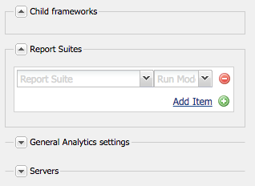

# Connessione ad Adobe Analytics e creazione di framework {#connecting-to-adobe-analytics-and-creating-frameworks}

Per tenere traccia dei dati web dalle pagine AEM in Adobe Analytics, crea una configurazione di Adobe Analytics Cloud Services e un framework Adobe Analytics:

* **Configurazione Adobe Analytics:** Informazioni sul tuo account Adobe Analytics. La configurazione di Adobe Analytics consente AEM connettersi ad Adobe Analytics. Crea una configurazione Adobe Analytics per ogni account utilizzato.
* **Framework Adobe Analytics:** Un set di mappature tra le proprietà della suite di rapporti di Adobe Analytics e le variabili CQ. Utilizza un framework per configurare il modo in cui i dati del sito web compilano i rapporti di Adobe Analytics. I framework sono associati a una configurazione Adobe Analytics. Puoi creare più framework per ogni configurazione.

Quando si associa una pagina Web a un framework, il framework esegue il tracciamento di tale pagina e dei relativi discendenti. Le visualizzazioni di pagina possono quindi essere recuperate da Adobe Analytics e visualizzate nella console Sites .

## Prerequisiti {#prerequisites}

### Account Adobe Analytics {#adobe-analytics-account}

Per tenere traccia AEM dati in Adobe Analytics, è necessario disporre di un account Adobe Marketing Cloud Adobe Analytics valido.

L’account Adobe Analytics deve:

* Avere **Amministratore** privilegi
* Da assegnare al **Accesso al servizio Web** gruppo di utenti.

>[!CAUTION]
>
>Fornitura **Amministratore** i privilegi (in Adobe Analytics) non sono sufficienti per consentire a un utente di connettersi da AEM ad Adobe Analytics. Il conto deve anche avere **Accesso al servizio Web** privilegi.

Prima di procedere, assicurati che le tue credenziali ti consentano di accedere ad Adobe Analytics. Tramite:

* [Accesso Adobe Experience Cloud](https://login.experiencecloud.adobe.com/exc-content/login.html)

* [Accesso Adobe Analytics](https://sc.omniture.com/login/)

### Configurazione di AEM per l’utilizzo dei data center Adobe Analytics {#configuring-aem-to-use-your-adobe-analytics-data-centers}

Adobe Analytics [data center](https://developer.omniture.com/en_US/content_page/concepts-terminology/c-how-is-data-stored) raccogliere, elaborare e archiviare dati associati alla suite di rapporti Adobe Analytics. Devi configurare AEM per utilizzare il data center che ospita la suite di rapporti Adobe Analytics. Nella tabella seguente sono elencati i data center disponibili e il relativo URL.

| Datacenter | URL |
|---|---|
| San Jose | https://api.omniture.com/admin/1.4/rest/ |
| Dallas | https://api2.omniture.com/admin/1.4/rest/ |
| Londra | https://api3.omniture.com/admin/1.4/rest/ |
| Singapore | https://api4.omniture.com/admin/1.4/rest/ |
| Oregon | https://api5.omniture.com/admin/1.4/rest/ |

Per impostazione predefinita, AEM utilizza il data center di San Jose (https://api.omniture.com/admin/1.4/rest/).

Utilizza la [Console web per configurare il bundle OSGi](/help/sites-deploying/configuring-osgi.md#osgi-configuration-with-the-web-console) **Adobe AEM client HTTP di Analytics**. Aggiungi il **URL del centro dati** per il data center che ospita una suite di rapporti per la quale le pagine AEM raccolgono i dati.

1. Apri la console Web nel browser Web. ([https://localhost:4502/system/console/configMgr](https://localhost:4502/system/console/configMgr))
1. Immetti le tue credenziali per accedere alla console.

   >[!NOTE]
   >
   >Contatta l’amministratore del sito per verificare se hai accesso a questa console.

1. Seleziona l&#39;elemento di configurazione denominato **Adobe AEM client HTTP di Analytics**.
1. Per aggiungere l&#39;URL di un centro dati, premere il pulsante + accanto al **URL del centro dati** e digitare l&#39;URL nella casella.

1. Per rimuovere un URL dall’elenco, fai clic sul pulsante - accanto all’URL.
1. Fai clic su Salva.

## Configurazione della connessione ad Adobe Analytics {#configuring-the-connection-to-adobe-analytics}

>[!CAUTION]
>
>In seguito a modifiche di sicurezza nell’API di Adobe Analytics, non è più possibile utilizzare la versione di Activity Map inclusa in AEM.
>
>La [Plug-in ActivityMap fornito da Adobe Analytics](https://experienceleague.adobe.com/docs/analytics/analyze/activity-map/getting-started/get-started-users/activitymap-install.html?lang=it) Da utilizzare.

## Configurazione per Activity Map {#configuring-for-the-activity-map}

>[!CAUTION]
>
>In seguito a modifiche di sicurezza nell’API di Adobe Analytics, non è più possibile utilizzare la versione di Activity Map inclusa in AEM.
>
>La [Plug-in ActivityMap fornito da Adobe Analytics](https://experienceleague.adobe.com/docs/analytics/analyze/activity-map/getting-started/get-started-users/activitymap-install.html) Da utilizzare.

## Creazione di un framework Adobe Analytics {#creating-a-adobe-analytics-framework}

Per l’ID suite di rapporti (RSID) in uso, puoi controllare quali istanze del server (autore, pubblicazione o entrambe) contribuiscono ai dati della suite di rapporti:

* **Tutto**: Le informazioni provenienti sia dall’istanza di authoring che da quella di pubblicazione popolano la suite di rapporti.
* **Autore**: Solo le informazioni provenienti dall’istanza di authoring popolano la suite di rapporti.
* **Pubblica**: Solo le informazioni dell’istanza di pubblicazione popolano la suite di rapporti.

>[!NOTE]
>
>Selezionando il tipo di istanza del server non si limitano le chiamate ad Adobe Analytics, si limita a controllare quali chiamate includono l&#39;RSID.
>
>Ad esempio, viene configurato un framework per utilizzare il *diweretail* suite di rapporti e autore è l’istanza server selezionata. Quando le pagine vengono pubblicate insieme al framework, le chiamate ad Adobe Analytics vengono comunque effettuate, ma queste chiamate non contengono l’RSID. Solo le chiamate dall&#39;istanza dell&#39;autore includono l&#39;RSID.

1. Utilizzo **Navigazione**, seleziona **Strumenti**, **Cloud Services**, quindi **Cloud Services legacy**.
1. Scorri fino a **Adobe Analytics** e seleziona **Mostra configurazioni**.
1. Fai clic sul pulsante **[+]** link accanto alla tua configurazione Adobe Analytics.

1. In **Crea framework** finestra di dialogo:

   * Specificare un **Titolo**.
   * Facoltativamente, puoi specificare la **Nome**, per il nodo che memorizza i dettagli del framework nell&#39;archivio.
   * Seleziona **Framework Adobe Analytics**

   E fai clic su **Crea**.

   Il framework viene aperto per la modifica.

1. In **Suite di rapporti** sezione del pod laterale (lato destro del pannello principale), fai clic su **Aggiungi elemento**. Quindi utilizza il menu a discesa per selezionare l’ID suite di rapporti (ad esempio, `geometrixxauth`) con cui il quadro interagirà.

   >[!NOTE]
   >
   >Quando selezioni un ID suite di rapporti, il Content Finder a sinistra è popolato con variabili di Adobe Analytics (variabili di SiteCatalyst).

1. Quindi utilizza il **Modalità di esecuzione** a discesa (accanto all’ID suite di rapporti) per selezionare le istanze del server che si desidera inviare informazioni alla suite di rapporti.

   

1. Per rendere il framework disponibile nell’istanza di pubblicazione del sito, nella pagina **Pagina** scheda della barra laterale, fai clic su **Attiva framework.**

### Configurazione delle impostazioni del server per Adobe Analytics {#configuring-server-settings-for-adobe-analytics}

Il sistema di framework consente di modificare le impostazioni del server all’interno di ogni framework Adobe Analytics.

>[!CAUTION]
>
>Queste impostazioni determinano dove vengono inviati i dati e come, quindi è fondamentale *non manomettere queste impostazioni* e consenti al tuo rappresentante Adobe Analytics di configurarlo.

Inizia aprendo il pannello. Premere la freccia rivolta verso il basso accanto a **Server**:

* **Server per tracking**

   * contiene l’URL utilizzato per inviare le chiamate Adobe Analytics

      * cname: impostazione predefinita dell’account Adobe Analytics *Nome dell&#39;azienda*
      * d1 - corrisponde al centro dati a cui verranno inviate le informazioni (può essere d1, d2 o d3)
      * sc.omtrdc.net - nome di dominio

* **Server di tracciamento protetto**

   * Ha gli stessi segmenti del server di tracciamento
   * Viene utilizzato per l’invio di dati da pagine protette (https://)

* **Namespace visitatore**

   * Lo spazio dei nomi determina la prima parte dell’URL di tracciamento.
   * Ad esempio, modifica dello spazio dei nomi in **CNAME** farà assomigliare le chiamate effettuate ad Adobe Analytics **CNAME.d1.omtrdc.net** anziché il valore predefinito.

## Associazione di una pagina a un framework Adobe Analytics {#associating-a-page-with-a-adobe-analytics-framework}

Quando una pagina è associata a un framework Adobe Analytics, la pagina invia i dati ad Adobe Analytics quando la pagina viene caricata. Le variabili compilate dalla pagina vengono mappate e recuperate dalle variabili di Adobe Analytics nel framework. Ad esempio, le visualizzazioni di pagina vengono recuperate da Adobe Analytics.

I discendenti della pagina ereditano l’associazione al framework. Ad esempio, quando si associa la pagina principale del sito a un framework, tutte le pagine del sito sono associate al framework.

1. Da **Sites** seleziona la pagina da configurare con il tracciamento.
1. Apri **[Proprietà pagina](/help/sites-authoring/editing-page-properties.md)**, direttamente dalla console o dall’editor di pagine.
1. Apri la scheda* Cloud Services**.

1. Utilizza la **Aggiungi configurazione** menu a discesa per selezionare **Adobe Analytics** dalle opzioni disponibili. Se è presente l’ereditarietà, è necessario disattivarla prima che il selettore diventi disponibile.

1. Selettore a discesa per **Adobe Analytics** verranno aggiunte alle opzioni disponibili. Utilizza questa opzione per selezionare la configurazione del framework richiesta.

1. Seleziona **Salva e chiudi**.
1. **[Pubblica](/help/sites-authoring/publishing-pages.md)** la pagina per attivare la pagina ed eventuali configurazioni/file connessi.
1. L’ultimo passo è quello di visitare la pagina nell’istanza di pubblicazione e cercare una parola chiave (ad esempio melanzana) utilizzando il **Ricerca** componente.
1. Puoi quindi controllare le chiamate effettuate ad Adobe Analytics utilizzando uno strumento appropriato; ad esempio, [Debugger Adobe Experience Cloud](https://experienceleague.adobe.com/docs/debugger/using/experience-cloud-debugger.html).
1. Utilizzando l’esempio fornito, la chiamata deve contenere il valore inserito (ad es. melanzana) in eVar7 e l’elenco degli eventi deve contenere event3.

### Visualizzazioni pagina {#page-views}

Quando una pagina è associata a un framework Adobe Analytics, il numero di visualizzazioni di pagina può essere visualizzato nella vista Elenco della console Sites.

Vedi [Visualizzazione dei dati di analisi delle pagine](/help/sites-authoring/page-analytics-using.md) per ulteriori dettagli.

### Configurazione dell’intervallo di importazione {#configuring-the-import-interval}

Configura l&#39;istanza appropriata del **Adobe AEM configurazione del polling gestito** servizio:

* **Intervallo di polling**: Intervallo, in secondi, in cui il servizio recupera i dati di visualizzazione della pagina da Adobe Analytics.
L’intervallo predefinito è 43200000 ms (12 ore).

* **Abilita**: Attiva o disattiva il servizio. Per impostazione predefinita, il servizio è abilitato.

Per configurare questo servizio OSGi, puoi utilizzare il [Console web](/help/sites-deploying/configuring-osgi.md#osgi-configuration-with-the-web-console) o [nodo osgiConfig nell&#39;archivio](/help/sites-deploying/configuring-osgi.md#osgi-configuration-in-the-repository) (il PID del servizio è `com.day.cq.polling.importer.impl.ManagedPollConfigImpl`).

## Modifica di configurazioni e/o framework Adobe Analytics {#editing-adobe-analytics-configurations-and-or-frameworks}

Come per la creazione di una configurazione o un framework Adobe Analytics, passa a (legacy) **Cloud Services** schermo. Seleziona **Mostra configurazioni**, quindi fai clic sul collegamento alla configurazione specifica che desideri aggiornare.

Quando modifichi una configurazione di Adobe Analytics, devi anche premere il pulsante **Modifica** quando si trova nella pagina di configurazione stessa per aprire il **Modifica componente** finestra di dialogo.

## Eliminazione dei framework Adobe Analytics {#deleting-adobe-analytics-frameworks}

Per eliminare un framework Adobe Analytics, prima [aprilo per la modifica](#editing-adobe-analytics-configurations-and-or-frameworks).

Quindi seleziona **Elimina framework** dal **Pagina** scheda della barra laterale.
